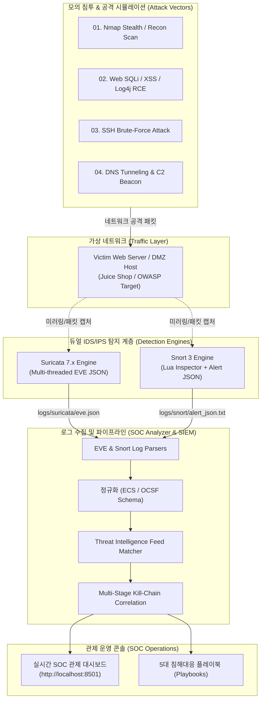

# 🛡️ Suricata & Snort SOC Lab (보안 관제 및 침해사고 로그 분석 실습 환경)

> **수리카타(Suricata 7.x)**와 **스노트(Snort 3)** 침입탐지시스템(IDS/IPS) 듀얼 엔진을 활용하여, 실시간 네트워크 위협 탐지, 다단계 킬체인 상관분석, 그리고 침해사고 대응(SOC Triage)을 실습하는 종합 핸즈온 랩 환경입니다.

---

## 📑 목차 (Table of Contents)
1. [아키텍처 및 시스템 구성도](#1-아키텍처-및-시스템-구성도)
2. [프로젝트 디렉토리 구조](#2-프로젝트-디렉토리-구조)
3. [빠른 시작 가이드 (Quick Start)](#3-빠른-시작-가이드-quick-start)
4. [5대 모의 공격 시나리오 & 룰셋](#4-5대-모의-공격-시나리오--룰셋)
5. [로그 분석 & 상관분석 엔진](#5-로그-분석--상관분석-엔진)
6. [실시간 SOC 관제 대시보드](#6-실시간-soc-관제-대시보드)
7. [침해대응 플레이북 (Playbooks)](#7-침해대응-플레이북-playbooks)

---

## 1. 아키텍처 및 시스템 구성도



---

## 2. 프로젝트 디렉토리 구조

```
Suricata-Snort-SOC-Lab/
├── analyzer/                 # Python 기반 실시간 로그 수집/파서/상관분석 엔진
│   ├── alerting/             # Slack/Discord/Console Rich 알림 포맷터
│   │   └── notifier.py
│   ├── detection/            # 상관분석 및 위협 인텔리전스 매처
│   │   ├── correlation_engine.py
│   │   └── threat_intel.py
│   ├── parsers/              # EVE JSON 및 Snort 3 파서
│   │   ├── eve_parser.py
│   │   └── snort_parser.py
│   ├── models.py             # 정규화된 Alert/Event Pydantic 스키마
│   └── main.py               # CLI 배치 분석 및 로그 모니터링 실행기
├── configs/                  # 엔진 설정 파일
│   ├── suricata/suricata.yaml # Suricata 7.x 튜닝 설정 (EVE JSON)
│   └── snort/snort.lua       # Snort 3 Lua 설정
├── dashboard/                # FastAPI 기반 실시간 웹 관제 대시보드
│   └── app.py                # 통계 KPI, 차트, 경보 피드, 사고 사례 UI
├── docs/                     # 기술 문서 및 가이드
│   ├── architecture.md
│   ├── rule_writing_guide.md
│   └── suricata_snort_comparison.md
├── logs/                     # 실시간 수집 로그 저장소
│   ├── suricata/eve.json
│   └── snort/alert_json.txt
├── pcaps/                    # 패킷 캡처 파일 저장소
├── playbooks/                # 침해사고 대응 플레이북
│   ├── 01_port_scan_investigation.md
│   ├── 03_web_attack_investigation.md
│   └── 04_malware_c2_investigation.md
├── rules/                    # 탐지 룰셋
│   ├── suricata/             # Suricata 7 커스텀 룰 (Web, Recon, C2)
│   └── snort/                # Snort 3 로컬 룰
├── scenarios/                # 모의 침투 및 트래픽 발생기
│   ├── 01_recon_port_scan.py
│   ├── 02_web_sqli_xss_rce.py
│   ├── 03_brute_force_attack.py
│   ├── 04_dns_tunneling_c2.py
│   └── traffic_generator.py  # 종합 시뮬레이션 및 데이터 생성기
├── docker-compose.yml        # 원클릭 전체 실습 인프라 배포
├── Dockerfile
├── requirements.txt
└── pyproject.toml
```

---

## 3. 빠른 시작 가이드 (Quick Start)

### 3.1 로컬 파이썬 가상환경 구성
```bash
# 1. 패키지 설치
pip install -r requirements.txt

# 2. 실습용 모의 침해사고 로그 생성 (Suricata & Snort 로그 생성)
python scenarios/traffic_generator.py

# 3. CLI 분석기 실행 (상관분석 및 침해사고 판정)
python -m analyzer.main

# 4. 실시간 웹 관제 대시보드 기동 (포트 8501)
python -m uvicorn dashboard.app:app --host 0.0.0.0 --port 8501 --reload
```

웹 브라우저에서 **`http://localhost:8501`**에 접속하여 실시간 경보 현황, 차트, 킬체인 사고 사례를 확인합니다.

---

### 3.2 Docker Compose 전체 환경 기동
```bash
docker compose up -d
```
- **SOC 관제 대시보드**: `http://localhost:8501`
- **모의 공격 대상 웹 서버**: `http://localhost:3000`

---

## 4. 5대 모의 공격 시나리오 & 룰셋

| 시나리오 | 공격 기법 | MITRE ATT&CK | Suricata SID | Snort SID |
|---|---|---|---|---|
| **01. Recon** | Nmap Stealth NULL / XMAS / FIN Scan | `T1046`, `T1595` | `1000101` ~ `1000104` | `2000020` ~ `2000022` |
| **02. Web Exploit**| SQLi (`UNION SELECT`), XSS, LFI (`/etc/passwd`), Log4j RCE | `T1190`, `T1059` | `1000001` ~ `1000040` | `2000010` ~ `2000013` |
| **03. Brute Force**| SSH 고빈도 무차별 대입 연결 | `T1110` | `1000120` | `2000025` |
| **04. C2 & Exfil** | DNS Base64 서브도메인 터널링, Reverse Shell (`/bin/sh`) | `T1071`, `T1048` | `1000201` ~ `1000220` | `2000030` ~ `2000035` |

---

## 5. 실습 및 분석 워크플로우

1. **로그 정규화(Normalization)**: EVE JSON과 Snort Alert를 단일 `NormalizedAlert` 데이터 모델로 변환.
2. **위협 인텔리전스 연동(Threat Intel Matching)**: 알려진 C2 IP, 스캐너, Tor Exit Node 자동 태깅.
3. **킬체인 다단계 상관분석(Correlation)**: 동일 출발지 IP에서 발생한 정찰 ➔ 초기 침투 ➔ C2 연결을 단일 **Incident**로 자동 그룹화.
4. **플레이북 가이드(Playbook-guided Response)**: 각 사고 유형별로 즉각적인 격리/차단 조치 가이드 제시.
