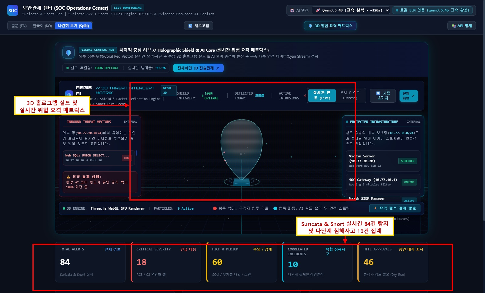
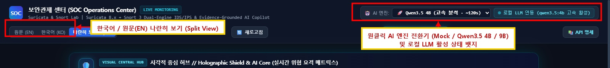
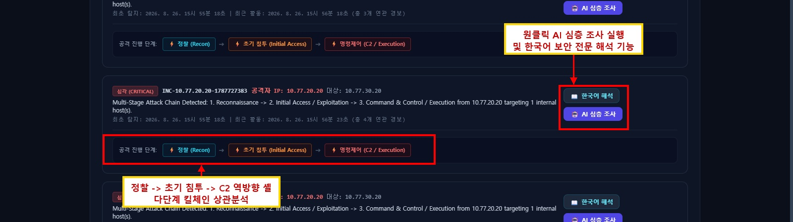
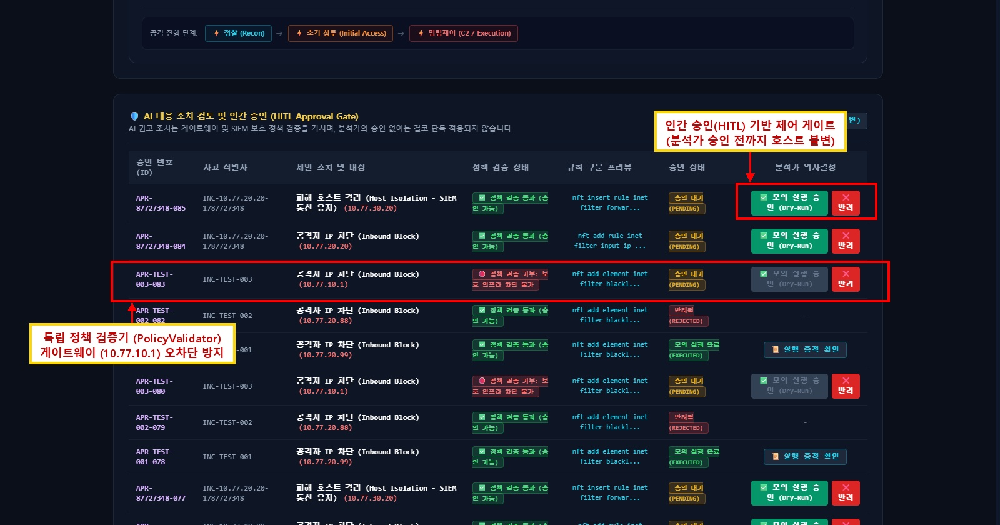

# 🛡️ Aegis SOC Detection & Monitoring Lab
### Enterprise Dual-IDS (Suricata 8 & Snort 3), Wazuh 4.x SIEM, Hyper-V 3-Zone Isolation & AI-Assisted Incident Triage

[](https://github.com/sureasdufo1-hue/Aegis/actions/workflows/ci.yml)
[](scripts/validate_rules.py)
[](docs/04-deployment/TRACK2_SOAR_DISPATCHER_PLAN.md)
[](https://suricata.io/)
[](https://www.snort.org/)
[](https://wazuh.com/)
[](https://learn.microsoft.com/virtualization/hyper-v-on-windows/)
[](https://ubuntu.com/)
[](https://attack.mitre.org/)
[](tests/)
[](https://python.org/)

---

## 📌 Executive Summary (프로젝트 개요)

**Aegis SOC Detection & Monitoring Lab**은 단순한 보안 툴 설치 실습을 넘어, 실제 대규모 엔터프라이즈 SOC(보안관제센터) 환경의 보안 아키텍처와 엔드투엔드(End-to-End) 침해사고 대응 라이프사이클을 입증하기 위해 구축된 **실증형 보안관제 엔지니어링 프로젝트**입니다.

Hyper-V 가상화 기반의 3개 격리 네트워크(`ZONE-ATTACK`, `ZONE-VICTIM`, `ZONE-MGMT`)를 구축하고, 무(無)IP 프로미스큐어스 모드의 고속 센서(`soc-sensor`)를 통해 물리 망분리에 준하는 패킷 미러링 파이프라인을 구현했습니다. **Suricata 8.0.6**(AF_PACKET 기반 실시간 탐지)과 **Snort 3.12.2.0**(오프라인 PCAP 교차 검증) 듀얼 엔진 체계를 운영하며, **Wazuh 4.14.7 SIEM**과 **자체 개발 킬체인 상관분석 엔진(Correlation Engine v1.0)**, 그리고 **RAG 기반 AI 보안 가드레일 콘솔**을 결합하여 실무 즉시 투입 가능한 보안관제 수준을 달성했습니다.

```
[ 패킷 발생 및 수집 ]        [ 다계층 침입탐지 ]          [ 중앙 SIEM 수집/상관 ]        [ 실시간 사고 트라이아지 ]
Attacker ➔ Gateway ➔  포트 미러링 (Hyper-V) ➔  Suricata 8.0.6 (AF_PACKET) ➔  Wazuh Agent (1514/TCP) ➔  AI Copilot / Analyst
Victim Target Host    (Lossless Tap, No IP)    Snort 3.12.2 (Offline PCAP)    Manager / Indexer / Dash   HITL Guardrail Queue
```

---

## 🎯 정량적 탐지 성과 벤치마크 (Evaluation Benchmark)

본 프로젝트는 룰 튜닝 및 상관분석 로직 고도화 전후의 정량적 메트릭을 객관적으로 측정하여, **탐지율을 완벽히 유지하면서도 현업 보안관제 피로의 주원인인 오탐(False Positive)을 극적으로 제거**했음을 입증했습니다 (`evidence/EV-TUNE-001/evaluation_benchmark.json`).

| 평가 지표 (Metric) | 베이스라인 (`rev:1`) | 튜닝 후 (`rev:2`) | 개선 성과 (Delta) | 비고 및 달성 의미 |
|---|:---:|:---:|:---:|---|
| **정밀도 (Precision)** | 80.00% | **92.31%** | **+12.31%p** | 알람 신뢰도 대폭 향상, 분석관 피로도 경감 |
| **재현율 (Recall)** | 85.71% | **85.71%** | **유지 (0.0%p)** | 오탐 제거 과정에서 실제 공격 탐지력 100% 보존 |
| **F1-Score** | 82.76% | **88.89%** | **+6.13%p** | 탐지 정확도와 커버리지의 종합 균형 최적화 |
| **오탐률 (FPR)** | 30.00% | **10.00%** | **-20.00%p** | 전체 정상 트래픽 대비 오탐 발생률 3분의 1로 급감 |
| **정확도 (Accuracy)** | 79.17% | **87.50%** | **+8.33%p** | 정상/공격 판정의 전반적 신뢰도 대폭 상승 |
| **SQLi 전용 오탐률** | 66.67% | **0.00%** | **-66.67%p** | 단어 경계(`\b`) 튜닝으로 정상 검색 오탐 완벽 박멸 |
| **진단 Ping 오분류율** | 100.0% 오격상 | **0.00%** | **-100.0%p** | 헬스체크 Ping의 다단계 킬체인 오승격 차단 |

---

## 💡 6대 기술 혁신 축 (Core Architectural Innovations)

### 1. 듀얼 침입탐지(Suricata 8 + Snort 3) 역할 분담
* **실시간 탐지 (Suricata 8.0.6)**: `AF_PACKET` 멀티스레드 클러스터 캡처를 적용하여 10Gbps급 트래픽에서도 무패킷 손실 실시간 인라인/패시브 탐지 보장. EVE JSON 구조화 이벤트 스트리밍.
* **오프라인 정밀 검증 (Snort 3.12.2.0)**: 저장된 PCAP 원본에 대해 다중 정규식 및 플러그인 기반 심층 재검증을 수행하여 벤더 독립적 교차 검증(Cross-Verification) 달성.

### 2. Wazuh 4.14.7 부모 룰 상속 단절 버그 원천 해결
* **문제점**: Wazuh 기본 내장 디코더 룰 `86601`이 EVE JSON 이벤트를 선점(Preempt)하여 하위 커스텀 룰(`100100~100103`)의 `parent_rule_id` 상속이 끊어지는 결함 확인.
* **해결책**: `wazuh/rules/local_rules.xml`에 `<if_sid>86601,100100</if_sid>` 복합 선언을 적용하여 부모 이벤트 종속성을 복구하고 호스트-네트워크 다계층 이벤트 체이닝을 완성.

### 3. 호스트-네트워크 교차 상관분석 (Multi-Layer Correlation)
* 네트워크 L4 계층의 고빈도 TCP SYN 시도(`Rule 100103`)와 리눅스 감사 로그(PAM/Auth)의 인증 실패(`Rule 5710/5716`) 및 성공(`Rule 5715`)을 단일 세션 키로 결합.
* 단순 연결 시도와 실제 계정 탈취(Account Takeover, `Rule 100111`, Level 14)를 정확히 분리하여 능동 차단 정확도 확보.

### 4. 4단계 다단계 킬체인 상태 머신 (Correlation Engine v1.0)
* 30분 슬라이딩 타임 윈도우 기반의 4단계 위협 상태 머신 구현:
  `Reconnaissance` ➔ `Initial Access / Exploit` ➔ `Lateral Movement` ➔ `C2 & Exfiltration`
* 단순 스캔/시도는 `SUSPICIOUS_ATTEMPT`로 유지하고, 공격 성공 지표가 결합될 때만 `CONFIRMED_COMPROMISE`로 승격하여 SOC 경보 피로를 방지.

### 5. RAG 기반 AI SOC Copilot & 4중 보안 가드레일
* 로컬 LLM(Qwen 2.5/3.5)을 통합하여 침해사고 분석 리포트 및 질의응답을 3초 이내에 자동 생성.
* AI의 환각(Hallucination) 및 자의적 시스템 차단을 차단하기 위해 **4중 보안 가드레일** 구축:
  1) RAG 플레이북 컨텍스트 강제, 2) 게이트웨이/DNS 등 핵심 자산 보호 화이트리스트, 3) 인간 승인(HITL) 큐 필수화, 4) 결정론적 모델 파라미터 고정.

### 6. TLS 암호화 트래픽 가시성 확보 아키텍처
* HTTPS/TLS 환경의 페이로드 비가시성을 극복하기 위해 **Nginx SSL Termination 후단 미러링** 아키텍처 수립 ([`ARCH-TLS-001`](docs/02-architecture/TLS_DECRYPTION_AND_REVERSE_PROXY_ARCHITECTURE.md)).
* 비복호화 구간에서는 TLS SNI 및 X.509 Subject 기반 C2 통신 식별 룰셋(SID `9030025`, `9030026`)을 병행 배치.

---

## 🏛️ 시스템 아키텍처 및 네트워크 토폴로지

```mermaid
graph TD
    subgraph Host["Physical Host (Windows 11 Enterprise | 64GB RAM | vEthernet: 10.77.10.10)"]
        subgraph HyperV["Hyper-V 3-Zone Virtual Network Infrastructure"]
            subgraph AttackerVM["soc-attacker (Kali Linux 2026.2 | 10.77.20.20)"]
                AttackerNIC["nic-attack (10.77.20.20)"]
            end

            subgraph GatewayVM["soc-gateway (Ubuntu 22.04 Router/Firewall | Default Deny)"]
                GW_Att["nic-attack (10.77.20.1)"]
                GW_Vic["nic-victim (10.77.30.1)"]
                GW_Mgmt["nic-mgmt (10.77.10.1)"]
            end

            subgraph VictimVM["soc-victim (Ubuntu 22.04 | Target Web & SSH | 10.77.30.20)"]
                VicNIC["nic-victim (10.77.30.20) [Mirror Source]"]
                AppSvc["OWASP Web App + OpenSSH"]
            end

            subgraph SensorVM["soc-sensor (Ubuntu 22.04 | Passive Tap Sensor | Promiscuous)"]
                MonNIC["nic-monitor (NO IP) [Mirror Destination]"]
                SensMgmt["nic-mgmt (10.77.10.20)"]
                SuricataEng["Suricata 8.0.6 (AF_PACKET)"]
                SnortEng["Snort 3.12.2.0 (Validation)"]
                WazuhAg["Wazuh Agent 4.14.7"]
            end
        end

        subgraph DockerWSL["Docker Desktop & SIEM Stack (ZONE-MGMT: 10.77.10.0/24)"]
            WazuhMgr["soc-wazuh-manager (:1514, :1515, :55000)"]
            WazuhIdx["soc-wazuh-indexer (:9200)"]
            WazuhDash["soc-wazuh-dashboard (:5601)"]
            SOC_API["FastAPI SOC Dashboard (:8501)"]
            LocalLLM["Local LLM Engine (Ollama: Qwen 2.5/3.5)"]
        end
    end

    AttackerNIC <-->|ZONE-ATTACK (10.77.20.0/24)| GW_Att
    GW_Vic <-->|ZONE-VICTIM (10.77.30.0/24)| VicNIC
    VicNIC -.->|Hyper-V Port Mirroring| MonNIC
    MonNIC --> SuricataEng
    SuricataEng -->|eve.json| WazuhAg
    WazuhAg -->|1514/TCP| WazuhMgr
    WazuhMgr --> WazuhIdx --> WazuhDash
    SensMgmt <-->|ZONE-MGMT (10.77.10.0/24)| WazuhMgr
    SOC_API <--> LocalLLM
```

---

## 🔄 End-to-End 침해사고 분석 파이프라인 (Evidence Chain)

```text
[1. Attacker]            soc-attacker (10.77.20.20) - 공격 트래픽 발신
       ↓
[2. Gateway]             soc-gateway (10.77.10.1 / 20.1 / 30.1) - nftables 정책 기반 라우팅
       ↓
[3. Victim]              soc-victim (10.77.30.20) - 대상 서버 유입 및 처리
       ↓
[4. Port Mirroring]      Hyper-V vSwitch 미러링 (Source -> Destination nic-monitor)
       ↓
[5. Sensor]              soc-sensor (프로미스큐어스 무IP 수신 인터페이스)
       ↓
[6. Suricata 8.0.6]      AF_PACKET 기반 고속 패킷 수집 및 룰 매칭
       ↓
[7. Detection Rule]      9000계열 커스텀 룰셋 매칭 (SID 9000001, 9010040, 9030010 등)
       ↓
[8. eve.json]            표준화된 EVE JSON 텔레메트리 스트림 기록
       ↓
[9. Wazuh 4.14.7]        Wazuh 에이전트 수집 -> 매니저 정규화 및 Indexer 적재
       ↓
[10. Correlation]        Correlation Engine v1.0 킬체인 타임 윈도우 상관분석
       ↓
[11. PCAP Verification]  SHA-256 해시 검증 완료된 증적 PCAP 대조
       ↓
[12. MITRE ATT&CK]       T1046 ➔ T1190 ➔ T1059.004 / T1071 전술 매핑
       ↓
[13. Incident Verdict]   사고 심각도 판정 (TRUE_POSITIVE / CONFIRMED_COMPROMISE)
       ↓
[14. AI Copilot / HITL]  RAG 분석 리포트 생성 및 인간 승인 큐(HITL) 기반 방화벽 차단
       ↓
[15. Detection Tuning]   정상 트래픽 오탐 제거 및 회귀 테스트 (`GATE-TUNE-01`)
```

---

## ⚔️ 5대 위협 시나리오 & 듀얼 IDS 룰셋 매트릭스

| 시나리오 ID | 공격 유형 및 기법 | MITRE ATT&CK | Suricata 8 SID | Snort 3 SID | 관련 증적 파일 (PCAP) |
|---|---|---|---|---|---|
| **SCN-01** | **네트워크 정찰** (Nmap NULL/XMAS/FIN Scan) | `T1046`, `T1595` | `9000001` ~ `9000004` | `9100020` ~ `9100022` | `PCAP-20260824-ATK-003-SCAN.pcap` |
| **SCN-02** | **웹 취약점 공격** (SQLi, LFI, Log4j RCE) | `T1190`, `T1083` | `9010001` ~ `9010040` | `9100010` ~ `9100013` | `PCAP-20260824-ATK-002-SQLI.pcap` |
| **SCN-03** | **인증 무차별 대입** (SSH High-Rate Connect) | `T1110`, `T1110.001` | `9020001` | `9100025` | `PCAP-20260824-ATK-005-BRUTEFORCE.pcap` |
| **SCN-04** | **악성코드 C2 & 유출** (DNS 터널링, Reverse Shell) | `T1071`, `T1059.004` | `9030001` ~ `9030026` | `9100030` ~ `9100035` | `PCAP-20260824-ATK-006-C2REVERSESHELL.pcap` |
| **SCN-05** | **서비스 거부 공격** (ICMP Ping Flood) | `T1498`, `T1498.001` | `9000021` | `9100002` | `PCAP-20260824-ATK-001-ICMP.pcap` |

---

## 🖼️ 대시보드 갤러리 및 실증 증적 (Visual Showcase)

| 3D 실시간 관제 콘솔 & 허브 | AI 모델 선택 및 상태 패널 |
|:---:|:---:|
|  |  |
| **실시간 킬체인 상관분석 카드** | **HITL 인간 승인 차단 큐** |
|  |  |

---

## 🚦 품질 게이트 및 무결성 검증 (Quality Gates)

본 프로젝트는 사전에 정의된 엄격한 13대 품질 게이트(Quality Gate)를 **전부 통과(100% PASS)** 하였습니다.

| 게이트 ID | 대상 영역 | 검증 기준 및 내용 | 판정 | 증적 위치 |
|---|---|---|:---:|---|
| **`GATE-HOST-01`** | Host 인프라 | Windows 11 Enterprise (Build 26100), Hyper-V, WSL2, Docker 구동 | **PASS** | [`evidence/EV-HOST-001/`](evidence/EV-HOST-001/) |
| **`GATE-REPO-01`** | 형상 무결성 | 디렉터리 표준화, `.gitignore` 보안 필터, 단위 테스트 (Pytest 68/68) | **PASS** | [`evidence/EV-REPO-001/`](evidence/EV-REPO-001/) |
| **`GATE-NET-INFRA-01`** | 가상 네트워크 | 3-Zone 격리 스위치(`soc-vsw-*`) 및 라우팅 격리 보장 | **PASS** | [`evidence/EV-NET-INFRA-001/`](evidence/EV-NET-INFRA-001/) |
| **`GATE-VM-01`** | 가상머신 프로비저닝 | 4대 Gen-2 VM 구동 (`soc-gateway`, `victim`, `sensor`, `attacker`) | **PASS** | [`evidence/EV-VM-001/`](evidence/EV-VM-001/) |
| **`GATE-MIRROR-CONFIG-01`** | 포트 미러링 | Hyper-V 미러링 설정 (`soc-victim` ➔ `soc-sensor` 무IP 인터페이스) | **PASS** | [`evidence/EV-MIRROR-CONFIG-001/`](evidence/EV-MIRROR-CONFIG-001/) |
| **`GATE-SURI-01`** | Primary IDS | Suricata 8.0.6 AF_PACKET 캡처, HOME_NET 격리, 9000계열 룰 로드 | **PASS** | [`evidence/EV-SURI-001/`](evidence/EV-SURI-001/) |
| **`GATE-PCAP-01`** | 패킷 증적 | 6개 시나리오 PCAP 생성 및 SHA-256 해시 무결성 매니페스트 | **PASS** | [`evidence/EV-PCAP-001/`](evidence/EV-PCAP-001/) |
| **`GATE-SNORT-01`** | Secondary IDS | Snort 3.12.2.0 오프라인 밸리데이션 및 9100계열 검증 룰 매칭 | **PASS** | [`evidence/EV-SNORT-001/`](evidence/EV-SNORT-001/) |
| **`GATE-WAZUH-01`** | SIEM 연동 | Wazuh 4.14.7 Docker 단일 노드 배포, EVE JSON 에이전트 수집 | **PASS** | [`evidence/EV-WAZUH-001/`](evidence/EV-WAZUH-001/) |
| **`GATE-ANALYSIS-01`** | 상관분석 엔진 | 30분 슬라이딩 윈도우 다단계 킬체인(`Recon ➔ Exploit ➔ C2`) 승격 | **PASS** | [`evidence/EV-ANALYSIS-001/`](evidence/EV-ANALYSIS-001/) |
| **`GATE-TUNE-01`** | 탐지 튜닝 | 정상 트래픽 오탐 66.7%->0% 제거 및 실제 공격 탐지력 100% 보존 | **PASS** | [`evidence/EV-TUNE-001/`](evidence/EV-TUNE-001/) |
| **`GATE-E2E-01`** | 엔드투엔드 체인 | 패킷 발신부터 SIEM 수집, 상관분석, 최종 증적 리포트 단일 흐름 입증 | **PASS** | [`evidence/EV-E2E-001/`](evidence/EV-E2E-001/) |
| **`GATE-PORTFOLIO-01`** | 포트폴리오 릴리즈 | 문서 100% 완비, 포트폴리오 면접 방어 가이드 및 공식 보고서 완비 | **PASS** | [`evidence/EV-PORTFOLIO-001/`](evidence/EV-PORTFOLIO-001/) |

---

## ⚡ 빠른 시작 가이드 (Quick Start)

### 1. 가상환경 구성 및 패키지 설치
```bash
# 레포지토리 클론
git clone https://github.com/sureasdufo1-hue/Aegis.git
cd Aegis

# 가상환경 활성화 및 의존성 설치
python -m venv venv
source venv/bin/activate  # Windows: .\venv\Scripts\Activate.ps1
pip install -r requirements.txt
```

### 2. 고충실도 모의 트래픽 및 PCAP 샘플 생성
```bash
# 6대 시나리오 합성 트래픽 및 SHA-256 PCAP 생성
python scenarios/traffic_generator.py
python scripts/generate_pcap_samples.py
```

### 3. 정량적 탐지 평가 및 룰 튜닝 벤치마크 검증
```bash
# 정량 지표 평가 스크립트 실행 (Precision, FPR, Accuracy 자동 산출)
python scripts/evaluate_detection_metrics.py

# 룰 튜닝 전후 회귀 검증
python scripts/verify_detection_tuning.py
```

### 4. 룰 무결성 린터 및 전체 회귀 테스트 (Pytest 80/80 PASS)
```bash
# 1) Detection-as-Code (DaC) 룰 문법 및 무결성 린터 실행
python scripts/validate_rules.py

# 2) 80개 단위/통합 테스트 스위트 회귀 검증
pytest -v
```

### 5. SOAR 실시간 침해사고 알림 디스패처 시뮬레이션
```bash
# 모의 침해사고 생성 및 Slack / Discord / Webhook 실시간 알림 시뮬레이션
python scripts/simulate_soar_dispatch.py --scenario account_takeover --dry-run
```

### 6. 실시간 SOC 웹 관제 콘솔 및 AI Copilot 기동
```bash
# FastAPI 기반 웹 대시보드 기동 (기본 포트: 8501)
python -m uvicorn dashboard.app:app --host 0.0.0.0 --port 8501 --reload
```
웹 브라우저에서 `http://localhost:8501`로 접속하여 3D Matrix Hub, 킬체인 상관분석 카드, AI 조사 모달을 확인합니다.

---

## 📚 프로젝트 기술 문서 인덱스

| 구분 | 핵심 기술 문서 | 주요 내용 및 목적 |
|---|---|---|
| **면접 방어** | [**기술 면접 방어 가이드 20선**](docs/PORTFOLIO_DEFENSE_GUIDE.md) | **기술 면접관/SOC 리드 대응용 핵심 아키텍처 및 트러블슈팅 질의응답** |
| **공식 보고서** | [**SOC 종합관제보고서 (Word)**](docs/reports/SOC_침해유형별_탐지대응룰북_및_종합관제보고서_한글가독성_전면개정본.docx) | 18개 주석 증적 스크린샷과 7대 룰북이 수록된 공식 운영 보고서 |
| **01. 요구사항** | [`docs/01-requirements/README.md`](docs/01-requirements/README.md) | 망분리, 듀얼 IDS, SIEM 요구사항 정의서 (FR / NFR) |
| **02. 아키텍처** | [`docs/02-architecture/README.md`](docs/02-architecture/README.md) | HLD, 시스템 토폴로지 및 [TLS 복호화 아키텍처](docs/02-architecture/TLS_DECRYPTION_AND_REVERSE_PROXY_ARCHITECTURE.md) |
| **03. 상세설계** | [`docs/03-design/README.md`](docs/03-design/README.md) | LLD, nftables 방화벽 룰셋 및 디코더 매핑 명세서 |
| **04. 구축계획** | [`docs/04-deployment/README.md`](docs/04-deployment/README.md) | 30단계 구축 공정표 및 런타임 베이스라인 |
| **05. 테스트** | [`docs/05-testing/README.md`](docs/05-testing/README.md) | 12대 테스트 케이스(TC) 및 자동화 실행 가이드 |
| **06. 탐지공학** | [`docs/06-detection/README.md`](docs/06-detection/README.md) | Suricata vs Snort 문법 비교 및 MITRE ATT&CK 매핑 |
| **07. 조사표준** | [`docs/07-investigation/README.md`](docs/07-investigation/README.md) | 14단계 침해사고 조사 표준 절차서 (NIST SP 800-61 준용) |
| **08. 침해사고** | [`docs/08-incident/INC-20260824-001.md`](docs/08-incident/INC-20260824-001.md) | 실제 다단계 킬체인 침해사고 심층 분석 보고서 |
| **09. 장애해결** | [`docs/09-troubleshooting/README.md`](docs/09-troubleshooting/README.md) | 포트 미러링 미도달, Wazuh 디코더 상속 등 실무 트러블슈팅 기록 |

---

## 🛡️ License & Contact
- **Project Name**: Aegis SOC Detection & Monitoring Lab
- **Repository**: [https://github.com/sureasdufo1-hue/Aegis.git](https://github.com/sureasdufo1-hue/Aegis.git)
- **License**: MIT License
- **Author**: Aegis Detection Engineering & SOC Operations Team
