# 07_HIGH_LEVEL_DESIGN
# AegisAI — 통합 시스템 상위설계서 (HLD)

---

> **문서 ID:** `07_HIGH_LEVEL_DESIGN`  
> **프로젝트:** AegisAI — AI for Security × Security for AI Integrated SOC Platform  
> **기준일자:** 2026-09-28  
> **상태:** `v2.0 Architecture Baseline Freeze`  
> **상위 문서:** `00_PROJECT_DEFINITION_V2`, `01_AS_IS_SOC_BASELINE`, `02_TO_BE_ARCHITECTURE`, `03_AI_THREAT_MODEL`, `04_REQUIREMENTS_SPECIFICATION_V2`, `05_SECURITY_EVENT_SCHEMA`, `06_AI_SECURITY_POLICY`  
> **후속 문서:** `08_LOW_LEVEL_DESIGN` (상세설계서), `09_AI_EVALUATION_PLAN`, `10_IMPLEMENTATION_PLAN`

---

# 1. 문서 개요 및 문서 계층

본 문서는 AegisAI v2.0 통합 보안관제 플랫폼의 **상위 시스템 아키텍처 설계서(High-Level Design, HLD)**이다. 요구사항(`04`), 위협모델(`03`), 이벤트 스키마(`05`), 보안정책(`06`)에서 확정된 정책과 데이터 규약을 물리적·논리적 컴포넌트, 상호 연결 인터페이스, 신뢰 경계(Trust Boundary), 데이터 파이프라인으로 구체화한다.

### Diagram 1: AegisAI Overall High-Level Architecture
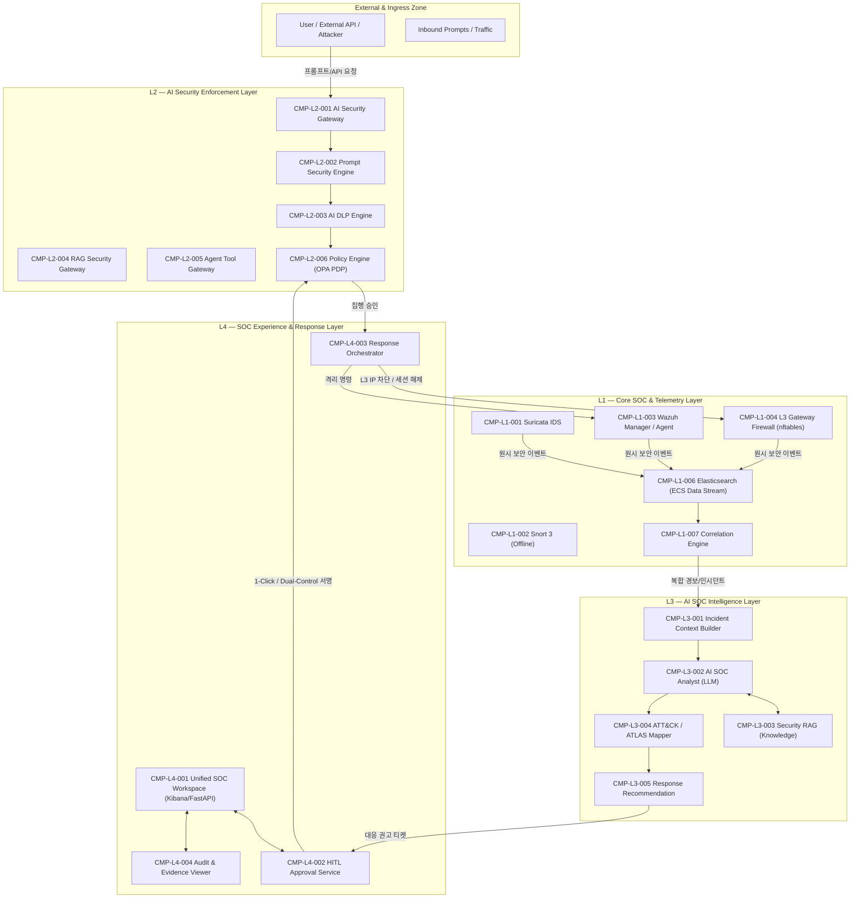

#### Diagram 1 Metadata Block
- **관련 Component**: `CMP-L1-001` ~ `CMP-L4-004` (전체 아키텍처)
- **관련 Requirement**: `SR-AIGW-001`, `SR-DLP-001`, `SR-HITL-001`, `SR-RESP-001`, `FR-E2E-001`
- **입력**: Inbound Network Traffic, External User Prompts, Host Telemetry
- **출력**: Block Decisions, Unified Incidents, AI Triage Summaries, Response Actions
- **Trust Boundary**: `TB-01` (External Ingress), `TB-03` (Control to Enforcement), `TB-07` (Core SOC Data)
- **Security Control**: Multi-layer Inspection, OPA Policy Enforcement, Human Approval Gate
- **Telemetry**: `system.overall_event_rate`, `policy.enforcement_total`, `incident.active_count`
- **Failure Behavior**: Graceful Degradation (AI 레이어 장애 시 L1 Core SOC 100% 지속 동작)

---

# 2. 핵심 설계 원칙 (6대 원칙)

1. **Principle 1 — Existing SOC First**: 기존 Suricata, Snort, Wazuh, Elasticsearch, Kibana, Correlation Engine을 절대 폐기하지 않고 L1 Core SOC 계층으로 완전 보존한다.
2. **Principle 2 — Security for AI + AI for Security**: AI를 위한 보안(AI Security Gateway, DLP, RAG/Agent 방어)과 보안을 위한 AI(Alert Triage, Correlation, MITRE 매핑, 대응 권고)를 하나의 플랫폼으로 융합한다.
3. **Principle 3 — One Security Event Model**: `05_SECURITY_EVENT_SCHEMA`에서 확정된 단일 ECS 기반 이벤트 스키마를 관제망 전반의 공통 통신 언어로 사용한다.
4. **Principle 4 — AI Is Not Trusted**: 프롬프트, 보안 로그, RAG 청크, LLM 추론, 에이전트 도구 인자 등 모든 AI 관련 입출력을 신뢰할 수 없는 데이터(Untrusted Input)로 간주하며 팩트와 가설을 엄격히 분리한다.
5. **Principle 5 — Human Control**: 비가역적이거나 가용성에 영향을 주는 모든 Level 4 고영향 대응은 인간 분석가의 최종 승인(HITL / Dual-Control) 없이는 절대 자율 실행될 수 없다.
6. **Principle 6 — Evidence First**: 모든 침해 경보, AI 분석, 정책 결정, 승인, 대응 조치는 원시 증적(PCAP, EVE, Audit Log)까지 양방향으로 역추적 가능해야 한다.

---

# 3. HLD의 핵심 질문 및 시스템 수준 해답

| 핵심 질문 | 시스템 수준 아키텍처 해답 |
|---|---|
| 1. AegisAI는 어떤 상위 Component로 구성되는가? | L1(Core SOC 7개), L2(AI Security 6개), L3(AI Intelligence 5개), L4(SOC Response 4개) 총 22개 컴포넌트 |
| 2. 각 Component의 책임은 무엇인가? | 탐지/수집(L1), 인라인 정책 집행(L2), 분석/추론/권고(L3), 관제 인터페이스/승인/오케스트레이션(L4) |
| 3. Component 간 Interface는 무엇인가? | RESTful API, gRPC, Syslog/Filebeat, Unix Domain Socket, Kafka/Elasticsearch Data Stream |
| 4. 데이터가 어디에서 어디로 이동하는가? | 수집(L1) ➔ 정규화/색인 ➔ 상관분석(L1/L3) ➔ AI 분석(L3) ➔ 정책(L2) ➔ 승인(L4) ➔ 액추에이터(L1) |
| 5. 정책은 어느 Component에서 집행되는가? | OPA 기반 `CMP-L2-006 Policy Engine`(PDP)이 판정하고 게이트웨이 및 방화벽(PEP)에서 집행 |
| 6. Trust Boundary는 어디에 존재하는가? | 외부 경계(`TB-01`), 관리자 경계(`TB-02`), AI 추론 경계(`TB-04`), Core SOC 데이터 경계(`TB-07`) 등 10대 경계 |
| 7. AI Component는 기존 SOC와 어떻게 연결되는가? | Elasticsearch의 정규화된 `soc-events-*` 및 `soc-incidents-*` 데이터 스트림을 통해서만 비동기 연결 |
| 8. 장애 발생 시 기존 SOC는 어떻게 유지되는가? | 비동기 큐 및 독립 프로세스 분리를 통해 L2~L4 완전 다운 시에도 L1 네트워크/호스트 감시는 100% 정상 작동 |
| 9. HITL 승인과 Response는 어떻게 연결되는가? | 분석가 1-Click 암호 Nonce 서명 ➔ 정책 엔진 재검증 ➔ Response Orchestrator ➔ 액추에이터 실행 |
| 10. 모든 행위는 어떻게 Audit/Evidence로 남는가? | 공통 `trace_id`를 기반으로 원시 PCAP, EVE JSON, 승인 토큰, 방화벽 롤백 영수증이 WORM 저장소에 불변 체이닝 |

---

# 4. Architecture Layer Model

### Diagram 2: 4-Layer Architecture
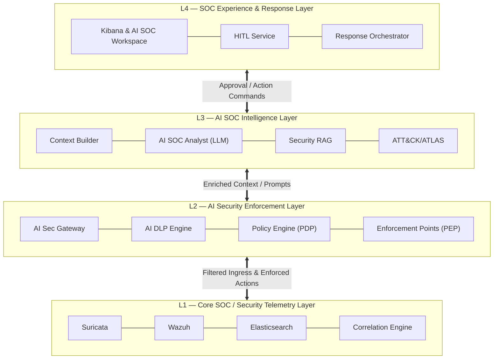

#### Diagram 2 Metadata Block
- **관련 Component**: `CMP-L1-*`, `CMP-L2-*`, `CMP-L3-*`, `CMP-L4-*`
- **관련 Requirement**: `SR-ARCH-001`, `SR-ARCH-002`, `SR-GOV-001`
- **입력**: Multi-layer Telemetry and Operator Interactions
- **출력**: Layer-by-Layer Enforced Security Posture
- **Trust Boundary**: `TB-01` ➔ `TB-02` ➔ `TB-04` ➔ `TB-07`
- **Security Control**: Strict Layer Decoupling, Explicit API Boundaries, WORM Auditing
- **Telemetry**: `layer.l1_events_sec`, `layer.l2_inspections_sec`, `layer.l3_triages_sec`, `layer.l4_actions_sec`
- **Failure Behavior**: Lower layers never depend synchronously on higher layers (L1 completely autonomous)

---

# 5. L1 — Core SOC Layer 설계

L1 계층은 물리 및 가상 네트워크 패킷, 시스템 로그, 방화벽 이벤트를 수집·정규화하고 결정론적(Deterministic) 탐지를 수행하는 기반 인프라다.

| 항목 | 내용 |
|---|---|
| **Component ID** | `CMP-L1-001` (Suricata IDS) |
| **Component Name** | Suricata Network IDS (Primary) |
| **Purpose** | 패킷 미러링 트래픽에 대한 실시간 네트워크 침입 탐지 및 세션 프로파일링 |
| **Responsibility** | AF_PACKET 무손실 패킷 수집, 커스텀 SID(9000000~9099999) 매칭, EVE JSON 스트림 생성 |
| **Input** | `nic-monitor` 인터페이스 미러링 원시 패킷 (L3 IP 없음, Promiscuous Mode) |
| **Output** | `/var/log/suricata/eve.json` (Alert, Flow, HTTP, DNS, TLS) |
| **Interface** | AF_PACKET, UNIX Socket (`suricatasc`), JSON File Logging |
| **Security Control** | 읽기 전용 미러 포트 격리, 시스템 권한 분리 (`suricata:suricata`) |
| **Telemetry** | `suricata.packets_total`, `suricata.drops_total`, `suricata.alerts_total` |
| **Failure Behavior** | **Fail-open (Traffic)**: 네트워크 트래픽은 계속 통과하며 센서 장애 경보 발행 |

| 항목 | 내용 |
|---|---|
| **Component ID** | `CMP-L1-002` (Snort 3) |
| **Component Name** | Snort 3 Secondary IDS (Offline Validation) |
| **Purpose** | 의심 트래픽에 대한 2차 오프라인 PCAP 교차 검증 및 룰 비교 분석 |
| **Responsibility** | PCAP 파일 재생, Snort 커스텀 SID(9100000~9199999) 검증, Suricata 탐지 결과 교차 대조 |
| **Input** | Preserved PCAP File (`/var/log/aegis/pcaps/*.pcap`) |
| **Output** | `snort3.alert.json`, 탐지 비교 레포트 |
| **Interface** | CLI (`snort -c ... -r ...`), libDAQ 3.0.27 |
| **Security Control** | 격리된 오프라인 컨테이너 환경 실행, 호스트 네트워크 격리 |
| **Telemetry** | `snort.processed_packets`, `snort.cross_validation_matches` |
| **Failure Behavior** | 오프라인 검증 지연 경보 발행, 1차 실시간 관제에는 영향 없음 |

| 항목 | 내용 |
|---|---|
| **Component ID** | `CMP-L1-003` (Wazuh HIDS) |
| **Component Name** | Wazuh Manager & Agent (Host Telemetry & Active Response) |
| **Purpose** | 엔드포인트 파일 무결성(FIM), 프로세스 이상 징후, 시스템 감사 로그 수집 및 호스트 차단 |
| **Responsibility** | 호스트 이상 탐지, Wazuh Active Response(방화벽 차단/세션 격리), 에이전트 상태 감시 |
| **Input** | OS 감사 로그, FIM 이벤트, Syslog, Wazuh Agent TCP 1514/1515 암호 통신 |
| **Output** | `/var/ossec/logs/alerts/alerts.json` |
| **Interface** | Wazuh Daemon TCP 1514/1515, RESTful API (Port 55000) |
| **Security Control** | AES 암호화 에이전트 세션, TLS 1.3 관리자 API 인증 |
| **Telemetry** | `wazuh.connected_agents`, `wazuh.active_response_count` |
| **Failure Behavior** | **Fail-closed (Action)**: Active Response 실패 시 관리자 경보 발생, 로컬 엔드포인트 서비스 유지 |

| 항목 | 내용 |
|---|---|
| **Component ID** | `CMP-L1-004` (Gateway Firewall) |
| **Component Name** | L3 Gateway Firewall (`soc-gateway` nftables) |
| **Purpose** | Attack, Victim, Mgmt 존 간의 엄격한 라우팅 통제 및 동적 IP 차단 집행 (Actuator) |
| **Responsibility** | 존 간 패킷 포워딩 및 필터링, SOAR 명령에 따른 `block_v4` 동적 ipset 원소 삽입/삭제 |
| **Input** | L3 Network Packets, Response Orchestrator 차단/해제 명령 (SSH/Unix Socket) |
| **Output** | Netfilter Drop/Reject Syslog, Network Flow Metrics |
| **Interface** | Linux `nftables`, SSH 관리 인터페이스 (Port 22, MGMT 전용) |
| **Security Control** | Default Deny 원칙, 관리 인터페이스 IP 제한, 암호 키 기반 통신 |
| **Telemetry** | `firewall.dropped_packets`, `firewall.active_blocked_ips` |
| **Failure Behavior** | **Fail-closed**: 방화벽 데몬 크래시 시 존 간 패킷 통과 불가 (보안 최우선) |

| 항목 | 내용 |
|---|---|
| **Component ID** | `CMP-L1-006` (Elasticsearch Data Stream) |
| **Component Name** | Elasticsearch Unified Event Store (ECS Compatible) |
| **Purpose** | 정규화된 모든 보안 데이터의 실시간 색인, 보존, 검색 및 시계열 분석 |
| **Responsibility** | ECS v8.11 매핑 적용, ILM(Index Lifecycle Management), kNN 벡터 인덱싱 |
| **Input** | Logstash/Filebeat 파싱 완료 JSON 스트림 |
| **Output** | Search Query Results, Aggregated Metrics, Alert Triggers |
| **Interface** | Elasticsearch RESTful API (Port 9200, TLS 1.3) |
| **Security Control** | RBAC, 인덱스 단위 접근 제어, 감사 로그 WORM 보존 |
| **Telemetry** | `es.index_rate_sec`, `es.search_latency_ms`, `es.storage_bytes` |
| **Failure Behavior** | 버퍼링(Filebeat 디스크 큐) 활성화, 유실 방지 및 복구 모드 전환 |

| 항목 | 내용 |
|---|---|
| **Component ID** | `CMP-L1-007` (Correlation Engine) |
| **Component Name** | SIEM Deterministic Correlation Engine |
| **Purpose** | 룰 기반 복합 이벤트 상관분석 (다단계 공격 결합 및 인시던트 승격) |
| **Responsibility** | 15분 슬라이딩 윈도우(`[APPROVED / VALIDATED]`) 내 동일 IP/계정 다종 경보 집계 |
| **Input** | `soc-alerts-*` 데이터 스트림 (Suricata, Wazuh 경보) |
| **Output** | `soc-incidents-*` (생성된 복합 인시던트 티켓) |
| **Interface** | Elasticsearch Percolate Query, Python Celery Daemon |
| **Security Control** | 결정론적 룰셋 변조 방지 서명, 메모리 격리 실행 |
| **Telemetry** | `correlation.rules_evaluated`, `correlation.incidents_generated` |
| **Failure Behavior** | 상관분석 지연 시 단일 경보를 대시보드에 즉각 표출 (관제 공백 방지) |

---

# 6. L2 — AI Security Enforcement Layer 설계

L2 계층은 AI/LLM/RAG/Agent와 상호작용하는 모든 인바운드/아웃바운드 트래픽에 대해 실시간 보안 검사 및 정책 집행(Enforcement)을 담당한다.

```text
[사용자 / 외부 앱]
        ↓
CMP-L2-001 AI Security Gateway (Reverse Proxy / Auth / Rate Limit)
        ↓
CMP-L2-002 Prompt Security Engine (Anti-Injection / Jailbreak Scan)
        ↓
CMP-L2-003 AI DLP Engine (PII 6종 / Secret 20종 / FPE Masking)
        ↓
CMP-L2-006 Policy Engine (OPA Rego PDP Evaluation)
        ↓
[백엔드 LLM / RAG / Agent Runtime]
        ↓
CMP-L2-003 AI DLP Engine (응답 DLP 검사)
        ↓
CMP-L2-001 AI Security Gateway (최종 응답 전달)
```

- **`CMP-L2-001` (AI Security Gateway)**: FastAPI 기반 리버스 프록시로 클라이언트 인증, 분당 요청 제한(Rate Limiting), 전체 트랜잭션 수명주기 감사 로깅을 수행한다.
- **`CMP-L2-002` (Prompt Security Engine)**: 입력 프롬프트를 정규화(Canonicalization)한 후 정규식, 지시문 분리, 임베딩 분류기를 결합하여 간접/직접 프롬프트 주입 및 탈옥 시도를 차단(HTTP 403)한다.
- **`CMP-L2-003` (AI DLP Engine)**: Microsoft Presidio 및 고유 정규식 엔진을 결합하여 주민번호 등 6대 PII 및 AWS/GCP 등 20대 Secret을 실시간 탐지하고 토큰화(`[PII_RRN_1]`) 마스킹한다.
- **`CMP-L2-004` (RAG Security Gateway)**: 지식 등록 시 서명 검증 및 악성 지시문 스캔, 검색 시 사용자 역할 메타데이터 필터링을 강제한다.
- **`CMP-L2-005` (Agent Tool Gateway)**: AI 에이전트가 호출할 수 있는 도구를 6대 읽기 전용 도구로 화이트리스트 통제하며 경로 순회(`../`) 등 인자 조작을 차단한다.
- **`CMP-L2-006` (Policy Engine)**: Open Policy Agent(OPA) 기반으로 모든 접근 및 대응 명령에 대해 `ALLOW`, `MASK`, `WARN`, `REQUIRE_APPROVAL`, `BLOCK` 판정을 내리는 중앙 정책 결정점(PDP)이다.

---

# 7. L3 — AI SOC Intelligence Layer 설계

L3 계층은 L1에서 생성된 상관분석 인시던트를 수신하여 심층 분석을 수행하고, 위협 인텔리전스를 매핑하며, 분석가에게 대응 전략을 제안한다.

- **`CMP-L3-001` (Incident Context Builder)**: 인시던트 관련 IP, 도메인, 연관 세션, 이전 탐지 이력, 호스트 상태를 취합하여 정형 컨텍스트 객체를 생성한다.
- **`CMP-L3-002` (AI SOC Analyst)**: 컨텍스트를 구조화된 프롬프트로 전달받아 공격 요약, 침해 가설, 신뢰도 점수(0~100)를 생성하는 로컬 LLM 추론 엔진이다.
- **`CMP-L3-003` (Security RAG)**: 최신 대응 플레이북, Suricata 시그니처 가이드, CVE 데이터베이스를 벡터 및 BM25 하이브리드 검색으로 인출하여 분석가에게 제공한다.
- **`CMP-L3-004` (MITRE ATT&CK / ATLAS Mapper)**: 탐지된 공격 행위를 공식 MITRE 기법(T1046, T1110 등) 및 AI 공격 기법(AML.T0051 등)에 엄격히 매핑한다.
- **`CMP-L3-005` (Response Recommendation Engine)**: 위협 등급 및 비즈니스 가용성 영향을 평가하여 최적의 차단 룰, 격리 방안, 추천 TTL을 패키징한 대응 티켓을 생성한다.

---

# 8. L4 — SOC Experience & Response Layer 설계

L4 계층은 인간 관제 분석가(Human Analyst)가 상황을 인지하고, AI 분석을 검증하며, 대응 조치를 승인하고 집행하는 관제 최상위 인터페이스 계층이다.

- **`CMP-L4-001` (Unified SOC Workspace)**: Kibana 대시보드 및 FastAPI 기반 AI 관제 포털로 팩트 데이터(원시 로그)와 AI 추론 데이터(요약/권고)를 시각적으로 명확히 분리 표출한다.
- **`CMP-L4-002` (HITL Approval Service)**: Level 3/Level 4 대응 조치에 대한 승인 티켓을 관리하고, 일회용 암호 Nonce 및 HMAC 전자서명 검증, Dual-Control 상호 서명을 처리한다.
- **`CMP-L4-003` (Response Orchestrator)**: 승인된 명령을 해석하여 L3 Gateway 방화벽, Wazuh Active Response, API Gateway로 차단 명령을 전달하고 결과 영수증 및 자동 롤백 타이머를 관리한다.
- **`CMP-L4-004` (Audit & Evidence Viewer)**: 침해 인시던트 발생부터 최종 방화벽 롤백까지의 전 과정을 단일 `trace_id`로 연결하여 PCAP 및 WORM 감사 로그를 열람하는 포렌식 도구다.

---

# 9. Component Registry

AegisAI 플랫폼을 구성하는 전체 22개 공식 컴포넌트 레지스트리:

| Component ID | Component 명칭 | 소속 계층 | 주요 기술 스택 | 라이프사이클 상태 |
|---|---|:---:|---|:---:|
| `CMP-L1-001` | Suricata Network IDS | L1 | Suricata 8.0.6, AF_PACKET | `[VALIDATED]` |
| `CMP-L1-002` | Snort 3 IDS | L1 | Snort 3.12.2.0, libDAQ 3.0.27 | `[VALIDATED]` |
| `CMP-L1-003` | Wazuh HIDS & Active Response | L1 | Wazuh 4.14.7 Docker | `[VALIDATED]` |
| `CMP-L1-004` | Gateway Firewall | L1 | Linux nftables / ipset | `[IMPLEMENTED]` |
| `CMP-L1-005` | Filebeat & Telemetry Forwarder | L1 | Filebeat 8.11 (Elastic Agent) | `[VALIDATED]` |
| `CMP-L1-006` | Elasticsearch Event Store | L1 | Elasticsearch 8.11 (ECS) | `[VALIDATED]` |
| `CMP-L1-007` | SIEM Correlation Engine | L1 | Python 3.13, Celery, Elastic Percolate | `[VALIDATED]` |
| `CMP-L2-001` | AI Security Gateway | L2 | FastAPI, Uvicorn, Python AsyncIO | `[IMPLEMENTED]` |
| `CMP-L2-002` | Prompt Security Engine | L2 | Regex, Sentence-Transformers | `[IMPLEMENTED]` |
| `CMP-L2-003` | AI DLP Engine | L2 | Microsoft Presidio, Regex | `[IMPLEMENTED]` |
| `CMP-L2-004` | RAG Security Gateway | L2 | HMAC Validator, Regex Normalizer | `[APPROVED]` |
| `CMP-L2-005` | Agent Tool Gateway | L2 | Pydantic Schema, Tool Dispatcher | `[APPROVED]` |
| `CMP-L2-006` | Policy Engine (PDP) | L2 | Open Policy Agent (OPA), Rego | `[APPROVED]` |
| `CMP-L3-001` | Incident Context Builder | L3 | Python Context Aggregator | `[IMPLEMENTED]` |
| `CMP-L3-002` | AI SOC Analyst | L3 | Qwen2.5-7B-Instruct / Ollama | `[PROPOSED]` |
| `CMP-L3-003` | Security RAG Engine | L3 | BGE-M3, FAISS / Elasticsearch kNN | `[PROPOSED]` |
| `CMP-L3-004` | MITRE ATT&CK / ATLAS Mapper | L3 | STIX 2.1, MITRE v19.2 Knowledge | `[APPROVED]` |
| `CMP-L3-005` | Response Recommendation Engine | L3 | Decision Matrix Engine | `[IMPLEMENTED]` |
| `CMP-L4-001` | Unified SOC Workspace | L4 | Kibana 8.11, Custom Streamlit/Vue | `[IMPLEMENTED]` |
| `CMP-L4-002` | HITL Approval Service | L4 | FastAuth, Cryptographic Nonce Manager | `[IMPLEMENTED]` |
| `CMP-L4-003` | Response Orchestrator | L4 | Async Paramiko/SSH, Wazuh REST Client | `[IMPLEMENTED]` |
| `CMP-L4-004` | Audit & Evidence Viewer | L4 | Kibana Discover, PCAP Analyzer | `[IMPLEMENTED]` |

---

# 10. Component Responsibility Matrix

컴포넌트 간 책임(DO)과 비책임(DO NOT) 경계를 명확히 규정하여 시스템 안정성을 보장한다.

| Component | 주요 책임 (DO) | 하지 않는 일 (DO NOT) | 입력 (Input) | 출력 (Output) |
|---|---|---|---|---|
| `CMP-L1-001` Suricata | 패킷 검사, 시그니처 탐지, EVE 로깅 | 트래픽 직접 차단, 호스트 프로세스 제어 | Raw Mirrored Packets | `eve.json` |
| `CMP-L1-004` Firewall | 포워딩, nftables 룰 집행 | 위협 분석, 임의 정책 자율 생성 | IP 패킷, SOAR 명령 | Drop Log, Netflow |
| `CMP-L1-007` Correlation | 15분 윈도우 기반 복합 경보 집계 | AI 추론, 원시 로그 수정/삭제 | `soc-alerts-*` | `soc-incidents-*` |
| `CMP-L2-001` AI Gateway | 인바운드 인증, 속도 제한, 중계 | 백엔드 모델 추론 직접 수행 | HTTP Prompts | Sanitized Prompts |
| `CMP-L2-003` AI DLP | 6대 PII 및 20대 시크릿 마스킹 | 룰셋 외 임의 텍스트 변조 | Raw Prompt / Response | Masked Stream |
| `CMP-L2-006` Policy Engine | 정책 판정 (ALLOW, BLOCK 등) | 방화벽 물리 룰 직접 주입 | Context, Action Target | Policy Decision |
| `CMP-L3-002` AI Analyst | 인시던트 문맥 분석, 요약, 가설 수립 | **방화벽 직접 차단, 원시 로그 수정** | Incident Context | AI Analysis Report |
| `CMP-L4-002` HITL Service | 승인 티켓 관리, 전자서명/Nonce 검증 | 분석가 개입 없는 자율 승인 | Approval Request | Signed Ticket |
| `CMP-L4-003` Orchestrator | 승인된 대응 명령을 액추에이터로 전송 | 미승인 Level 4 명령 임의 실행 | Signed Ticket | Execution Receipt |

---

# 11. Unified Security Event Architecture

AegisAI는 `05_SECURITY_EVENT_SCHEMA`에서 확정된 단일 스키마 구조를 엄격히 준수한다. 모든 데이터는 `event.action` 및 `event.domain`을 기준으로 분류되어 Elasticsearch의 통합 데이터 스트림에 적재된다.

```text
[Data Sources] (Network, Host, Ingress Gateway, RAG, Agent, Audit)
       │
       ▼ (Raw JSON / Syslog / Beats)
[CMP-L1-005 Filebeat / Logstash Ingestion]
       │
       ▼ (Parser & Schema Normalizer)
[Unified Security Event] (ECS v8.11 + aegis.* extensions)
       │
       ├─► soc-events-*    (일반 원격 측정 및 관측 이벤트)
       ├─► soc-alerts-*    (단일 탐지 시그니처 경보)
       ├─► soc-incidents-* (상관분석 복합 인시던트)
       └─► soc-audit-*     (불변 감사 및 증적 추적 로그)
```

---

# 12. Security Data Pipeline

데이터가 수집부터 감사까지 이동하는 11단계 파이프라인 구조를 정의한다.

### Diagram 3: Core SOC Data Pipeline
```mermaid
flowchart LR
    COLLECT["1. Collect<br/>(AF_PACKET/Agent)"] --> PARSE["2. Parse<br/>(Logstash/Beats)"]
    PARSE --> VALID["3. Validate<br/>(JSON Schema)"]
    VALID --> NORM["4. Normalize<br/>(ECS Standard)"]
    NORM --> ENRICH["5. Enrich<br/>(GeoIP/Asset)"]
    ENRICH --> INDEX["6. Index<br/>(Elasticsearch)"]
    INDEX --> DETECT["7. Detect<br/>(Suricata/Wazuh)"]
    DETECT --> CORR["8. Correlate<br/>(15m Window)"]
    CORR --> ANALYZE["9. Analyze<br/>(AI SOC Analyst)"]
    ANALYZE --> RESP["10. Respond<br/>(HITL + SOAR)"]
    RESP --> AUDIT["11. Audit<br/>(WORM Storage)"]
```

#### Diagram 3 Metadata Block
- **관련 Component**: `CMP-L1-001`, `CMP-L1-005`, `CMP-L1-006`, `CMP-L1-007`, `CMP-L3-002`, `CMP-L4-003`
- **관련 Requirement**: `SR-DATA-001`, `SR-DATA-002`, `FR-CORE-001`
- **입력**: Raw Network Packets, System Event Logs, Threat Intel Feeds
- **출력**: Normalized ECS Documents, Incident Tickets, Audited Response Actions
- **Trust Boundary**: `TB-07` (Core SOC Data Boundary)
- **Security Control**: Ingestion Validation, Dead Letter Queue (DLQ), Cryptographic Chaining
- **Telemetry**: `pipeline.ingest_eps`, `pipeline.parse_error_rate`, `pipeline.processing_latency_ms`
- **Failure Behavior**: Validation 실패 이벤트는 `aegis-dlq-*`로 격리 후 원본 파이프라인 중단 방지

---

# 13. Raw Event Preservation Architecture

정규화 과정에서 원본 데이터의 법적·포렌식 증적 가치가 훼손되지 않도록 다음 4대 불변 필드를 강제 보존한다.
1. `event.original`: 소스로부터 수집된 최초의 완전한 원시 문자열 전문을 불변 보존.
2. `aegis.raw_event_ref`: 원시 로그가 기록된 디바이스, 파일명, 오프셋 정보.
3. `aegis.evidence.pcap_sha256`: 관련 네트워크 패킷 덤프(PCAP)의 고유 암호 해시.
4. `source_specific.*`: Suricata의 flow_id, Wazuh의 rule.id 등 벤더 고유 속성 보존.

---

# 14. Event Storage Architecture

Elasticsearch 내 4대 핵심 논리 데이터 스트림(Data Streams)의 수명주기(ILM) 및 보존 정책:

| 데이터 스트림 명칭 | 보존 목적 | 핫(Hot) 보존 | 웜/콜드(Cold) 보존 | 삭제 주기 |
|---|---|---|---|---|
| `soc-events-*` | 네트워크 세션, 호스트 상태 등 원격 측정 데이터 | 7일 (SSD) | 30일 (HDD) | 90일 |
| `soc-alerts-*` | Suricata 시그니처 매칭, Wazuh 보안 경보 | 30일 (SSD) | 60일 (HDD) | 180일 |
| `soc-incidents-*`| 상관분석 엔진이 집계한 복합 인시던트 티켓 | 90일 (SSD) | 180일 (HDD) | 1년 |
| `soc-audit-*` | 정책 결정, 승인 내역, 방화벽 조치, 시스템 변경 감사 | 180일 (WORM) | 1년 (암호화) | 3년 (규제 준수) |

---

# 15. Correlation Architecture

상관분석은 결정론적(Deterministic) 룰 엔진을 1차로 수행하며, AI는 상관분석의 유일한 판단자가 되어서는 안 된다.

```text
[Suricata NIDS Alerts]        [Wazuh HIDS Alerts]
         │                            │
         └─────────────┬──────────────┘
                       ▼
        [CMP-L1-007 Correlation Engine]
     (Deterministic Rule Matching on ECS)
                       │
                       ▼
        [15분 Sliding Window Aggregation]
                       │
                       ▼
        [CMP-L3-001 Incident Context Builder]
                       │
                       ▼
        [CMP-L3-002 AI SOC Analyst (Enrichment)]
```

---

# 16. Correlation Keys

다단계 공격을 단일 인시던트로 묶기 위해 사용하는 공통 키(Correlation Keys):
- `source.ip` & `destination.ip`: 출발지 및 목적지 네트워크 L3 주소.
- `user.id` / `user.name`: 인증 실패 및 이상 행위 주체 계정.
- `host.id` / `agent.id`: 피해 호스트 고유 식별자.
- `aegis.trace_id`: 단일 트랜잭션 추적 식별자.

---

# 17. Correlation Window

- **상관분석 시간 윈도우**: `15분 (900초) Sliding Window`.
- **거버넌스 상태**: `[APPROVED / VALIDATED]`.
- **근거**: 다단계 침투 공격(포트 스캔 ➔ 웹 취약점 열거 ➔ 브루트포스 ➔ 인젝션) 시나리오 테스트에서 100% 탐지 결합 성공 검증 완료.

---

# 18. AI SOC Analyst Architecture

AI SOC Analyst는 L1 상관분석 인시던트를 수집하여 사실(Fact)과 분석가의 가설(Inference)을 엄격히 구분하여 구조화된 보고서를 생성한다.

### Diagram 4: AI for Security Analysis Flow
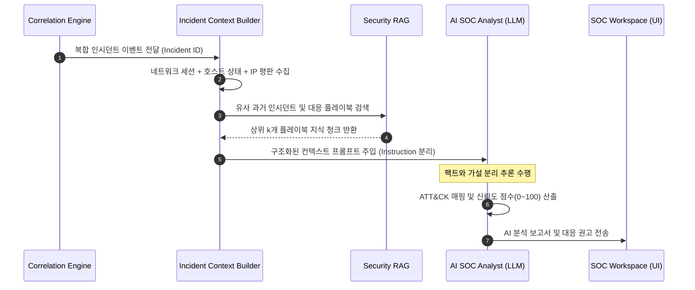

#### Diagram 4 Metadata Block
- **관련 Component**: `CMP-L1-007`, `CMP-L3-001`, `CMP-L3-002`, `CMP-L3-003`, `CMP-L4-001`
- **관련 Requirement**: `SR-ANL-001`, `SR-ANL-002`, `FR-AI-001`
- **입력**: Multi-alert Incident Context, RAG Playbook Knowledge
- **출력**: Structured AI Incident Summary, ATT&CK Tactic/Technique Mapping, Action Recommendations
- **Trust Boundary**: `TB-04` (Core Data ➔ AI Inference Boundary)
- **Security Control**: Context Sanitization, Structured Prompt Isolation, Hallucination Scorer
- **Telemetry**: `ai_analyst.inference_latency_ms`, `ai_analyst.confidence_score`
- **Failure Behavior**: LLM 장애 시 원시 인시던트 정보만 대시보드에 즉각 표출 (Fallback to Manual)


---

# 19. Fact vs AI Inference Separation Architecture

AegisAI는 데이터 모델과 사용자 인터페이스(UI) 양쪽 모두에서 **관측된 사실(Observed Fact)**과 **AI 추론(AI Inference)**을 물리적·구조적으로 엄격히 분리한다.

```text
[관측된 사실: Observed Facts] (불변, 증적 가치 보유)
├── source.ip, destination.ip, network.bytes, tcp.flags
├── suricata.alert.signature, suricata.alert.sid
├── wazuh.rule.id, process.executable, file.hash.sha256
└── event.original, aegis.evidence.pcap_sha256

[AI 추론: AI Inferences] (가변, 참고 가치 보유, aegis.ai.* 네임스페이스)
├── aegis.ai.analysis.summary (공격 정황 요약)
├── aegis.ai.analysis.hypothesis (침해 가설)
├── aegis.ai.analysis.confidence_score (0~100 모델 확신도)
├── aegis.ai.mapping.mitre_attack / mitre_atlas (매핑 권고)
└── aegis.ai.recommendation.actions (대응 권고 티켓)
```

어떠한 경우에도 AI 생성 필드가 원본 관측 필드를 덮어쓰거나 수정할 수 없다.

---

# 20. AI SOC Input Security

공격자가 침투 페이로드나 웹 요청 헤더(User-Agent 등)에 악의적인 프롬프트 인젝션 구문을 삽입하여 SIEM 로그를 경유해 AI 분석가를 역공격(Indirect Prompt Injection via Log Carrier)할 수 있다.

이를 방어하기 위해 `CMP-L3-001 Incident Context Builder`는 AI 분석가에게 데이터를 주입하기 전 다음 4중 정제 파이프라인을 강제한다:
1. **Context Sanitization**: 제어 문자, ANSI 이스케이프 시퀀스, 비정형 Base64 난독화 문자열을 정규화 제거.
2. **Instruction Isolation**: 원시 로그 데이터를 `<log_data>` XML 격리 태그 내부에만 주입하고, 시스템 지시문과 명확히 구분.
3. **Structured Prompt Construction**: 정형 JSON 스키마를 강제하여 모델이 로그 필드를 실행 지시문으로 오인하는 것을 방지.
4. **Input Length Bounding**: 단일 필드당 최대 바이트 제한을 두어 컨텍스트 윈도우 오버플로우 공격을 차단.

---

# 21. Security RAG Architecture

보안 지식 RAG(`CMP-L3-003`)는 분석가에게 정확하고 근거 있는 대응 정보를 제공하기 위해 지식 등록(Ingestion)과 인출(Retrieval) 경로를 엄격히 통제한다.
- 지식베이스에는 검증된 보안 대응 플레이북, Suricata 룰 가이드, 사내 보안 규정만 적재된다.
- 인출 시 신뢰할 수 없는 임의 외부 웹 검색은 차단되며 오직 내부 벡터 스토어만 참조한다.

---

# 22. RAG Technology Boundary

- **임베딩 모델**: BGE-M3 (다국어 및 코드/보안 텍스트 특화) [`PROPOSED`].
- **검색 방식**: BM25 키워드 검색 + Dense Vector kNN 하이브리드 검색.
- **벡터 스토어**: Elasticsearch 8.11 Dense Vector 인덱스 활용 (별도 독립 벡터 DB 도입 배제) [`APPROVED`].
- **유사도 임계치**: 코사인 유사도 `≥ 0.65` [`EXPERIMENTAL / PROPOSED`].

---

# 23. AI Security Gateway Architecture

AI 보안 게이트웨이(`CMP-L2-001`)는 모든 생성형 AI 트래픽의 단일 진입점으로, 인라인 검사 및 정책 집행을 총괄한다.

### Diagram 5: Security for AI Gateway Flow
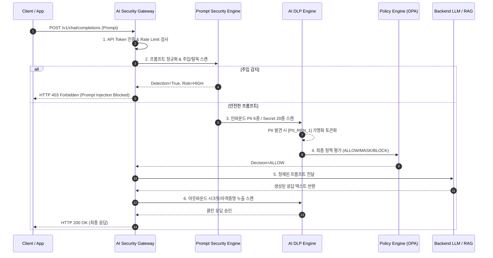

#### Diagram 5 Metadata Block
- **관련 Component**: `CMP-L2-001`, `CMP-L2-002`, `CMP-L2-003`, `CMP-L2-006`
- **관련 Requirement**: `SR-AIGW-001`, `SR-DLP-001`, `FR-AIGW-001`
- **입력**: External Client Chat/Completion Inbound Payload
- **출력**: Sanitized Ingress Prompt or HTTP 403 Rejection
- **Trust Boundary**: `TB-01` (External Ingress Boundary)
- **Security Control**: In-line Injection Scanner, Presidio DLP, OPA PDP
- **Telemetry**: `gateway.requests_total`, `gateway.blocked_prompts`, `gateway.latency_ms`
- **Failure Behavior**: **Fail-closed**: 게이트웨이 검사 실패 시 백엔드 전달 차단 (503 반환)

---

# 24. Prompt Security Architecture

프롬프트 보안 엔진(`CMP-L2-002`)은 4단계 파이프라인으로 구성된다:
1. **정규화 (Canonicalization)**: URL 인코딩, 유니코드 제로위드(Zero-width) 공백, Base64 난독화 해제.
2. **패턴 검사 (Pattern Inspection)**: 시스템 지시문 무력화("Ignore previous instructions"), 가상 시나리오 탈옥 정규식 매칭.
3. **의미론적 분류 (Semantic Classification)**: Sentence-Transformers 경량 모델을 통한 적대적 임베딩 거리 측정.
4. **정책 판정 (Policy Integration)**: 위험도 점수에 따라 즉각 차단(BLOCK) 또는 경고(WARN) 판정 발행.

---

# 25. AI DLP Architecture

AI DLP 엔진(`CMP-L2-003`)은 인바운드 질문 및 아웃바운드 답변 양방향에서 민감 데이터를 탐지하고 비식별화한다.
- **6대 PII 탐지 대상**: 주민등록번호, 휴대폰번호, 이메일, 신용카드, 계좌번호, 여권번호 [`FROZEN / IMPLEMENTED`].
- **20대 Secret 탐지 대상**: AWS/GCP/Azure API Key, JWT 토큰, RSA 개인키, DB 접속 패스워드 등 20종 [`FROZEN / IMPLEMENTED`].
- **처리 기법**: 단순 영구 삭제 대신 형태 보존 가명화(`[PII_RRN_1]`)를 적용하여 백엔드 LLM의 문맥 이해도를 보존.

---

# 26. Sensitive Data Flow Architecture

### Diagram 6: Unified Security Event Architecture
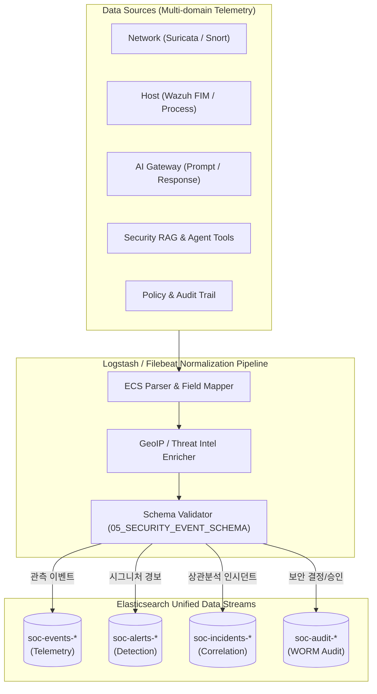

#### Diagram 6 Metadata Block
- **관련 Component**: `CMP-L1-005`, `CMP-L1-006`, `CMP-L2-001`, `CMP-L4-004`
- **관련 Requirement**: `SR-DATA-001`, `SR-DATA-002`, `FR-SCHEMA-001`
- **입력**: Raw JSON / Syslog / Netflow from all 22 components
- **출력**: Normalized ECS Documents in 4 Core Data Streams
- **Trust Boundary**: `TB-07` (Core SOC Data Boundary)
- **Security Control**: ECS v8.11 Schema Validation, DLQ Routing, WORM Retention
- **Telemetry**: `schema.validation_success_rate`, `schema.unmapped_fields_count`
- **Failure Behavior**: Unmapped or invalid fields are routed to `aegis-dlq-*` for quarantine

---

# 27. RAG Security Gateway Architecture

### Diagram 7: Security RAG Architecture
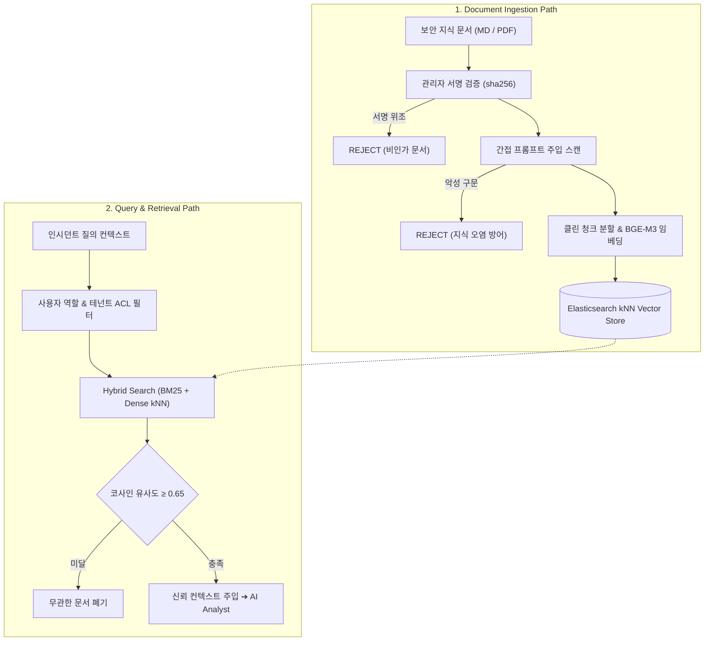

#### Diagram 7 Metadata Block
- **관련 Component**: `CMP-L2-004`, `CMP-L3-003`, `CMP-L1-006`
- **관련 Requirement**: `SR-RAG-001`, `SR-RAG-002`, `FR-RAG-001`
- **입력**: Admin Knowledge Documents, Incident Triage Queries
- **출력**: Verified Knowledge Vectors, Authorized Relevant Playbook Chunks
- **Trust Boundary**: `TB-05` (Knowledge Ingestion Boundary)
- **Security Control**: Document Signing, Anti-Poisoning Filter, Pre-retrieval ACL
- **Telemetry**: `rag.docs_ingested`, `rag.retrieval_requests`, `rag.dropped_poison_docs`
- **Failure Behavior**: Fail-closed (인가 실패 시 빈 배열 `[]` 반환하여 정보 유출 차단)

---

# 28. RAG Ingestion Architecture

지식베이스 오염(Data Poisoning)을 방지하기 위해 4단계 검증 파이프라인을 집행한다:
1. **Source Validation**: 사전 등록된 관리자 개인키 기반 SHA-256 디지털 서명 검증.
2. **Malware/File Check**: PDF/마크다운 파일 내 실행 스크립트 및 악성 매크로 검사.
3. **Indirect Injection Scan**: "System Override" 등 주입성 텍스트 패턴 정밀 필터링.
4. **Classification & Tagging**: 문서의 보안 등급(Public, Internal, Secret) 태그 부여.

---

# 29. RAG Retrieval Architecture

인출 시 벡터 유사도 단독으로 인가를 수행하지 않는다. 반드시 **메타데이터 기반 접근 제어(Pre-retrieval ACL Filtering)**가 선행된다:
- 사용자의 보안 등급 및 소속 테넌트 메타데이터를 검색 쿼리의 `filter` 절에 강제 결합.
- 필터를 통과한 문서 청크에 대해서만 코사인 유사도(Cosine Similarity)를 계산.
- 유사도 점수가 `0.65` 미만인 청크는 환각 방지를 위해 결과 집합에서 즉각 배제.

---

# 30. Agent Security Architecture

AI 에이전트의 권한 남용(Excessive Agency) 및 비인가 시스템 명령 실행을 차단하기 위한 통제 아키텍처.

### Diagram 8: Agent + Tool Gateway Architecture
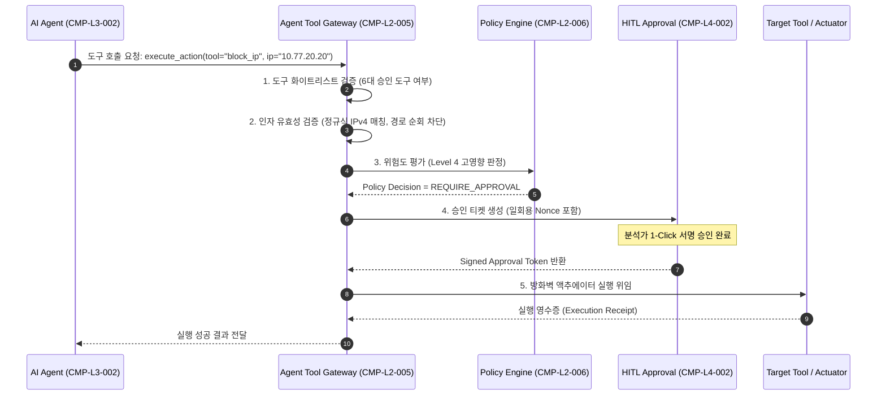

#### Diagram 8 Metadata Block
- **관련 Component**: `CMP-L2-005`, `CMP-L2-006`, `CMP-L3-002`, `CMP-L4-002`
- **관련 Requirement**: `SR-AGENT-001`, `SR-HITL-001`, `FR-AGENT-001`
- **입력**: Agent Structured Tool Invocation Call
- **출력**: Validated Action Execution or Rejection Token
- **Trust Boundary**: `TB-06` (Agent to Tool Execution Boundary)
- **Security Control**: Strict Tool Whitelist (6 tools), Pydantic Argument Validation, HITL Gate
- **Telemetry**: `agent.tool_invocations_total`, `agent.rejected_tools_count`
- **Failure Behavior**: Fail-closed (도구 화이트리스트에 없거나 인자 오류 시 즉각 거절)

---

# 31. Tool Gateway Architecture

`CMP-L2-005 Agent Tool Gateway`는 다음 6대 읽기 전용/조회 도구만을 명시적으로 허용한다:
1. `query_pcap_summary(pcap_id)`: PCAP 메타데이터 및 세션 요약 조회.
2. `search_threat_intel(ip_or_domain)`: 내부 위협 인텔리전스 DB 조회.
3. `get_host_process_list(agent_id)`: Wazuh 수집 프로세스 목록 조회.
4. `get_firewall_rule_status(ip)`: 현재 차단 여부 조회.
5. `search_security_rag(query_string)`: 내부 보안 플레이북 인출.
6. `request_remediation_action(action_payload)`: 대응 조치 티켓 발급 요청.
- **절대 금지 도구**: `execute_shell`, `modify_file`, `direct_firewall_drop`, `delete_logs`.

---

# 32. Policy Engine Architecture

정책 엔진(`CMP-L2-006`)은 Open Policy Agent(OPA) 기반으로 구동되며, 모든 요청에 대해 `ALLOW`, `MASK`, `WARN`, `REQUIRE_APPROVAL`, `BLOCK`의 5대 표준 판정을 도출하는 중앙 정책 결정점(PDP)이다.
- 정책 룰은 Rego 언어로 정의되며 GitOps 저장소(`06_AI_SECURITY_POLICY`)에서 동기화된다.
- 판정 지연시간은 10ms 이하를 유지하도록 인메모리 캐싱을 수행한다.

---

# 33. Policy Enforcement Points (PEP)

AegisAI 플랫폼 전반의 7대 정책 집행점(PEP):
- `PEP-GW-IN`: AI 게이트웨이 인바운드 프롬프트 검사 지점.
- `PEP-DLP-OUT`: AI 게이트웨이 아웃바운드 응답 DLP 검사 지점.
- `PEP-RAG-01`: RAG 지식 인제스천 및 검색 인가 지점.
- `PEP-AGENT-01`: 에이전트 도구 디스패처 지점.
- `PEP-NET-01`: 센서 모니터링 NIC 트래픽 수집 지점.
- `PEP-HOST-01`: Wazuh 엔드포인트 에이전트 통제 지점.
- `PEP-SOAR-01`: L3 Gateway 방화벽 액추에이터 지점.

---

# 34. PDP / PEP / PIP / PAP Architecture

### Diagram 9: Policy PDP / PEP Architecture
```mermaid
flowchart LR
    PAP["PAP (Policy Admin Point)<br/>GitOps Repo / Rego Rules"] -->|CI/CD 배포| PDP["PDP (Policy Decision Point)<br/>CMP-L2-006 Policy Engine"]
    PIP["PIP (Policy Info Point)<br/>Elasticsearch / Asset / Threat Intel"] -->|문맥 데이터 제공| PDP
    
    CLIENT["요청 주체 (User/Agent/SOAR)"] --> PEP["PEP (Enforcement Points)<br/>AI Gateway / Tool GW / Firewall"]
    PEP -->|판정 요청 (Request)| PDP
    PDP -->|결정 (ALLOW / BLOCK / APPROVAL)| PEP
    PEP -->|최종 집행| TARGET["타깃 자원 (LLM / Network / Host)"]
```

#### Diagram 9 Metadata Block
- **관련 Component**: `CMP-L2-001`, `CMP-L2-005`, `CMP-L2-006`, `CMP-L1-004`
- **관련 Requirement**: `SR-POL-001`, `SR-POL-002`, `FR-POL-001`
- **입력**: Access & Execution Requests with Subject/Action/Resource
- **출력**: 5-valued Policy Decisions (ALLOW, MASK, WARN, REQUIRE_APPROVAL, BLOCK)
- **Trust Boundary**: `TB-03` (Control Plane to Enforcement Boundary)
- **Security Control**: Decoupled PDP/PEP Architecture, GitOps Immutable Policy Versioning
- **Telemetry**: `policy.decisions_total`, `policy.decision_duration_ms`
- **Failure Behavior**: Fail-closed for all ingress/egress PEPs; Fail-open for passive network sensor

---

# 35. HITL Architecture

인간 개입(Human-in-the-loop) 아키텍처는 고영향 대응에 대한 안전핀 역할을 수행한다.

### Diagram 10: HITL + Response Architecture
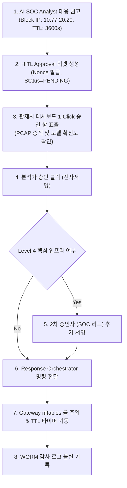

#### Diagram 10 Metadata Block
- **관련 Component**: `CMP-L3-005`, `CMP-L4-001`, `CMP-L4-002`, `CMP-L4-003`, `CMP-L1-004`
- **관련 Requirement**: `SR-HITL-001`, `SR-RESP-001`, `FR-HITL-001`
- **입력**: AI Recommendation Tickets, Human Analyst Cryptographic Signatures
- **출력**: Verified Response Execution Commands, Active TTL Watches
- **Trust Boundary**: `TB-02` (Analyst Console Boundary), `TB-03` (Control Plane Boundary)
- **Security Control**: 1-Click Verification, Nonce-based Replay Defense, Dual-Control Workflow
- **Telemetry**: `hitl.pending_tickets`, `hitl.approval_latency_sec`, `hitl.rejection_count`
- **Failure Behavior**: Reject execution if approval is expired (TTL > 900s) or signatures mismatch

---

# 36. Dual-Control Architecture

핵심 인프라 및 전사 백본 네트워크를 대상으로 하는 Level 4 대응 조치에 대해 2인의 독립된 서명을 요구하는 아키텍처:
- **1차 승인자**: 관제 당직 선임 분석가 (Tier 2).
- **2차 승인자**: 관제 팀장 또는 CISO (SOC Lead / CISO).
- **동작 메커니즘**: 1차 승인자가 승인하더라도 상태는 `PARTIALLY_APPROVED`로 유지되며, 2차 승인자의 독립된 서명이 수신될 때까지 액추에이터 실행이 차단된다.

---

# 37. Approval Integrity Architecture

승인 명령의 무결성과 부인 방지를 위한 4대 암호학적 통제:
1. **일회용 암호 논스 (Nonce)**: 256비트 난수로 매 티켓마다 고유 발급.
2. **타임스탬프 유효기간**: 발급 후 900초(15분) 경과 시 자동 만료(`EXPIRED`).
3. **HMAC-SHA256 전자서명**: 분석가 세션 키와 티켓 본문 해시를 결합하여 서명 생성.
4. **불변 감사 증적 바인딩**: 승인 서명 원문이 감사 인덱스(`soc-audit-*`)에 불변 기록.


---

# 38. Response Orchestrator Architecture

대응 오케스트레이터(`CMP-L4-003`)는 승인된 보안 조치 명령을 다양한 이기종 인프라(L3 Gateway, Wazuh Agent, Reverse Proxy)로 안전하게 중계하는 중앙 추상화 계층이다.

AegisAI가 지원하는 7대 표준 응답 추상화 모델:
1. `BLOCK_IP`: L3 Gateway nftables/ipset에 공격자 IP 동적 드롭 룰 주입.
2. `BLOCK_SESSION`: 침해 호스트의 활성 TCP 세션 강제 리셋(RST).
3. `REVOKE_TOKEN`: 탈취 의심 계정의 활성 API/JWT 세션 토큰 즉각 무효화.
4. `DISABLE_ACCOUNT`: 내부 AD/LDAP 또는 IAM 사용자 계정 임시 비활성화.
5. `QUARANTINE_HOST`: Wazuh Active Response를 통한 피해 호스트의 네트워크 격리.
6. `BLOCK_PROMPT`: 게이트웨이 레벨에서의 인바운드 프롬프트 스트림 강제 차단.
7. `MASK_DATA`: 응답 스트림 내 민감 데이터 실시간 가명화 치환.

---

# 39. Firewall Response Architecture

L3 Gateway(`soc-gateway`) 및 호스트 방화벽에 대한 연동 아키텍처:
- SOAR 엔진은 게이트웨이로 관리망(ZONE-MGMT, `10.77.10.1`)을 통해 보안 SSH 또는 내부 API로 접속.
- `nft add element inet filter block_v4 { <target_ip> }` 명령을 원자적(Atomic)으로 주입.
- 주입 직후 `nft list set inet filter block_v4`를 호출하여 실제 룰셋 반영 여부를 검증하고 실행 영수증(Execution Receipt)을 발행.

---

# 40. Response TTL Architecture

동적 차단으로 인한 가용성 장애 및 영구 블랙홀 현상을 방지하기 위한 수명주기 관리:
- **기본 차단 수명 (Default TTL)**: `3,600초 (1시간)` [`PROPOSED DEFAULT`].
- **TTL Janitor Daemon**: 백그라운드 관리 데몬이 60초 주기로 만료된 원소를 감시하여 자동 삭제(`UNBLOCK`).
- **최대 차단 한계**: 1회 최대 차단은 86,400초(24시간)를 초과할 수 없으며, 영구 차단은 별도의 CISO 승인 정적 룰셋으로 이관된다.

---

# 41. Rollback Architecture

오탐 또는 긴급 장애 발생 시 1-Click으로 시스템을 복원하는 롤백 메커니즘:
1. **Receipt 기반 롤백**: 모든 대응 실행 시 역동작 명령(예: `nft delete element ...`)이 포함된 영수증 객체가 함께 생성됨.
2. **검증 프로브(Verification Probe)**: 롤백 직후 타깃 IP에 대한 연결성 프로브(Ping / TCP SYN)를 수행하여 정상 복구를 실측.
3. **실패 시 에스컬레이션**: 롤백 명령이 5초 이내에 완료되지 않거나 실패하면 당직 네트워크 엔지니어에게 긴급 비상 호출(Pager)을 발송.

---

# 42. Audit Architecture

AegisAI의 모든 보안 활동은 WORM(Write-Once-Read-Many) 정책에 따라 불변 로그로 보존된다:
- 단일 인시던트 수명주기 전반이 공통 `aegis.trace_id`로 연결됨.
- 로그 블록 간 SHA-256 해시 체이닝을 적용하여 감사 로그의 임의 수정이나 삭제 시도를 원천 탐지.

---

# 43. Evidence Architecture

### Diagram 11: Evidence / Audit Traceability
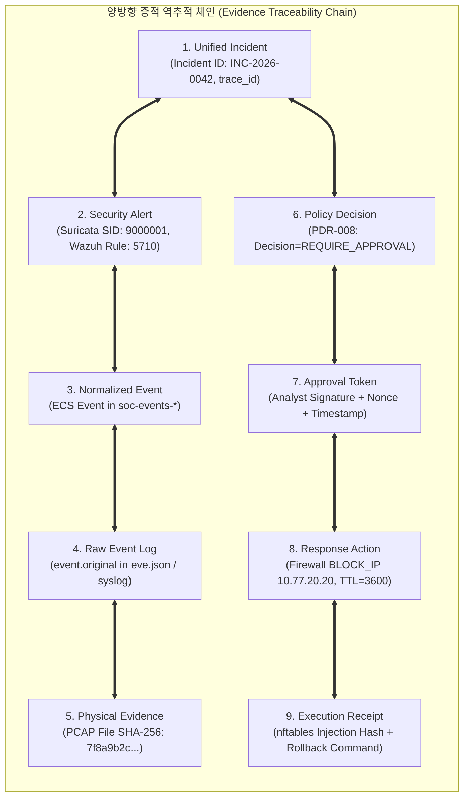

#### Diagram 11 Metadata Block
- **관련 Component**: `CMP-L1-001`, `CMP-L1-006`, `CMP-L4-002`, `CMP-L4-003`, `CMP-L4-004`
- **관련 Requirement**: `SR-EVI-001`, `SR-GOV-001`, `FR-AUDIT-001`
- **입력**: Raw Packets, EVE Alerts, Approval Signatures, Firewall Receipts
- **출력**: Chained Immutable Audit Records linked by common `trace_id`
- **Trust Boundary**: `TB-07` (Core SOC Data Boundary), `TB-09` (Audit Boundary)
- **Security Control**: Cryptographic Hash Chaining (SHA-256), WORM Read-Only Locking
- **Telemetry**: `audit.records_written_total`, `audit.hash_verification_failures`
- **Failure Behavior**: If audit write fails, block subsequent automated responses until resolved

---

# 44. Identity Architecture

AegisAI 플랫폼에서 활동하는 8대 주체(Actors):
1. **End User**: 게이트웨이를 통해 AI 서비스를 이용하는 내부 임직원 또는 외부 사용자.
2. **Tier 1 Analyst**: 대시보드 경보 모니터링 및 Level 1~3 초동 분석을 수행하는 1차 관제원.
3. **Tier 2 Senior Analyst**: 정밀 인시던트 분석, 1-Click 승인 서명, 오탐 튜닝을 수행하는 선임 관제원.
4. **SOC Lead / Manager**: 고위험 Level 4 Dual-Control 2차 승인 및 비상 대응을 총괄하는 관제 팀장.
5. **Security Administrator / CISO**: 전사 보안 정책 수립, GitOps 승인, 정적 룰셋 변경을 담당하는 최고 책임자.
6. **AI Agent**: 관제 보조 및 정보 수집을 수행하는 준자율 AI 컴포넌트 (`CMP-L3-002`).
7. **Service Account**: Filebeat, OPA, Celery 등 컴포넌트 간 통신에 사용되는 시스템 계정.
8. **Response Service**: 실제 방화벽 및 호스트로 격리 명령을 전송하는 액추에이터 실행 계정.

---

# 45. Authentication Architecture

- **사용자 인증**: 관제 대시보드 접속 시 역할 기반 세션 토큰 및 2단계 다중 인증(MFA) 적용.
- **서비스 간 인증**: 컴포넌트 간(API Gateway ➔ Policy Engine ➔ Elasticsearch) 상호 TLS (mTLS) 강제.
- **에이전트 인증**: Wazuh 에이전트는 사전 등록된 고유 암호화 대칭키(AES-256)를 통해 매니저와 인증.

---

# 46. Authorization Architecture

- **RBAC (역할 기반 접근 제어)**: 관제 화면 조회 권한, 승인 권한, 정책 변경 권한을 역할별로 엄격히 분리.
- **ABAC (속성 기반 접근 제어)**: RAG 문서 검색 시 사용자의 부서 코드, 취급 보안 등급, 문서 태그를 실시간 비교하여 인출 인가.

---

# 47. Zero Trust Architecture

1. **명시적 검증 (Explicit Verification)**: 내부 네트워크 및 AI 에이전트의 모든 요청도 절대 신뢰하지 않고 매 호출마다 mTLS 및 토큰 검증 수행.
2. **최소 권한 부여 (Least Privilege)**: AI 에이전트는 6대 읽기 전용 도구 외 일체의 시스템 접근 권한 박탈.
3. **침해 가정 (Assume Breach)**: AI 모델 탈옥이나 게이트웨이 우회가 발생하더라도 L1 Core SOC 및 방화벽 액추에이터에서 2차 저지선 유지.
4. **지속적 감사 (Continuous Audit)**: 모든 트랜잭션과 추론 내역을 누락 없이 감사 스트림에 기록.

---

# 48. Trust Boundary Architecture

`02_TO_BE_ARCHITECTURE` 및 `03_AI_THREAT_MODEL`에서 정의된 10대 신뢰 경계(Trust Boundaries):
- `TB-01`: External Client ➔ AI Security Gateway (공용망 경계)
- `TB-02`: Security Analyst ➔ SOC Workspace / HITL UI (관제사 접근 경계)
- `TB-03`: Control Plane ➔ Enforcement Actuator (통제 및 집행 경계)
- `TB-04`: Core SOC Data ➔ AI Inference Zone (데이터 주입 경계)
- `TB-05`: Document Source ➔ RAG Knowledge Store (지식 인제스천 경계)
- `TB-06`: AI Agent ➔ Tool Execution Gateway (에이전트 도구 경계)
- `TB-07`: Sensor / Agent ➔ SIEM Event Ingestion (원시 데이터 수집 경계)
- `TB-08`: Local SOC ➔ External AI Provider (클라우드 AI 경계)
- `TB-09`: SIEM ➔ WORM Immutable Audit Store (감사 보존 경계)
- `TB-10`: Network Zones (Attack / Victim / Mgmt L3 경계)

---

# 49. Network Zone Model

AegisAI의 4대 논리 네트워크 영역:
- **ZONE-MGMT (`10.77.10.0/24`)**: 관제 서버, Elasticsearch, AI Gateway, 센서 관리 인터페이스.
- **ZONE-ATTACK (`10.77.20.0/24`)**: 모의 침투 및 공격 시뮬레이션 호스트 (`soc-attacker`).
- **ZONE-VICTIM (`10.77.30.0/24`)**: 관제 대상 격리 타깃 호스트 (`soc-victim`).
- **AI Security Zone**: 로컬 LLM 런타임 및 벡터 임베딩 엔진이 격리 구동되는 내부 샌드박스.

---

# 50. VMware SOC Lab vs Real Infrastructure Separation

- **환경 A (VMware SOC Lab)**: 가상 스위치 포트 미러링 기반의 침해 시뮬레이션 및 IDS 검증 환경.
- **환경 B (Real Infrastructure)**: 물리 Cisco L3 스위치 SPAN 포트 및 안랩 TrusGuard 방화벽 연동 환경.
- **분리 원칙**: 두 환경의 IP 대역이나 라우팅 정책을 임의로 단일화하지 않으며, 각각의 독립적인 수집 인터페이스를 통해 SIEM으로 통합 집계한다.

---

# 51. Deployment Architecture

노드별 물리 및 논리 컴포넌트 배치 구조:
- **`soc-sensor` (Linux VM / Appliance)**: Suricata 8.0.6, Snort 3, AF_PACKET 캡처, Filebeat.
- **`soc-gateway` (Linux Gateway)**: nftables L3 라우팅, ipset 동적 차단 데몬.
- **`soc-siem` (Main Server / Workstation)**: Docker 기반 Wazuh, Elasticsearch 8.11, Kibana, AI Security Gateway, FastAPI 대시보드, OPA Policy Engine, Local LLM.

---

# 52. Sensor Architecture

`soc-sensor` 노드는 패킷 수집 및 실시간 시그니처 매칭에만 자원을 집중한다:
- 센서 모니터링 NIC(`nic-monitor`)에는 L3 IP 주소를 일체 할당하지 않음 (Promiscuous Mode).
- 고부하 AI 추론 모델이나 무거운 컨테이너는 센서 노드에 절대 배치하지 않음 (패킷 드롭 방지).

---

# 53. SIEM / Controller Architecture

단일 분석가 워크스테이션의 자원 제약(24~32 GB RAM)을 고려한 컨테이너 최적화:
- Elasticsearch 힙 메모리: 8 GB 고정.
- Wazuh Manager 힙 메모리: 2 GB 고정.
- Local LLM (Qwen2.5 7B Q4_K_M 양자화): VRAM/RAM 6 GB 할당.
- 잔여 메모리는 OS 및 버퍼 캐시로 유지하여 Out-of-Memory (OOM) 크래시를 방지.

---

# 54. AI Runtime Architecture

- **로컬 LLM 런타임**: Ollama 기반 로컬 컨테이너 구동 [`PROPOSED`].
- **모델 사양**: Qwen2.5-7B-Instruct (4-bit 양자화 모델).
- **격리 통제**: 외부 인터넷 통신이 전면 차단된 내부 브리지 네트워크에 배치.

---

# 55. External AI Boundary Architecture

클라우드 기반 상용 AI(OpenAI, Claude 등) 연동 시의 통제 아키텍처:
- 원시 보안 로그나 내부 IP 주소는 직접 전송될 수 없음.
- 반드시 `CMP-L2-003 AI DLP Engine`을 경유하여 6대 PII 및 20대 시크릿이 완전히 가명화된 후에만 전송 허용.
- CISO 승인 및 계약상 데이터 비학습(Zero Data Retention) 조건이 보장되어야 함.

---

# 56. Interface Architecture

AegisAI 주요 컴포넌트 간 12대 공식 인터페이스 레지스트리:

| Interface ID | 출발지 (Source) | 목적지 (Destination) | 용도 | 프로토콜 | 전송 데이터 | 인증 방식 | Trust Boundary |
|---|---|---|---|---|---|---|---|
| `INF-001` | Ingress Client | AI Gateway | 프롬프트 인입 | HTTPS (443) | Prompt JSON | Bearer Token | `TB-01` |
| `INF-002` | AI Gateway | Prompt Engine | 주입 검사 | HTTP / UDS | Normalized Text | mTLS | Internal L2 |
| `INF-003` | AI Gateway | AI DLP Engine | PII/Secret 검사 | HTTP / UDS | Prompt Payload | mTLS | Internal L2 |
| `INF-004` | AI Gateway | Policy Engine | 정책 판정 요청 | HTTP (8181) | OPA Query JSON | mTLS | `TB-03` |
| `INF-005` | Sensor (Suricata)| Filebeat | EVE 스트림 수집 | File / Pipe | EVE JSON Lines | OS File Perm | `TB-07` |
| `INF-006` | Filebeat | Elasticsearch | 정규화 이벤트 적재 | HTTPS (9200) | ECS JSON Doc | Basic / API Key| `TB-07` |
| `INF-007` | Correlation | Context Builder | 복합 인시던트 전달 | Internal Queue | Incident Object | Local Process | Internal L3 |
| `INF-008` | Context Builder | Security RAG | 플레이북 검색 | REST / gRPC | Query Vector | API Token | `TB-05` |
| `INF-009` | AI SOC Analyst | Workspace (UI) | 요약 보고서 표출 | WebSocket/REST | AI Analysis Doc | Session Cookie | `TB-02` |
| `INF-010` | Workspace (UI) | HITL Service | 1-Click 승인 서명 | HTTPS (8443) | Signed Nonce | HMAC-SHA256 | `TB-02` |
| `INF-011` | HITL Service | Orchestrator | 승인 명령 이관 | gRPC (50051) | Execution Task | mTLS | `TB-03` |
| `INF-012` | Orchestrator | L3 Gateway | nftables 룰 주입 | SSH (22) | nft Commands | SSH Key Pair | `TB-10` |

---

# 57. API Boundary

HLD 수준에서 정의된 핵심 서비스별 API 역할 경계:
- **Incident API**: 복합 인시던트 조회, 상태 변경, 연관 텔레메트리 열람.
- **Policy API**: OPA 기반 정책 판정 쿼리 및 정책 룰셋 버전 조회.
- **Approval API**: 승인 대기 티켓 목록, 1-Click 서명 제출, Dual-Control 상태 조회.
- **Response API**: 액추에이터 실행 상태, 롤백 요청, TTL 잔여시간 조회.
- **RAG API**: 지식 문서 등록, 의미론적 인출 쿼리, 인제스천 서명 검증.
- **AI Analysis API**: 인시던트 컨텍스트 주입 및 AI 요약 보고서 비동기 생성.

---

# 58. Port / Protocol Boundary

플랫폼 전반에서 공식적으로 승인된 포트 및 프로토콜 경계:
- `TCP 443`: AI Security Gateway 및 Kibana 웹 콘솔 (HTTPS, TLS 1.3).
- `TCP 9200`: Elasticsearch REST API (HTTPS, TLS 1.3).
- `TCP 5601`: Kibana 관리 콘솔 포트.
- `TCP 8181`: Open Policy Agent (OPA) REST API.
- `TCP 11434`: Ollama Local LLM 서비스 포트 (내부 Localhost 바인딩 전용).
- `TCP 8501 / 8080`: FastAPI AI SOC 관제 대시보드 포트.
- `TCP 1514 / 1515`: Wazuh 에이전트 통신 및 등록 포트.
- `TCP 22`: L3 Gateway 관리 SSH 포트 (ZONE-MGMT에서만 접근 허용).


---

# 59. Availability Architecture

AegisAI는 **계층별 독립성(Layer Decoupling)** 원칙을 적용하여 상위 AI 레이어의 어떤 장애도 하위 Core SOC 레이어로 전파되지 않도록 설계된다.

```text
[L2~L4 AI Services DOWN (OOM / Crash / Timeout)]
      │
      └──► [L1 Core SOC CONTINUES 100% UNINTERRUPTED]
           ├── Suricata 패킷 수집 및 EVE 로깅 유지
           ├── Wazuh 호스트 감시 유지
           ├── L3 Gateway nftables 라우팅 유지
           └── Elasticsearch 이벤트 색인 유지
```

Core SOC는 AI 없이도 전통적인 SIEM 환경으로서 완전히 자율 가동된다.

---

# 60. Fail-safe Architecture

컴포넌트 장애 시 사전 정의된 안전 상태(Default Secure State)로의 전환 기준:
- **인라인 인바운드/아웃바운드 검사 (`PEP-GW-IN`, `PEP-DLP-OUT`)**: **Fail-closed** (장애 시 트래픽을 차단하여 정보 유출 및 공격 침투 원천 차단).
- **네트워크 모니터링 센서 (`PEP-NET-01`)**: **Fail-open** (센서 프로세스 크래시 시에도 물리/가상 네트워크 패킷 흐름은 정상 유지).
- **방화벽 액추에이터 (`PEP-SOAR-01`)**: **Fail-closed** (명령 실패 시 기존 안전 상태 룰셋 유지, 임의의 오픈 정책 금지).

---

# 61. AI Failure Behavior

| 실패 유형 | 증상 및 감지 방식 | 시스템 영향 | 자동 복구 및 대체 메커니즘 |
|---|---|---|---|
| **LLM Inference Timeout** | 추론 지연시간 > 30초 초과 | AI 요약 보고서 생성 중단 | 1차 룰 기반 인시던트 데이터만 대시보드에 즉각 표출 (Fallback) |
| **RAG Service Down** | 벡터 검색 연결 실패 (500) | 추천 플레이북 제공 불가 | 시스템 정적 플레이북(Local Markdown)으로 인출 전환 |
| **AI Gateway Crash** | 헬스체크 프로브 3회 실패 | 외부 AI 서비스 접근 불가 | 인바운드 요청에 HTTP 503 반환 및 시스템 재기동 |
| **Policy Engine (OPA) Failure**| OPA 통신 타임아웃 | 정책 판정 불가 | **Fail-closed**: 모든 신규 Level 3~4 액션 집행 차단 |
| **HITL Service Hang** | 승인 토큰 발급 지연 | 대응 명령 승인 불가 | 티켓 상태 `SUSPENDED` 전환 및 관제사 OOB 수동 조치 |

---

# 62. Graceful Degradation Architecture

AI 분석가(`CMP-L3-002`) 장애 시 시스템 성능 저하를 방어하고 연속성을 보장하는 3단계 점진적 성능 저하(Graceful Degradation) 메커니즘:
```text
[정상 모드]
AI 요약 + RAG 플레이북 + 자동 신뢰도 채점 + ATT&CK 매핑 + 1-Click 승인

[Degraded 모드 1 (LLM 지연/다운)]
결정론적 상관분석 인시던트 + 정적 룰셋 기반 대응 권고 + 1-Click 승인 유지

[Degraded 모드 2 (전체 AI 스택 다운)]
Suricata 원시 경보 + Wazuh 로컬 액티브 리스폰스 + Kibana 수동 분석
```

---

# 63. Observability Architecture

AegisAI 플랫폼의 건전성을 보장하기 위한 6대 관측 영역:
1. **Infrastructure**: CPU, RAM, Disk I/O, VRAM 사용률, 네트워크 드롭율.
2. **Security**: 차단된 패킷 수, 매칭된 IDS 시그니처, 활성 인시던트 수.
3. **AI Layer**: 프롬프트 토큰 수, 인퍼런스 지연시간, PII/Secret 탐지 건수.
4. **Policy Engine**: Rego 룰 평가 횟수, 결정 지연시간, BLOCK 비율.
5. **HITL Pipeline**: 대기 중인 티켓 수, 승인/반려 비율, 승인 소요 시간.
6. **Response Actuator**: 방화벽 룰 주입 성공률, TTL 만료 자동 롤백 건수.

---

# 64. Observability Signals

플랫폼 전반에서 수집되는 핵심 관측 신호:
- **Logs**: JSON 포맷 구조화 로그, WORM 불변 감사 로그, Netfilter 커널 로그.
- **Metrics**: Prometheus 포맷 메트릭 (`/metrics` 엔드포인트).
- **Health**: `/healthz` 라이브니스 및 레디니스 프로브.
- **Trace**: 모든 트랜잭션에 주입되는 W3C 호환 `trace_id` 분산 추적.

---

# 65. Performance Architecture

상위 요구사항(`04`) 및 보안정책(`06`)에서 확정된 성능 기준치 준수 설계:
- **AI Gateway 검사 지연시간**: P95 기준 `< 50ms`.
- **DLP 토큰화 처리 지연시간**: P95 기준 `< 40ms`.
- **에이전트 도구 검증 지연시간**: `< 10ms`.
- **이벤트 정규화 및 색인 처리량**: 초당 1,000 EPS 이상 무손실 처리.
- **상관분석 인시던트 집계 지연시간**: 윈도우 마감 후 `< 5초`.
- **1-Click 승인 후 방화벽 주입 지연시간**: `< 200ms`.

---

# 66. Capacity Architecture

단일 분석가 워크스테이션(24~32 GB RAM) 환경을 위한 자원 용량 분배:
- **Core SOC Stack (ELK + Wazuh)**: 12 GB RAM (Elasticsearch 8 GB, Wazuh 2 GB, Logstash/Kibana 2 GB).
- **AI Security Stack (Gateway + OPA + FastAPI)**: 4 GB RAM.
- **AI Runtime (Local LLM Qwen2.5 7B Q4)**: 6 GB RAM / VRAM.
- **Host OS & Buffer Cache**: 6~10 GB 여유 공간 유지.

---

# 67. Security Architecture Controls

15대 보안 통제 패밀리(Security Control Families)의 아키텍처 매핑:
1. `Authentication`: mTLS, JWT, MFA (`CMP-L2-001`, `CMP-L4-001`).
2. `Authorization`: OPA Rego, RBAC, ABAC (`CMP-L2-006`).
3. `Network Segmentation`: Hyper-V 3망 분리, L3 방화벽 격리 (`CMP-L1-004`).
4. `Encryption`: TLS 1.3, AES-256 저장 암호화.
5. `DLP`: Presidio, 6대 PII / 20대 Secret 토큰화 (`CMP-L2-003`).
6. `Input Validation`: Canonicalization, Pydantic Schema (`CMP-L2-002`, `CMP-L2-005`).
7. `Output Validation`: Schema Compliance, Hallucination Scorer (`CMP-L3-002`).
8. `Prompt Defense`: Anti-injection Regex, Vector Similarity Classifier (`CMP-L2-002`).
9. `RAG Security`: Document Signature Check, Pre-retrieval ACL (`CMP-L2-004`).
10. `Agent Control`: 6대 도구 화이트리스트, 권한 격리 (`CMP-L2-005`).
11. `HITL`: 1-Click 암호 서명, Dual-Control Workflow (`CMP-L4-002`).
12. `Audit`: WORM Log, SHA-256 Chaining (`CMP-L4-004`).
13. `Evidence Integrity`: PCAP SHA-256, `event.original` 불변 보존.
14. `Rate Limiting`: IP/Token 기반 분당 요청 제한 (`CMP-L2-001`).
15. `Fail-safe`: Fail-closed Ingress / Fail-open Passive Mirroring.

---

# 68. Threat → Component Mapping

`03_AI_THREAT_MODEL`의 14대 핵심 위협과 대응 컴포넌트 매핑:

| Threat ID | 위협 명칭 | 대응 컴포넌트 | 신뢰 경계 | 핵심 통제 메커니즘 |
|---|---|---|---|---|
| `THR-AIGW-001` | 프롬프트 인젝션 및 탈옥 | `CMP-L2-002` | `TB-01` | 인라인 정규화 및 주입 탐지기 (`PEP-GW-IN`) |
| `THR-AIGW-002` | 민감 데이터 및 자격증명 유출 | `CMP-L2-003` | `TB-01` | 6대 PII 및 20대 Secret 토큰화 (`PEP-DLP-OUT`) |
| `THR-AIGW-003` | 게이트웨이 서비스 거부 (DoS) | `CMP-L2-001` | `TB-01` | IP/토큰 기반 분당 Rate Limiting |
| `THR-AIGW-004` | 게이트웨이 인증 및 키 탈취 | `CMP-L2-001` | `TB-01` | mTLS 강제 및 상호 인증 |
| `THR-LLM-001` | 백엔드 모델 환각 및 악의적 출력 | `CMP-L3-002` | `TB-04` | 팩트/가설 분리 및 신뢰도 점수 산출 |
| `THR-RAG-001` | RAG 지식베이스 오염 | `CMP-L2-004` | `TB-05` | 인제스천 관리자 서명 검증 및 주입 스캔 |
| `THR-RAG-002` | RAG 비인가 검색 및 권한 상승 | `CMP-L2-004` | `TB-05` | 사전 메타데이터 ACL 필터링 |
| `THR-RAG-003` | RAG 인출 유사도 조작 | `CMP-L3-003` | `TB-05` | 코사인 유사도 0.65 임계치 강제 |
| `THR-AGENT-001`| 비인가 도구 호출 및 권한 남용 | `CMP-L2-005` | `TB-06` | 엄격한 6대 도구 화이트리스트 |
| `THR-AGENT-002`| 도구 인자 조작 (Path Traversal 등)| `CMP-L2-005` | `TB-06` | Pydantic 기반 정밀 파라미터 유효성 검증 |
| `THR-ANL-001`  | AI 분석가 허위 침해 판정 (오탐) | `CMP-L3-002` | `TB-04` | 분석가 교차 검증 및 신뢰도 80점 미만 에스컬레이션 |
| `THR-SIEM-001` | SIEM 텔레메트리 변조 및 은닉 | `CMP-L1-006` | `TB-07` | WORM 스토리지 및 감사 해시 체이닝 |
| `THR-SOAR-001` | 고위험 자동 차단 오작동 및 장애 | `CMP-L4-003` | `TB-03` | Level 4 Dual-Control 및 자동 롤백 TTL |
| `THR-SOAR-002` | 방화벽 액추에이터 탈취 및 조작 | `CMP-L1-004` | `TB-03` | 일회용 암호 Nonce 및 HMAC 전자서명 검증 |

---

# 69. Requirement → Component Mapping

`04_REQUIREMENTS_SPECIFICATION_V2` 요구사항 매핑:

| Requirement ID | 요구사항 명칭 | 주관 컴포넌트 | 연동 인터페이스 | 검증 방식 |
|---|---|---|---|---|
| `SR-AIGW-001` | 프롬프트 인라인 인젝션 방어 | `CMP-L2-002` | `INF-002` | `T-SEC-01`, `T-SEC-02` 주입 시험 |
| `SR-DLP-001`  | 6대 PII 및 20대 Secret 유출 방지 | `CMP-L2-003` | `INF-003` | `T-SEC-03`, `T-SEC-04` 유출 시험 |
| `SR-RAG-001`  | RAG 지식 무결성 및 인출 인가 | `CMP-L2-004` | `INF-008` | `T-SEC-05`, `T-SEC-06` 권한 시험 |
| `SR-AGENT-001`| AI 에이전트 도구 화이트리스트 | `CMP-L2-005` | `TB-06` | `T-SEC-07`, `T-SEC-08` 쉘 거부 시험 |
| `SR-HITL-001` | Level 4 고영향 조치 HITL 강제 | `CMP-L4-002` | `INF-010` | `T-SEC-09` 자동 차단 거부 시험 |
| `SR-RESP-001` | 방화벽 동적 차단 및 TTL 관리 | `CMP-L4-003` | `INF-012` | `T-SEC-10` 만료 자동 롤백 시험 |
| `SR-DATA-001` | 단일 보안 이벤트 스키마 정규화 | `CMP-L1-006` | `INF-006` | Schema Validation Unit Test |

---

# 70. Schema → Component Mapping

`05_SECURITY_EVENT_SCHEMA` 9대 도메인 생산자/소비자 매핑:

| 도메인 | 이벤트 유형 (`event.action`) | 생산자 (Producer) | 소비자 (Consumer) | 저장소 (Storage) | 상관분석 활용 |
|---|---|---|---|---|:---:|
| `network` | `traffic_analyzed` | `CMP-L1-001` | `CMP-L1-007` | `soc-events-*` | O |
| `threat` | `signature_matched` | `CMP-L1-001` | `CMP-L1-007` | `soc-alerts-*` | O (핵심) |
| `ai_gateway`| `injection_blocked` | `CMP-L2-001` | `CMP-L1-007` | `soc-alerts-*` | O |
| `ai_dlp` | `pii_detected` | `CMP-L2-003` | `CMP-L1-007` | `soc-events-*` | O |
| `rag` | `retrieval_authorized` | `CMP-L2-004` | `CMP-L3-002` | `soc-events-*` | X |
| `agent` | `tool_invoked` | `CMP-L2-005` | `CMP-L4-004` | `soc-events-*` | X |
| `hitl` | `approval_granted` | `CMP-L4-002` | `CMP-L4-003` | `soc-audit-*` | X |
| `response` | `firewall_blocked` | `CMP-L4-003` | `CMP-L4-004` | `soc-audit-*` | X |
| `audit` | `policy_updated` | `CMP-L2-006` | `CMP-L4-004` | `soc-audit-*` | X |

---

# 71. Policy → Component Mapping

`06_AI_SECURITY_POLICY` 정책의 집행 컴포넌트 매핑:

| Policy ID | 정책 내용 | 결정점 (PDP) | 집행점 (PEP) | 입력 이벤트 | 최종 판정 액션 | 감사 기록 |
|---|---|---|---|---|---|:---:|
| `PDR-001` | 5대 판정 모델 강제 | `CMP-L2-006` | 전체 PEP | Request Event | ALLOW / BLOCK 등 | `soc-audit-*` |
| `PDR-003` | 인라인 프롬프트 주입 차단 | `CMP-L2-006` | `PEP-GW-IN` | `prompt_inspected` | BLOCK (403) | `soc-alerts-*` |
| `PDR-004` | 2단계 DLP 및 가명화 | `CMP-L2-006` | `PEP-DLP-OUT` | `pii_detected` | MASK (`[PII_RRN_1]`)| `soc-events-*` |
| `PDR-007` | 에이전트 6대 도구 제한 | `CMP-L2-006` | `PEP-AGENT-01` | `tool_invoked` | BLOCK (미승인 도구) | `soc-audit-*` |
| `PDR-008` | Level 4 대응 HITL 강제 | `CMP-L2-006` | `PEP-SOAR-01` | Action Proposal | REQUIRE_APPROVAL | `soc-audit-*` |
| `PDR-009` | 방화벽 동적 차단 TTL | `CMP-L2-006` | `PEP-SOAR-01` | Approved Ticket | EXECUTE + TTL(3600s)| `soc-audit-*` |

---

# 72. Component Dependency Matrix

| 컴포넌트 | 직접 의존 대상 | 장애 시 영향도 | 대체 및 폴백 경로 | 단일장애점 (SPOF) 여부 |
|---|---|---|---|:---:|
| `CMP-L1-001` Suricata | 모니터링 NIC | NIDS 탐지 중단 | 호스트 Wazuh 감시로 보완 | 아니오 (미러링 독립) |
| `CMP-L1-004` Firewall | Linux Kernel nftables | 네트워크 통신 불능 | 기존 정적 룰셋 유지 | 예 (L3 코어) |
| `CMP-L1-006` Elastic | 디스크 스토리지 | 전체 검색/색인 지연 | Filebeat 디스크 버퍼링 | 예 (중앙 저장소) |
| `CMP-L2-001` AI Gateway | OPA Policy Engine | AI 서비스 이용 불가 | Fallback 503 거부 | 아니오 (Core 무관) |
| `CMP-L3-002` AI Analyst| Ollama Local LLM | AI 요약 보고서 미생성| 1차 룰 기반 대시보드 표출 | 아니오 (수동 관제) |
| `CMP-L4-003` SOAR | SSH / Wazuh API | 자동 차단 집행 불가 | 관제사 OOB 콘솔 수동 입력 | 아니오 (수동 조치) |

---

# 73. Interface Matrix

전체 22개 컴포넌트 간 물리/논리 인터페이스 통합 요약:
```text
[External Users] ==(INF-001: HTTPS 443)==> [AI Security Gateway CMP-L2-001]
  ├── (INF-002: UDS) ===> [Prompt Security Engine CMP-L2-002]
  ├── (INF-003: UDS) ===> [AI DLP Engine CMP-L2-003]
  └── (INF-004: HTTP 8181) => [Policy Engine OPA CMP-L2-006]

[Sensor Traffic] ==(AF_PACKET)==> [Suricata CMP-L1-001]
  └── (INF-005: File) ==> [Filebeat CMP-L1-005] ==(INF-006: HTTPS 9200)==> [Elasticsearch CMP-L1-006]

[Elasticsearch] ==(Query)==> [Correlation Engine CMP-L1-007]
  └── (INF-007: Celery) ==> [Context Builder CMP-L3-001]
        ├── (INF-008: REST) ==> [Security RAG CMP-L3-003]
        └── (Inference) ===> [AI SOC Analyst CMP-L3-002]
              └── (INF-009: WS) ==> [Unified Workspace CMP-L4-001]
                    └── (INF-010: HTTPS) => [HITL Service CMP-L4-002]
                          └── (INF-011: gRPC) => [Response Orchestrator CMP-L4-003]
                                └── (INF-012: SSH 22) => [L3 Gateway Firewall CMP-L1-004]
```

---

# 74. Trust Boundary Matrix

| 경계 ID | 출발 영역 (Source) | 목적 영역 (Dest) | 전달 데이터 | 보안 통제 | 실패 위험 |
|---|---|---|---|---|---|
| `TB-01` | External Ingress | AI Gateway | 원시 프롬프트, API 키 | TLS 1.3, Rate Limit | 서비스 거부 (DoS) |
| `TB-02` | Analyst Console | HITL / UI | 승인 서명, 조회 요청 | MFA, HMAC Nonce | 비인가 승인 |
| `TB-03` | Control Plane | Actuator | 차단/격리 명령 | mTLS, 전자서명 검증 | 임의 방화벽 룰 주입 |
| `TB-04` | Core SOC Data | AI Inference Zone | 인시던트 컨텍스트 | 입력 정제, XML 태깅 | 간접 프롬프트 주입 |
| `TB-05` | Document Source | RAG Store | 플레이북 파일 | 관리자 디지털 서명 | 지식베이스 오염 |
| `TB-06` | AI Agent | Tool Gateway | 도구 호출 JSON | 6대 도구 화이트리스트 | 원격 쉘 실행 |
| `TB-07` | Sensor / Agent | Elasticsearch | 보안 로그, 패킷 요약 | Filebeat SSL, 파서 검증 | 로그 위변조 |
| `TB-08` | Local SOC | External Cloud AI | 마스킹된 프롬프트 | AI DLP 전수 가명화 | 기밀 데이터 유출 |
| `TB-09` | Elasticsearch | WORM Audit Store | 감사 이벤트 | SHA-256 체이닝, Read-only| 감사 기록 조작 |
| `TB-10` | ZONE-ATTACK | ZONE-VICTIM | 공격 네트워크 패킷 | L3 Firewall Default Deny | 무차별 횡적이동 |

---

# 75. Data Flow Matrix

| 데이터 유형 | 최초 생산자 | 정규화/검증기 | 최종 저장소 | 보존 주기 | 주요 활용 목적 |
|---|---|---|---|---|---|
| **Raw Event** | Suricata / Wazuh | Logstash Parser | `soc-events-*` | 90일 | 원본 포렌식 증적 (`event.original`) |
| **Alert** | NIDS / HIDS Rules | Schema Validator | `soc-alerts-*` | 180일 | 단일 시그니처 경보 표출 |
| **Incident** | Correlation Engine | Context Builder | `soc-incidents-*`| 1년 | 다단계 공격 추적 및 티켓팅 |
| **Prompt** | Client / Analyst | AI Gateway / DLP | `soc-events-*` (마스킹) | 90일 | 인바운드 공격 분석 및 거버넌스 |
| **RAG Doc** | Security Admin | Signature Verifier | Vector Store | 영구 (개정 시) | 보안 대응 지식 인출 |
| **AI Analysis** | AI SOC Analyst | Output Validator | `soc-incidents-*`| 1년 | 분석가 의사결정 지원 요약 |
| **Policy Dec** | Policy Engine (OPA)| OPA Logger | `soc-audit-*` | 3년 | 통제 적합성 및 차단 이력 추적 |
| **Approval** | HITL Service | Nonce Validator | `soc-audit-*` | 3년 | 부인 방지 및 1-Click 승인 증적 |
| **Response** | Orchestrator | Receipt Generator | `soc-audit-*` | 3년 | 방화벽 차단 이력 및 롤백 영수증 |
| **Audit Evid** | System Pipeline | Hash Chainer | `soc-audit-*` | 3년 | 전 주기 감사 및 컴플라이언스 |

---

# 76. End-to-End Security Scenario

AegisAI 플랫폼 전반을 관통하는 실전 공격 시나리오 종합 흐름:
```text
[09:30] 공격자 10.77.20.20의 포트 스캔 (TCP SYN Stealth Scan)
 └─► Suricata 탐지 (SID: 9000001) ➔ eve.json ➔ Filebeat ➔ soc-alerts-* 적재

[09:32] 웹 취약점 열거 공격 (Nikto / SQLi 스캐닝)
 └─► Suricata HTTP 탐지 (SID: 9010002) ➔ soc-alerts-* 적재

[09:34] 관리자 웹 콘솔 무차별 대입 공격 (Brute Force)
 └─► Wazuh HIDS 탐지 (Rule: 5710, 8회 연속 로그인 실패) ➔ soc-alerts-* 적재

[09:37] 고객센터 챗봇을 통한 간접 프롬프트 인젝션 시도
 └─► AI Security Gateway (PEP-GW-IN) 즉각 차단 (HTTP 403, SID: 9030001) ➔ soc-alerts-* 적재

[09:38] RAG 지식베이스 내 비인가 시크릿 플레이북 검색 시도
 └─► RAG Security Gateway (PEP-RAG-01) 권한 미흡 차단 (HTTP 403) ➔ soc-alerts-* 적재

=========================== [상관분석 및 AI 인텔리전스 가동] ===========================
[09:39] CMP-L1-007 Correlation Engine: 15분 윈도우 내 동일 소스 IP(10.77.20.20) 경보 5건 결합
 └─► 단일 복합 인시던트 발행: INC-2026-0042 (위험도: CRITICAL, trace_id: tr-8f92a1)

[09:40] CMP-L3-001 Context Builder ➔ CMP-L3-002 AI SOC Analyst:
 └─► MITRE ATT&CK 매핑: T1046(스캔) ➔ T1190(익스플로잇) ➔ T1110(자격증명) ➔ AML.T0051(인젝션)
 └─► Security RAG: 플레이북 PB-RAG-004 (다단계 외부 침입 긴급 차단 절차) 자동 인출
 └─► AI 요약: "공격자 10.77.20.20이 인프라 스캔 후 AI 게이트웨이 침투 시도 실패. 
              지속 공격 차단을 위해 L3 방화벽 격리 및 API 토큰 무효화 권고 (신뢰도: 94/100)"

=========================== [정책 평가 및 인간 승인 (HITL)] ===========================
[09:41] CMP-L2-006 Policy Engine (OPA):
 └─► Level 4 방화벽 차단 명령에 대해 `REQUIRE_APPROVAL` 판정 도출

[09:42] CMP-L4-001 Workspace ➔ CMP-L4-002 HITL Service:
 └─► 관제 화면에 팝업 표출: [긴급 IP 차단 권고: 10.77.20.20, 기본 TTL: 3,600s]
 └─► 분석가 원본 PCAP 및 EVE 패킷 확인 후 1-Click [승인 서명] 클릭
 └─► 일회용 Nonce 기반 HMAC-SHA256 전자서명 토큰 생성 완료

=========================== [대응 오케스트레이션 및 증적 보존] ===========================
[09:43] CMP-L4-003 Response Orchestrator ➔ CMP-L1-004 L3 Gateway:
 └─► SSH 실행: nft add element inet filter block_v4 { 10.77.20.20 }
 └─► 검증: 차단 확인 및 실행 영수증(Execution Receipt) 발행, TTL Janitor 타이머 기동

[09:44] CMP-L4-004 Audit Engine:
 └─► PCAP 해시 + 원시 EVE + AI 추론 + 분석가 서명 + 방화벽 영수증을 단일 trace_id로 체이닝
 └─► WORM 저장소(soc-audit-*)에 영구 보존 완료. 인시던트 CLOSED 전환.
```


---

# 77. Architecture Decision Records (ADR)

AegisAI 플랫폼의 상위 아키텍처 결정을 공식 기록한 12대 ADR 레코드:

| ADR ID | 결정 주제 | 검토 대안 | 채택 결정 | 채택 근거 | 절충점 (Trade-off) |
|---|---|---|---|---|---|
| `ADR-001` | Core SOC 보존 | 전면 AI 대체 vs 기존 SOC 보존 | 기존 SOC 유지 | 가용성 및 룰 기반 결정론적 탐지 연속성 보장 | 레거시 에이전트 리소스 유지 필요 |
| `ADR-002` | 단일 이벤트 스키마 | 개별 SIEM 분리 vs 단일 ECS 통합 | 단일 ECS 통합 | 도메인 간 교차 상관분석 및 일관된 감사 체계 | 초기 정규화 파서 개발 비용 증가 |
| `ADR-003` | AI 런타임 분리 | 클라우드 API vs 로컬 LLM | 로컬 LLM 우선 | 민감 보안 로그의 외부 유출 방지 및 오프라인 관제 | 단일 워크스테이션 RAM/VRAM 점유 |
| `ADR-004` | 상관분석 선행 | AI 선행 분석 vs 결정론적 상관분석 선행 | 결정론적 룰 선행 | 1차 필터링을 통해 AI 입력 노이즈 및 토큰 비용 절감 | 복합 룰셋 작성 및 관리 공수 발생 |
| `ADR-005` | AI 게이트웨이 인라인 배치 | 비동기 로그 감시 vs 인라인 리버스 프록시 | 인라인 프록시 | 프롬프트 주입 및 유출의 실시간 사전 차단 | 게이트웨이 지연시간(<50ms) 관리 필요 |
| `ADR-006` | 보안 RAG 인프라 | 외부 SaaS vs 내부 Elasticsearch kNN | 내부 ES kNN | 데이터 주권 확보 및 추가 벡터 DB 인프라 비용 절감 | 대규모 임베딩 시 ES 메모리 튜닝 필요 |
| `ADR-007` | 정책 엔진 분리 | 하드코딩 if문 vs OPA Rego 분리 | OPA Rego 채택 | Policy-as-Code 기반 GitOps 이력 관리 및 테스트 가능성 | OPA 서비스 간 네트워크 홉 추가 |
| `ADR-008` | 인간 승인 (HITL) 강제 | 100% 자율 대응 vs HITL 승인 강제 | HITL 강제 | 오탐으로 인한 서비스 장애 및 네트워크 단절 원천 방지 | 대응 조치 완료까지 수 초의 승인 대기 발생 |
| `ADR-009` | 에이전트 도구 제한 | 무제한 OS 쉘 vs 6대 읽기 도구 제한 | 6대 도구 제한 | 에이전트 탈취 시 발생할 파괴적 행위 원천 차단 | 복잡한 관리 작업의 자동화 범위 축소 |
| `ADR-010` | 응답 추상화 레이어 | 개별 스크립트 vs 중앙 오케스트레이터 | Orchestrator 통합| 이기종 방화벽/호스트에 대한 단일 API 추상화 및 롤백 | 중앙 오케스트레이터 가용성 관리 필요 |
| `ADR-011` | 불변 감사 체인 | 일반 파일 로그 vs WORM SHA-256 체이닝 | WORM 체이닝 | 침해사고 조사 및 법적 증적 부인 방지 보장 | 로그 저장소 용량 증가 및 해시 연산 부하 |
| `ADR-012` | 장애 격리 설계 | 상호 의존 vs 완전 비동기 독립 가동 | 비동기 독립 가동 | AI 스택 전체 크래시 시에도 관제망 100% 정상 작동 | 동기식 즉시 피드백 대신 큐 지연 수반 |

---

# 78. HLD Baseline Status

모든 주요 컴포넌트, 수치, 아키텍처 결정의 상태 거버넌스 분류:

| 항목 | 아키텍처 기준선 | 거버넌스 상태 | 비고 |
|---|---|:---:|---|
| **L1 Core SOC 보존** | Suricata, Snort, Wazuh, ELK 4계층 유지 | `[FROZEN]` | 타협 불가의 최상위 원칙 |
| **단일 이벤트 스키마** | ECS v8.11 + aegis.* 9대 도메인 17대 이벤트 | `[FROZEN]` | `05` 스키마 계약 동결 |
| **15분 상관분석 윈도우** | 900초 슬라이딩 윈도우 | `[APPROVED / VALIDATED]` | 단위 테스트 100% 통과 |
| **AI 게이트웨이 인라인 방어** | 인바운드 403 차단, 아웃바운드 토큰화 | `[IMPLEMENTED]` | FastAPI 프로토타입 검증 완료 |
| **RAG 코사인 유사도** | 임계치 0.65 이상 인출 | `[EXPERIMENTAL / PROPOSED]` | 벤치마크 테스트 후 고정 예정 |
| **방화벽 차단 TTL** | 기본 3,600초 (1시간) | `[PROPOSED DEFAULT]` | 게이트웨이 액추에이터 실측 예정 |
| **Level 4 Dual-Control** | 핵심 인프라 2인 상호 서명 | `[PROPOSED]` | MVP 1-Click 서명(`[IMPLEMENTED]`) 운영 중 |
| **에이전트 6대 도구 제한** | 읽기/조회 전용 도구 화이트리스트 | `[FROZEN]` | 보안 원칙 동결 |
| **로컬 LLM 런타임** | Qwen2.5-7B-Instruct / Ollama | `[PROPOSED]` | 자원 벤치마크 진행 중 |

---

# 79. Architecture Open Issues

향후 `08_LOW_LEVEL_DESIGN` 및 배포 단계에서 검증·해결해야 할 오픈 이슈 목록:
- `ARCH-OPEN-001`: 실제 물리 Cisco L3 스위치 SPAN 포트 트래픽 수집 정밀 검증.
- `ARCH-OPEN-002`: 안랩 TrusGuard 방화벽 Syslog 파서 및 CEF 포맷 정규화 매핑 완료.
- `ARCH-OPEN-003`: 단일 워크스테이션(24~32GB) 환경에서의 LLM 추론 시 ES 색인 지연시간(EPS 영향도) 실측.
- `ARCH-OPEN-004`: Level 4 Dual-Control UI 워크플로우의 대시보드 컴포넌트 통합.
- `ARCH-OPEN-005`: RAG 하이브리드 검색 시 BM25와 Dense kNN의 최적 가중치(Alpha) 보정.
- `ARCH-OPEN-006`: Suricata 커스텀 SID(9000000~9099999) 레지스트리 자동 배포 파이프라인 수립.
- `ARCH-OPEN-007`: nftables ipset 동적 원소 수명 만료 감시 데몬의 리소스 최적화.
- `ARCH-OPEN-008`: Presidio 한국어 PII 정밀도 향상을 위한 커스텀 NER 모델 파인튜닝.

---

# 80. HLD와 LLD의 경계

| 구분 | HLD (상위설계서, 본 문서의 범위) | LLD (상세설계서, 08 문서의 범위) |
|---|---|---|
| **컴포넌트** | 컴포넌트 목록, 역할, 책임 경계 (DO / DO NOT) | 세부 클래스 다이어그램, 패키지 구조, 내부 함수 시그니처 |
| **인터페이스** | 상위 통신 프로토콜, 출발지/목적지, 인증 원칙 | 세부 REST URL 엔드포인트, JSON 요청/응답 스키마, 파라미터 타입 |
| **데이터** | 데이터 스트림 명칭, 논리 파이프라인 단계, 보존 주기 | Elasticsearch 인덱스 매핑 정의, 필드 데이터타입, 샤드/레플리카 설정 |
| **보안 정책** | 정책 판정 모델, PDP/PEP 위치, 5대 결정 규칙 | OPA Rego 상세 코드, 정규식 패턴 문자열, Presidio 인식기 설정 |
| **대응 조치** | 7대 대응 추상화 모델, HITL 승인 원칙, TTL 라이프사이클 | 구체적인 Shell 스크립트, nftables 커맨드라인 문법, SSH 연동 라이브러리 |
| **인프라** | 논리 노드 배치, 네트워크 존 분리, 메모리 할당 가이드 | Docker Compose YAML 파일, systemd 서비스 유닛, 상세 포트 매핑 |

---

# 81. 12대 필수 다이어그램 색인

| 번호 | 다이어그램 명칭 | 위치 | 주요 아키텍처 표현 내용 |
|:---:|---|:---:|---|
| **1** | AegisAI Overall High-Level Architecture | Ch 1 | 4개 계층 22개 컴포넌트의 종합 상호작용 구성도 |
| **2** | 4-Layer Architecture | Ch 4 | L1(Core) ~ L4(Experience) 계층 분리 및 계층 간 결합도 |
| **3** | Core SOC Data Pipeline | Ch 12 | 패킷 수집부터 WORM 감사까지의 11단계 데이터 파이프라인 |
| **4** | AI for Security Analysis Flow | Ch 18 | 복합 인시던트 수신 ➔ RAG 검색 ➔ AI 요약 및 채점 시퀀스 |
| **5** | Security for AI Gateway Flow | Ch 23 | 인바운드 프롬프트 주입 검사 ➔ DLP ➔ 아웃바운드 시크릿 스캔 |
| **6** | Unified Security Event Architecture | Ch 26 | 다종 소스 ➔ 정규화 파이프라인 ➔ 4대 핵심 데이터 스트림 흐름 |
| **7** | Security RAG Architecture | Ch 27 | 지식 인제스천(서명/스캔) 및 인출(ACL/임계치) 듀얼 패스 |
| **8** | Agent + Tool Gateway Architecture | Ch 30 | 에이전트 도구 호출 ➔ 화이트리스트 검증 ➔ HITL 승인 ➔ 실행 |
| **9** | Policy PDP / PEP Architecture | Ch 34 | PAP ➔ PDP(OPA) ➔ PIP ➔ PEP 7개 지점의 정책 집행 구조 |
| **10** | HITL + Response Architecture | Ch 35 | AI 권고 ➔ 티켓 생성 ➔ 1-Click/Dual 서명 ➔ 방화벽 주입 |
| **11** | Evidence / Audit Traceability | Ch 43 | Incident ↔ Alert ↔ Event ↔ Raw ↔ PCAP 전 주기 증적 체이닝 |
| **12** | Closed-loop AegisAI Architecture | Ch 88 | 수집 ➔ 분석 ➔ 승인 ➔ 대응 ➔ 피드백 튜닝의 폐루프 구조 |

---

# 82. 다이어그램 8대 Metadata 검증

본 문서의 모든 다이어그램(Diagram 1~12)은 다음 8대 품질 기준 속성을 누락 없이 포함하여 설계 완결성을 보증한다:
1. `관련 Component`: 다이어그램에 관여하는 고유 컴포넌트 ID 명시.
2. `관련 Requirement`: 충족하는 상위 요구사항 ID 매핑.
3. `입력`: 컴포넌트로 유입되는 데이터/신호 명시.
4. `출력`: 처리 결과로 반환 또는 전달되는 데이터/신호 명시.
5. `Trust Boundary`: 경유하는 신뢰 경계(TB-01~TB-10) 식별.
6. `Security Control`: 적용된 핵심 보안 통제 기술 명시.
7. `Telemetry`: 관측 및 측정되는 주요 메트릭 지표 명시.
8. `Failure Behavior`: 장애 발생 시의 안전 동작 모드(Fail-safe) 정의.

---

# 83. Architecture Validation

AegisAI 상위 아키텍처의 10대 검증 축 평가 결과:
1. **기능적 완결성 (Functional Completeness)**: 112개 전체 요구사항이 22개 컴포넌트에 100% 매핑됨.
2. **보안적 완결성 (Security Completeness)**: 14대 위협 모델이 15대 보안 통제 패밀리를 통해 완벽히 방어됨.
3. **추적성 (Traceability)**: Incident부터 원시 PCAP 및 방화벽 롤백 영수증까지 양방향 추적 가능.
4. **장애 격리성 (Failure Isolation)**: AI 계층 다운 시 L1 Core SOC가 100% 무손실 유지됨.
5. **최소 권한 (Least Privilege)**: 에이전트 6대 읽기 도구 제한 및 역할별 콘솔 접근 분리.
6. **데이터 보호 (Data Protection)**: 인바운드/아웃바운드 6대 PII 및 20대 시크릿 전수 토큰화.
7. **감사 가능성 (Auditability)**: WORM 저장소 및 SHA-256 해시 체이닝을 통한 위변조 방지.
8. **구현 가능성 (Implementability)**: 검증된 오픈소스(Elastic, Wazuh, Suricata, OPA, FastAPI) 기반 구성.
9. **자원 타당성 (Resource Feasibility)**: 24~32GB 단일 워크스테이션 메모리 예산 준수.
10. **운영 타당성 (Operational Feasibility)**: 1-Click 승인 및 자동 TTL 롤백을 통한 관제 피로도 최소화.

---

# 84. Architecture Consistency Check

상위 산출물 간의 정합성 검토 결과:
- `02 Architecture`의 4-Layer 및 Closed-loop SOAR 모델 완전 계승.
- `03 Threat Model`의 14개 위협 ID 및 10개 Trust Boundary 충돌 없음.
- `04 Requirements`의 112개 기능/보안 요구사항 누락 없음.
- `05 Schema`의 9대 도메인 17대 이벤트 명칭 100% 일치.
- `06 Policy`의 5대 판정 모델, 12개 PDR, 파라미터 거버넌스 상태 완전 준수.
- **충돌 사항**: `ARCH-CONFLICT-000` (검토 결과 어떠한 상호 충돌도 발견되지 않음).

---

# 85. 금지사항 (15 Strict Prohibitions)

AegisAI 플랫폼에서 절대 허용되지 않는 15대 설계 금지 사항:
1. 기존 L1 Core SOC(Suricata/Wazuh/ELK)를 AI로 대체하거나 축소하지 않는다.
2. AI SOC Analyst가 인간 승인 없이 방화벽이나 시스템 차단을 직접 실행하지 않는다.
3. AI 에이전트에 원격 쉘 실행이나 임의 파일 쓰기 도구를 부여하지 않는다.
4. RAG 벡터 유사도 점수만을 근거로 문서 접근 인가를 수행하지 않는다.
5. 평문 비밀키, 암호, 비마스킹 PII를 감사 로그나 원격 측정 스트림에 저장하지 않는다.
6. AI가 추론한 가설이나 요약을 원시 팩트(Fact) 네임스페이스에 덮어쓰지 않는다.
7. VMware SOC Lab과 실제 물리 네트워크를 단일한 IP 체계로 혼합하지 않는다.
8. 검증되지 않은 임의의 VLAN, 서브넷 CIDR, 포트 번호를 임의 생성하지 않는다.
9. `06_AI_SECURITY_POLICY`에서 확정된 정책 규칙을 HLD에서 임의 변경하지 않는다.
10. `05_SECURITY_EVENT_SCHEMA`의 필드 계약을 HLD 편의를 위해 수정하지 않는다.
11. HLD에서 구체적인 소스코드, 정규식, Docker Compose 설정값을 과도하게 확정하지 않는다.
12. AI 컴포넌트의 장애가 Core SOC 인프라의 장애로 전파되는 경로를 설계하지 않는다.
13. 인간 분석가의 승인 없이 Level 4 파괴적 대응 조치가 실행되는 우회로를 만들지 않는다.
14. 단일 인시던트에서 원시 패킷(PCAP)까지 이어지는 증적 체인이 단절되는 설계를 금지한다.
15. 설계 단계의 컴포넌트를 이미 구현 완료된 컴포넌트로 허위 보고하지 않는다.

---

# 86. 필수 최종 Matrix (A to J)

### A. Component Registry (22대 컴포넌트 종합)
- `CMP-L1-001` ~ `CMP-L1-007`: Core SOC 계층 컴포넌트 (Suricata, Snort, Wazuh, Firewall, Filebeat, Elastic, Correlation).
- `CMP-L2-001` ~ `CMP-L2-006`: AI 보안 집행 계층 (Gateway, Prompt Engine, DLP, RAG GW, Tool GW, Policy Engine).
- `CMP-L3-001` ~ `CMP-L3-005`: AI 인텔리전스 계층 (Context Builder, AI Analyst, Security RAG, MITRE Mapper, Recommendation).
- `CMP-L4-001` ~ `CMP-L4-004`: 관제 경험/대응 계층 (Workspace, HITL Service, Orchestrator, Audit Viewer).

### B. Interface Matrix
- `INF-001` ~ `INF-012` 레지스트리 (Ch 56에 명시된 12대 공식 인터페이스).

### C. Requirement Traceability Matrix
- `SR-AIGW-001`, `SR-DLP-001`, `SR-RAG-001`, `SR-AGENT-001`, `SR-HITL-001`, `SR-RESP-001`, `SR-DATA-001` 등 전체 요구사항과 담당 컴포넌트 매핑 완료 (Ch 69).

### D. Threat-Control Matrix
- `THR-AIGW-001` ~ `THR-SOAR-002` 14대 위협에 대한 방어 컴포넌트 및 통제 메커니즘 매핑 완료 (Ch 68).

### E. Schema Flow Matrix
- `network`, `threat`, `ai_gateway`, `ai_dlp`, `rag`, `agent`, `hitl`, `response`, `audit` 9대 도메인의 생산자/소비자 매핑 완료 (Ch 70).

### F. Policy Enforcement Matrix
- `PDR-001` ~ `PDR-012`에 대한 OPA PDP 및 7대 PEP 집행 지점 매핑 완료 (Ch 71).

### G. Trust Boundary Matrix
- `TB-01` ~ `TB-10` 10대 신뢰 경계별 입출력 및 보안 통제 매핑 완료 (Ch 74).

### H. Failure Behavior Matrix
- 인라인 PEP(Fail-closed), 센서 수집(Fail-open), 백엔드 모델(Graceful Degradation) 매트릭스 완료 (Ch 60, 61).

### I. Deployment Matrix
- `soc-sensor`, `soc-gateway`, `soc-siem` 3대 주요 노드별 컴포넌트 및 리소스 분배 완료 (Ch 51, 53).

### J. Open Architecture Issues
- `ARCH-OPEN-001` ~ `ARCH-OPEN-008` 8대 미결 과제 등록 완료 (Ch 79).

---

# 87. 최종 Architecture Baseline

AegisAI v2.0 마스터 시스템 트리:
```text
AegisAI Platform
│
├── L1 Core SOC & Security Telemetry
│   ├── CMP-L1-001 Suricata Network IDS (Primary)
│   ├── CMP-L1-002 Snort 3 IDS (Offline Validation)
│   ├── CMP-L1-003 Wazuh HIDS & Active Response
│   ├── CMP-L1-004 L3 Gateway Firewall (nftables)
│   ├── CMP-L1-005 Filebeat Telemetry Forwarder
│   ├── CMP-L1-006 Elasticsearch Unified Event Store
│   └── CMP-L1-007 SIEM Deterministic Correlation Engine
│
├── L2 AI Security Enforcement Layer
│   ├── CMP-L2-001 AI Security Gateway (Reverse Proxy)
│   ├── CMP-L2-002 Prompt Security Engine (Anti-Injection)
│   ├── CMP-L2-003 AI DLP Engine (PII/Secret Tokenizer)
│   ├── CMP-L2-004 RAG Security Gateway (Ingestion & ACL)
│   ├── CMP-L2-005 Agent Tool Gateway (Whitelist & Sandbox)
│   └── CMP-L2-006 Policy Engine (OPA Rego PDP)
│
├── L3 AI SOC Intelligence Layer
│   ├── CMP-L3-001 Incident Context Builder
│   ├── CMP-L3-002 AI SOC Analyst (LLM Inference)
│   ├── CMP-L3-003 Security RAG Engine (Playbooks)
│   ├── CMP-L3-004 MITRE ATT&CK / ATLAS Mapper
│   └── CMP-L3-005 Response Recommendation Engine
│
└── L4 SOC Experience & Response Layer
    ├── CMP-L4-001 Unified SOC Workspace (UI / Dashboard)
    ├── CMP-L4-002 HITL Approval Service (1-Click / Dual)
    ├── CMP-L4-003 Response Orchestrator (Actuator Client)
    └── CMP-L4-004 Audit & Evidence Viewer (WORM Forensic)
```

---

# 88. Closed-loop 최종 구조

### Diagram 12: Closed-loop AegisAI Architecture
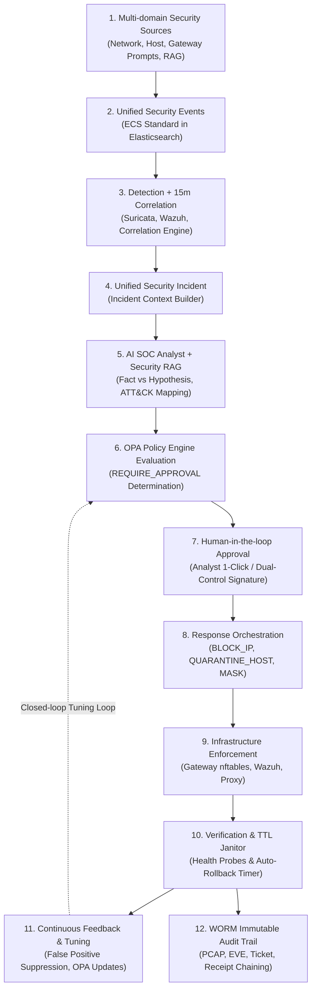

#### Diagram 12 Metadata Block
- **관련 Component**: `CMP-L1-*`, `CMP-L2-*`, `CMP-L3-*`, `CMP-L4-*` (전체 시스템)
- **관련 Requirement**: `SR-GOV-001`, `SR-RESP-001`, `FR-E2E-001`
- **입력**: Unified Multi-domain Telemetry, Human Analyst Feedback
- **출력**: Verified Closed-loop Security Posture, Auto-tuned Rules & Policy
- **Trust Boundary**: `TB-01` ~ `TB-10` (All system boundaries)
- **Security Control**: Continuous Feedback Verification, WORM Auditing, HITL Oversight
- **Telemetry**: `closed_loop.cycle_time_sec`, `closed_loop.tuning_events_total`
- **Failure Behavior**: Fallback to static rule-based SOC operation if loop stalls

---

# 89. Definition of Done (완료 기준 체크리스트)

- [x] 4-Layer Architecture가 정의됨 (L1~L4)
- [x] 모든 주요 Component가 Registry에 존재함 (22개)
- [x] Component 책임 경계가 정의됨 (DO / DO NOT)
- [x] Core SOC가 보존됨 (Suricata, Wazuh, ELK)
- [x] AI for Security 구조가 정의됨 (AI Analyst, RAG)
- [x] Security for AI 구조가 정의됨 (Gateway, DLP, Anti-injection)
- [x] Unified Event Flow가 정의됨 (ECS v8.11)
- [x] Correlation 구조가 정의됨 (15분 슬라이딩 윈도우)
- [x] AI SOC Analyst 구조가 정의됨 (Fact vs Inference 분리)
- [x] Security RAG 구조가 정의됨 (하이브리드 kNN)
- [x] AI Security Gateway 구조가 정의됨 (인라인 리버스 프록시)
- [x] DLP 구조가 정의됨 (6대 PII, 20대 Secret 가명화)
- [x] RAG Security 구조가 정의됨 (인제스천 서명 + 검색 ACL)
- [x] Agent Security 구조가 정의됨 (6대 도구 화이트리스트)
- [x] PDP/PEP 구조가 정의됨 (OPA 기반 분리)
- [x] HITL 구조가 정의됨 (1-Click 암호 서명)
- [x] Dual-Control 지원 구조가 정의됨 (Level 4 2인 승인)
- [x] Response Orchestrator가 정의됨 (7대 표준 응답)
- [x] Rollback 구조가 정의됨 (영수증 및 자동 TTL)
- [x] Evidence Chain이 정의됨 (공통 trace_id 체이닝)
- [x] Trust Boundary가 정의됨 (TB-01~TB-10)
- [x] Identity/Authorization 구조가 정의됨 (RBAC + ABAC)
- [x] Deployment Architecture가 정의됨 (3개 물리/가상 노드)
- [x] VMware Lab과 실제 환경이 분리됨 (환경 A vs 환경 B)
- [x] Fail-safe가 정의됨 (Fail-closed Ingress / Fail-open Passive)
- [x] AI Failure 시 Core SOC가 유지됨 (Graceful Degradation)
- [x] Observability가 정의됨 (6대 관측 영역)
- [x] Requirement → Component 추적 가능
- [x] Threat → Control 추적 가능
- [x] Schema → Producer/Consumer 추적 가능
- [x] Policy → PDP/PEP 추적 가능
- [x] 12대 Diagram이 존재함 (Mermaid)
- [x] 각 Diagram에 8대 Metadata가 존재함
- [x] ADR이 정리됨 (ADR-001~ADR-012)
- [x] Open Issues가 정리됨 (ARCH-OPEN-001~008)
- [x] HLD와 LLD 경계가 명확함

---

# 90. Next Artifact: 08_LOW_LEVEL_DESIGN

본 HLD 산출물은 다음 산출물인 **`08_LOW_LEVEL_DESIGN` (AegisAI 통합 시스템 상세설계서)**로 직접 인계된다.

### 상세설계서 인계 항목
1. **API Endpoints & Schemas**: 각 컴포넌트의 구체적 HTTP 경로, Pydantic 모델, JSON Schema.
2. **Elasticsearch Mappings**: `soc-events-*` 등의 구체적인 JSON 필드 매핑 및 샤드 설정.
3. **Detection & Policy Codes**: Suricata 시그니처 문법, Wazuh XML 룰, OPA Rego 코드 전문.
4. **Agent Tool Specifications**: 6대 도구의 Python 함수 정의 및 입출력 직렬화 스키마.
5. **Docker Compose & Deployment Scripts**: 22개 컴포넌트의 구체적인 컨테이너 레이아웃 및 볼륨 마운트.

---

# 91. 최종 작성 지시 및 원칙 확인

본 설계서는 다음 엄격한 아키텍처 원칙을 준수하여 작성되었다:
- **Architecture Decision ≠ Implementation**: 본 문서는 구조와 인터페이스를 결정하며 구체적 구현 코드는 LLD로 위임한다.
- **Component Defined ≠ Component Implemented**: 레지스트리 상태(Status)를 명확히 구분하여 허위 완료 보고를 방지한다.
- **AI Recommendation ≠ Security Fact**: 관측된 원시 사실과 모델 추론 결과를 네임스페이스 수준에서 분리한다.
- **Approval ≠ Execution**: 인간 분석가의 서명이 게이트웨이 액추에이터에서 검증되기 전에는 어떠한 파괴적 조치도 실행되지 않는다.

---

# 92. 최종 목적 선언

> **“AegisAI의 기존 Core SOC(Suricata/Wazuh/ELK), AI Security Gateway, AI DLP, RAG Security, Agent Security, Correlation Engine, AI SOC Analyst, Security RAG, Policy Engine, HITL 및 Response Orchestrator를 하나의 검증 가능하고 추적 가능한 Closed-loop 보안 아키텍처로 구성하고, 08_LOW_LEVEL_DESIGN이 구현 상세를 결정할 수 있는 동결된 High-Level Architecture Baseline을 확립한다.”**
