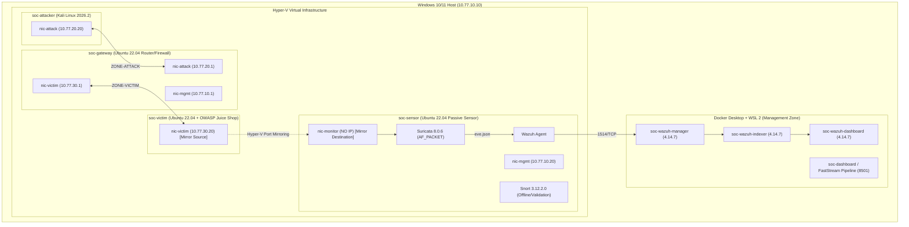

# 🏛️ 02. 보안관제 프로젝트 시스템 아키텍처 및 기본설계서 (HLD v1.0)

> **원본 문서**: [`보안관제_프로젝트_시스템_아키텍처_및_기본설계서(HLD)_v1.0.pdf`](./보안관제_프로젝트_시스템_아키텍처_및_기본설계서(HLD)_v1.0.pdf)  
> **문서 버전**: v1.0 (57 Pages)  
> **기준 일자**: 2026-08-24  
> **프로젝트 명**: SOC Detection & Monitoring Lab  

---

## 1. 아키텍처 토폴로지 (System Architecture Topology)

---

## 2. 3대 보안 영역 및 IP 할당 기준 (Network Baseline)

| 존 (Zone) | 서브넷 | 기본 게이트웨이 | 주요 호스트 및 IP | 용도 및 보안 정책 |
|---|---|---|---|---|
| **ZONE-MGMT** | `10.77.10.0/24` | `10.77.10.1` | Host: `10.77.10.10` Sensor: `10.77.10.20` Wazuh: `10.77.10.10` | 관제 트래픽 및 SIEM 통신만 허용 (외부 침투 절대 격리) |
| **ZONE-ATTACK** | `10.77.20.0/24` | `10.77.20.1` | Attacker: `10.77.20.20` | 모의 침투 및 공격 트래픽 발신 전용 대역 |
| **ZONE-VICTIM** | `10.77.30.0/24` | `10.77.30.1` | Victim: `10.77.30.20` | 공격 대상 웹 애플리케이션 및 타깃 시스템 |
| **Sensor Monitor**| - | - | Sensor: **NO IP** | 무IP 수동 모니터링 인터페이스 (패킷 캡처 전용) |

---

## 3. 핵심 기술 스택 및 버전 고정 (Technology Baseline)

- **Primary IDS**: Suricata `8.0.6` (AF_PACKET 실시간 EVE JSON)
- **Secondary IDS**: Snort `3.12.2.0` / libDAQ `3.0.27` (오프라인 검증 및 룰 비교)
- **Primary SIEM**: Wazuh `4.14.7` (Single-Node Docker 배포)
- **위협 프레임워크**: MITRE ATT&CK `19.2`
- **가상화 플랫폼**: Windows Hyper-V + Docker Desktop (WSL 2)
