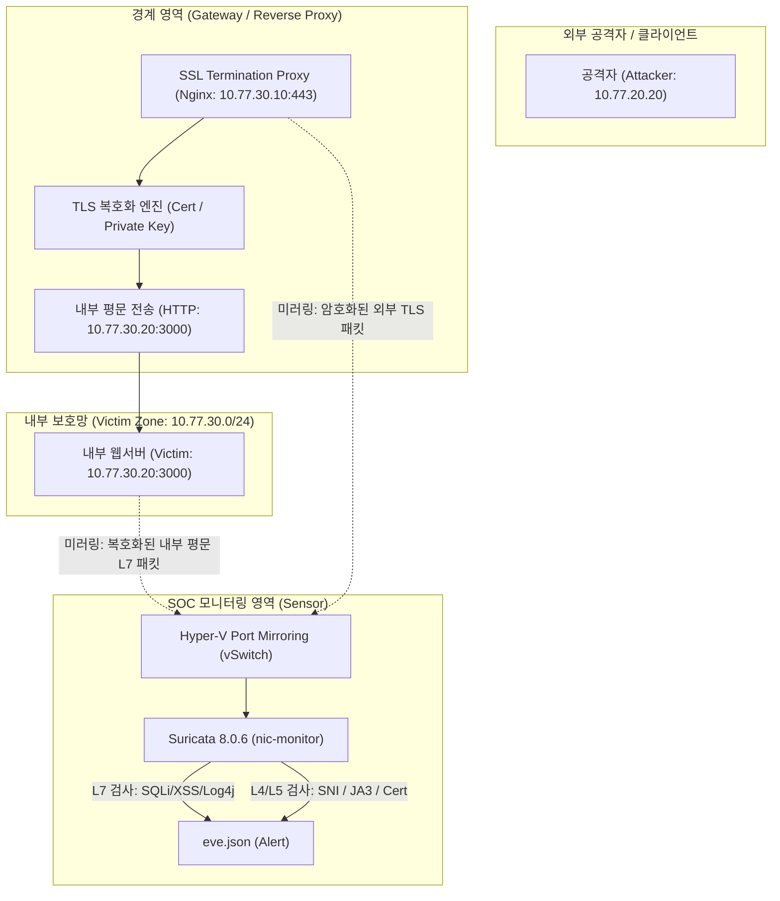

# 🔒 TLS/HTTPS 가시성 확보 및 SSL Termination 리버스 프록시 아키텍처

> **문서 ID**: `ARCH-TLS-001`  
> **기준 버전**: Suricata 8.0.6 / Nginx 1.26+ / Wazuh 4.14.7  
> **연관 문서**: [ARCHITECTURE.md](file:///C:/Users/user/Documents/ChatGPT/Suricata-Snort-SOC-Lab/docs/02-architecture/ARCHITECTURE.md), [LLD.md](file:///C:/Users/user/Documents/ChatGPT/Suricata-Snort-SOC-Lab/docs/03-design/LLD.md)

---

## 1. 개요 및 배경

오늘날 웹 트래픽의 95% 이상이 TLS/HTTPS로 암호화되어 전송됩니다.  
수동형 네트워크 침입탐지시스템(Passive IDS)인 Suricata가 원시 패킷을 미러링(`nic-monitor`)하여 수신할 때, **TLS로 암호화된 페이로드(HTTP URI, HTTP Header, HTTP Body, SQLi/XSS/Log4j 패턴)는 복호화 키 없이는 검사할 수 없는 한계**가 존재합니다.

본 문서는 이러한 암호화 트래픽 가시성 문제를 극복하기 위해 본 SOC Lab에 도입된 **3단계 TLS 가시성 아키텍처**를 정의합니다.



---

## 2. TLS 가시성 확보 3단계 전략

### 전략 1: 인바운드 SSL Termination 리버스 프록시 (Inbound Protection)
* **적용 대상**: 외부에서 내부 웹 서비스(`10.77.30.20:80/443/3000`)로 유입되는 인바운드 트래픽
* **동작 원리**:
  1. 클라이언트(공격자)는 Nginx 리버스 프록시와 정식 TLS 핸드셰이크를 맺고 암호화 통신을 수행합니다.
  2. Nginx가 서버 인증서와 개인키로 트래픽을 복호화합니다.
  3. Nginx와 내부 백엔드 웹서버 간에는 평문(HTTP: 3000/TCP)으로 패킷이 전달됩니다.
  4. **Hyper-V Virtual Switch Port Mirroring**이 백엔드 웹서버 가상 NIC(`nic-victim`)를 소스로 모니터링하므로, Suricata는 **완벽히 복호화된 평문 L7 HTTP 트래픽(URI, User-Agent, Post Body)**을 수신하여 9010 계열 웹 공격 룰을 100% 정상 발화합니다.

#### Nginx SSL Termination 설정 예시 (`/etc/nginx/conf.d/soc-ssl-proxy.conf`)
```nginx
server {
    listen 443 ssl http2;
    server_name victim-app.soc-lab.local;

    # SSL Certificates
    ssl_certificate /etc/ssl/certs/soc-lab.crt;
    ssl_certificate_key /etc/ssl/private/soc-lab.key;
    ssl_protocols TLSv1.2 TLSv1.3;
    ssl_ciphers HIGH:!aNULL:!MD5;

    location / {
        proxy_pass http://10.77.30.20:3000;
        proxy_set_header Host $host;
        proxy_set_header X-Real-IP $remote_addr;
        proxy_set_header X-Forwarded-For $proxy_add_x_forwarded_for;
        proxy_set_header X-Forwarded-Proto https;
        
        # Mirroring unencrypted upstream traffic to Suricata monitoring port
        # mirror /mirror;
    }
}
```

---

### 전략 2: 수동형 TLS 핸드셰이크 메타데이터 검사 (Passive Handshake Inspection)
복호화 키가 없는 외부 통신(아웃바운드 C2 비콘, 외부 악성 서버 역접속)의 경우, TLS 복호화 없이도 **ClientHello / Certificate 핸드셰이크 단계의 비암호화 메타데이터**를 검사합니다.

1. **SNI (Server Name Indication)**:
   - 클라이언트가 접속하고자 하는 도메인명이 평문으로 노출됨.
   - 룰 SID `9030025`: `tls.sni; content:".evil-c2.lab";`
2. **Server Certificate Subject / Issuer**:
   - 서버가 제시하는 인증서 발급자/주체 정보 검사.
   - 룰 SID `9030026`: `tls.cert_subject; content:"CN=evil-c2.lab";`
3. **JA3 / JA4 지문 분석 (Fingerprinting)**:
   - 클라이언트의 SSL 버전, 지원 암호화 스위트(Cipher Suites), 확장 필드(Extensions) 해시값을 계산하여 Cobalt Strike, Metasploit 등 알려진 공격 도구의 TLS 지문과 일치 여부 대조.

---

### 전략 3: EVE JSON TLS 원격 측정 텔레메트리 연계
`suricata.yaml`의 `outputs.eve-log.types.tls` 설정을 통해 모든 TLS 세션의 세부 정보가 `eve.json`에 기록됩니다.

```yaml
outputs:
  - eve-log:
      types:
        - tls:
            extended: yes
            custom: [subject, issuer, session_resumed, serial, fingerprint, sni, version]
```

* **기록 항목**:
  - `tls.sni`: 접속 대상 호스트명
  - `tls.version`: `TLS 1.2`, `TLS 1.3`, 또는 취약한 `SSLv3 / TLS 1.0`
  - `tls.fingerprint`: 인증서 SHA-256 지문
  - `tls.subject` / `tls.issuer`: 인증서 주체 정보

---

## 3. 검증 결과 및 운영 권고

1. **검증 현황**:
   - `suricata/rules/9030-malware-c2.rules`에 TLS SNI(`9030025`) 및 Certificate Subject(`9030026`) 룰셋 반영 완료.
   - `suricata.yaml`의 TLS 파서 및 EVE JSON 출력 활성화 확인.
2. **운영 권고**:
   - 내부 서비스 대상 공격 탐지는 **리버스 프록시(Nginx) 후단 패킷 미러링**을 최우선 표준으로 유지.
   - 아웃바운드 C2 통신은 **SNI 블랙리스트 및 JA3 Fingerprinting**을 병행 운영하여 다계층 가시성 유지.
