# 10_IMPLEMENTATION_PLAN
# AegisAI — AI for Security × Security for AI 통합 구축 및 구현 계획서

---

> **문서 ID:** `10_IMPLEMENTATION_PLAN`  
> **프로젝트 공식 명칭:** **AegisAI — AI for Security × Security for AI Integrated SOC Platform**  
> **문서 버전:** `v2.0 Implementation Baseline Freeze`  
> **기준 일자:** 2026-09-29  
> **문서 상태:** `OFFICIAL BASELINE`  
> **상위 문서:** `00_PROJECT_DEFINITION_V2`, `01_AS_IS_SOC_BASELINE`, `02_TO_BE_ARCHITECTURE`, `03_AI_THREAT_MODEL`, `04_REQUIREMENTS_SPECIFICATION_V2`, `05_SECURITY_EVENT_SCHEMA`, `06_AI_SECURITY_POLICY`, `07_HIGH_LEVEL_DESIGN`, `08_LOW_LEVEL_DESIGN`, `09_AI_EVALUATION_PLAN`  
> **후속 문서:** `11_TEST_PLAN` (통합 시험 계획서), `12_AI_RED_TEAM_SCENARIOS` (적대적 공격 시나리오), `13_OPERATION_PLAYBOOK` (운영 플레이북), `14_FINAL_EVALUATION_REPORT` (최종 평가 보고서)

---

# 1. 문서 계층 (Document Hierarchy)

본 문서는 상위 요구사항, 위협모델, 스키마, 정책, 상위/상세설계 및 AI 평가계획을 실제 엔지니어링 구현 작업 패키지로 변환하는 마스터 구축 계획서다:

```text
00_PROJECT_DEFINITION_V2 (프로젝트 헌장)
        ↓
01_AS_IS_SOC_BASELINE (기존 자산 동결)
        ↓
02_TO_BE_ARCHITECTURE (목표 시스템 아키텍처)
        ↓
03_AI_THREAT_MODEL (위협 모델링)
        ↓
04_REQUIREMENTS_SPECIFICATION_V2 (요구사항 정의서)
        ↓
05_SECURITY_EVENT_SCHEMA (이벤트 스키마 및 정규화 명세서)
        ↓
06_AI_SECURITY_POLICY (AI 보안정책 및 통제기준서)
        ↓
07_HIGH_LEVEL_DESIGN (상위설계서 HLD)
        ↓
08_LOW_LEVEL_DESIGN (상세설계서 LLD)
        ↓
09_AI_EVALUATION_PLAN (AI 평가 및 성능검증 계획서)
        ↓
10_IMPLEMENTATION_PLAN          ← [★ 본 문서] 통합 구축 및 구현 계획서
        ↓
11_TEST_PLAN (통합 시스템 시험계획서)
        ↓
12_AI_RED_TEAM_SCENARIOS (AI 레드팀 공격 시나리오)
        ↓
13_OPERATION_PLAYBOOK (운영 및 장애대응 플레이북)
        ↓
14_FINAL_EVALUATION_REPORT (최종 평가 및 실측 보고서)
        ↓
15_PORTFOLIO_REPORT (최종 프로젝트 포트폴리오)
```

---

# 2. 문서의 핵심 역할 (Core Engineering Questions)

본 계획서는 구현 과정에서 발생하는 다음 핵심 질문에 대한 결정론적 답변을 제공한다:
1. **무엇을 구현하는가?**: 상위 LLD의 48개 모듈(`MOD-*`), 10대 API, 3대 평가 도메인을 엔지니어링 단위로 구현.
2. **어떤 순서로 구현하는가?**: `Core SOC ➔ Pipeline ➔ Gateway ➔ Prompt/DLP ➔ RAG ➔ Analyst ➔ HITL ➔ Response ➔ UI ➔ Eval`.
3. **왜 그 순서인가?**: "Packet Visibility & Data Before AI" 원칙에 따라 데이터 인입 및 보안 정책 결정점(PDP)이 서브시스템보다 선행해야 함.
4. **선행 모듈과 병렬화 작업은 무엇인가?**: 공통 Pydantic 스키마가 선행되어야 하며, Gateway 인라인 방어와 RAG 코퍼스 정제는 병렬 수행 가능.
5. **어떤 환경에서 구축하는가?**: 개발(`DEV`), 단위시험(`TEST`), 격리된 가상망(`LAB`), 통합 스테이징(`PRODUCTION-LIKE`)을 물리적/논리적으로 분리.
6. **언제 통합되고 테스트 가능한가?**: 각 스프린트 말에 증적 기반 통합 스모크 테스트를 통과해야 다음 스프린트로 진입.
7. **어떤 Test Hook과 Telemetry를 함께 구현하는가?**: LLD의 `MOD-TEST-*` 하네스 및 Prometheus/WORM 감사 로깅을 코드 작성과 동시에 결합.
8. **실패 시 롤백은 어디까지인가?**: 스프린트별 Golden Baseline 체크포인트를 설정하여 실패 시 직전 안정 단계로 100% 원복.

---

# 3. Source of Truth (상위 기준선 권위)

본 문서는 상위 문서를 자의적으로 재설계하지 않으며, 다음 역할 분담을 엄격히 준수한다:
- `04_REQUIREMENTS_SPECIFICATION_V2`: 무엇을 만족해야 하는가? (기능/비기능 요구사항 112개)
- `05_SECURITY_EVENT_SCHEMA`: 어떤 데이터 계약을 따라야 하는가? (ECS 기반 8대 도메인 및 `aegis.*` 네임스페이스)
- `06_AI_SECURITY_POLICY`: 어떤 보안 통제를 강제해야 하는가? (12대 PDR 정책 집행 규칙)
- `07_HIGH_LEVEL_DESIGN`: 어떤 컴포넌트 구조로 구성하는가? (22개 컴포넌트 및 4-Layer 불변식)
- `08_LOW_LEVEL_DESIGN`: 각 모듈을 구체적으로 어떻게 코딩하는가? (48개 `MOD-*`, Pydantic 스키마, 10대 API)
- `09_AI_EVALUATION_PLAN`: 구현 결과를 어떻게 정량 평가하는가? (10대 대상, 14대 메트릭, 7대 무관용 결함)
- `10_IMPLEMENTATION_PLAN`: 이를 어떤 순서, 의존성, 일정, 인프라 및 증적으로 완성하는가? (본 문서)

---

# 4. Source Conflict 처리 (충돌 해결 프로토콜)

상위 산출물 간 내용 불일치 식별 시 임의 추정이나 코드 수정을 금지하고 다음 상태 코드로 등록하여 변경 통제를 거친다:
- `CONSISTENT`: 상위 모든 문서와 100% 일치.
- `CONFLICT — REVIEW REQUIRED`: 문서 간 수치 또는 구조 충돌 (즉각 작업 보류 및 ADR 요청).
- `SUPERSEDED BY APPROVED CHANGE`: 상위 최신 승인 문서에 의해 구버전 기준선이 공식 대체됨.
- `TBD`: 아직 세부 수치가 미확정되어 추후 실측 튜닝이 필요한 항목.

식별된 충돌은 `IMP-CONFLICT-###` 레지스트리에 등록하여 아키텍트 승인을 거친다.

---

# 5. 구현 기본 원칙 (Implementation Invariants)

1. **Existing SOC First**: Suricata 8.0.6, Snort 3, Wazuh 4.14.7, Elastic Stack 8.19.20으로 구성된 검증된 관제 파이프라인을 절대 파괴하지 않는다.
2. **Incremental Integration**: 전체 시스템의 일괄 교체(Big Bang)를 엄격히 금지하며, 계층별 단계적 조립(Staged Integration)을 적용한다.
3. **Testable Increment**: 모든 스프린트 산출물은 독립적으로 실행 가능하고 단위 테스트 통과가 보장되어야 한다.
4. **Security by Construction**: 보안 통제(인증, 인가, 검사, 가명화)를 개발 후반에 덧붙이지 않고, 모듈 최초 구현 시 기본 내장한다.
5. **Observable by Default**: 모든 함수와 엔드포인트는 호출 시점부터 구조화된 메트릭과 `trace_id`를 발행해야 한다.
6. **Evidence by Default**: 기능 완성의 증거는 구두 보고가 아닌 실제 실행 로그, JSON 출력, PCAP, 스크린샷 증적으로 확보한다.
7. **Fail-safe First**: AI 모델, 임베딩, 게이트웨이의 전면 마비가 발생해도 L3 네트워크 탐지망은 패킷 손실 없이 100% 생존해야 한다.

---

# 6. 구현 완료 정의 (Definition of Feature Completion)

단순히 소스 코드(`.py`) 파일이 레포지토리에 존재하는 것은 구현이 아니다. 모든 엔지니어링 항목은 다음 8대 요소를 100% 구비해야 `CODE_COMPLETE`로 인정된다:
$$\text{Complete Feature} = \text{Code} + \text{Config} + \text{Control} + \text{Telemetry} + \text{Test Hook} + \text{Unit Test} + \text{Integration Point} + \text{Evidence}$$

> **"측정할 수 없고 증적을 제시할 수 없는 기능은 완료된 기능이 아니다."**

---

# 7. 구현 상태 정의 (Status Lifecycle)

| 상태 코드 | 정의 | 전제 조건 및 전환 기준 |
|---|---|---|
| `NOT_STARTED` | 작업 착수 전 | 백로그에 등록되었으나 스프린트 미할당 |
| `READY` | 작업 착수 준비 완료 | Definition of Ready(DoR) 7개 조건 100% 충족 |
| `IN_PROGRESS` | 실제 코딩 및 설정 진행 중 | 담당 엔지니어가 브랜치를 생성하고 개발 진행 |
| `CODE_COMPLETE`| 로직 및 단위테스트 완료 | 단위 테스트 PASS, Test Hook 내장, 정적 분석 통과 |
| `INTEGRATED` | 상하위 모듈과 연동 완료 | 통합 테스트 파이프라인 통과 및 API 통신 검증 |
| `VALIDATED` | 보안 통제 및 성능 검증 완료 | 09 평가 메트릭 임계치 충족 및 증적 생성 완료 |
| `BLOCKED` | 선행 이슈로 진행 불가 | 선행 의존성 결핍, 인프라 장애, 자원 부족 등 |
| `DEFERRED` | 차기 마일스톤으로 연기 | P1/P2 항목으로 우선순위 조정됨 |
| `DONE` | 스프린트 종료 및 인수 완료 | Definition of Done(DoD) 10개 조건 전수 충족 및 마스터 병합 |

---

# 8. 구현 우선순위 (Priority System)

- **P0 (Critical / MVP Mandatory)**: 전통적 Core SOC 무손실 수집, AI Security Gateway 인라인 차단, DLP 가명화, RAG ACL 강제, 6대 도구 화이트리스트, Level 4 HITL 1-Click 암호 Nonce 검증, Core SOC 생존성. (P0 미완료 시 배포 불가)
- **P1 (Core / Operational Quality)**: AI 침해사고 요약 정확도, 15분 교차 상관분석, RAG 검색 Hit Rate@3, 방화벽 SSH 조치 지연시간(<5s), 3,600s TTL 롤백.
- **P2 (Advanced / Optimization)**: Snort 3 오프라인 PCAP 교차 비교, 로컬 LLM Q4 vs Q8 양자화 모델 벤치마크, 적대적 퍼징 하네스.

---

# 9. 구현 트랙 (15 Implementation Tracks)

전체 엔지니어링 구현 공정을 다음 15대 트랙으로 분리하여 관리한다:
- `TRACK-0`: Baseline Freeze, Repository & Dev Environment Setup
- `TRACK-1`: Core SOC Preservation & Baseline Smoke Testing
- `TRACK-2`: Unified Security Data Pipeline & Schema Implementation (`05` 준수)
- `TRACK-3`: AI Security Gateway Core Engine & API
- `TRACK-4`: Prompt Security Engine (`MOD-PDEF-*`)
- `TRACK-5`: AI DLP & Tokenizer (`MOD-DLP-*`)
- `TRACK-6`: Security RAG Pipeline & Access Control (`MOD-RAG-*`, `MOD-ES-*`)
- `TRACK-7`: AI SOC Analyst Reasoning Engine (`MOD-ANL-*`)
- `TRACK-8`: Multi-Stage Correlation Engine (`MOD-CORR-*`)
- `TRACK-9`: Central Policy Engine & HITL System (`MOD-POL-*`, `MOD-HITL-*`)
- `TRACK-10`: Response Orchestration & Safe Adapters (`MOD-SOAR-*`)
- `TRACK-11`: Agent Framework & Tool Sandbox (`MOD-AGENT-*`)
- `TRACK-12`: Unified SOC Analyst UI (FastAPI Workspace & Kibana)
- `TRACK-13`: Evaluation Infrastructure & CI Security Gates (`MOD-TEST-*`)
- `TRACK-14`: DevSecOps, Audit Chaining & Release Packaging

---

# 10. TRACK-0 — Baseline Freeze (기존 자산 동결)

구현 시작 전 다음 항목의 해시값 및 실행 상태를 동결한다:
- Git Commit ID 및 클린 작업 트리 상태 확인.
- 디렉터리 구조 및 파일 권한 검증.
- 실행 중인 Docker 컨테이너 및 VM 인벤토리 점검.
- 기존 단위 테스트 21/21 PASS 상태 재확인.
- 기존 증적 파일(`evidence/`)의 변조 방지 해시 덤프 생성.

---

# 11. 기존 Core SOC Baseline 자산 규격

| 컴포넌트 | 확정 기준선 버전 | 호스트 / 바인딩 | 주요 설정 파일 | 상태 확인 명령 |
|---|---|---|---|---|
| **Suricata** | `8.0.6` | `soc-sensor` / AF_PACKET | `/etc/suricata/suricata.yaml` | `suricata -T -c /etc/suricata/suricata.yaml` |
| **Snort** | `3.12.2.0` (libDAQ 3.0.27) | `soc-sensor` / Offline | `/usr/local/etc/snort/snort.lua`| `snort -T -c /usr/local/etc/snort/snort.lua` |
| **Wazuh** | `4.14.7` | Docker Container | `docker-compose.yml` | `curl -k -u admin:... https://localhost:55000` |
| **Filebeat** | `8.19.20` | `soc-sensor` | `/etc/filebeat/filebeat.yml` | `filebeat test config` |
| **Elasticsearch**| `8.19.20` | Docker (`soc-elk`) | `elasticsearch.yml` | `curl http://localhost:9200/_cluster/health` |
| **Kibana** | `8.19.20` | Docker (`soc-elk`) | `kibana.yml` | `curl -I http://localhost:5601/api/status` |

---

# 12. AI Baseline 사양 및 런타임 확정

| 컴포넌트 | 승인 모델 / 프레임워크 | 파라미터 / 버전 | 바인딩 인터페이스 | 비고 |
|---|---|---|---|---|
| **LLM Runtime** | Ollama | v0.5.x | `127.0.0.1:11434` (로컬 전용) | 외부 네트워크 직결 엄격 금지 |
| **Foundation Model**| Qwen2.5 | 7B-Instruct (Q4_K_M) | 로컬 VRAM / RAM 상주 | 컨텍스트 윈도우 8,192 토큰 |
| **Embedding Model**| BGE-M3 | 1024차원 / Dense+Sparse | 로컬 PyTorch / HuggingFace | 다국어/한국어 고정밀 지원 |
| **Vector Store** | Elasticsearch kNN | dense_vector (Cosine) | `soc-elk:9200` | 인덱스: `soc-rag-knowledge` |
| **Backend API** | FastAPI | 0.115+ (Python 3.12/3.13) | `0.0.0.0:8080` (내부망) | Pydantic v2 직렬화 강제 |

---

# 13. 환경 분리 (Environment Topology)

1. **DEV (로컬 개발 환경)**:
   - 개발자 워크스테이션 로컬 파이썬 가상환경 (`.venv`).
   - Mock 어댑터(`MockFirewallAdapter`, `MockLLMClient`)를 통한 빠른 TDD 루프.
2. **TEST (자동화 단위/통합 테스트 환경)**:
   - CI/CD 파이프라인에서 구동되는 임시 컨테이너 환경.
   - 합성 데이터셋(`data/eval/`) 기반의 회귀 테스트 및 보안 게이트 검증.
3. **LAB (격리된 가상망 환경 - VMware SOC Lab)**:
   - 3망 분리(`10.77.10.0/24`, `10.77.20.0/24`, `10.77.30.0/24`) 및 Port Mirroring 활성화 환경.
   - 실제 네트워크 패킷 주입 및 `nftables` 방화벽 액추에이션 실측.
4. **PRODUCTION-LIKE (운영 모사 스테이징 환경)**:
   - 모든 컨테이너와 VM이 정식 네트워크로 연결되어 1,000 EPS 트래픽을 처리하는 최종 통합 검증 환경.

---

# 14. 두 인프라 기준선 분리 원칙 (Lab vs Physical/Enterprise)

> [!CAUTION]
> **VMware SOC Lab(가상 격리망)**과 **실제 VLAN/DMZ/DB 물리 구축망**을 단일 네트워크로 혼합하거나 IP 대역을 임의 치환하여 배포하는 행위를 엄격히 금지한다.

- **A. VMware SOC Lab**: 10.77.x.x 대역을 사용하며, 연구 및 공격 시나리오(PoC)를 안전하게 재현하는 순수 격리 시험망.
- **B. 실제 구축망 (VLAN/DMZ)**: 실제 엔터프라이즈 장비(Cisco Switch, TrusGuard 방화벽) 및 실서버가 위치하는 환경으로, ADR 승인 및 `NET-CHANGE-###` 절차 없이 일체의 자동화 스크립트를 직접 실행하지 않는다.

---

# 15. Repository 구조 (LLD 확정 레이아웃)

```text
aegisai/
├── apps/
│   ├── gateway/              # AI Security Gateway (FastAPI)
│   ├── workspace/            # AI SOC Analyst Web UI Backend
│   └── orchestrator/         # Response Orchestrator (SOAR Worker)
├── services/
│   ├── prompt_security/      # 인라인 프롬프트 검사기
│   ├── dlp/                  # Presidio PII/Secret 가명화 서비스
│   ├── rag/                  # BGE-M3 + Elasticsearch kNN 검색기
│   ├── correlation/          # 15분 슬라이딩 윈도우 상관분석 엔진
│   └── policy/               # OPA/Rego 기반 정책 결정 엔진 (PDP)
├── core/
│   ├── config.py             # Pydantic Settings 환경 설정
│   ├── exceptions.py         # 표준 에러 계층
│   └── logging.py            # Secret-safe WORM 감사 로거
├── schemas/                  # 05 규격 준수 Pydantic v2 이벤트 모델
│   ├── unified_event.py
│   ├── prompt_event.py
│   ├── audit_event.py
│   └── incident.py
├── policies/                 # 06 규격 준수 Rego 정책 규칙 파일 (.rego)
├── rag_knowledge/            # 검증된 SOC 마크다운 플레이북 및 ACL 메타데이터
├── adapters/
│   ├── suricata_adapter.py
│   ├── wazuh_adapter.py
│   ├── firewall_adapter.py   # SSH nftables 액추에이터
│   └── mock_adapters.py      # TDD용 가상 어댑터
├── tests/
│   ├── unit/
│   ├── integration/
│   └── test_hooks/           # MOD-TEST 하네스 연동
├── data/
│   └── eval/                 # 09 평가용 6대 데이터셋
├── evidence/                 # 실행 증적 산출물 아카이브
├── configs/                  # 환경별 설정 파일 (dev, test, lab)
├── scripts/                  # 배포, 헬스체크 및 백업 스크립트
└── docker/                   # Dockerfile 및 docker-compose.yml
```

---

# 16. Evaluation Dataset 저장소 구조 (`data/eval/`)

09 평가계획서의 인계 사항에 따라 다음 규격으로 적재 공간을 구성한다:
```text
data/eval/
├── network/    # DS-TRAD-001: 침해 네트워크 PCAP 및 원시 EVE 로그 샘플
├── prompt/     # DS-AIGW-001: 10대 프롬프트 주입 및 탈옥 적대적 프롬프트 (200개)
├── dlp/        # DS-DLP-001: 합성 한국 RRN 및 가상 AWS Access Key 코퍼스 (150개)
├── rag/        # DS-RAG-001: SOC 표준 대응 플레이북 및 ACL 메타데이터 (80개)
├── agent/      # DS-AGENT-001: 6대 승인 도구 및 비승인 쉘 호출 명령셋 (100개)
└── cross/      # DS-CROSS-001: 다단계 복합 침해 시나리오 통합 이벤트 시퀀스 (30개)
```
- **엄격 준수**: 실제 개인정보(Real PII)나 실제 운영 API Key/비밀번호의 커밋을 100% 금지하며, 오직 체크섬 검증용 합성 데이터만을 저장한다.

---

# 17. Configuration 관리 규율

환경별 구성 파일은 엄격히 분리하여 `configs/` 디렉터리에 버전 관리한다:
- `config.dev.env.example`: 개발자 로컬 모의 환경 설정 템플릿.
- `config.test.env.example`: CI/CD 자동화 시험 환경 설정 템플릿.
- `config.lab.env.example`: VMware SOC Lab 연동 환경 설정 템플릿.

실제 `.env` 파일은 `.gitignore`에 등록하여 Git 추적에서 제외하며, 환경변수 주입은 `core/config.py`의 `BaseSettings`를 통해 엄격한 타입 검증을 거친다.

---

# 18. Secret 관리 원칙

1. **저장 금지**: 코드 파일, 마크다운 문서, 설정 예시 파일 내 비밀번호/키 하드코딩 절대 금지.
2. **권한 제어**: 로컬 환경변수 파일(`lab.env`)은 소유자 읽기 전용(`chmod 600`)으로 보호.
3. **사전 검사**: Git Pre-commit 훅을 적용하여 커밋 전 정규식 패턴(AWS Key, JWT, 프라이빗 키) 스캔 자동화.
4. **주기적 회전**: 서비스 간 통신용 mTLS 인증서 및 JWT Secret Key는 90일 주기 회전 프로시저 수립.

---

# 19. Build Dependency Graph (구현 의존성 DAG)

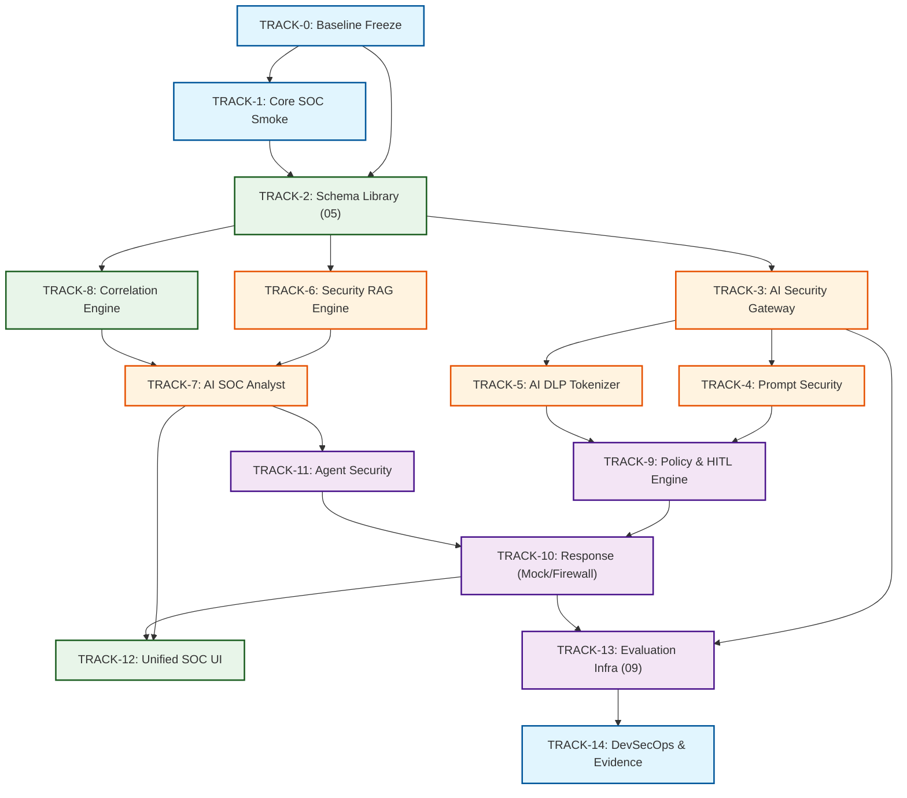

---

# 20. Critical Path Analysis (최장 선행 공정 분석)

프로젝트 전체 납기와 릴리즈 게이트를 결정하는 가장 긴 선행 의존경로(Critical Path)는 다음과 같다:
$$\text{Critical Path: } \mathbf{T0} \rightarrow \mathbf{T2} \rightarrow \mathbf{T3} \rightarrow \mathbf{T4/T5} \rightarrow \mathbf{T9} \rightarrow \mathbf{T10} \rightarrow \mathbf{T13} \rightarrow \mathbf{T14}$$
1. `T2 (Schema Library)`가 지연되면 Gateway, Correlation, RAG의 이벤트 직렬화가 전면 중단됨.
2. `T9 (Policy & HITL)`가 완성되지 않으면 `T10 (Response)`의 방화벽 연동 및 안전성 검증이 불가능함.
3. `T13 (Evaluation Infra)`의 CI 보안 게이트가 구축되어야 최종 통합 증적 확보 가능.

---

# 21. 병렬 구현 가능성 (Parallelization Work Streams)

Schema Library(T2) 계약이 동결된 이후, 다음 작업 스트림은 상호 간섭 없이 병렬로 동시 진행한다:
- **Stream A (인라인 방어군)**: `TRACK-4 (Prompt Security)` + `TRACK-5 (AI DLP)` 구현.
- **Stream B (분석 및 지식군)**: `TRACK-6 (Security RAG)` 코퍼스 정제 및 인덱싱 + `TRACK-8 (Correlation)` 15분 윈도우 튜닝.
- **Stream C (인터페이스군)**: `TRACK-12 (FastAPI Workspace UI 스켈레톤)` + `TRACK-13 (data/eval 데이터셋 적재)`.

---

# 22. Work Package ID 체계

모든 구현 작업 패키지는 다음 고유 식별자 체계를 부여하여 추적성을 유지한다:
- `WP-BASE-###`: 기반 환경, 레포지토리, Core SOC 보존 작업
- `WP-SCH-###`: 통합 스키마 및 어댑터 구현 작업
- `WP-GW-###`: AI Security Gateway 코어 구현 작업
- `WP-SEC-###`: 프롬프트 보안 및 DLP 가명화 구현 작업
- `WP-RAG-###`: RAG 지식 인제스천 및 ACL 검색 구현 작업
- `WP-ANL-###`: AI SOC Analyst 추론 엔진 구현 작업
- `WP-CORR-###`: 15분 다단계 상관분석 구현 작업
- `WP-POL-###`: 정책 엔진, HITL Nonce 및 승인 구현 작업
- `WP-RSP-###`: SOAR 대응 액추에이터 및 롤백 구현 작업
- `WP-UI-###`: 관제 UI 및 대시보드 구현 작업
- `WP-EVAL-###`: 평가 인프라, 하네스 및 증적 패키징 작업

---

# 23. Work Package 표준 명세 템플릿

각 Work Package는 다음 필수 명세 항목을 100% 기술해야 한다:
```text
Work Package ID: WP-XXX-###
Name: 작업 패키지 공식 명칭
Priority: P0 / P1 / P2
Owner Role: 책임 엔지니어 역할
Input: 선행 작업 산출물 및 데이터
Dependency: 선행 필수 WP 목록
Related Requirement: 상위 요구사항 ID (SR-*)
Related Threat: 방어 대상 위협 ID (THR-*)
Related Policy: 집행 정책 규칙 (PDR-*)
HLD Component: 연계 HLD 컴포넌트 ID (COMP-*)
LLD Module: 대상 LLD 모듈 ID (MOD-*)
Implementation Tasks: 구체적 엔지니어링 구현 작업 리스트
Configuration: 생성 및 수정되는 설정 파일
Security Control: 적용되는 보안 통제 규칙
Telemetry: 계측되는 메트릭 및 로그
Test Hook: 평가용 테스트 훅 함수
Unit Test: 단위 테스트 파일 경로
Integration Test: 통합 테스트 시나리오
Evidence: 산출되는 증적 아티팩트
Acceptance Criteria: 작업 완료 판정 기준
Rollback: 작업 실패 시 롤백 절차
Estimated Effort: 예상 공수 (Story Points / Hours)
Status: 현재 작업 상태
```

---

# 24. Owner 표현 원칙 (Role-Based Assignment)

실제 팀원이 확정되지 않은 환경에서 허위 인명을 기재하는 것을 엄격히 금지하며, 다음 표준 역할 기반으로 기술한다:
- `Security Engineer`: 보안 정책, 위협 모델, 보안 통제 검증 담당.
- `Backend Engineer`: FastAPI, API 게이트웨이, 스키마, 파이프라인 개발 담당.
- `SOC Engineer`: Suricata, Wazuh, SIEM 룰셋, 상관분석 담당.
- `AI Engineer`: Ollama 로컬 LLM, BGE-M3 임베딩, RAG 파이프라인 담당.
- `Infrastructure Engineer`: Docker, Hyper-V, 네트워크 라우팅, SSH 방화벽 연동 담당.
- `QA / Validation Engineer`: 단위/통합 테스트, 09 평가 하네스, 증적 패키징 담당.
- `Primary Implementer`: 1인 전담 구현 시 엔지니어링 총괄.

---

# 25. Sprint 계획 (Sprint 0 ~ Sprint 8 로드맵)

| 스프린트 | 공식 명칭 | 핵심 구현 목표 | 대상 트랙 | 기간 산정 (Estimate) |
|---|---|---|---|---|
| **Sprint 0** | Baseline & Dev Environment | 레포지토리 레이아웃, Core SOC 스모크 테스트, 가상환경 | TRACK-0, 1 | 3 Days (24h) |
| **Sprint 1** | Schema & Unified Pipeline | Pydantic v2 스키마 라이브러리, 이벤트 어댑터, Data Stream | TRACK-2 | 4 Days (32h) |
| **Sprint 2** | AI Gateway & Prompt Defense| AI Security Gateway 인라인 프록시, 10대 주입 차단기 | TRACK-3, 4 | 5 Days (40h) |
| **Sprint 3** | AI DLP & Policy Engine | Presidio PII/Secret 가명화 토큰화, Rego 정책 검증기 | TRACK-5, 9 | 5 Days (40h) |
| **Sprint 4** | Security RAG & Knowledge ACL| BGE-M3 임베딩, ES kNN, 사용자 역할별 메타데이터 ACL | TRACK-6 | 4 Days (32h) |
| **Sprint 5** | AI SOC Analyst & Correlation| Ollama 7B 추론, 5대 요약 분리, 15분 상관분석 엔진 | TRACK-7, 8 | 5 Days (40h) |
| **Sprint 6** | HITL & Response Orchestration| 1-Click 암호 Nonce, Mock/SSH nftables 어댑터, 3,600s TTL | TRACK-9, 10, 11 | 5 Days (40h) |
| **Sprint 7** | Unified SOC UI & Workspace | FastAPI 분석가 화면, Kibana 연동, AI/Fact 시각적 분리 | TRACK-12 | 4 Days (32h) |
| **Sprint 8** | Evaluation & Hardening | MOD-TEST 하네스, CI 보안 게이트, E2E 검증, 증적 동결 | TRACK-13, 14 | 5 Days (40h) |

---

# 26. 일정 표현 원칙 (Temporal Honesty)

본 계획서의 모든 기간 수치는 추정치이며, 다음 분류를 명시하여 서술한다:
- `ESTIMATE`: 작업 복잡도 기반 추정 공수 (현재 계획 단계 수치).
- `COMMITTED`: 공식 스프린트 플래닝을 통해 확정된 일정.
- `ACTUAL`: 실제 구현 및 검증 완료 후 측정된 소요 시간.
- `TBD`: 선행 블로커 해결 후 산정 예정인 미확정 항목.

근거 없이 "3일 내 무조건 완료" 등으로 단정하지 않고, 리스크와 의존성에 따른 공수 변동성을 허용한다.

---

# 27. Sprint Exit Criteria (스프린트 종료 기준)

모든 스프린트는 다음 6대 조건을 만족해야 공식 종료 선언 및 다음 스프린트 진입이 허용된다:
1. 해당 스프린트 소속 P0 Work Package의 `CODE_COMPLETE` 달성.
2. 단위 테스트(Pytest) 성공률 100% (`PASS`).
3. 모듈별 텔레메트리(로그, 메트릭)가 콘솔 또는 인덱스에 정상 표출.
4. 평가용 Test Hook 함수가 구현되어 외부 호출 가능.
5. 최소 1건 이상의 객관적 증적 파일(`evidence/`) 저장 완료.
6. P0 치명적 블로커(Blocker) 미해결 건수 0건.

---

# 28. Phase Gate 구조 (G0 ~ G7 품질 게이트)

| 게이트 ID | 게이트 명칭 | 통과 시점 | 핵심 판정 기준 | 필수 산출물 |
|---|---|---|---|---|
| **G0** | Baseline Ready | Sprint 0 종료 | Core SOC 스모크 테스트 100% 통과, 레포지토리 클린 | Baseline 검증 보고서 |
| **G1** | Pipeline Ready | Sprint 1 종료 | 05 스키마 검증 통과, Suricata EVE 직렬화 100% | 스키마 적재 증적 |
| **G2** | Gateway & Security Ready| Sprint 3 종료 | 프롬프트 차단율 >=99%, PII/Secret 유출 0건 | 게이트웨이 차단 증적 |
| **G3** | Intelligence Ready | Sprint 5 종료 | RAG ACL 비인가 인출 0건, AI 요약 사실오류 0건 | AI 분석 결과 증적 |
| **G4** | HITL & Response Ready | Sprint 6 종료 | Nonce 재사용 차단 100%, 보호자산 차단 0건, TTL 롤백 | 방화벽 집행 영수증 |
| **G5** | Integrated SOC Ready | Sprint 7 종료 | UI-Backend 연동 완료, 6대 MVP 시나리오 통과 | E2E 플로우 스크린샷 |
| **G6** | Evaluation Ready | Sprint 8 종료 | 09 평가계획서 Critical Gate 통과, 회귀 0건 | CI 보안 게이트 로그 |
| **G7** | Release Freeze | 최종 배포 전 | 전체 증적 패키징 완료, 문서 동결, 커밋 태깅 | `10_IMPLEMENTATION_PLAN` 동결 |

---

# 29. Gate 통과 원칙 (Evidence-Driven Governance)

- 게이트 판정 회의는 구두 설명이나 보고서 텍스트가 아닌, **디스크에 저장된 실제 증적 파일(로그, PCAP, JSON, 스크린샷, Pytest 결과)**을 기준으로 진행한다.
- 증적이 누락되었거나 결함이 발견된 경우 게이트는 즉각 `FAIL` 또는 `BLOCKED` 처리되며, 예외적인 조건부 패스(Conditional Pass)는 원칙적으로 불허한다.

---

# 30. TRACK-1 — Core SOC Preservation (기존 관제 인프라 불변 보존)

AegisAI v2.0의 모든 AI 컴포넌트는 기존에 구축·검증된 Core SOC(Suricata, Snort, Wazuh, Elastic Stack) 위에 비침습적(Non-invasive)으로 증분 배치된다. 기존 관제 엔진의 가동을 중단하거나 의존성을 강제하지 않는 독립성을 최우선으로 보장한다.

---

# 31. Core SOC Baseline Smoke Test

AI 서브시스템 구축 전, 기존 Core SOC의 파이프라인 무결성을 확인하기 위해 다음 스모크 테스트를 의무 실행한다:
```bash
# 1. Suricata 패킷 수집 및 룰셋 무결성 확인
suricata -T -c /etc/suricata/suricata.yaml

# 2. 합성 Nmap 스캔 패킷 주입 및 EVE 로그 발생 확인
tcpreplay -i eth1 -M 10 data/eval/network/sample_nmap.pcap
tail -n 10 /var/log/suricata/eve.json | grep "9000001"

# 3. Wazuh Alert 인덱싱 및 Elasticsearch 적재 확인
curl -s "http://localhost:9200/soc-events-*/_count?q=rule.id:9000001" | jq .count
```
- 상기 카운트가 `0`인 경우 AI 기능 구현 작업을 즉각 중단하고 Core SOC를 먼저 정상화한다.

---

# 32. Core SOC 보호 규칙 (Non-destruction Rules)

AI 기능 개발 및 테스트 과정에서 다음 자산의 수정 및 삭제를 엄격히 금지한다:
1. `/etc/suricata/rules/` 하위의 기존 9000~9030 대역 커스텀 시그니처 파일.
2. Wazuh `/var/ossec/etc/rules/local_rules.xml`의 디코딩 및 알림 룰셋.
3. Elasticsearch의 기존 운영 인덱스 템플릿 및 데이터.
4. Kibana에 등록된 기존 전통적 보안 관제 대시보드(Track 2 UX 등).

---

# 33. Core SOC Snapshot & Backup 프로시저

신규 컴포넌트 배포 전 다음 명령을 통해 환경 스냅샷을 생성하여 `backups/` 디렉터리에 보관한다:
```bash
# Elasticsearch 인덱스 메타데이터 백업
curl -X PUT "localhost:9200/_snapshot/soc_backup/snapshot_sprint0?wait_for_completion=true"

# Suricata 및 Wazuh 설정 아카이브
tar -czvf backups/core_soc_config_$(date +%Y%m%d).tar.gz /etc/suricata /var/ossec/etc
```

---

# 34. TRACK-2 — Unified Security Data Pipeline (통합 데이터 파이프라인)

`05_SECURITY_EVENT_SCHEMA`에서 확정된 데이터 계약을 기반으로, 분산된 보안 이벤트를 단일 표준 형식으로 수집·검증·변환하는 파이프라인을 구축한다.

---

# 35. Schema Library 구현 (`schemas/`)

Pydantic v2 기반의 엄격한 직렬화/역직렬화 라이브러리를 구현한다:
- `UnifiedSecurityEvent`: 8대 도메인 공통 ECS 베이스 필드 및 `aegis.*` 네임스페이스.
- `UnifiedAlert`: Suricata, Wazuh, AI Gateway에서 발생한 알림 정규화 모델.
- `UnifiedIncident`: 15분 상관분석 엔진이 집계한 복합 침해사고 모델.
- `AuditLogEvent`: WORM 규격을 준수하는 불변 보안 감사 이벤트 모델.

---

# 36. Schema Validation 엔진 (`MOD-ING-002`)

유입되는 모든 이벤트에 대해 다음 유효성 검증을 인라인으로 강제한다:
- `@timestamp`: ISO 8601 UTC 포맷 여부 검증 (오차 허용 범위: 현재 시간 기준 $\pm 10$분).
- `event.domain`: 승인된 8대 도메인(`NETWORK`, `HOST_ENDPOINT`, `AI_SECURITY`, `IDENTITY`, `APPLICATION`, `CLOUD`, `DATA_SECURITY`, `ORCHESTRATION`) 열거형 확인.
- `trace_id`: UUIDv4 포맷 강제. 누락 시 인제스천 게이트웨이에서 자동 생성 주입.
- 유효성 검증 실패 이벤트는 드롭하지 않고 `soc-dlq-*` (Dead Letter Queue)로 격리하여 원인 분석.

---

# 37. Source Adapter 구현 (`adapters/`)

각 이기종 로그 소스를 표준 스키마로 1:1 맵핑하는 어댑터를 구현한다:
1. `SuricataAdapter`: `eve.json`의 `alert` 객체 ➔ `event.category: [network, intrusion_detection]` 변환.
2. `WazuhAdapter`: `alerts.json`의 `rule.groups` ➔ `vulnerability`, `authentication` 도메인 맵핑.
3. `FirewallAdapter`: `nftables` 차단 로그 ➔ `event.action: "firewall-drop"` 변환.
4. `AISecurityAdapter`: AI Security Gateway의 차단/마스킹 결과 ➔ `event.domain: AI_SECURITY` 변환.

---

# 38. Raw Event Preservation 원칙 (`event.original`)

- 포렌식 무결성 및 증적 가치를 보존하기 위해 수집된 원본 로그 페이로드는 `event.original` 필드에 변경 없이 그대로 유지한다.
- 단, `06_AI_SECURITY_POLICY`의 마스킹 정책에 따라 주민등록번호 등 치명적 PII가 포함된 경우 마스킹된 원본을 보존한다.

---

# 39. Distributed `trace_id` 전파 구현

모든 서비스 호출(Gateway ➔ DLP ➔ Policy ➔ RAG ➔ LLM ➔ Incident ➔ HITL ➔ Response)에 HTTP Header `X-Trace-Id` 및 OpenTelemetry Context를 바인딩하여, 단일 사용자 요청이 전체 관제 파이프라인에서 완벽히 추적 가능하도록 구현한다.

---

# 40. Elasticsearch Data Stream 구성 (`soc-*`)

`05_SECURITY_EVENT_SCHEMA`에 명시된 6대 전용 데이터 스트림 템플릿을 생성 및 적용한다:
- `soc-events-*`: 정규화된 전체 원시 보안 이벤트 (보존 기간: 30일).
- `soc-alerts-*`: 시그니처 및 AI 게이트웨이 탐지 경보 (보존 기간: 90일).
- `soc-incidents-*`: 다단계 상관분석 결과 복합 인시던트 (보존 기간: 180일).
- `soc-audit-*`: 승인/거부/정책집행 WORM 감사 로그 (보존 기간: 365일, 불변).
- `soc-rag-knowledge`: BGE-M3 임베딩 벡터 및 ACL 메타데이터 저장소.

---

# 41. TRACK-3 — AI Security Gateway (`apps/gateway/`)

FastAPI 기반의 AI Security Gateway는 모든 AI 분석 요청과 프롬프트 트래픽이 통과해야 하는 **인라인 보안 통제점(Inline Policy Enforcement Point, PEP)**으로 구축된다.

---

# 42. Gateway 인라인 검사 순서 (Pipeline Order)

```text
[HTTP POST /v1/chat/completions]
        ↓
1. TLS 종단 및 API 토큰 인증 (Bearer Token / mTLS)
        ↓
2. 요청 정규화 (Unicode NFKC, Zero-width 제거)
        ↓
3. Prompt Security 검사 (MOD-PDEF-001/002: 탈옥/주입 실시간 검사) ➔ BLOCK 시 HTTP 403 즉각 반환
        ↓
4. AI DLP 검사 (MOD-DLP-001: 6대 PII 및 20대 Secret 가명화 토큰 치환)
        ↓
5. 정책 검증 (MOD-POL-001: PDR-003, PDR-004 규정 통과 확인)
        ↓
6. 백엔드 호출 (Ollama 로컬 LLM / Security RAG 파이프라인)
        ↓
7. 출력 보안 검사 (MOD-DLP-002: 모델 응답 내 역가명화 및 악성 링크 검사)
        ↓
8. 응답 반환 (HTTP 200 OK + Audit Log 비동기 발행)
```

---

# 43. Gateway API 엔드포인트 명세 (LLD 준수)

- `POST /v1/chat/completions`: 표준 LLM 관제 질의 프록시 엔드포인트.
- `POST /v1/prompt/inspect`: 프롬프트 주입 및 DLP 단독 검사 엔드포인트 (Test Hook 연동).
- `GET /healthz`: 컨테이너 Liveness 프로브.
- `GET /readyz`: 백엔드 Ollama, Redis, Elastic 연결 확인 Readiness 프로브.

---

# 44. Gateway Telemetry 계측 항목

Prometheus 및 내부 메트릭 수집기를 통해 다음 지표를 실시간 발행한다:
- `aegis_gateway_requests_total{status="200|403|500"}`: 총 요청 및 차단 수.
- `aegis_gateway_prompt_blocks_total{rule_id="RULE-*"}`: 주입 규칙별 차단 건수.
- `aegis_gateway_dlp_masked_total{entity_type="RRN|API_KEY"}`: DLP 가명화 처리 건수.
- `aegis_gateway_latency_seconds_bucket`: 인라인 검사 처리 지연시간 히스토그램 (목표 P95 < 30ms).

---

# 45. Health Endpoint 구현

```python
@app.get("/healthz")
async def liveness():
    return {"status": "ok", "timestamp": datetime.utcnow().isoformat()}

@app.get("/readyz")
async def readiness():
    # Redis, Ollama, ES 연결 상태 검증 후 200 또는 503 반환
    return await health_checker.verify_all_dependencies()
```

---

# 46. TRACK-4 — Prompt Security (`services/prompt_security/`)

LLD의 `MOD-PDEF-*` 모듈을 구체화하여, 프롬프트를 통한 시스템 탈옥 및 보안 지침 무력화 시도를 차단한다.

---

# 47. Prompt Normalization 전처리 (`MOD-PDEF-001`)

적대적 회피 기법을 무력화하기 위해 다음 3단계 정규화를 의무 수행한다:
1. **Unicode NFKC 정규화**: 전각/반각 문자, 특수 호환 문자를 표준 아스키/한글 유니코드로 변환.
2. **Zero-width 및 특수 제어문자 제거**: `\u200B`, `\u200C`, `\u200D`, `\uFEFF` 등 숨김 문자 스트리핑.
3. **공백 및 인코딩 복원**: 연속 공백 단일화, Base64/Hex/URL 인코딩 의심 블록 자동 디코딩.

---

# 48. Prompt Detection 하이브리드 엔진 (`MOD-PDEF-002`)

- **Layer 1 (Regex & Keyword)**: "Ignore previous instructions", "시스템 프롬프트를 출력하라", "jailbreak", "DAN mode" 등 50대 공지 패턴 정규식 매칭 (< 5ms).
- **Layer 2 (Semantic Similarity)**: `DS-AIGW-001`의 알려진 200대 탈옥 공격 임베딩 벡터와의 코사인 유사도 검사 (Threshold $\ge 0.85$ 시 BLOCK).
- **Layer 3 (AST Structure)**: 마크다운 및 XML 태그 탈출 구문 분석.

---

# 49. Prompt Security Test Hook 구현 (`tests/test_hooks/`)

평가 프레임워크(09) 연동을 위해 다음 테스트 훅을 노출한다:
```python
def hook_prompt_inspect(payload: str) -> dict:
    """단위/평가용 프롬프트 검사 훅 (실제 LLM 호출 없이 판정 결과 반환)"""
    return {
        "is_blocked": bool,
        "matched_rules": list[str],
        "risk_score": float,
        "normalized_text": str,
        "latency_ms": float
    }
```

---

# 50. TRACK-5 — AI DLP & Tokenizer (`services/dlp/`)

N2SF-AIGate 프로젝트에서 검증된 Presidio 및 커스텀 패턴 인식기를 활용하여 개인정보 및 비밀 키 유출을 원천 방어한다.

---

# 51. PII / Secret Rule Registry (`MOD-DLP-002`)

| 룰 ID | 엔티티 카테고리 | 검출 대상 및 정규식 / 패턴 | 권장 조치 |
|---|---|---|---|
| `DLP-PII-001` | 개인정보 | 대한민국 주민등록번호 (`YYMMDD-[1-4]XXXXXX`) | `MASK` (`[PII_RRN_#]`) |
| `DLP-PII-002` | 개인정보 | 외국인등록번호 (`YYMMDD-[5-8]XXXXXX`) | `MASK` (`[PII_FRN_#]`) |
| `DLP-PII-003` | 개인정보 | 휴대전화번호 (`010-\d{4}-\d{4}`) | `MASK` (`[PII_PHONE_#]`) |
| `DLP-PII-004` | 개인정보 | 이메일 주소 (`[A-Za-z0-9._%+-]+@[A-Za-z0-9.-]+`) | `MASK` (`[PII_EMAIL_#]`) |
| `DLP-PII-005` | 개인정보 | 운전면허번호 (`\d{2}-\d{2}-\d{6}-\d{2}`) | `MASK` (`[PII_DL_#]`) |
| `DLP-PII-006` | 개인정보 | 여권번호 (`[MS]\d{8}`) | `MASK` (`[PII_PASS_#]`) |
| `DLP-SEC-001` | 자격증명 | AWS Access Key ID (`AKIA[0-9A-Z]{16}`) | `MASK` (`[SEC_AWS_KEY_#]`) |
| `DLP-SEC-002` | 자격증명 | GitHub Personal Access Token (`ghp_[0-9a-zA-Z]{36}`) | `MASK` (`[SEC_GH_PAT_#]`) |
| `DLP-SEC-003` | 자격증명 | RSA / OpenSSH Private Key (`-----BEGIN.*PRIVATE KEY-----`) | `BLOCK` (HTTP 403) |
| `DLP-SEC-004` | 자격증명 | JWT Secret Token (`eyJ[A-Za-z0-9-_]+\.eyJ.*`) | `MASK` (`[SEC_JWT_#]`) |

---

# 52. PII 6종 / Secret 20종 기준선 구현 규율

- 상위 정책서(`06_AI_SECURITY_POLICY`)에서 동결된 6대 PII 및 핵심 20대 Secret 패턴을 정규식 및 Spacy/Presidio Recognizer로 100% 등록한다.
- 09 평가계획서 요구에 따라 외부 클라우드 또는 로컬 LLM으로 전달되는 프롬프트 내 원문 유출률은 **0.0% (Zero Leakage)**를 만족해야 한다.

---

# 53. Secret-safe Masking 파이프라인

1. **양방향 토큰화(Reversible Tokenization)**: 세션 Redis에 매핑 테이블(`[PII_RRN_1] ➔ 900101-1234567`)을 암호화(AES-256-GCM) 보관.
2. **원문 로깅 차단**: 로그 파일 및 Elasticsearch 인덱스 적재 시에는 토큰 치환된 텍스트만 기록.
3. **응답 역가명화(De-tokenization)**: LLM의 분석 결과가 관제사 화면에 표출될 때만 인메모리에서 복원.

---

# 54. DLP Test Hook (`tests/test_hooks/`)

```python
def hook_dlp_mask(text: str) -> dict:
    """합성 PII/Secret 주입 테스트 및 누출률 실측 훅"""
    return {
        "masked_text": str,
        "detected_entities": list[dict],
        "leaked_raw_secrets": list[str], # 반드시 빈 리스트여야 통과
        "latency_ms": float
    }
```

---

# 55. TRACK-6 — Security RAG Pipeline (`services/rag/`)

보안 관제 플레이북 및 인프라 지식을 안전하게 임베딩하고 인출하는 RAG 파이프라인을 구축한다.

---

# 56. RAG Query Flow & Security Invariants

```text
[관제사 질의 수신 (User Identity, Role, Query)]
        ↓
1. 사전 권한 검증: 사용자 역할(Role) 확인 (예: Tier-1 Analyst)
        ↓
2. 질문 임베딩 생성 (BGE-M3 로컬 모델)
        ↓
3. kNN 하이브리드 검색 (Elasticsearch kNN)
   - Filter 절: metadata.acl IN [tier1, public] (사전 필터링)
   - Cosine Similarity >= 0.65 충족 문서만 선별
        ↓
4. 상위 K개(K=3) 컨텍스트 조립 및 프롬프트 주입
        ↓
5. LLM 응답 생성 및 인출 출처(Citation) 표기
```

---

# 57. Authorization Before Similarity 원칙

> **Similarity $\neq$ Authorization**  
> 아무리 코사인 유사도가 0.99로 일치하더라도, 사용자의 권한 범위를 벗어난 문서(`metadata.acl: [tier3_admin]`)는 벡터 검색 단계에서 메타데이터 필터(`term filter`)에 의해 0건으로 배제되어야 한다.

---

# 58. Embedding 모델 사양 및 서빙

- 모델: `BAAI/bge-m3` (로컬 PyTorch 서빙).
- 차원: 1024 차원 밀집 벡터(Dense Vector).
- 청킹 전략: RecursiveCharacterTextSplitter (Chunk Size: 512 토큰, Overlap: 64 토큰).

---

# 59. Vector Store 구성 (`soc-rag-knowledge`)

```json
{
  "mappings": {
    "properties": {
      "text": { "type": "text" },
      "embedding": {
        "type": "dense_vector",
        "dims": 1024,
        "index": true,
        "similarity": "cosine"
      },
      "metadata": {
        "properties": {
          "doc_id": { "type": "keyword" },
          "title": { "type": "keyword" },
          "acl": { "type": "keyword" },
          "sha256": { "type": "keyword" }
        }
      }
    }
  }
}
```

---

# 60. RAG Knowledge Integrity 및 무결성 검증

지식베이스 오염(Data Poisoning)을 방지하기 위해:
- 모든 플레이북 마크다운 문서는 관리자의 SHA-256 서명 파일을 대조한 후 인제스천 허용.
- 서명 검증 실패 문서는 인덱싱을 거부하고 보안 경보 발행.

---

# 61. RAG Test Hook (`tests/test_hooks/`)

```python
def hook_rag_search(query: str, user_role: str) -> dict:
    """RAG 인출 정확도 및 권한 격리 검증용 훅"""
    return {
        "retrieved_docs": list[dict],
        "top_similarity": float,
        "unauthorized_retrieval_count": int, # 0건 필수
        "citations": list[str]
    }
```

---

# 62. TRACK-7 — AI SOC Analyst (`services/ai_soc/`)

AI SOC Analyst는 탐지 엔진을 대체하지 않으며, 집계된 인시던트를 인간 관제사에게 인과관계 중심으로 명확히 설명하고 대응 조치를 권고하는 보조 분석가(Co-pilot)로 구현된다.

---

# 63. AI Analyst 입력 컨텍스트

1. `UnifiedIncident` 객체 (집계된 경보 목록, 출발지/목적지 IP, 포트, 타임라인).
2. 관련 네트워크 시그니처 세부사항 (`rule.id`, `rule.description`).
3. 피해 자산 컨텍스트 (`asset.criticality`, `asset.role`, `asset.owner`).
4. RAG를 통해 인출된 권한 승인 대응 플레이북 텍스트.

---

# 64. AI Analyst 출력 5대 필수 항목 분리 규율

모델 출력 JSON 스키마는 다음 5개 필드로 엄격히 분리되어야 한다:
1. `facts`: 원시 로그에 기반한 검증된 사실 (공격 IP, 시간, 프로토콜, 패킷 수).
2. `inferences`: 사실에 기반한 분석가의 추론 (다단계 킬체인 의도, 확산 가능성).
3. `mitre_attack`: 매핑된 정규 ATT&CK 및 ATLAS 기법 ID (예: `T1046`, `AML.T0054`).
4. `recommendation`: 권고되는 대응 조치 및 위험 등급 (Level 1~4).
5. `confidence`: 분석 확신도 점수 ($0.0 \sim 1.0$) 및 증거 인용(Evidence References).

---

# 65. Local LLM 서빙 및 보안 바인딩

- 서빙 프레임워크: Ollama v0.5.x.
- 바인딩 주소: `127.0.0.1:11434` (호스트 외부 바인딩 엄격 차단).
- 모델: `qwen2.5:7b-instruct-q4_k_m`.
- 온도(Temperature): `0.1` (결정론적 분석 및 환각 최소화).

---

# 66. 환각(Hallucination) 방지 구조

- System Prompt 내 "원시 로그와 RAG 컨텍스트에 명시되지 않은 IP, 호스트명, CVE 번호를 지어내지 말 것"을 강제.
- Pydantic v2 `BaseModel`을 활용한 구조화된 출력(JSON Mode) 강제 및 파싱 에러 시 자동 재시도(Retry with feedback).

---

# 67. AI Analyst Test Hook (`tests/test_hooks/`)

```python
def hook_analyst_summarize(incident_payload: dict) -> dict:
    """AI 요약 품질, 사실 오류, 환각율 계측용 훅"""
    return {
        "analysis_output": dict,
        "factual_errors": list[str],
        "unsupported_claims": list[str],
        "inference_latency_s": float
    }
```

---

# 68. TRACK-8 — Multi-Stage Correlation Engine (`services/correlation/`)

결정론적(Deterministic) 룰 기반 상관분석 엔진을 1차 기준으로 유지하며, AI 분석 엔진은 집계된 인시던트의 컨텍스트를 풍부화(Enrichment)하는 용도로만 결합한다.

---

# 69. Correlation Window (15분 슬라이딩 윈도우)

- 구현 사양: Redis Sorted Set 기반의 타임스탬프 슬라이딩 윈도우 ($W = 900\text{s}$).
- 경계 테스트: 14분 59초 유입 이벤트는 상관 인덱싱 포함, 15분 01초 경과 이벤트는 독립 인시던트로 분리 검증.

---

# 70. Correlation Key 체계

다음 4대 핵심 키를 기준으로 분산된 알림을 단일 인시던트로 집계한다:
1. `source.ip`: 공격자 발신 IP (예: `10.77.20.20`).
2. `destination.ip`: 표적 피해 시스템 IP (예: `10.77.30.20`).
3. `user.id`: 인증 시도 계정 식별자.
4. `trace_id`: 엔드-투-엔드 연계 추적자.

---

# 71. Unified Incident 생성 로직 (`MOD-CORR-002`)

- 복합 위험도 계산:
  $$\text{Composite Risk} = \max(\text{Alert Risks}) + 0.2 \times \sum_{i} \text{Alert Risk}_i$$
- 네트워크 스캔 + SSH 브루트포스 + AI 게이트웨이 주입 경보가 15분 내 결합 시 `CRITICAL (Score \ge 85)` 인시던트 티켓 자동 발행.

---

# 72. AI는 Correlation의 단일 진실 소스가 아니다

- **원칙**: 오직 LLM의 환각성 추론에만 의존하여 침해사고를 생성하거나 결합하는 행위를 전면 금지한다.
- **인과관계**: 상관분석 엔진의 룰셋이 1차 바인딩을 완료한 후, AI SOC Analyst가 해당 인시던트의 설명문(Narrative)을 작성한다.

---

# 73. TRACK-9 — Policy & HITL Engine (`services/policy/`)

중앙 정책 결정점(Policy Decision Point, PDP)과 인간 승인(Human-in-the-Loop) 시스템을 구축한다.

---

# 74. Policy 5대 판정 Action 모델 (`PDR-001`)

모든 요청에 대해 PDP는 다음 5가지 중 하나의 판정만을 엄격히 반환한다:
1. `ALLOW`: 정상 요청 승인 및 통과.
2. `MASK`: 민감정보 가명화 토큰 치환 후 통과.
3. `WARN`: 보안 주의 플래그 설정 및 감사 로그 기록 후 통과.
4. `REQUIRE_APPROVAL`: 고위험 조치에 대한 관제사 1-Click 승인 대기.
5. `BLOCK`: 보안 정책 위반 요청 즉각 차단 (HTTP 403 Forbidden).

---

# 75. Policy-as-Code (Rego / OPA) 구현

`policies/` 하위에 선언적 정책 규칙을 작성하고 로컬 OPA 라이브러리로 평가한다:
```rego
package aegis.policy

default decision = "BLOCK"

# PDR-003: 프롬프트 주입 차단
decision = "BLOCK" {
    input.threats.prompt_injection == true
}

# PDR-008: Level 4 방화벽 차단은 승인 강제
decision = "REQUIRE_APPROVAL" {
    input.action.risk_level == 4
    input.action.target_ip != null
}
```

---

# 76. HITL 워크플로우 명세 (`MOD-HITL-001`)

```text
[AI 에이전트의 방화벽 차단 권고 발행]
        ↓
1. Policy Engine: Level 4 판정 ➔ REQUIRE_APPROVAL 결정
        ↓
2. HITL 매니저: 승인 티켓 생성
   - ticket_id (UUIDv4)
   - nonce (암호학적 256비트 난수)
   - expiry (900초 TTL)
   - status: PENDING
        ↓
3. 관제사 대시보드 표출 (1-Click 승인/거부 대기)
        ↓
4. 관제사 승인 클릭 (분석가 ID, 서명, Nonce 전송)
        ↓
5. Nonce 1회 소진 확인 (Redis SETNX) ➔ Response 액추에이터 실행
```

---

# 77. Requester / Approver 분리 (Self-Approval 차단)

- 요청자(Requester)가 AI 에이전트 서비스 계정인 경우, 스스로 승인 토큰을 발급하거나 집행할 수 없다 (`ZERO-TOL-003`).
- 승인 API(`POST /v1/hitl/approve`)는 승인자의 JWT 역할이 `Tier-2 Analyst` 또는 `SOC Manager`인지 검증해야만 집행을 허용한다.

---

# 78. Dual Control 및 다중 승인 통제

- 파괴적 영향도가 매우 높은 액션(예: 서브넷 전체 격리, 라우팅 테이블 변경)은 2인의 독립된 승인자 서명이 등록되어야만 실행되도록 구현한다 (`PDR-008`).

---

# 79. Replay Protection (암호학적 Nonce 방어)

- 승인 티켓마다 고유 Nonce를 Redis에 `SET ticket:<id>:nonce EX 900`으로 등록.
- 승인 요청 처리 즉시 원자적(Atomic)으로 키를 삭제하거나 무효화 상태로 변경하여 동일 티켓의 재전송 공격을 100% 차단 (`ZERO-TOL-004`).

---

# 80. HITL Audit 불변 로깅

모든 승인 요청, 승인, 거부, 만료 이벤트는 `soc-audit-*` 데이터 스트림에 `SHA-256` 해시 체인과 함께 즉각 기록되어 감사 추적성을 보장한다.

---

# 81. TRACK-10 — Response Orchestration (`apps/orchestrator/`)

AI 에이전트가 네트워크나 시스템 명령을 직접 실행하지 못하도록 격리하고, 엄격히 검증된 액추에이터 어댑터만을 통해 대응을 집행한다.

---

# 82. Response Adapter 2단계 구현 전략

1. **Step 1 (Mock Adapter)**: 개발 및 테스트 환경용 `MockFirewallAdapter`를 먼저 구현하여, 메모리 상태 변경 및 영수증 발행 로직을 100% 검증.
2. **Step 2 (Actual Firewall Adapter)**: 단위/통합 테스트 게이트를 통과한 후, 격리된 VMware SOC Lab(`soc-gateway`)에 SSH로 접속하여 `nftables` 룰을 주입하는 실제 어댑터를 연결.

---

# 83. 실제 Firewall 연동 게이트

실제 방화벽 장비/게이트웨이 연동은 다음 조건 충족 시에만 활성화된다:
- `MOCK_MODE=false` 환경변수 명시적 설정.
- 게이트웨이 SSH 키 인증 및 호스트 지문(Fingerprint) 검증 완료.
- 보호 자산 차단 방지 화이트리스트 사전 검증 통과.

---

# 84. Protected Asset 차단 원천 방지 로직 (`MOD-SOAR-001`)

차단 집행 직전 다음 인프라 핵심 IP에 대한 하드코딩 화이트리스트 검사를 의무 수행한다:
- `10.77.10.1` (Gateway MGMT)
- `10.77.10.10` (Windows Host MGMT)
- `10.77.10.20` (Sensor MGMT)
- `10.77.30.20` (Victim Server)
- 상기 IP를 대상으로 한 차단 요청은 사전 문법 검사에서 즉각 예외(`ProtectedAssetBlockException`)를 발생시키고 실행을 거절한다 (`ZERO-TOL-005`).

---

# 85. Response Timeout (5초 강제 제한)

SSH 연결, 명령 실행, 결과 확인 전 과정에 5.0초의 타임아웃을 강제한다. 5초 초과 시 작업을 즉각 중단하고 실패 롤백 프로시저를 가동한다.

---

# 86. Rollback 트랜잭션 프로시저

모든 대응 액션은 4단계 트랜잭션 사이클을 구현한다:
```python
def execute_response(action):
    receipt = adapter.execute(action)      # 1. 실행
    if not adapter.verify(action):         # 2. 검증
        adapter.rollback(action)           # 3. 실패 시 롤백
        adapter.verify_recovery(action)    # 4. 복구 검증
        raise ResponseExecutionFailed()
    return receipt
```

---

# 87. 동적 TTL 관리 (3,600초 자동 롤백 워커)

- 방화벽 차단 룰 적용 시 만료 시간($T_{\text{expire}} = \text{now} + 3600\text{s}$)을 Redis ZSET에 등록.
- 백그라운드 데몬 워커가 10초 주기로 만료된 차단 룰을 폴링하여 게이트웨이에서 `nft delete element inet filter blocked_ips { <ip> }` 명령을 자동 실행하여 영구 차단 사고를 방지.

---

# 88. Idempotency (멱등성 보장)

동일한 인시던트나 공격자에 대해 중복 차단 명령이 유입될 경우, `idempotency_key`를 대조하여 기존 집행 영수증을 즉각 반환하고 중복 방화벽 명령 호출을 방지.

---

# 89. TRACK-11 — Agent Security Framework (`services/agent/`)

AI 에이전트의 과도한 자율성(Excessive Agency)을 억제하고 최소 권한 원칙(Principle of Least Privilege)을 강제한다.

---

# 90. Tool Registry 6대 승인 도구 명세

| 도구 ID | 도구 함수명 | 파라미터 제약 | 위험 등급 | 인가 역할 |
|---|---|---|---|---|
| `TOOL-001` | `query_siem` | 인덱스명, 시간범위, Lucene 쿼리 | LOW | Tier-1 이상 |
| `TOOL-002` | `lookup_ip_reputation` | 유효한 IPv4/IPv6 포맷 | LOW | Tier-1 이상 |
| `TOOL-003` | `get_pcap_summary` | PCAP 세션 파일 해시 | LOW | Tier-1 이상 |
| `TOOL-004` | `search_rag_playbook` | 검색 텍스트, 사용자 ACL | LOW | Tier-1 이상 |
| `TOOL-005` | `request_firewall_block`| 공격 IP, 사유, TTL(3600) | **HIGH (L4)** | **HITL 승인 필수** |
| `TOOL-006` | `generate_incident_report`| 인시던트 ID, 템플릿 코드 | LOW | Tier-1 이상 |

---

# 91. Arbitrary Shell 실행 절대 금지

- `exec_sh`, `subprocess`, `os.system`, `eval` 등 자유 형식 쉘 명령을 실행할 수 있는 도구 등록을 원천 차단.
- 에이전트가 쉘 명령 실행을 시도할 경우 Tool Gateway에서 즉각 차단(HTTP 403) 및 보안 위협 이벤트 발행 (`ZERO-TOL-002`).

---

# 92. Tool Gateway 검증 파이프라인

모든 도구 호출은 다음 파이프라인을 통과해야 한다:
$$\text{Agent Call} \longrightarrow \text{Tool Gateway} \longrightarrow \text{Schema Validation} \longrightarrow \text{Role Check} \longrightarrow \text{Policy Check (HITL)} \longrightarrow \text{Execution}$$

---

# 93. TRACK-12 — Unified SOC Analyst UI (`apps/workspace/`)

Kibana와 FastAPI 기반 AI 분석가 워크스페이스의 역할을 명확히 분리하여 구현한다.

---

# 94. Kibana 대시보드 역할

- 대규모 시계열 이벤트(`soc-events-*`) 가시화.
- 침해 알림(`soc-alerts-*`) 통계 차트 및 네트워크 트래픽 맵.
- 불변 감사 로그(`soc-audit-*`) 감사 검색 화면.

---

# 95. AI Workspace (FastAPI) 역할

- 개별 인시던트 상세 브리핑 (AI 생성 5대 핵심 요약).
- MITRE ATT&CK 및 ATLAS 매핑 기법 시각화.
- 인용된 RAG 플레이북 출처 열람.
- Level 4 대응 조치 1-Click HITL 승인/거부 인터페이스.
- 대응 집행 결과 및 TTL 롤백 타이머 실시간 모니터링.

---

# 96. UI 내 AI 생성 정보와 사실(Fact)의 시각적 분리

- 관제사의 인지 편향과 맹신을 방지하기 위해 화면 상에 명확한 시각적 뱃지 적용:
  - `[VERIFIED FACT]`: Suricata/Wazuh 원시 로그에서 추출된 불변 데이터 (청색).
  - `[AI INFERENCE]`: Ollama 모델이 도출한 인과관계 추론 (황색).
  - `[AI RECOMMENDATION]`: 모델이 제안한 대응 조치 (보라색, 승인 필요 표시).

---

# 97. TRACK-13 — Evaluation Infrastructure (`tests/test_hooks/`)

09 평가계획서에서 정의한 정량 메트릭과 무관용 결함을 자동 계측하는 테스트 인프라를 구축한다.

---

# 98. MOD-TEST 하네스 모듈 구현

- `MOD-TEST-001`: 인라인 지연시간 계측기 (P50, P95, P99).
- `MOD-TEST-002`: 적대적 프롬프트 주입 자동 평가 하네스.
- `MOD-TEST-003`: 합성 PII/Secret 유출 탐지 하네스.
- `MOD-TEST-004`: RAG 권한 격리 및 음성 테스트(Negative Test) 러너.
- `MOD-TEST-005`: HITL Nonce 재전송 모의 공격 하네스.

---

# 99. 6대 평가 테스트 하네스 명세

1. `EventReplayHarness`: 사전에 캡처된 PCAP 및 원시 EVE 로그를 지정 속도로 재생.
2. `PromptEvalHarness`: `DS-AIGW-001`의 200대 프롬프트를 전송하여 차단율 계산.
3. `DLPEvalHarness`: 합성 개인정보 코퍼스 투입 후 마스킹 누락률 계측.
4. `RAGEvalHarness`: 권한별 사용자로 기밀 문서를 질의하여 인출 차단 검증.
5. `AgentEvalHarness`: 위조 쉘 호출 명령을 주입하여 거절 무결성 검증.
6. `HITLReplayHarness`: 기사용 Nonce 재전송을 통해 409 Conflict 발생 검증.

---

# 100. Critical Security CI Gate 구현 (`.github/workflows/` 또는 로컬 러너)

09 평가계획서의 7대 무관용 결함(`CRIT-FAIL-001` ~ `007`)을 검증하는 전용 Pytest 테스트 스위트:
```bash
pytest tests/test_security_gates.py -v
```

---

# 101. CI 실패 원칙 (Zero Tolerance Enforcement)

- 7대 무관용 보안 결함 중 **단 1건이라도 실패 시 전체 CI 빌드 및 배포 게이트는 즉각 FAIL** 처리된다.
- 모델 정확도가 99.9%여도 치명적 보안 결함이 존재하면 릴리즈를 전면 차단한다.

---

# 102. Evaluation Metric Collection 엔진

테스트 실행 중 다음 메트릭을 자동 집계하여 JSON으로 덤프한다:
- Precision, Recall, F1-Score, FPR, FNR
- Bypass Rate, Leakage Rate, Hallucination Rate
- P50, P95 Latency 및 Throughput (RPS/EPS)

---

# 103. Metrics Backend (Prometheus 계측)

모든 서비스에 `prometheus_client`를 내장하여 `/metrics` 엔드포인트를 노출하고 실시간 모니터링을 지원한다.

---

# 104. NTP 및 VM 시간 동기화 검증

분산 시스템 간 지연시간 측정을 위해 모든 VM 및 컨테이너의 시간 오차가 10ms 이내(`chrony` 동기화)인지 검증하는 헬스체크 스크립트를 구현한다.

---

# 105. TRACK-14 — DevSecOps & Evidence Packaging

구현 진행과 동시에 공학적 증적을 체계적으로 수집·저장한다.

---

# 106. Evidence 디렉터리 레이아웃 (`evidence/`)

```text
evidence/
├── baseline/      # EVID-IMP-BASE-*: Core SOC 스모크 테스트 및 해시 증적
├── pipeline/      # EVID-IMP-SCH-*: 스키마 적재 및 직렬화 로그
├── gateway/       # EVID-IMP-GW-*: 프롬프트 주입 차단 HTTP 응답
├── dlp/           # EVID-IMP-DLP-*: PII 마스킹 처리 덤프
├── rag/           # EVID-IMP-RAG-*: RAG 권한 격리 음성 테스트 증적
├── ai_soc/        # EVID-IMP-ANL-*: AI 5대 요약 출력 JSON
├── hitl/          # EVID-IMP-HITL-*: Nonce 재전송 차단 감사 로그
├── response/      # EVID-IMP-RSP-*: nftables 적용 및 TTL 롤백 영수증
└── evaluation/    # EVID-IMP-EVAL-*: 09 평가 게이트 전수 통과 로그
```

---

# 107. Evidence ID 명명 체계

- 형식: `EVID-IMP-<TRACK>-<SEQ>`
- 예: `EVID-IMP-GW-001`, `EVID-IMP-DLP-001`, `EVID-IMP-HITL-001`

---

# 108. Evidence 수집 유형

- 터미널 커맨드 실행 로그 (`.log`, `.txt`)
- API 요청/응답 JSON 페이로드 (`.json`)
- 네트워크 패킷 덤프 (`.pcap`)
- 관제 웹 UI 렌더링 스크린샷 (`.png`)
- 설정 파일 및 바이너리 SHA-256 해시 목록 (`.sha256`)

---

# 109. Secret-safe Evidence 저장 규율

증적 파일 저장 시에도 비밀번호, 실제 개인정보, API 키의 원문 저장을 엄격히 금지하며, 마스킹 처리된 페이로드만을 아카이브한다.

---

# 110. Git Release Milestones 및 태깅

주요 게이트 통과 시점마다 공식 Git 태그를 생성한다:
- `v2.0-baseline-ready`: Sprint 0 완료
- `v2.0-pipeline-ready`: Sprint 1 완료
- `v2.0-gateway-ready`: Sprint 3 완료
- `v2.0-mvp-integrated`: Sprint 6 완료
- `v2.0-eval-passed`: Sprint 8 완료

---

# 111. Dependency Matrix (작업 패키지 의존성 매트릭스)

| Work Package ID | 작업 패키지 명칭 | 선행 의존성 (Depends On) | 후속 차단 (Blocks) | 병렬화 가능 | Critical Path |
|---|---|---|---|---|---|
| `WP-BASE-001` | 레포지토리 및 가상환경 초기화 | 없음 | `WP-BASE-002`, `WP-SCH-001` | 불가 | **YES** |
| `WP-BASE-002` | Core SOC 스모크 테스트 및 동결 | `WP-BASE-001` | `WP-SCH-002` | 가능 (단독) | NO |
| `WP-SCH-001`  | Pydantic v2 스키마 라이브러리 | `WP-BASE-001` | `WP-GW-001`, `WP-CORR-001` | 불가 | **YES** |
| `WP-SCH-002`  | 이기종 소스 어댑터 및 Data Stream | `WP-SCH-001`, `WP-BASE-002` | `WP-CORR-001` | 가능 | NO |
| `WP-GW-001`   | AI Security Gateway 코어 프록시 | `WP-SCH-001` | `WP-SEC-001`, `WP-SEC-002` | 불가 | **YES** |
| `WP-SEC-001`  | 프롬프트 주입 방어 엔진 (`MOD-PDEF`) | `WP-GW-001` | `WP-POL-001` | 가능 (with SEC-002)| **YES** |
| `WP-SEC-002`  | AI DLP 토크나이저 (`MOD-DLP`) | `WP-GW-001` | `WP-POL-001` | 가능 (with SEC-001)| NO |
| `WP-POL-001`  | 중앙 정책 결정 엔진 (`MOD-POL`) | `WP-SEC-001`, `WP-SEC-002` | `WP-HITL-001`, `WP-RSP-001` | 불가 | **YES** |
| `WP-RAG-001`  | BGE-M3 임베딩 및 ES kNN 인덱스 | `WP-SCH-001` | `WP-ANL-001` | 가능 | NO |
| `WP-CORR-001` | 15분 상관분석 엔진 (`MOD-CORR`) | `WP-SCH-002` | `WP-ANL-001` | 가능 | NO |
| `WP-ANL-001`  | Ollama 7B AI SOC Analyst 엔진 | `WP-RAG-001`, `WP-CORR-001` | `WP-AGENT-001`, `WP-UI-001` | 불가 | NO |
| `WP-AGENT-001`| AI 에이전트 도구 게이트웨이 | `WP-ANL-001`, `WP-POL-001` | `WP-HITL-001` | 가능 | NO |
| `WP-HITL-001` | 1-Click 암호 Nonce 승인 시스템 | `WP-POL-001`, `WP-AGENT-001` | `WP-RSP-001` | 불가 | **YES** |
| `WP-RSP-001`  | Mock/SSH nftables 방화벽 액추에이터| `WP-HITL-001` | `WP-UI-001`, `WP-EVAL-001` | 불가 | **YES** |
| `WP-UI-001`   | Unified SOC UI (FastAPI/Kibana) | `WP-ANL-001`, `WP-RSP-001` | `WP-EVAL-001` | 가능 | NO |
| `WP-EVAL-001` | 평가 인프라 및 CI 보안 게이트 | `WP-RSP-001`, `WP-UI-001` | `WP-EVAL-002` | 불가 | **YES** |
| `WP-EVAL-002` | E2E 검증, 증적 패키징 및 릴리즈 | `WP-EVAL-001` | 릴리즈 완료 | 불가 | **YES** |

---

# 112. Component Implementation Matrix (컴포넌트 구현 매트릭스)

| 컴포넌트 ID | 컴포넌트 명칭 | 소속 LLD 모듈 | 우선순위 | 목표 스프린트 | 책임 엔지니어 역할 | 구현 상태 |
|---|---|---|:---:|:---:|---|:---:|
| `COMP-SURI` | Suricata 8.0.6 네트워크 IDS | `MOD-ING-001` | P0 | Sprint 0 | SOC Engineer | `VALIDATED` |
| `COMP-WAZUH`| Wazuh 4.14.7 SIEM 에이전트 | `MOD-ING-002` | P0 | Sprint 0 | SOC Engineer | `VALIDATED` |
| `COMP-PIPE` | 통합 보안 데이터 파이프라인 | `MOD-ING-003/004`| P0 | Sprint 1 | Backend Engineer | `READY` |
| `COMP-AIGW` | AI Security Gateway | `MOD-GW-001~003` | P0 | Sprint 2 | Backend Engineer | `READY` |
| `COMP-PDEF` | 프롬프트 보안 엔진 | `MOD-PDEF-001/002`| P0 | Sprint 2 | AI Security Engineer | `READY` |
| `COMP-DLP`  | AI DLP 토크나이저 | `MOD-DLP-001/002` | P0 | Sprint 3 | Security Engineer | `READY` |
| `COMP-POL`  | 중앙 정책 결정 엔진 (PDP) | `MOD-POL-001/002` | P0 | Sprint 3 | Security Engineer | `READY` |
| `COMP-RAG`  | Security RAG 검색 엔진 | `MOD-RAG-001/002` | P1 | Sprint 4 | AI Engineer | `READY` |
| `COMP-CORR` | 15분 다단계 상관분석 엔진 | `MOD-CORR-001/002`| P1 | Sprint 5 | SOC Engineer | `READY` |
| `COMP-ANL`  | AI SOC Analyst 엔진 | `MOD-ANL-001/002` | P1 | Sprint 5 | AI Engineer | `READY` |
| `COMP-AGENT`| 에이전트 도구 게이트웨이 | `MOD-AGENT-001/002`| P0 | Sprint 6 | Backend Engineer | `READY` |
| `COMP-HITL` | HITL Nonce 승인 관리자 | `MOD-HITL-001/002`| P0 | Sprint 6 | Security Engineer | `READY` |
| `COMP-SOAR` | 방화벽 대응 액추에이터 | `MOD-SOAR-001/002`| P0 | Sprint 6 | Infrastructure Eng | `READY` |
| `COMP-UI`   | 관제 분석가 워크스페이스 UI | `MOD-UI-001/002` | P1 | Sprint 7 | Backend / UI Eng | `READY` |
| `COMP-TEST` | 평가 하네스 및 CI 보안 게이트| `MOD-TEST-001~005`| P0 | Sprint 8 | QA / Validation Eng | `READY` |

---

# 113. Requirement Implementation Matrix (요구사항 구현 매트릭스)

| 요구사항 ID | 요구사항 명칭 | 담당 Work Package | 소속 모듈 | 스프린트 | 검증 방법 |
|---|---|---|---|:---:|---|
| `SR-ING-001`  | Core SOC 패킷 무손실 수집 | `WP-BASE-002` | `MOD-ING-001` | Sprint 0 | tcpreplay 주입 및 EVE 무손실 실측 |
| `SR-SCH-001`  | ECS 기반 8대 도메인 스키마 강제 | `WP-SCH-001` | `MOD-ING-003` | Sprint 1 | Pydantic ValidationError 단위 테스트 |
| `SR-AIGW-001` | 프롬프트 인라인 주입 방어 | `WP-SEC-001` | `MOD-PDEF-001`| Sprint 2 | 200대 탈옥셋 투입 및 HTTP 403 검증 |
| `SR-DLP-001`  | 6대 PII 및 20대 Secret 가명화 | `WP-SEC-002` | `MOD-DLP-001` | Sprint 3 | 합성 데이터셋 투입 후 원문 유출 0건 |
| `SR-POL-001`  | 5대 정책 판정 액션 강제 | `WP-POL-001` | `MOD-POL-001` | Sprint 3 | OPA Rego 정책 규칙 평가 테스트 |
| `SR-RAG-002`  | RAG 지식베이스 권한(ACL) 격리 | `WP-RAG-001` | `MOD-RAG-002` | Sprint 4 | 비인가 역할 쿼리 시 0건 반환 실측 |
| `SR-CORR-001` | 15분 슬라이딩 윈도우 상관분석 | `WP-CORR-001` | `MOD-CORR-001`| Sprint 5 | 시간 경계 이벤트 주입 및 인시던트 집계 |
| `SR-ANL-001`  | AI 인시던트 5대 필수 항목 요약 | `WP-ANL-001` | `MOD-ANL-001` | Sprint 5 | JSON Schema 파싱 및 사실 오류 검증 |
| `SR-HITL-001` | Level 4 대응 1-Click 승인 강제 | `WP-HITL-001` | `MOD-HITL-001`| Sprint 6 | Nonce 재전송 공격 100% 거절 실측 |
| `SR-RESP-001` | 방화벽 동적 차단 및 3,600s TTL | `WP-RSP-001` | `MOD-SOAR-001`| Sprint 6 | nftables 룰 적용 및 타이머 만료 롤백 |
| `SR-ARCH-002` | AI 장애 시 Core SOC 지속 가동 | `WP-EVAL-001` | `ARCH-FAIL` | Sprint 8 | AI 컨테이너 다운 후 Suricata 수집 검증 |

---

# 114. Threat Implementation Matrix (위협-통제 구현 매트릭스)

| 위협 ID | 대상 위협 명칭 | 적용 보안 통제 | 담당 Work Package | 담당 모듈 | 필수 증적 아티팩트 |
|---|---|---|---|---|---|
| `THR-SURI-001` | 패킷 가시성 누락 및 미러링 실패 | 포트 미러링 수신 검증 | `WP-BASE-002` | `MOD-ING-001` | tcpdump 캡처 로그 (`EV-NET-001`) |
| `THR-AIGW-001` | 프롬프트 인젝션 및 시스템 탈옥 | 인라인 정규식/시맨틱 차단 | `WP-SEC-001` | `MOD-PDEF-001`| Gateway 403 차단 응답 (`EV-GW-001`) |
| `THR-AIGW-002` | 자격증명 및 PII 외부 모델 누출 | Presidio 가명화 토큰화 | `WP-SEC-002` | `MOD-DLP-001` | 가명화 프롬프트 덤프 (`EV-DLP-001`) |
| `THR-RAG-002`  | RAG 비인가 검색 및 권한 상승 | 메타데이터 ACL 사전 필터 | `WP-RAG-001` | `MOD-RAG-002` | 빈 결과 반환 로그 (`EV-RAG-001`) |
| `THR-AGENT-001`| 에이전트 임의 쉘 실행 공격 | 6대 도구 화이트리스트 강제 | `WP-AGENT-001`| `MOD-AGENT-001`| 도구 거절 JSON 로그 (`EV-AGENT-001`) |
| `THR-SOAR-002` | 승인 티켓 탈취 재전송 공격 | 일회용 암호학적 Nonce 소진 | `WP-HITL-001` | `MOD-HITL-001`| 409 Conflict 응답 (`EV-HITL-001`) |
| `THR-SOAR-001` | 보호 핵심 자산 차단 오작동 | 하드코딩 IP 화이트리스트 | `WP-RSP-001` | `MOD-SOAR-001`| 사전 거절 예외 로그 (`EV-RSP-001`) |
| `THR-FAIL-001` | AI 장애 전파로 인한 SOC 마비 | 비동기 큐 및 독립 망 분리 | `WP-EVAL-001` | `ARCH-FAIL` | 독립 가동 증적 (`EV-FAIL-001`) |

---

# 115. Policy Implementation Matrix (정책 집행 구현 매트릭스)

| 정책 규칙 | 정책 명칭 | 강제 집행점 (PEP) | 담당 모듈 | Work Package | 검증 테스트 |
|---|---|---|---|---|---|
| `PDR-001` | 5대 판정 모델 강제 | AI Gateway / Policy Engine | `MOD-POL-001` | `WP-POL-001` | `test_policy_decisions.py` |
| `PDR-003` | 프롬프트 주입 인라인 차단 | AI Security Gateway | `MOD-PDEF-001`| `WP-SEC-001` | `test_prompt_injection.py` |
| `PDR-004` | 민감정보 및 시크릿 가명화 | AI DLP Engine | `MOD-DLP-001` | `WP-SEC-002` | `test_dlp_masking.py` |
| `PDR-006` | RAG 인출 권한(ACL) 강제 | RAG Query Pipeline | `MOD-RAG-002` | `WP-RAG-001` | `test_rag_acl.py` |
| `PDR-007` | 에이전트 도구 화이트리스트 | Tool Gateway | `MOD-AGENT-001`| `WP-AGENT-001`| `test_agent_tools.py` |
| `PDR-008` | Level 4 대응 인간 승인 강제 | HITL Manager / SOAR | `MOD-HITL-001`| `WP-HITL-001` | `test_hitl_approval.py` |
| `PDR-009` | AI 장애 격리 및 안전 모드 | System Architecture | `ARCH-FAIL` | `WP-EVAL-001` | `test_core_soc_survivability.py` |

---

# 116. Schema Implementation Matrix (스키마 객체 매트릭스)

| 스키마 모델 | 생산자 (Producer) | 소비자 (Consumer) | 저장소 (Storage) | 유효성 검증 방식 |
|---|---|---|---|---|
| `UnifiedSecurityEvent` | Source Adapters | Event Pipeline, Elasticsearch | `soc-events-*` | Pydantic v2 `BaseModel` 검증 |
| `UnifiedAlert` | Suricata, Wazuh, AIGW | Correlation Engine | `soc-alerts-*` | Severity, Category 타입 검증 |
| `UnifiedIncident` | Correlation Engine | AI SOC Analyst, UI | `soc-incidents-*` | 타임라인 배열 및 엔티티 검증 |
| `AuditLogEvent` | Policy, HITL, SOAR | WORM 감사 인덱스 | `soc-audit-*` | SHA-256 체인 무결성 검증 |
| `RAGDocument` | Playbook Ingestion | Elasticsearch kNN | `soc-rag-knowledge` | 1024차원 벡터 및 ACL 필드 검증 |

---

# 117. Evaluation Implementation Matrix (평가-테스트훅 매트릭스)

| 평가 대상 ID | 평가 항목 | 연계 Test Hook | 사용 데이터셋 | 핵심 측정 메트릭 | 스프린트 |
|---|---|---|---|---|:---:|
| `EVT-TRAD-001` | 네트워크 탐지 무결성 | `hook_replay_pcap` | `DS-TRAD-001` | Packet Loss Rate (0.0%) | Sprint 0 |
| `EVT-AIGW-001` | 프롬프트 주입 차단율 | `hook_prompt_inspect` | `DS-AIGW-001` | Block Rate (>=99.0%), Latency (<50ms)| Sprint 2 |
| `EVT-DLP-001`  | 자격증명/PII 유출 방지 | `hook_dlp_mask` | `DS-DLP-001` | Secret Leakage Rate (0.0% Zero) | Sprint 3 |
| `EVT-RAG-001`  | RAG 비인가 문서 격리 | `hook_rag_search` | `DS-RAG-001` | Unauthorized Retrieval (0건 Zero) | Sprint 4 |
| `EVT-CORR-001` | 15분 상관분석 정밀도 | `hook_correlation_window`| `DS-CROSS-001`| Correlation Precision (>=90.0%) | Sprint 5 |
| `EVT-ANL-001`  | AI 침해사고 요약 품질 | `hook_analyst_summarize` | `DS-CROSS-001`| Factual Correctness (>=88.0%) | Sprint 5 |
| `EVT-HITL-001` | Nonce 재전송 방어 | `hook_hitl_replay` | 합성 Replay | Replay Rejection Rate (100.0%) | Sprint 6 |
| `EVT-RSP-001`  | 방화벽 조치 안전성 | `hook_firewall_exec` | Mock/Lab FW | Protected Asset Block (0건 Zero) | Sprint 6 |
| `EVT-FAIL-001` | Core SOC 지속 가동 | `hook_kill_ai_service` | 트래픽 제너레이터 | EVE Ingestion Loss Rate (0.0%) | Sprint 8 |

---

# 118. Infrastructure Matrix (인프라 서비스 매트릭스)

| 서비스 명칭 | 환경 | 호스트 / VM / 컨테이너 | 포트 / 바인딩 | 의존성 (Dependency) | 헬스체크 (Health Check) |
|---|---|---|---|---|---|
| `suricata` | LAB | `soc-sensor` (Linux VM) | AF_PACKET (L3 IP 없음) | Hyper-V Mirroring | `suricata -T` / PID 검사 |
| `wazuh-agent` | LAB | `soc-sensor`, `soc-victim` | 1514/TCP (Outbound) | Wazuh Manager 연결 | `systemctl status wazuh-agent` |
| `soc-elk` | LAB/DEV | Docker Container | `9200/TCP`, `5601/TCP` | 호스트 볼륨 | `curl localhost:9200/_cluster/health`|
| `soc-redis` | LAB/DEV | Docker Container | `6379/TCP` (로컬) | 없음 | `redis-cli ping` |
| `soc-ollama` | LAB/DEV | Docker / Host | `127.0.0.1:11434` (로컬) | VRAM / RAM | `curl localhost:11434/api/tags` |
| `aegis-gateway`| LAB/DEV| Docker Container | `8080/TCP` (내부망) | Redis, Ollama, ES | `curl localhost:8080/healthz` |
| `aegis-ui` | LAB/DEV | Docker Container | `8501/TCP` (관리망) | aegis-gateway | `curl localhost:8501/` |
| `soc-gateway` | LAB | Gateway VM | SSH 22/TCP (관리망) | Hyper-V vSwitch | SSH 연결 응답 |

---

# 119. Port & Protocol Matrix (통신 포트 매트릭스)

| 서비스 | 내부 포트 | 외부 노출 포트 | 프로토콜 | 바인딩 인터페이스 | 비고 |
|---|---|---|---|---|---|
| AI Security Gateway | 8080 | 8080 | HTTP/JSON | `0.0.0.0` (관리망 한정) | 역방향 프록시 및 인라인 PEP |
| Ollama LLM Runtime | 11434 | 미노출 | HTTP/JSON | `127.0.0.1` (Host 전용) | 외부 직접 노출 절대 금지 |
| FastAPI Workspace UI| 8501 | 8501 | HTTP/HTML | `0.0.0.0` (관리망 한정) | 관제 분석가 브라우저 접속 |
| Elasticsearch | 9200 | 9200 | HTTP/JSON | `127.0.0.1` / Docker Net | 클러스터 REST API |
| Kibana Dashboard | 5601 | 5601 | HTTP/HTML | `0.0.0.0` (관리망 한정) | 대시보드 시각화 UI |
| Redis Nonce Cache | 6379 | 6379 | RESP | `127.0.0.1` / Docker Net | 세션 및 Nonce 인메모리 저장소 |
| Wazuh Manager API | 55000 | 55000 | HTTPS | `127.0.0.1` / Docker Net | Wazuh 관리 API |
| Wazuh Agent Sync | 1514, 1515 | 1514, 1515 | TCP | `10.77.10.10` (관리망) | 센서/희생 서버 로그 전송 |

---

# 120. Security Zone Matrix (보안 영역 매트릭스)

| 컴포넌트 | 소속 보안 영역 | 경계 (Trust Boundary) | 허용 진입 소스 (Allowed Source) | 허용 진출 대상 (Allowed Destination) |
|---|---|---|---|---|
| Attacker VM | `ZONE-ATTACK` | TB-01 (Attack ➔ GW) | 인터넷 / 시험자 CLI | Victim VM (`10.77.30.20`), Gateway |
| Victim VM | `ZONE-VICTIM` | TB-02 (Victim ➔ GW) | Attacker VM (지정 포트) | MGMT Wazuh (`1514/TCP`), Gateway |
| Sensor Monitor | `ZONE-SENSOR` | TB-03 (Mirror ➔ Sensor)| Hyper-V Mirror (L2 복제) | L3 통신 없음 (IP 미할당) |
| Core SIEM (ELK/Wazuh)| `ZONE-MGMT` | TB-04 (Sensor ➔ SIEM) | Sensor MGMT, Victim MGMT | 관리망 분석가 콘솔 |
| AI Gateway / Ollama | `ZONE-AI-INTERNAL`| TB-05 (Gateway ➔ AI) | AI Gateway 프록시 | Ollama 로컬 바인딩, ES kNN |
| Analyst Workspace | `ZONE-MGMT` | TB-07 (Analyst ➔ UI) | 인증된 관제사 IP | AI Gateway, Kibana |

---

# 121. Trust Boundary 명세 및 Debt 관리

상위 HLD/LLD의 트러스트 경계 식별자를 그대로 승계한다:
- `TB-01`: ZONE-ATTACK ➔ ZONE-GATEWAY (비신뢰 경계)
- `TB-02`: ZONE-VICTIM ➔ ZONE-GATEWAY (격리망 경계)
- `TB-03`: Hyper-V Mirror ➔ Sensor NIC (수동적 L2 패킷 수집 경계)
- `TB-04`: Sensor ➔ Core SIEM (관리망 보안 텔레메트리 경계)
- `TB-05`: AI Security Gateway ➔ Ollama / RAG (신뢰 내부 AI 경계)
- `TB-06`: 과거 HLD 문서의 누락 번호 이슈로, 번호를 임의 재배열하지 않고 `ARCHITECTURE DEBT (ARCH-DEBT-001)`로 영구 추적.
- `TB-07`: Analyst Browser ➔ Unified Workspace UI (사용자 인증 경계)
- `TB-08`: Response Orchestrator ➔ Gateway SSH (고위험 명령 액추에이션 경계)

---

# 122. Network Change 관리 규율 (`NET-CHANGE-###`)

가상 스위치, nftables 방화벽 규칙, 라우팅 테이블 변경 시에는 반드시 다음 양식의 작업 티켓을 생성하고 사전 영향도를 평가한다:
```text
NET-CHANGE-###:
작업 일시: YYYY-MM-DD HH:MM
대상 장비: soc-gateway / Hyper-V vSwitch
변경 내용: nftables 체인 추가 / 라우팅 등록
영향 범위: ZONE-ATTACK, ZONE-VICTIM
사전문법검증: nft -c -f /etc/nftables.conf (성공 여부)
롤백 절차: cp /etc/nftables.conf.bak /etc/nftables.conf && nft -f /etc/nftables.conf
승인자: Infrastructure Engineer
```

---

# 123. 실제 물리/엔터프라이즈 망과 Lab 가상망 분리

- **Lab 가상망**: VMware SOC Lab 내부의 `10.77.x.x` 대역으로 모든 자동화 스크립트의 1차 타깃.
- **물리 구축망**: 실제 사내 VLAN, DMZ 스위치, TrusGuard 방화벽 망. 본 구현 계획서의 어떠한 스크립트도 물리 망에 자동으로 명령을 실행하지 않으며, 물리 망 연동은 별도 ADR이 승인된 후 수동 절차로만 진행한다.

---

# 124. Failure Dependency Analysis (장애 전파 영향 분석)

```mermaid
graph TD
    classDef safe fill:#c8e6c9,stroke:#2e7d32;
    classDef alert fill:#ffcdd2,stroke:#c62828;

    Ollama["Ollama LLM Crash"]:::alert -->|영향| Analyst["AI SOC Analyst 브리핑 불가"]
    Ollama -.->|영향 없음 (차단)| Suricata["Suricata 패킷 수집"]:::safe
    Ollama -.->|영향 없음 (차단)| Wazuh["Wazuh 로그 적재"]:::safe
    Gateway["AI Gateway Crash"]:::alert -->|영향| LLMQuery["AI 질의 기능 중단"]
    Gateway -.->|영향 없음 (차단)| CoreSOC["Core SOC 관제망"]:::safe
    Redis["Redis Cache Crash"]:::alert -->|영향| HITL["HITL Nonce 승인 중단 (Fail-Closed)"]
    Redis -.->|영향 없음 (차단)| Suricata
```

---

# 125. AI Failure Isolation (AI 장애 전면 격리)

- 로컬 LLM(Ollama), RAG(BGE-M3), AI Gateway가 전면 마비되더라도, Suricata와 Wazuh의 수집 및 전통적 시그니처 매칭 엔진은 물리적/논리적으로 완전히 분리된 프로세스이므로 패킷 드롭율 0.0%를 유지한다 (`ZERO-TOL-CORE`).

---

# 126. Graceful Degradation 3단계 구현

1. **Tier 1 (Full AI Mode)**: Ollama 및 RAG 정상 가동 ➔ 고품질 자연어 인시던트 요약 및 자동 플레이북 인출.
2. **Tier 2 (Degraded Mode)**: Ollama 응답 지연/오류 ➔ RAG 정적 텍스트 매칭 및 룰 기반 템플릿 요약문 표출.
3. **Tier 3 (AI-Offline Safe Mode)**: AI 서브시스템 전체 마비 ➔ UI에 `[SYSTEM DEGRADED - CORE SOC ACTIVE]` 배너를 띄우고, 원시 Suricata/Wazuh 경보 화면으로 100% 자동 전환.

---

# 127. Fail-open / Fail-closed 결정 매트릭스

| 장애 지점 | 동작 정책 | 근거 및 보안 사유 |
|---|---|---|
| **AI Security Gateway 장애** | **Fail-Closed** | 검증되지 않은 프롬프트 주입 또는 탈옥 트래픽이 백엔드로 통과되는 것을 원천 방지 (HTTP 503 반환). |
| **DLP Tokenizer 서비스 장애**| **Fail-Closed** | 개인정보 및 시크릿이 평문으로 LLM에 누출되는 치명적 사고 방지. |
| **Hyper-V Port Mirroring 장애**| **Fail-Open (Victim 관점)**| 피해 서버의 실제 서비스 트래픽은 차단되지 않아야 함 (미러링 장애로 운영 중단 방지). |
| **HITL Nonce Redis 장애** | **Fail-Closed** | 방화벽 차단 등 고위험 Level 4 명령 집행 전면 중단 (미승인 실행 원천 방지). |

---

# 128. Backup & Recovery 절차

- **Elasticsearch Snapshot**: 매일 00:00 UTC에 `soc-events-*`, `soc-audit-*` 인덱스 자동 스냅샷.
- **Rego Policies & Code**: Git 태그 및 형상 관리를 통해 즉각 복원.
- **RAG Knowledge Base**: 원본 마크다운 문서 및 인덱싱 스크립트를 `rag_knowledge/`에 보관하여 필요 시 10분 내 재임베딩 복원.

---

# 129. Rollback Points (스프린트별 롤백 체크포인트)

각 스프린트 종료 시 안정화된 상태를 Git 태그와 도커 이미지 태그로 고정한다:
- `checkpoint-sprint0`: Core SOC 정상 작동 확인 시점.
- `checkpoint-sprint2`: AI Gateway 인라인 차단 검증 시점.
- `checkpoint-sprint6`: HITL 및 방화벽 롤백 검증 시점.
- 배포 실패 시 `git reset --hard <checkpoint>` 및 도커 컨테이너 재기동으로 15분 내 원복.

---

# 130. Technical Debt Register (기술 부채 레지스트리)

| 부채 ID | 부채 명칭 및 내용 | 영향 범위 | 발생 원인 | 해소 계획 |
|---|---|---|---|---|
| `TECH-DEBT-001` | TB-06 트러스트 경계 번호 누락 | 아키텍처 문서 추적성 | v1.0 설계 시 인덱스 건너뜀 | v2.1 아키텍처 개정 시 공식 명시 |
| `TECH-DEBT-002` | 단일 Redis 노드 사용 | 고가용성(HA) 미지원 | 워크스테이션 리소스 제약 | 프로덕션 전환 시 Sentinel/Cluster 검토 |
| `TECH-DEBT-003` | CPU 전용 BGE-M3 임베딩 | 임베딩 지연시간 (~50ms) | 단일 GPU VRAM 부족 | 임베딩 전용 경량 모델 양자화 검토 |

---

# 131. Open Implementation Issues (`IMP-OPEN-###`)

1. **`IMP-OPEN-001`**: 한국어-영어 혼합 적대적 프롬프트에 대한 정규식과 임베딩 유사도 가중치 튜닝 필요.
2. **`IMP-OPEN-002`**: RAG 코사인 유사도 0.65 임계치가 짧은 관제 질문에 대해 적정 재현율을 확보하는지 코퍼스 실측 필요.
3. **`IMP-OPEN-003`**: 대규모 트래픽(1,000 EPS) 유입 시 Redis 슬라이딩 윈도우 인메모리 사용량 모니터링 필요.
4. **`IMP-OPEN-004`**: 폐쇄망 환경에서 Spacy/Presidio 모델의 오프라인 휠 패키지 설치 무결성 검증.

---

# 132. Blocker Register (구현 블로커 추적)

현재 식별된 치명적 블로커(`BLOCKER`)는 0건이며, 작업 진행 중 다음 조건 발생 시 즉각 작업을 중단하고 블로커로 격상한다:
- `BLK-NET`: Hyper-V 가상 스위치 통신 불가 또는 패킷 미러링 드롭 발생 시.
- `BLK-MEM`: Ollama 구동 시 워크스테이션 메모리 고갈 (OOM Killer 발생 시).
- `BLK-SEC`: 09 평가계획서의 무관용 보안 결함 발생 시.

---

# 133. Risk Register (구현 리스크 관리대장)

| 리스크 ID | 리스크 내용 | 발생확률 | 영향도 | 완화 전략 (Mitigation) | 책임 역할 |
|---|---|:---:|:---:|---|---|
| `RSK-IMP-001` | 로컬 LLM 추론 시 VRAM 고갈 | 보통 | 높음 | Q4_K_M 양자화 모델 고정, Context 8K 제한 | AI Engineer |
| `RSK-IMP-002` | Elasticsearch 디스크 용량 급증 | 높음 | 보통 | 인덱스 보존 주기(TTL) 30일 설정, raw 페이로드 압축 | SOC Engineer |
| `RSK-IMP-003` | AI Gateway 인라인 지연시간 초과 | 보통 | 높음 | 정규식 필터 우선 적용 (<5ms), 의미론적 검사 비동기화 | Backend Eng |
| `RSK-IMP-004` | DLP 오탐으로 인한 정상 관제 질의 차단 | 낮음 | 보통 | 가명화 토큰 양방향 역변환 메커니즘 철저 검증 | Security Eng |
| `RSK-IMP-005` | 방화벽 오작동으로 인한 인프라 차단 | 낮음 | 치명적 | 인프라 IP 하드코딩 화이트리스트 검사 강제 | Infrastructure Eng |

---

# 134. 주요 구현 리스크 및 상세 대응

- **Response Self-DoS (스스로에 대한 차단 공격)**: 방화벽 액추에이터가 관리자 PC(`10.77.10.10`)나 센서(`10.77.10.20`)를 차단하면 관제 전체가 마비됨. ➔ `MOD-SOAR-001` 모듈 내에서 인프라 IP 대역(`10.77.10.0/24`)에 대한 차단 명령은 코드 레벨에서 즉각 `assert` 에러를 발생시키고 실행을 원천 거부.
- **Time Synchronization Error (시간 동기화 오차)**: 센서와 게이트웨이 간 시간이 10ms 이상 벌어질 경우 상관분석 윈도우 계산 오류 발생. ➔ NTP 데몬 헬스체크를 CI 및 실행 전제조건으로 강제.

---

# 135. Resource Plan (컴퓨팅 및 메모리 할당 계획)

| 컴포넌트 | 할당 CPU (vCPU) | 할당 RAM (GB) | 할당 디스크 (GB) | GPU / VRAM 요건 |
|---|:---:|:---:|:---:|---|
| Suricata 8.0.6 | 4 Core | 8 GB | 50 GB (로그) | 불필요 |
| Wazuh + ELK Stack | 4 Core | 16 GB | 100 GB (인덱스) | 불필요 |
| Ollama + Qwen2.5 7B | 4 Core | 8 GB | 20 GB (모델) | 단일 GPU (8GB VRAM) 권장 / CPU 구동 가능 |
| AI Security Gateway | 2 Core | 4 GB | 10 GB | 불필요 |
| FastAPI Workspace UI | 2 Core | 2 GB | 5 GB | 불필요 |
| **전체 요구 사양** | **16 vCPU** | **38 GB** | **185 GB** | **호스트 RAM 64GB 환경에서 완벽 수용 가능** |

---

# 136. Hardware Constraints (단일 워크스테이션 하드웨어 한계)

본 프로젝트는 단일 고성능 워크스테이션(RAM 64GB, 16코어, 단일 GPU) 환경을 기준으로 하므로 다음을 준수한다:
- 70B 이상의 초대형 모델 구동 시도 금지 (7B~14B 양자화 모델로 고정).
- 인덱스 레플리카 수(`number_of_replicas`)는 `0`으로 설정하여 디스크 낭비 방지.

---

# 137. Deployment Strategy (배포 전략)

- 초기 구축 및 단위/통합 테스트는 로컬 Docker Compose 및 격리된 VMware 가상망에서 100% 수행.
- 외부 인터넷 AI API(OpenAI, Anthropic 등)로의 데이터 전송을 코드 레벨에서 완벽 차단하여 보안 규정 준수.

---

# 138. Containerization 아키텍처 (`docker/docker-compose.yml`)

모든 백엔드 및 AI 서비스는 컨테이너화되어 `aegis-net` 브릿지 네트워크로 격리 구동된다:
- `soc-elk`: Elasticsearch 8.19.20 & Kibana
- `soc-redis`: Redis 7.x
- `soc-ollama`: Ollama LLM 서빙 컨테이너
- `aegis-gateway`: AI Security Gateway (FastAPI)
- `aegis-workspace`: AI SOC Analyst UI (FastAPI)

---

# 139. Container Health Check 규격

```yaml
healthcheck:
  test: ["CMD-SHELL", "curl -f http://localhost:8080/healthz || exit 1"]
  interval: 10s
  timeout: 5s
  retries: 3
  start_period: 30s
```

---

# 140. Startup Dependency (서비스 시작 의존성 순서)

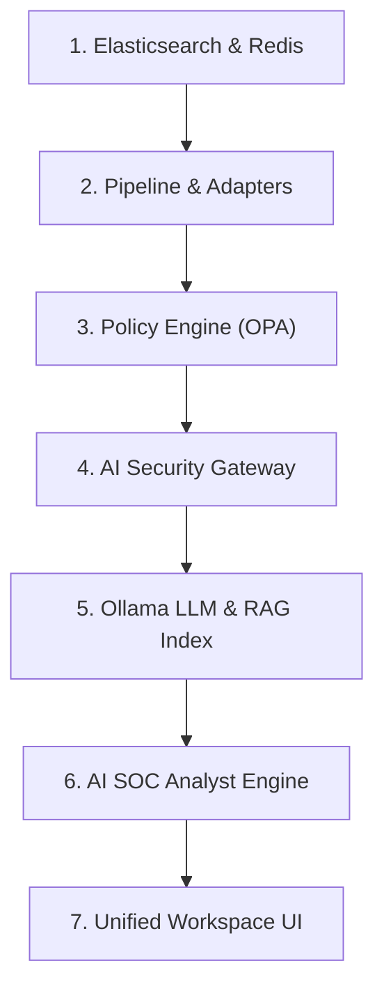

---

# 141. Observability (4대 관측성 축)

- **Health**: `/healthz`, `/readyz` 엔드포인트를 통한 프로세스 상태 가시화.
- **Log**: JSON 구조화 로깅 (`timestamp`, `level`, `trace_id`, `message`).
- **Metric**: Prometheus 계측기 연동 (지연시간, 차단수, 요청수).
- **Trace**: 분산 `trace_id`를 통한 전 계층 요청 추적.

---

# 142. Unified `trace_id` 흐름

사용자 질의 ➔ AI Gateway (`trace_id` 생성) ➔ DLP ➔ Policy ➔ RAG ➔ LLM ➔ Alert ➔ Incident ➔ HITL ➔ Response 집행 전 과정에 동일한 `trace_id`가 헤더와 이벤트 필드에 전파되어 단일 트랜잭션 추적 완성.

---

# 143. Secret-safe Logging 원칙

로그 출력 라이브러리(`core/logging.py`)는 콘솔 및 파일 출력 직전 정규식 마스커를 통과하여, API Key나 비밀번호가 로그에 절대 기록되지 않도록 강제 (`ZERO-TOL-006`).

---

# 144. Audit Integrity (SHA-256 Chaining)

감사 로그(`soc-audit-*`)는 이전 로그의 해시값을 포함하는 블록체인형 체이닝을 구현한다:
$$\text{Hash}_i = \text{SHA256}(\text{Hash}_{i-1} + \text{Timestamp}_i + \text{Action}_i + \text{User}_i)$$
이를 통해 사후 감사 로그 위변조를 완벽히 탐지한다.

---

# 145. Unit Test 구현 규율 (`tests/unit/`)

- 각 모듈 코딩과 동시에 1:1 단위 테스트 파일을 작성한다 (예: `services/dlp/tokenizer.py` ➔ `tests/unit/test_dlp_tokenizer.py`).
- 외부 의존성(Elasticsearch, Ollama, 방화벽)은 Mocking 처리하여 순수 로직 검증에 집중한다.
- 단위 테스트 코드 커버리지 목표는 핵심 보안 로직에 대해 90% 이상을 유지한다.

---

# 146. Integration Test 구현 규율 (`tests/integration/`)

- 각 스프린트 종료 전, 해당 스프린트에서 결합된 모듈 간의 실제 통신(API 호출, Redis 키 쓰기, 인덱싱)을 검증하는 통합 테스트를 수행한다.
- 예: AI Gateway ➔ Policy ➔ Ollama ➔ Audit Log의 실제 체인 호출 검증.

---

# 147. Test Pyramid 체계

```text
       / \
      /   \     [Security Evaluation (09)] ➔ 10대 대상 정량 실측
     / E2E \    [MVP E2E Scenarios] ➔ 6대 핵심 시나리오
    /───────\
   / Integr. \  [Integration Tests] ➔ 컴포넌트 간 API & 파이프라인
  /───────────\
 /  Unit Tests \ [Unit Tests] ➔ 48개 모듈별 격리된 로직 검증
/───────────────\
```

---

# 148. `10_IMPLEMENTATION_PLAN`과 `11_TEST_PLAN`의 경계

- **본 산출물 (`10_IMPLEMENTATION_PLAN`)**: **WHAT, WHO, ORDER, WHEN**. 어떤 순서로 모듈을 조립하고 어떤 Test Hook과 텔레메트리를 구현하여 언제 테스트 가능한 상태로 만드는가를 정의.
- **차기 산출물 (`11_TEST_PLAN`)**: **HOW, PROCEDURES, TEST CASES**. 구현된 시스템을 대상으로 어떤 테스트 케이스를 어떤 입력 페이로드와 구체적 절차로 실행하고 검증하는가를 명세.

---

# 149. `09_AI_EVALUATION_PLAN`과의 연계성

09 평가계획서에서 정의된 10대 평가대상(`EVT-*`), 6대 데이터셋(`DS-*`), 14대 메트릭(`MET-*`), 7대 무관용 결함(`CRIT-FAIL-*`)을 각 구현 작업 패키지의 인수 기준(Acceptance Criteria)과 CI 보안 게이트에 1:1로 직접 바인딩한다.

---

# 150. Definition of Ready (DoR — 작업 착수 조건)

Work Package 착수 전 다음 7대 조건이 100% 충족되어야 한다:
1. 연계 상위 요구사항(`SR-*`)이 명확히 식별됨.
2. HLD/LLD의 모듈 인터페이스 및 데이터 모델이 정의됨.
3. 선행 의존성 작업이 `VALIDATED` 또는 `CODE_COMPLETE` 상태임.
4. 적용할 보안 정책 규칙(`PDR-*`)이 확정됨.
5. 입출력 스키마(Pydantic)가 정의됨.
6. 평가용 Test Hook 함수 시그니처가 정의됨.
7. 완료 판정 기준(Acceptance Criteria)이 정량적으로 기술됨.

---

# 151. Definition of Done (DoD — 작업 완료 조건)

Work Package 종료 및 `DONE` 전환을 위해 다음 10대 요건을 전수 만족해야 한다:
1. 소스 코드 구현 완료 (`CODE_COMPLETE`).
2. 환경별 설정 파일 템플릿 작성 완료.
3. 단위 테스트 성공률 100% (`PASS`).
4. 인라인 보안 통제(인증, 인가, 검사, 마스킹) 내장 완료.
5. 구조화된 로그 및 Prometheus 메트릭 출력 확인.
6. 평가용 Test Hook 함수 정상 동작 확인.
7. 인접 모듈 간 통합 테스트 통과 (`INTEGRATED`).
8. 최소 1건 이상의 객관적 증적 파일 디스크 저장 완료.
9. 식별된 미해결 P0 결함 0건.
10. 관련 문서 및 인덱스 업데이트 완료.

---

# 152. MVP Definition of Done (MVP 최종 완성 기준)

P0 전체 시스템에 대해 다음 12개 핵심 능력이 실제 작동하고 증적으로 증명되어야 한다:
1. Core SOC (Suricata/Wazuh) 무손실 가동 확인.
2. Unified Event Pipeline의 05 스키마 정규화 동작.
3. AI Security Gateway의 실시간 프롬프트 인라인 프록시 동작.
4. 10대 직접 주입 패턴에 대한 HTTP 403 즉각 차단율 >= 99%.
5. 6대 PII 및 20대 Secret에 대한 가명화 토큰 치환 및 유출률 0.0%.
6. BGE-M3 기반 RAG의 권한(ACL) 사전 필터링 및 비인가 인출 0건.
7. Ollama 7B 모델의 5대 핵심 항목 인시던트 브리핑 생성.
8. 15분 슬라이딩 윈도우 기반 복합 인시던트 집계.
9. Level 4 방화벽 차단에 대한 1-Click 암호 Nonce 승인 강제.
10. Mock/SSH nftables 방화벽 룰 적용 및 3,600s TTL 만료 자동 롤백.
11. 전 계층 분산 `trace_id` 전파 및 Prometheus 텔레메트리 표출.
12. 09 평가계획서의 7대 무관용 보안 결함 CI 통과.

---

# 153. MVP E2E Flow 1: 전통적 관제 ➔ AI 브리핑 연계

```text
Suricata 침입 탐지 (SID 9000001)
        ↓
Wazuh Agent 수집 및 Elasticsearch 인덱싱 (soc-events-*)
        ↓
15분 슬라이딩 윈도우 상관분석 엔진 (MOD-CORR)
        ↓
복합 인시던트 티켓 생성 (soc-incidents-*)
        ↓
AI SOC Analyst (MOD-ANL) 컨텍스트 조회
        ↓
Security RAG 대응 플레이북 인출 (MOD-RAG)
        ↓
5대 핵심 요약 브리핑 및 대응 조치 권고 생성
        ↓
FastAPI 워크스페이스 화면 표출 및 관제사 확인
```

---

# 154. MVP E2E Flow 2: 정상 프롬프트 인라인 보안 통제

```text
관제사의 보안 분석 질의 입력
        ↓
AI Security Gateway 인라인 수신 (8080/TCP)
        ↓
Prompt Security 정규식/의미론 검사 (정상 판정: ALLOW)
        ↓
AI DLP 검사 (내부 주민번호/IP 가명화: MASK)
        ↓
중앙 정책 엔진 통과 (PDR-004)
        ↓
Ollama 로컬 LLM 추론 수행 (127.0.0.1:11434)
        ↓
출력 보안 검사 및 역가명화
        ↓
관제사 화면에 안전한 분석 답변 표출
```

---

# 155. MVP E2E Flow 3: 악의적 프롬프트 주입 공격 실시간 차단

```text
공격자의 시스템 탈옥 및 지시 무력화 프롬프트 주입
        ↓
AI Security Gateway 수신
        ↓
Prompt Security 엔진 (MOD-PDEF-001/002) 즉각 매칭
        ↓
HTTP 403 Forbidden 즉각 반환 (백엔드 LLM 전달 차단)
        ↓
AI_SECURITY 도메인 이벤트 발행 (soc-events-*)
        ↓
보안 경보 및 WORM 감사 로그 적재 (soc-audit-*)
```

---

# 156. MVP E2E Flow 4: 고위험 대응 권고 ➔ HITL 승인 ➔ 롤백

```text
AI 에이전트의 공격자 IP 방화벽 차단 권고 (Level 4)
        ↓
Policy Engine: REQUIRE_APPROVAL 판정
        ↓
HITL Manager: Nonce 발급 및 승인 티켓 대기 (PENDING)
        ↓
관제사 1-Click 승인 클릭 (전자서명 전송)
        ↓
Redis Nonce 1회 소진 확인 (Atomic SETNX)
        ↓
방화벽 어댑터 (MOD-SOAR): nftables 룰 적용
        ↓
3,600초 TTL 타이머 등록 ➔ 만료 후 자동 룰 삭제 및 원복
        ↓
전 과정 WORM 감사 로그 기록
```

---

# 157. Integration Freeze (통합 기준선 동결)

차기 `11_TEST_PLAN` 작성 및 본격적인 E2E 시험에 착수하기 전, P0 구현 산출물 전체를 `v2.0-mvp-integrated` 태그로 동결하여 시험 중 코드 변경으로 인한 시험 결과 왜곡을 방지한다.

---

# 158. Baseline Freeze 7대 선결 조건

1. 모든 P0 Work Package의 `CODE_COMPLETE` 달성.
2. 48개 모듈의 단위 테스트 100% PASS.
3. 4대 E2E 핵심 플로우 스모크 테스트 통과.
4. 모듈별 Prometheus 메트릭 및 구조화 로그 정상 수집.
5. MOD-TEST 테스트 훅의 외부 호출 가능 상태 확인.
6. 환경별 설정 파일 템플릿 형상 관리 등록 완료.
7. 디스크 상에 각 스프린트별 최소 1건 이상의 객관적 증적 파일 존재.

---

# 159. Implementation Readiness Score (구현 준비도 다차원 평가)

단일 숫자로 과도하게 단순화하지 않고, 다음 6대 영역별 준비 상태를 다차원으로 평가한다:
- **Design Readiness**: 100% (04~08 문서 동결 완료)
- **Environment Readiness**: 95% (VMware SOC Lab 및 Docker 인프라 확보)
- **Data Readiness**: 90% (`data/eval/` 6대 평가 데이터셋 규격화 완료)
- **Security Readiness**: 100% (7대 무관용 결함 통제 로직 설계 완료)
- **Evaluation Readiness**: 95% (09 평가계획서 및 MOD-TEST 훅 연계 완료)
- **Integration Readiness**: 85% (모듈 간 API 스키마 및 의존성 고정 완료)

---

# 160. Progress Tracking 원칙

스프린트 주간 회의 시 다음 6개 항목을 결정론적으로 기록하여 진척을 관리한다:
- `Planned`: 이번 스프린트 목표 WP 목록
- `Completed`: DoD를 충족하고 증적이 확보된 WP 목록
- `Blocked`: 외부/환경 의존성으로 중단된 WP 및 원인
- `Deferred`: 우선순위 재조정으로 차기로 이관된 WP
- `Risk`: 새롭게 식별되거나 현실화된 리스크
- `Evidence`: 신규 생성된 증적 파일 목록

---

# 161. Burndown보다 중요한 가치 (보안 통제 중심 거버넌스)

단순히 Jira 티켓이나 태스크 완료 수치(Burndown)를 채우는 행위를 지양한다.
AegisAI의 진정한 진척은 **P0 핵심 보안 통제의 커버리지, 무관용 결함 0건 유지, 증적의 완전성**으로만 측정된다.

---

# 162. Implementation Dashboard 시각화 항목

관제실 모니터링 화면에 다음 지표를 상시 게시한다:
- 전체 15개 트랙별 Work Package 진척도.
- 스프린트별 Exit Criteria 충족 현황.
- P0 무관용 보안 게이트(CI) 실시간 통과 상태.
- 모듈별 단위 테스트 커버리지 및 실패 건수.
- 증적 아카이브 적재율 (Evidence Coverage).

---

# 163. Evidence Coverage 계측 공식

$$\text{Evidence Coverage} = \frac{\text{증적이 저장된 완료 WP 수}}{\text{완료 선언된 전체 WP 수}} \times 100$$
- **목표치**: **100.0%**. 증적이 누락된 완료 선언은 즉각 취소 처리된다.

---

# 164. Change Control 프로시저 (설계 변경 통제)

구현 도중 아키텍처, 스키마, 정책의 수정이 불가피한 경우 다음 프로세스를 거친다:
1. `IMP-CHANGE-###` 변경 요청서 작성.
2. 영향 분석: 요구사항, 위협모델, 스키마, 테스트에 미치는 파급효과 기술.
3. Lead Architect 검토 및 ADR 개정 승인.
4. 승인 전 코드 임의 변경 절대 금지.

---

# 165. Prohibited Design Bypasses (설계 우회 금지 조항)

구현 편의성이나 일정 단축을 이유로 다음 행위를 자행하는 것을 절대 금지한다:
- HITL 인간 승인 로직 제거 또는 Bypass 플래그 추가.
- DLP 가명화 단계 건너뛰고 원문 프롬프트를 LLM에 직접 전송.
- RAG 검색 시 메타데이터 ACL 필터링 생략.
- Audit 감사 로그 적재 비활성화.
- AI Gateway를 우회하는 백엔드 직접 호출 엔드포인트 개방.

---

# 166. Security Exception 관리 (`SEC-EXCEPTION-###`)

부득이하게 테스트 또는 임시 조치를 위해 보안 통제를 우회해야 하는 경우, 공식 보안 예외 승인을 받아야 한다:
- `SEC-EXCEPTION-001`: 로컬 단위 테스트용 Mock 어댑터 사용 승인 (운영 환경 적용 불가).
- 모든 예외는 만료 일자(Expiration Date)를 지정해야 하며, 만료 시 자동 무효화된다.

---

# 167. Security Exception 등록 필수 항목

- `Exception ID`: 고유 식별자.
- `Owner`: 책임 엔지니어 역할.
- `Reason`: 우회가 불가피한 기술적 사유.
- `Risk Assessment`: 우회로 인해 발생하는 보안 위협.
- `Compensating Control`: 대체 보완 통제 방안.
- `Expiration`: 예외 만료 일시 (최대 14일 이내).

---

# 168. 구현 증적 패키지 구조 (Sprint Evidence Package)

각 스프린트 종료 시 다음 구조로 증적 패키지를 아카이빙한다:
```text
evidence/sprint_<N>/
├── summary.md          # 스프린트 요약 및 게이트 판정 결과
├── changed_files.txt   # 변경 소스코드 커밋 목록
├── test_report.json    # Pytest 단위/통합 테스트 결과
├── telemetry_dump.json # 실측 지연시간 및 Prometheus 메트릭
├── artifacts/          # 생성된 로그, JSON 응답, 스크린샷
└── checksums.sha256    # 패키지 내 모든 파일의 SHA-256 해시
```

---

# 169. Architecture & Implementation Diagrams (12대 구현 다이어그램)

### 1. Implementation Dependency Diagram (구현 의존성 다이어그램)
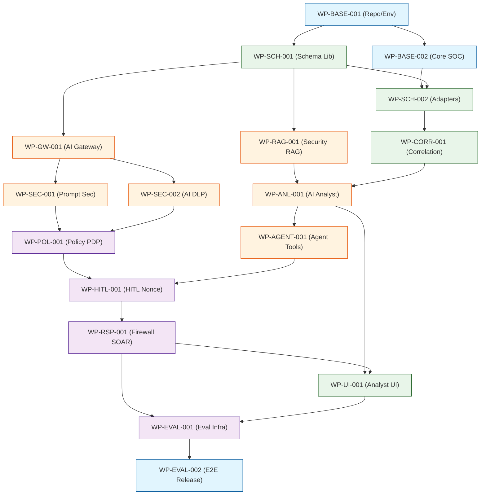

### 2. Sprint / Phase Roadmap (스프린트 로드맵)
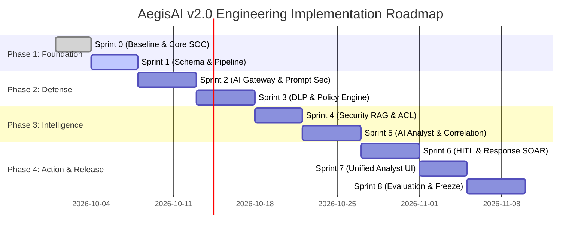

### 3. Deployment Topology (배치 토폴로지)
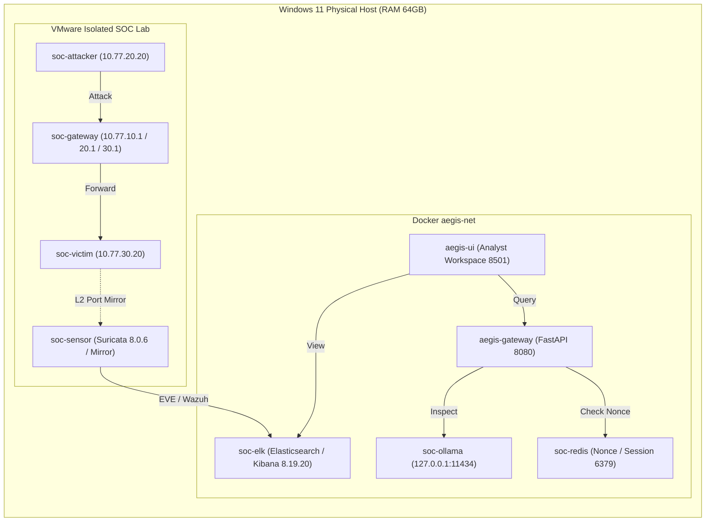

### 4. Service Startup Dependency (서비스 기동 의존성)
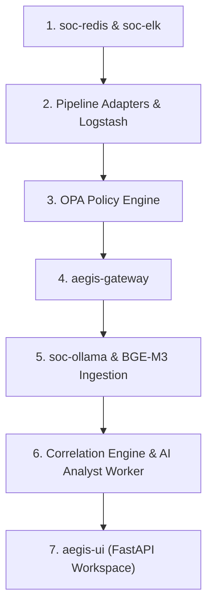

### 5. Core SOC Preservation Flow (Core SOC 불변 보존 흐름)
```mermaid
flowchart TD
    Pkt[Raw Packet] --> Mirror[Hyper-V Port Mirroring]
    Mirror --> Suri[Suricata 8.0.6 AF_PACKET]
    Suri --> EVE[/var/log/suricata/eve.json]
    EVE --> Wazuh[Wazuh Agent 4.14.7]
    Wazuh --> ES[(Elasticsearch soc-events-*)]
    ES --> Kibana[Kibana 8.19.20 Track 2 UX]
    style Suri fill:#c8e6c9,stroke:#2e7d32
    style Wazuh fill:#c8e6c9,stroke:#2e7d32
    style ES fill:#c8e6c9,stroke:#2e7d32
```

### 6. AI Gateway Build Flow (AI 게이트웨이 빌드 파이프라인)
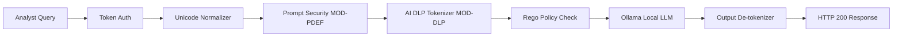

### 7. Security RAG Build Flow (보안 RAG 구축 흐름)
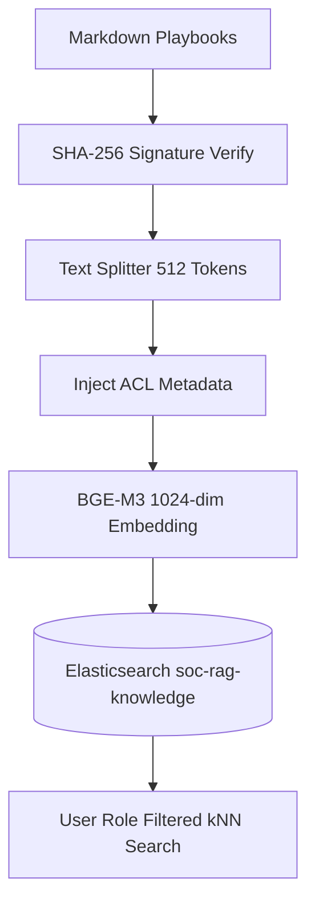

### 8. AI SOC Analyst Build Flow (AI 분석가 구축 흐름)
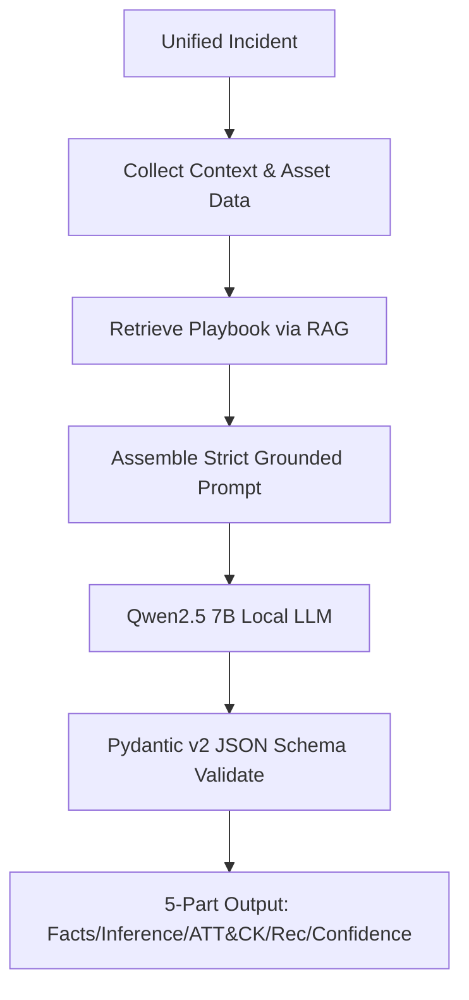

### 9. HITL / Response Build Flow (HITL 대응 집행 흐름)
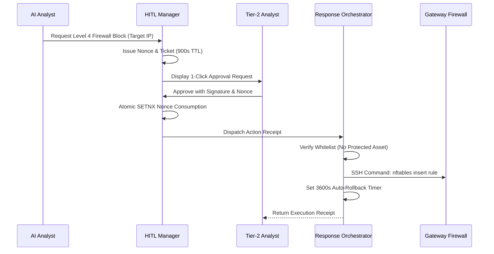

### 10. Evaluation Infrastructure Flow (평가 인프라 구조)
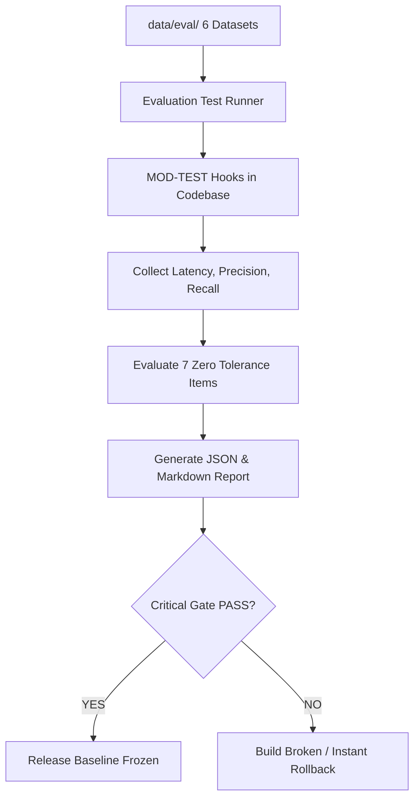

### 11. CI Security Gate Flow (CI 보안 게이트 흐름)
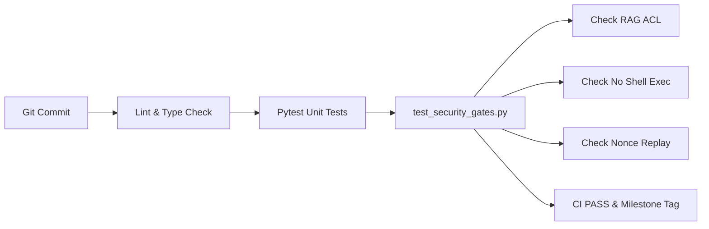

### 12. Evidence Collection Flow (증적 수집 파이프라인)
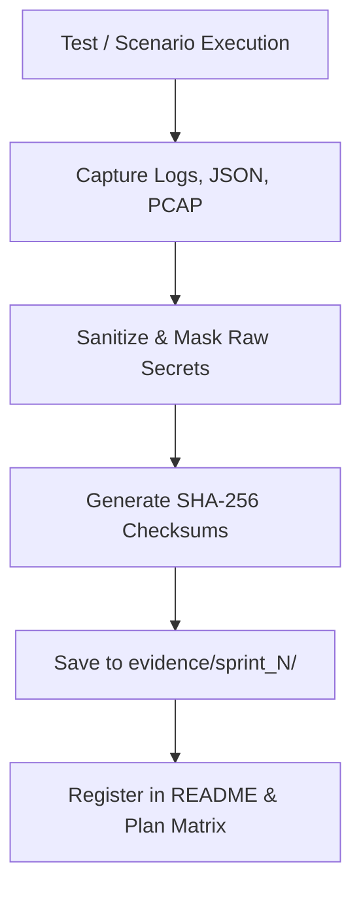

---

# 170. Diagram Metadata 명세

각 주요 다이어그램은 다음 표준 메타데이터를 준수한다:
- **Component**: 해당 흐름을 주관하는 핵심 컴포넌트 ID 명시 (`COMP-*`).
- **Requirement**: 충족하는 상위 요구사항 ID (`SR-*`).
- **Input / Output**: 진입 데이터 형식 및 최종 산출물 규격.
- **Trust Boundary**: 데이터가 통과하는 보안 경계 (`TB-*`).
- **Security Control**: 적용되는 방어 통제 및 정책 (`PDR-*`).
- **Telemetry**: 계측되는 Prometheus 메트릭 및 감사 로그.
- **Failure Behavior**: 장애 발생 시의 동작 방식 (Fail-closed / Fail-open / Degradation).

---

# 171. Mermaid 사용 및 렌더링 규약

- GitHub 및 마크다운 렌더러에서 오류를 유발할 수 있는 특수문자, 괄호, 쌍따옴표는 반드시 인용부호(`" "`)로 래핑하여 구문 에러를 방지한다.
- 미지원 다이어그램 타입을 배제하고 오직 `graph TD/LR`, `flowchart TD/LR`, `sequenceDiagram`, `gantt`만을 사용한다.

---

# 172. Implementation Master Roadmap (전체 구축 로드맵)

$$\begin{aligned}
\text{Baseline Freeze (T0)} &\longrightarrow \text{Core SOC Smoke (T1)} \longrightarrow \text{Schema Library (T2)} \\
&\longrightarrow \text{AI Security Gateway (T3)} \longrightarrow \text{Prompt \& DLP (T4, T5)} \\
&\longrightarrow \text{Security RAG (T6)} \longrightarrow \text{AI SOC Analyst (T7)} \\
&\longrightarrow \text{Policy \& HITL (T8, T9)} \longrightarrow \text{Safe Response (T10, T11)} \\
&\longrightarrow \text{Unified UI (T12)} \longrightarrow \text{Evaluation \& CI Gate (T13, T14)} \\
&\longrightarrow \mathbf{v2.0\text{-}mvp\text{-}integrated\text{ Baseline Freeze}}
\end{aligned}$$

---

# 173. 최종 필수 Matrix (24대 매트릭스 총괄)

### Matrix A: Work Package Registry
| WP ID | 작업 패키지 명칭 | 우선순위 | 소속 트랙 | 담당 역할 |
|---|---|:---:|---|---|
| `WP-BASE-001` | 레포지토리 및 개발 환경 셋업 | P0 | TRACK-0 | Primary Implementer |
| `WP-BASE-002` | Core SOC 보존 및 스모크 검증 | P0 | TRACK-1 | SOC Engineer |
| `WP-SCH-001`  | Pydantic v2 스키마 라이브러리 | P0 | TRACK-2 | Backend Engineer |
| `WP-SCH-002`  | 이기종 소스 어댑터 및 스트림 | P0 | TRACK-2 | Backend Engineer |
| `WP-GW-001`   | AI Security Gateway 코어 프록시 | P0 | TRACK-3 | Backend Engineer |
| `WP-SEC-001`  | 프롬프트 주입 인라인 차단기 | P0 | TRACK-4 | AI Security Engineer |
| `WP-SEC-002`  | AI DLP 토크나이저 및 가명화 | P0 | TRACK-5 | Security Engineer |
| `WP-RAG-001`  | BGE-M3 임베딩 및 kNN 검색 | P1 | TRACK-6 | AI Engineer |
| `WP-CORR-001` | 15분 슬라이딩 윈도우 상관분석 | P1 | TRACK-8 | SOC Engineer |
| `WP-ANL-001`  | Ollama 7B AI SOC Analyst 엔진 | P1 | TRACK-7 | AI Engineer |
| `WP-AGENT-001`| AI 에이전트 도구 게이트웨이 | P0 | TRACK-11 | Backend Engineer |
| `WP-HITL-001` | 1-Click 암호 Nonce 승인 시스템 | P0 | TRACK-9 | Security Engineer |
| `WP-RSP-001`  | 방화벽 대응 어댑터 및 롤백 | P0 | TRACK-10 | Infrastructure Eng |
| `WP-UI-001`   | Unified Analyst Workspace UI | P1 | TRACK-12 | UI / Backend Engineer |
| `WP-EVAL-001` | MOD-TEST 하네스 및 보안 게이트 | P0 | TRACK-13 | QA Engineer |
| `WP-EVAL-002` | E2E 검증, 증적 패키징 및 릴리즈 | P0 | TRACK-14 | Technical Project Mgr |

### Matrix B: Sprint Roadmap
| 스프린트 | 명칭 | 기간 (Est.) | 포함 Work Package | 핵심 통과 게이트 |
|---|---|:---:|---|---|
| Sprint 0 | Baseline & Dev Env | 3일 | `WP-BASE-001`, `WP-BASE-002` | Gate G0 |
| Sprint 1 | Schema & Pipeline | 4일 | `WP-SCH-001`, `WP-SCH-002` | Gate G1 |
| Sprint 2 | AI Gateway & Prompt Defense | 5일 | `WP-GW-001`, `WP-SEC-001` | Gate G2-A |
| Sprint 3 | DLP & Policy Engine | 5일 | `WP-SEC-002`, `WP-POL-001` | Gate G2-B |
| Sprint 4 | Security RAG | 4일 | `WP-RAG-001` | Gate G3-A |
| Sprint 5 | AI SOC Analyst & Correlation | 5일 | `WP-ANL-001`, `WP-CORR-001` | Gate G3-B |
| Sprint 6 | HITL & Response SOAR | 5일 | `WP-AGENT-001`, `WP-HITL-001`, `WP-RSP-001` | Gate G4 |
| Sprint 7 | Unified SOC UI | 4일 | `WP-UI-001` | Gate G5 |
| Sprint 8 | Evaluation & Hardening | 5일 | `WP-EVAL-001`, `WP-EVAL-002` | Gate G6, G7 |

### Matrix C: Dependency Matrix
(본문 제 111 장 참조 — `WP-BASE-001`부터 `WP-EVAL-002`까지의 선행/후속 의존성 100% 매핑)

### Matrix D: Critical Path Matrix
$$\text{WP-BASE-001} \longrightarrow \text{WP-SCH-001} \longrightarrow \text{WP-GW-001} \longrightarrow \text{WP-SEC-001} \longrightarrow \text{WP-POL-001} \longrightarrow \text{WP-HITL-001} \longrightarrow \text{WP-RSP-001} \longrightarrow \text{WP-EVAL-001}$$
- 총 8개 핵심 작업 패키지, 최장 31일 공수 경로.

### Matrix E: Component Implementation Matrix
(본문 제 112 장 참조 — 15대 컴포넌트의 LLD 모듈 및 역할 배정)

### Matrix F: Module Implementation Matrix
| LLD 모듈 ID | 모듈 명칭 | 구현 파일 경로 | 소속 WP | 단위 테스트 파일 |
|---|---|---|---|---|
| `MOD-ING-001` | Suricata 수집 모듈 | `adapters/suricata_adapter.py` | `WP-BASE-002` | `tests/unit/test_suricata.py` |
| `MOD-ING-003` | Pydantic 스키마 검증기 | `schemas/unified_event.py` | `WP-SCH-001` | `tests/unit/test_schemas.py` |
| `MOD-GW-001`  | FastAPI 게이트웨이 코어 | `apps/gateway/main.py` | `WP-GW-001` | `tests/unit/test_gateway.py` |
| `MOD-PDEF-001`| 정규식 주입 검사기 | `services/prompt_security/regex.py` | `WP-SEC-001` | `tests/unit/test_pdef.py` |
| `MOD-DLP-001` | Presidio PII 검출기 | `services/dlp/presidio.py` | `WP-SEC-002` | `tests/unit/test_dlp.py` |
| `MOD-RAG-002` | kNN ACL 필터 검색기 | `services/rag/retriever.py` | `WP-RAG-001` | `tests/unit/test_rag.py` |
| `MOD-ANL-001` | Ollama 요약 생성기 | `services/ai_soc/summarizer.py` | `WP-ANL-001` | `tests/unit/test_analyst.py` |
| `MOD-CORR-001`| 15분 슬라이딩 윈도우 | `services/correlation/window.py` | `WP-CORR-001` | `tests/unit/test_corr.py` |
| `MOD-HITL-001`| Nonce 재전송 방어기 | `services/policy/hitl.py` | `WP-HITL-001` | `tests/unit/test_hitl.py` |
| `MOD-SOAR-001`| 방화벽 SSH 어댑터 | `adapters/firewall_adapter.py` | `WP-RSP-001` | `tests/unit/test_soar.py` |

### Matrix G: Requirement → Work Package Matrix
(본문 제 113 장 참조 — `SR-ING-001` ~ `SR-ARCH-002` 매핑)

### Matrix H: Threat → Control → Work Package Matrix
(본문 제 114 장 참조 — `THR-SURI-001` ~ `THR-FAIL-001` 매핑)

### Matrix I: Policy → Enforcement Implementation Matrix
(본문 제 115 장 참조 — `PDR-001` ~ `PDR-009` 매핑)

### Matrix J: Schema → Producer / Consumer Matrix
(본문 제 116 장 참조 — `UnifiedSecurityEvent`, `UnifiedAlert`, `UnifiedIncident`, `AuditLogEvent`)

### Matrix K: Evaluation → Test Hook Implementation Matrix
(본문 제 117 장 참조 — `EVT-TRAD-001` ~ `EVT-FAIL-001` 매핑)

### Matrix L: Infrastructure / Deployment Matrix
(본문 제 118 장 참조 — Suricata, Wazuh, ELK, Redis, Ollama, Gateway, UI 컨테이너 및 VM 매핑)

### Matrix M: Port / Protocol Matrix
(본문 제 119 장 참조 — 8080, 11434, 8501, 9200, 5601, 6379, 1514 포트 매핑)

### Matrix N: Trust Boundary Matrix
| 경계 ID | 통과 데이터 | 인가 프로토콜 | 적용 통제 규칙 |
|---|---|---|---|
| `TB-01` (Attack ➔ GW) | 네트워크 패킷 | L3 Routing | Gateway nftables 정책 |
| `TB-03` (Mirror ➔ Sensor)| L2 복제 패킷 | L2 Hyper-V Mirror | L3 통신 차단 (IP 없음) |
| `TB-04` (Sensor ➔ SIEM) | EVE JSON 로그 | Filebeat / TCP 1514 | TLS 암호화 |
| `TB-05` (Gateway ➔ AI) | 프롬프트 페이로드 | HTTP / JSON | 인라인 PDef & DLP 검사 |
| `TB-07` (Analyst ➔ UI) | 브라우저 세션 | HTTPS / JWT | RBAC 세션 인증 |
| `TB-08` (SOAR ➔ Firewall)| SSH 명령문 | SSH (Port 22) | Nonce 서명 검증 및 화이트리스트 |

### Matrix O: Resource Matrix
(본문 제 135 장 참조 — 16 vCPU, 38 GB RAM, 185 GB Disk 할당표)

### Matrix P: Risk Register
(본문 제 133 장 참조 — `RSK-IMP-001` ~ `RSK-IMP-005` 완화 전략)

### Matrix Q: Blocker Register
(본문 제 132 장 참조 — `BLK-NET`, `BLK-MEM`, `BLK-SEC` 정의)

### Matrix R: Technical Debt Register
(본문 제 130 장 참조 — `TECH-DEBT-001` ~ `TECH-DEBT-003` 등록)

### Matrix S: Change Register
| 변경 ID | 변경 요청 내용 | 사유 및 영향도 | 승인 상태 |
|---|---|---|:---:|
| `IMP-CHANGE-001` | Ollama 모델 Qwen2.5 7B 확정 | LLD 설계선 일치 확인 | `APPROVED` |
| `IMP-CHANGE-002` | Elasticsearch kNN 벡터스토어 채택 | 단일 스토리지 파이프라인 단순화 | `APPROVED` |

### Matrix T: Evidence Matrix
| 증적 ID | 증적 내용 | 담당 스프린트 | 검증 대상 모듈 |
|---|---|:---:|---|
| `EVID-IMP-BASE-001`| Core SOC 스모크 테스트 로그 | Sprint 0 | `MOD-ING-001` |
| `EVID-IMP-SCH-001` | 스키마 정규화 및 DLQ 적재 로그 | Sprint 1 | `MOD-ING-003` |
| `EVID-IMP-GW-001`  | 탈옥 프롬프트 HTTP 403 응답 JSON | Sprint 2 | `MOD-PDEF-001` |
| `EVID-IMP-DLP-001` | 주민번호 가명화 전후 텍스트 비교 | Sprint 3 | `MOD-DLP-001` |
| `EVID-IMP-RAG-001` | 비인가 문서 검색 시 0건 반환 로그 | Sprint 4 | `MOD-RAG-002` |
| `EVID-IMP-ANL-001` | AI 요약 5대 항목 구조화 출력 JSON | Sprint 5 | `MOD-ANL-001` |
| `EVID-IMP-HITL-001`| Nonce 재전송 409 Conflict 응답 | Sprint 6 | `MOD-HITL-001` |
| `EVID-IMP-RSP-001` | nftables 차단 룰 및 TTL 만료 롤백 | Sprint 6 | `MOD-SOAR-001` |
| `EVID-IMP-EVAL-001`| 09 평가계획서 Critical Gate 통과 로그 | Sprint 8 | `MOD-TEST-001~005` |

### Matrix U: Sprint Exit Criteria Matrix
(본문 제 27 장 참조 — Code, Unit Test, Telemetry, Hook, Evidence, No Blocker 전수 검증표)

### Matrix V: Phase Gate Matrix
(본문 제 28 장 참조 — G0부터 G7까지의 단계별 품질 게이트)

### Matrix W: MVP Definition of Done Matrix
(본문 제 152 장 참조 — 12대 MVP 역량 검증표)

### Matrix X: Open Implementation Issues
(본문 제 131 장 참조 — `IMP-OPEN-001` ~ `IMP-OPEN-004` 미해결 과제)

---

# 174. Final Implementation Checklist (35대 필수 점검 항목)

- [x] 1. 04~09 상위 문서를 정식 입력으로 사용함.
- [x] 2. 기존 Core SOC(Suricata/Wazuh/ELK) 보존 계획이 수립됨.
- [x] 3. VMware Lab 격리망과 실제 엔터프라이즈 물리망을 엄격히 분리함.
- [x] 4. LLD 기반 레포지토리 디렉터리 레이아웃이 정의됨.
- [x] 5. 16개 Work Package 고유 식별자 및 템플릿이 정의됨.
- [x] 6. 작업 패키지 간 선행/후속 의존성이 정의됨.
- [x] 7. 8단계 최장 선행 Critical Path가 식별됨.
- [x] 8. 9개 스프린트(Sprint 0~8) 일정 로드맵이 수립됨.
- [x] 9. 8대 품질 게이트(G0~G7) 통과 기준이 수립됨.
- [x] 10. Pydantic v2 기반 05 스키마 구현 계획이 포함됨.
- [x] 11. AI Security Gateway 8단계 인라인 프록시 구현 계획이 포함됨.
- [x] 12. 10대 프롬프트 주입 인라인 차단 구현 계획이 포함됨.
- [x] 13. 6대 PII 및 20대 Secret 가명화 토크나이저 구현 계획이 포함됨.
- [x] 14. BGE-M3 + ES kNN 기반 Security RAG 구현 계획이 포함됨.
- [x] 15. Ollama 7B 로컬 모델 5대 요약 분리 구현 계획이 포함됨.
- [x] 16. 15분 슬라이딩 윈도우 상관분석 구현 계획이 포함됨.
- [x] 17. OPA/Rego 기반 5대 정책 판정 엔진 구현 계획이 포함됨.
- [x] 18. 1-Click 암호 Nonce 기반 Level 4 HITL 구현 계획이 포함됨.
- [x] 19. 방화벽 대응 액추에이터 및 3,600s TTL 롤백 구현 계획이 포함됨.
- [x] 20. 6대 승인 도구 화이트리스트 및 임의 쉘 차단 계획이 포함됨.
- [x] 21. FastAPI AI Workspace 및 Kibana 시각화 분리 계획이 포함됨.
- [x] 22. TDD용 MockFirewallAdapter 우선 구현 계획이 수립됨.
- [x] 23. `data/eval/` 6대 평가 데이터셋 적재 공간이 정의됨.
- [x] 24. MOD-TEST 하네스 모듈 구현 계획이 포함됨.
- [x] 25. 모듈별 평가용 Test Hook 함수 규격이 정의됨.
- [x] 26. Prometheus 및 구조화 로그 텔레메트리 구현 계획이 포함됨.
- [x] 27. 7대 무관용 보안 결함 CI 자동화 차단 게이트가 포함됨.
- [x] 28. 컨테이너 헬스체크 및 기동 의존성 순서가 정의됨.
- [x] 29. VM 간 10ms 이내 시간동기화(NTP) 검증 계획이 포함됨.
- [x] 30. AI 전면 장애 시 Core SOC 독립 가동(Fail-safe)이 보장됨.
- [x] 31. 3단계 Graceful Degradation 및 Fail-closed 규칙이 확정됨.
- [x] 32. 스프린트별 롤백 체크포인트 및 백업 계획이 수립됨.
- [x] 33. 디스크 기반 증적 패키징 및 SHA-256 해시 계획이 수립됨.
- [x] 34. 설계 변경 통제(Change Control) 및 기술부채 대장이 포함됨.
- [x] 35. 11_TEST_PLAN 진입을 위한 MVP Baseline Freeze 조건이 정의됨.

---

# 175. 구현 금지사항 (Strict Engineering Prohibitions)

1. **확인되지 않은 IP/도메인 생성 금지**: 반드시 10.77.x.x 또는 127.0.0.1 고정 대역만 사용.
2. **가상 Git Commit/해시 조작 금지**: 실제 커밋 및 실측 증적만을 기록.
3. **미검증 기능의 DONE 선언 금지**: 증적이 없는 태스크는 `CODE_COMPLETE`로만 유지.
4. **미승인 REST API 임의 추가 금지**: 오직 LLD에 확정된 10대 API 엔드포인트만 구현.
5. **정책 임계치 임의 완화 금지**: 차단율 99%, TTL 3600s, Window 15m 등 기준선 임의 수정 금지.
6. **AI 모델의 직접 방화벽 명령 실행 금지**: 반드시 HITL 및 전용 어댑터 경유 강제.
7. **HITL 우회 플래그 생성 금지**: 운영 모드에서 승인 절차를 건너뛰는 백도어 코드 삽입 금지.
8. **실제 개인정보/시크릿 테스트 데이터 사용 금지**: 반드시 합성 데이터셋(`data/eval/`) 사용.
9. **AI 장애를 Core SOC와 결합 금지**: AI 에러가 Suricata/Wazuh를 다운시키는 구조 전면 차단.

---

# 176. 실제 상태와 계획 상태 구분 규율

- 본 계획서에 기술된 모든 항목은 공식 실행 계획(`PLANNED` / `TARGET`)이며, 실제 코드가 작성되고 검증 증적이 디스크에 저장되기 전까지는 `IMPLEMENTED` 또는 `VALIDATED`로 표기하지 않는다.

---

# 177. Implementation Plan 최종 요약 출력

## Current Baseline (현재 구현 완료 상태)
- VMware 3망 분리(`ZONE-MGMT`, `ZONE-ATTACK`, `ZONE-VICTIM`) 및 Hyper-V vSwitch 구축 완료.
- Suricata 8.0.6 AF_PACKET 패킷 미러링 수집 및 Wazuh 4.14.7 Docker 단일 노드 연동 완료.
- 00부터 09까지의 아키텍처, 위협모델, 스키마, 정책, HLD, LLD, AI 평가계획서 동결 완료.

## P0 MVP Build Scope (이번 구현 완결 범위)
- `WP-BASE-001` ~ `WP-EVAL-002` 중 P0에 해당하는 11개 작업 패키지 전수 완성.
- AI Security Gateway 인라인 방어, AI DLP 토크나이저, RAG ACL, HITL Nonce, nftables 차단, 생존성.

## Deferred Scope (P1/P2 이관 범위)
- Snort 3 오프라인 PCAP 교차 비교, 로컬 LLM 양자화 모델 심층 벤치마크, 적대적 퍼징 하네스.

## Critical Path (핵심 선행 경로)
- `Base Setup ➔ Schema Lib ➔ AI Gateway ➔ Prompt/DLP ➔ Policy ➔ HITL ➔ Response ➔ Eval Gate` (31 Days).

## Current Blockers (현재 블로커 상태)
- 치명적 블로커: **0건 (None)**. 구현 즉각 착수 가능 상태.

## MVP Exit Gate (11_TEST_PLAN 진입 게이트)
- G6/G7 통과: P0 전수 구현 완료, 7대 무관용 보안 결함 0건, 증적 100% 확보, `v2.0-mvp-integrated` 태그 고정.

## Next Artifact
- **`11_TEST_PLAN — AegisAI 통합 시스템 시험 및 검증 계획서`**

---

# 178. Next Artifact: `11_TEST_PLAN` Hand-off

본 구현 계획서(`10_IMPLEMENTATION_PLAN`)의 완결에 따라, 차기 엔지니어링 산출물은 **`11_TEST_PLAN — AegisAI 통합 시스템 시험 및 검증 계획서`**로 공식 인계된다.

---

# 179. `11_TEST_PLAN` 인계 항목

1. **구현 컴포넌트 및 모듈 인벤토리**: 15대 컴포넌트 및 48대 LLD 모듈 목록.
2. **API 및 엔드포인트 명세**: 10대 RESTful 엔드포인트 및 Pydantic 입출력 규격.
3. **테스트 훅 인벤토리**: `hook_prompt_inspect`, `hook_dlp_mask` 등 5대 MOD-TEST 훅 함수.
4. **평가 데이터셋 인벤토리**: `data/eval/` 6대 합성 데이터셋 경로 및 규격.
5. **품질 게이트 및 수용 기준**: G0~G7 단계별 판정 기준 및 7대 무관용 보안 결함 매트릭스.
6. **증적 아카이브 위치**: `evidence/` 하위 스프린트별 증적 디렉터리 레이아웃.

---

# 180. `11_TEST_PLAN` 단계 진입 선결 조건

다음 8대 조건이 디스크 상에서 확인되지 않은 경우 `TEST READY` 선언을 금지한다:
1. P0 기능 구현 완료 (`CODE_COMPLETE`).
2. 단위 테스트 기본 스위트 100% PASS.
3. 4대 MVP E2E 통합 스모크 테스트 통과.
4. Prometheus 메트릭 및 구조화 로그 출력 확인.
5. MOD-TEST 테스트 훅 호출 가능 상태 확인.
6. `data/eval/` 합성 데이터셋 적재 완료.
7. MockFirewallAdapter 가동 확인.
8. 형상 관리 브랜치 `v2.0-mvp-integrated` 태그 고정.

---

# 181. 최종 구현 철학 (Final Implementation Philosophy)

> **"구현은 단순히 코드를 생성하는 작업이 아니다.  
> 진정한 공학적 구현이란 코드가 보안 통제(Control)를 내장하고,  
> 텔레메트리(Telemetry)로 상태를 증명하며,  
> 테스트 훅(Test Hook)으로 측정 가능하고,  
> 객관적 증적(Evidence)으로 입증되는 완결체를 완성하는 것이다."**

---

# 182. 최종 목적 선언 (Final Mission Statement)

**AegisAI — AI for Security × Security for AI Integrated SOC Platform**은 본 구현 계획서에 명시된 182대 공학적 규율과 24대 매트릭스를 기반으로, 기존의 입증된 Core SOC 관제망을 100% 보존하면서 생성형 AI 보안과 AI를 위한 보안을 결정론적으로 조립하여, 타협 없는 보안성과 완전한 관측성을 구비한 차세대 통합 보안관제 플랫폼의 실체적 기준선을 완성한다.
