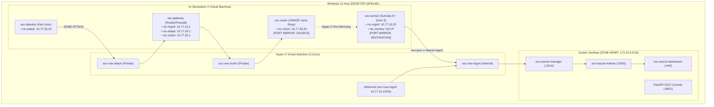

# 🛡️ Phase 32: Hyper-V Segmented SOC Lab Provisioning & Live Sensor Integration Guide

> **문서 버전**: v1.0  
> **기준 일자**: 2026-08-26  
> **프로젝트 명**: SOC Detection & Monitoring Lab  
> **증적 레코드**: [`evidence/EV-HYPERV-001/metadata.md`](../../evidence/EV-HYPERV-001/metadata.md)  
> **품질 게이트**: `GATE-HYPERV-01 = BLOCKED (Elevation & Subnet Conflict Action Required)`  

---

## 1. 🏗️ 시스템 토폴로지 및 망분리 구조



---

## 2. 📊 호스트 사전 점검 및 리소스 분석

| 점검 항목 | 기준 요구사항 | 실제 호스트 상태 (Fact) | 판정 |
|---|---|---|---|
| **OS / Hyper-V** | Windows 11 Pro/Edu (Build 26100), `vmms` 실행 | Win 11 Education (26100), `vmms` **Running** | **PASS** |
| **CPU 코어** | 최소 4 vCPU 이상 | 4 Cores (8 Logical Processors) | **PASS** |
| **메모리(RAM)** | 4대 VM 합산 17 GB 이상 | **Total 63.84 GB** (Free: 23.90 GB) | **PASS** |
| **저장 공간** | 4개 VHDX 합산 166 GB 이상 | **1,236.07 GB Free** on `C:\` | **PASS** |
| **OS 설치 ISO** | Ubuntu 22.04 LTS & Kali 2026.2 | `C:\SOC-Lab\iso\` 내 2종 파일 **존재 (True)** | **PASS** |
| **권한 모드** | Hyper-V WMI 관리를 위한 관리자 권한 | 현재 CLI 세션: **Standard User (False)** | **ACTION REQUIRED** |
| **네트워크 충돌** | `10.77.10/20/30.0/24` 대역 중복 없음 | `VMware VMnet10` 어댑터가 `10.77.10.1/24` 점유 중 | **ACTION REQUIRED** |

---

## 3. 🚀 Phase 32 실제 프로비저닝 실행 절차 (3단계)

### [1단계] VMware `VMnet10` 서브넷 충돌 해소 (관리자 PowerShell)
호스트의 `VMware Network Adapter VMnet10`이 `10.77.10.1/24`를 사용하고 있으므로, 충돌 방지를 위해 임시 비활성화합니다:
```powershell
# 관리자 PowerShell에서 실행
Disable-NetAdapter -Name "VMware Network Adapter VMnet10" -Confirm:$false
```

### [2단계] 원클릭 관리자 권한 프로비저닝 실행
프로젝트 루트의 [`deploy_hyperv_admin.bat`](../../deploy_hyperv_admin.bat)을 마우스 우클릭하여 **'관리자 권한으로 실행'** 하거나 관리자 CMD/PowerShell에서 실행합니다:

```cmd
:: 관리자 권한 명령 프롬프트(CMD)
deploy_hyperv_admin.bat
```
또는 관리자 PowerShell:
```powershell
powershell.exe -ExecutionPolicy Bypass -File .\infrastructure\hyper-v\deploy_all.ps1 -StartVMs
```

**수행 작업**:
1. 3개 가상 스위치(`soc-vsw-mgmt`, `soc-vsw-attack`, `soc-vsw-victim`) 생성
2. 호스트 어댑터 `vEthernet (soc-vsw-mgmt)`에 `10.77.10.10/24` 할당
3. 4대 Gen-2 VM 및 VHDX 생성, vCPU/RAM 할당, ISO 마운트
4. `soc-victim` ➔ `soc-sensor (nic-monitor)` Hyper-V 포트 미러링 적용
5. 호스트 정적 라우팅(`10.77.30.0/24 via 10.77.10.1`) 등록 및 VM 자동 부팅

### [3단계] 프로비저닝 결과 검증 스크립트 실행
```powershell
# 1. 토폴로지 및 하드웨어 사양 검증
powershell.exe -ExecutionPolicy Bypass -File .\infrastructure\hyper-v\Test-SocHyperVTopology.ps1

# 2. 포트 미러링 모드 검증
powershell.exe -ExecutionPolicy Bypass -File .\infrastructure\hyper-v\Test-SocPortMirroring.ps1
```

---

## 4. 🔄 롤백(Rollback) 절차

실습 완료 후 생성된 Hyper-V 자원을 초기 상태로 안전하게 정리할 수 있습니다:

```powershell
# 1. VM 정리 (옵션: -RemoveDisks로 VHDX 포함 삭제)
powershell.exe -ExecutionPolicy Bypass -File .\infrastructure\hyper-v\00_rollback_vms.ps1 -RemoveDisks

# 2. 가상 스위치 정리
powershell.exe -ExecutionPolicy Bypass -File .\infrastructure\hyper-v\00_rollback_vswitches.ps1
```
