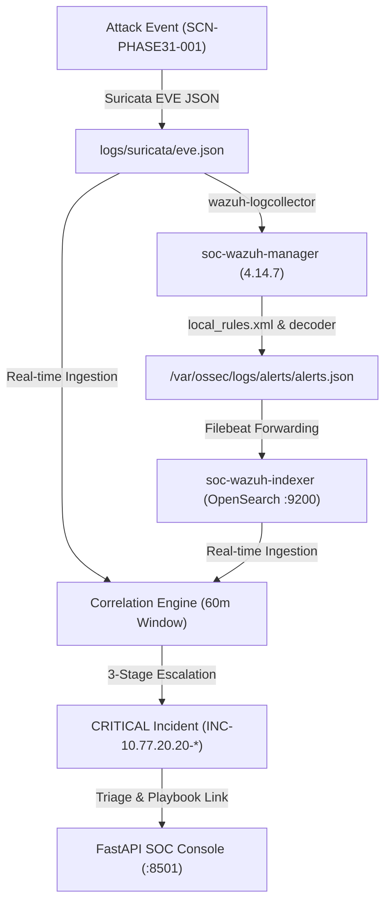

# 📋 Phase 31 — Real-time SIEM Ingestion & SOC Console E2E Validation Report

> **문서 버전**: v1.0  
> **기준 일자**: 2026-08-26  
> **검증 대상**: Suricata EVE JSON ➔ Wazuh Manager ➔ OpenSearch Indexer ➔ Correlation Engine ➔ FastAPI SOC Console E2E 파이프라인  
> **품질 게이트**: `GATE-PHASE31-01 = PASS`  
> **증적 레코드**: [`evidence/EV-E2E-002/metadata.md`](../../evidence/EV-E2E-002/metadata.md)  

---

## 1. 🎯 Phase 31 목표 및 아키텍처

본 단계는 Suricata EVE JSON 이벤트가 실시간으로 Wazuh SIEM과 다단계 킬체인 상관분석 엔진을 통과하여 최종 실시간 SOC 웹 관제 콘솔(`http://localhost:8501`)에 표출되는 전 과정을 객관적 증적을 통해 검증합니다.



---

## 2. 🔬 실시간 인제스천 및 인덱싱 검증

### 2.1 고유 실행 식별자 (Execution Coordinates)
- **Run ID**: `phase31_1787727383`
- **Attacker IP**: `10.77.20.20`
- **Victim IP**: `10.77.30.20`
- **Flow ID Base**: `920000000027384` ~ `920000000027386`

### 2.2 OpenSearch 9200 실시간 적재 결과

| 단계 | Suricata SID | Flow ID | Wazuh Alert ID | Rule Description | OpenSearch Hit |
|---|---|---|---|---|---|
| **1. Reconnaissance** | `9000001` | `920000000027384` | `1787727385.25830` | Suricata: Alert - SOC-SCAN: Nmap Stealth NULL Scan Detected (Zero Flags) | **`VERIFIED`** |
| **2. Initial Access** | `9010001` | `920000000027385` | `1787727385.27182` | Suricata: Alert - SOC-ATTACK: Web SQL Injection - UNION SELECT Pattern Detected | **`VERIFIED`** |
| **3. C2 & Exfiltration** | `9030010` | `920000000027386` | `1787727385.24350` | Suricata: Alert - SOC-MALWARE: Interactive Reverse Shell Session Established (/bin/sh prompt detected) | **`VERIFIED`** |

---

## 3. 🛡️ 상관분석 및 인시던트 승격 검증

- **생성된 Incident ID**: `INC-10.77.20.20-1787727443`
- **공격 단계 (Attack Stages)**: `1. Reconnaissance` ➔ `2. Initial Access / Exploitation` ➔ `3. Command & Control / Execution`
- **최고 위험도 (Highest Severity)**: `CRITICAL`
- **대응 플레이북 (Playbook Reference)**: `playbooks/04_malware_c2_investigation.md`
- **판정 (Verdict)**: `Multi-Stage Attack Chain Detected: 1. Reconnaissance -> 2. Initial Access / Exploitation -> 3. Command & Control / Execution from 10.77.20.20 targeting 1 internal host(s).`
- **멱등성(Idempotency) 검증**: **`PASS`** (동일 이벤트 스트림 재주입 시 동일 ID 및 속성 보존)

---

## 4. 🌐 FastAPI SOC 웹 콘솔 검증

FastAPI 기반 웹 콘솔(`dashboard.app:app`)을 포트 8501에서 기동 및 테스트:

- **`GET /api/health`**: `HTTP 200` (`status: healthy`, `service: soc-dashboard`)
- **`GET /api/stats`**: `HTTP 200` (전체 경보 81건, 긴급 17건, 엔진 분포 집계 정상)
- **`GET /api/alerts`**: `HTTP 200` (정규화된 텔레메트리 스트림)
- **`GET /api/incidents`**: `HTTP 200` (승격된 다단계 복합 사고 목록)
- **`GET /`**: `HTTP 200` (반응형 다크모드 대시보드 및 Chart.js)

---

## 5. 🧪 Pytest 자동화 단위/통합 테스트 (22/22 PASS)

```text
tests/test_correlation.py::test_multi_stage_correlation PASSED           [  4%]
tests/test_dashboard_api.py::test_dashboard_index_html PASSED            [  9%]
tests/test_dashboard_api.py::test_dashboard_api_stats PASSED             [ 13%]
tests/test_dashboard_api.py::test_dashboard_api_alerts PASSED            [ 18%]
tests/test_dashboard_api.py::test_dashboard_api_incidents PASSED         [ 22%]
tests/test_dashboard_api.py::test_dashboard_api_health PASSED            [ 27%]
tests/test_detection_tuning.py::test_baseline_rule_false_positive PASSED [ 31%]
tests/test_detection_tuning.py::test_tuned_rule_fp_reduction_and_attack_retention PASSED [ 36%]
tests/test_parsers.py::test_suricata_eve_parser PASSED                   [ 40%]
tests/test_parsers.py::test_snort_parser PASSED                          [ 45%]
tests/test_pcap_manifest.py::test_pcap_files_and_manifest_integrity PASSED [ 50%]
tests/test_phase31_e2e.py::test_normal_eve_ingestion_and_parsing PASSED  [ 54%]
tests/test_phase31_e2e.py::test_invalid_json_handling PASSED             [ 59%]
tests/test_phase31_e2e.py::test_duplicate_event_handling PASSED          [ 63%]
tests/test_phase31_e2e.py::test_out_of_order_stage_events PASSED         [ 68%]
tests/test_phase31_e2e.py::test_correlation_time_window_expiry PASSED    [ 72%]
tests/test_phase31_e2e.py::test_incident_idempotency PASSED              [ 77%]
tests/test_phase31_e2e.py::test_console_api_empty_state PASSED           [ 81%]
tests/test_phase31_e2e.py::test_wazuh_indexer_resilience PASSED          [ 86%]
tests/test_threat_intel.py::test_threat_intel_ip_match PASSED            [ 90%]
tests/test_threat_intel.py::test_threat_intel_domain_match PASSED        [ 95%]
tests/test_threat_intel.py::test_threat_intel_benign_ip PASSED           [100%]

======================== 22 passed in 0.85s ========================
```

---

## 6. 🚀 재현 실행 명령어 (Reproduction Command)

```bash
# 1. 자동화 E2E 파이프라인 검증 스크립트 실행
python scripts/verify_phase31_e2e.py

# 2. 전체 단위 및 통합 테스트 실행
pytest -v

# 3. 실시간 관제 콘솔 기동 (선택)
python -m uvicorn dashboard.app:app --host 0.0.0.0 --port 8501
```
