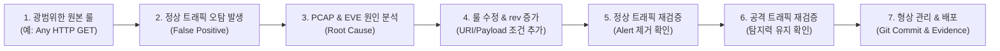

# 🔍 07. 침해사고 분석 및 트라이아지 표준 (SOC Investigation Standard)

> **기준 규정**: AGENTS.md Section 19 (SOC Investigation Standard) & Section 21 (Detection Tuning)  

---

## 1. 14단계 SOC 트라이아지 절차 (14-Step Investigation Pipeline)

관제센터에 경보(Alert)가 인입되면 분석가는 다음 순서에 따라 조사를 수행합니다:

```text
1. Timestamp 확인 (이벤트 발생 시각 및 지속 시간)
   ↓
2. Source IP 확인 (출발지 IP, 위협 인텔리전스 TI 매칭 여부)
   ↓
3. Destination IP 확인 (내부 자산 중요도 및 망 구분)
   ↓
4. Protocol / Port 분석 (TCP/UDP, 서비스 포트 및 비표준 포트 여부)
   ↓
5. Alert Signature 확인 (탐지된 룰 메시지)
   ↓
6. SID 식별 (Suricata 9000xxx / Snort 9100xxx)
   ↓
7. Raw EVE JSON 원시 데이터 추출 (전체 페이로드, HTTP 필드)
   ↓
8. PCAP 세션 스트림 분석 (실제 패킷 왕복 흐름 및 응답 코드)
   ↓
9. 탐지 룰 정의 확인 (어떤 조건에 의해 트리거되었는지 분석)
   ↓
10. 연관 이벤트 조회 (동일 IP에서 발생한 직전/직후 이벤트 상관관계)
   ↓
11. MITRE ATT&CK 기법 매핑 (T1046, T1190, T1110, T1071 등)
   ↓
12. 사고 최종 판정 (Verdict: TRUE_POSITIVE / FALSE_POSITIVE / BENIGN)
   ↓
13. 즉각 대응 조치 (IP 차단, 방화벽 차단, 세션 종료, 호스트 격리)
   ↓
14. 탐지 룰 튜닝 (오탐인 경우 정밀 조건 추가 후 Re-test)
```

---

## 2. 허용 판정 기준 (Allowed Verdicts)

| 판정 (Verdict) | 정의 | 조치 사항 |
|---|---|---|
| **`TRUE_POSITIVE`** | 실제 시스템 침해 시도 또는 악의적 위협 행위가 명백히 확인된 경우 | 침해사고 대응 플레이북 가동, 호스트 격리, 방화벽 차단 |
| **`FALSE_POSITIVE`** | 정상 업무 트래픽이나 개발 테스트 트래픽이 광범위한 룰로 인해 오탐된 경우 | 탐지 룰 튜닝(URI/헤더/조건 구체화), Before/After 재검증 |
| **`BENIGN`** | 알려진 내부 헬스체크, 정상 모니터링 트래픽이나 보안 영향이 없는 경우 | 화이트리스트 등록 또는 모니터링 룰 예외 처리 |
| **`UNRESOLVED`** | 증적 데이터 부족 또는 페이로드 암호화로 인해 추가 조사가 필요한 경우 | 패킷 심층 수집 및 엔드포인트 로그 추가 분석 의뢰 |

---

## 3. 탐지 룰 튜닝 라이프사이클 (Detection Tuning Loop)


