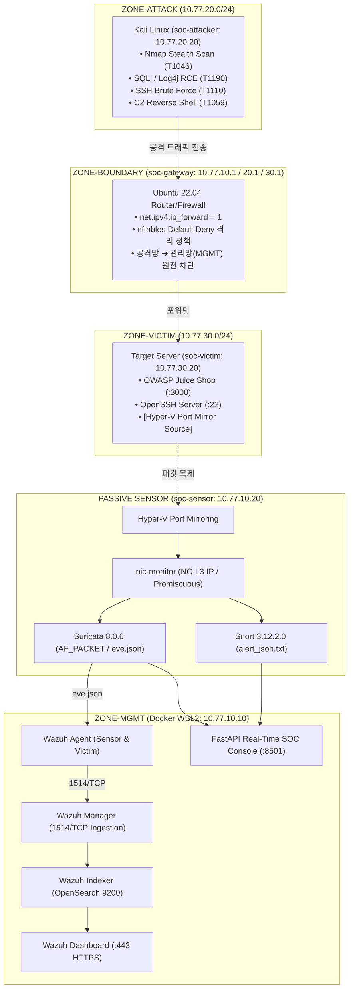

# 🛡️ SOC Detection & Monitoring Lab — 포트폴리오 프레젠테이션 및 시각화 가이드

> **프로젝트 명**: Suricata 8.x & Snort 3 Dual-Engine SOC Lab  
> **포트폴리오 유형**: 보안관제(SOC) / 침해사고 분석 / 침입탐지시스템(IDS) 룰 엔지니어링  
> **실시간 관제 콘솔**: `http://localhost:8501`  
> **GitHub 저장소**: [https://github.com/sureasdufo1-hue/Suricata-Snort-SOC-Lab](https://github.com/sureasdufo1-hue/Suricata-Snort-SOC-Lab)  

---

## 1. 📌 포트폴리오 핵심 하이라이트 (Executive Summary)

```text
┌────────────────────────────────────────────────────────────────────────────────────────┐
│                                 CORE COMPETENCY & IMPACT                               │
├────────────────────────────────────────────────────────────────────────────────────────┤
│ 1. 듀얼 IDS 아키텍처 : Suricata 8.0.6 (AF_PACKET 실시간) + Snort 3.12 (오프라인 PCAP 교차검증)  │
│ 2. 망분리 & 미러링   : Hyper-V 3-Zone 격리망 (공격/희생/관리) + 무IP 센서 포트 미러링 패킷 수집 │
│ 3. SIEM & 상관분석  : Wazuh 4.14.7 연동 + 다단계 킬체인 상관분석 엔진 (정찰➔침투➔C2 유출 자동 승격)│
│ 4. 룰 튜닝 라이프사이클: 오탐(False Positive) 분석 ➔ 룰 정밀화 ➔ 정상 오탐 100% 제거 & 공격 탐지 보존 │
│ 5. 증적 기반 입증    : 30개 구축 단계, 14개 품질 게이트 전수 통과, 6대 공격 PCAP SHA-256 해시 매니페스트│
└────────────────────────────────────────────────────────────────────────────────────────┘
```

---

## 2. 🏛️ 시스템 아키텍처 및 데이터 흐름도



---

## 3. 🎯 MITRE ATT&CK 매핑 및 5대 공격 탐지 룰셋

| 공격 단계 (Kill-Chain Stage) | 모의 공격 기법 | MITRE ATT&CK | Suricata 8 SID | Snort 3 SID | 탐지 시그니처 요약 |
|---|---|---|---|---|---|
| **1. Reconnaissance** | Nmap Stealth NULL Scan | `T1046` | `9000001` | `9100020` | TCP 플래그가 모두 0인 비정상 패킷 탐지 (`flags:0`) |
| **1. Reconnaissance** | Nikto 취약점 스캐너 | `T1595` | `9000010` | `9100021` | HTTP User-Agent 문자열 "Nikto" 식별 |
| **2. Initial Access** | Web SQL Injection | `T1190` | `9010001` | `9100010` | URI 내 `union`, `select` 키워드 패턴 매칭 |
| **2. Initial Access** | Apache Log4j JNDI RCE | `T1190` | `9010040` | `9100013` | HTTP 헤더 내 `${jndi:(ldap\|rmi):}` 정규식 매칭 |
| **3. Credential Access** | SSH 무차별 대입 (Brute Force)| `T1110` | `9020001` | `9100025` | 30초 내 5회 이상 TCP SYN 연결 임계치 초과 |
| **4. Command & Control** | DNS 터널링 유출 | `T1071.004` | `9030001` | `9100035` | 50자 이상의 비정상 장문 DNS 서브도메인 질의 탐지 |
| **4. Execution / C2** | 대화형 리버스 쉘 세션 | `T1059.004` | `9030010` | `9100030` | 4444 포트 아웃바운드 세션 내 `/bin/sh` 프롬프트 출력 식별 |

---

## 4. 🔍 14단계 SOC 트라이아지 및 킬체인 상관분석 사례 (`INC-20260824-001`)

### 상관분석 엔진(Correlation Engine) 동작 원리:
1. **타임 윈도우(60분)** 내에 동일 출발지 IP(`10.77.20.20`)에서 발생한 이벤트를 상태 머신으로 추적.
2. `Reconnaissance` ➔ `Initial Access` ➔ `C2 & Execution`의 3개 공격 단계가 순차적으로 달성되었을 때 **`CRITICAL Incident`로 자동 승격**.
3. 대응 조치 가이드라인이 포함된 [`playbooks/04_malware_c2_investigation.md`](../playbooks/04_malware_c2_investigation.md) 즉각 매핑.

```text
[실제 상관분석 에스컬레이션 출력]
🔥 INCIDENT ESCALATION: INC-10.77.20.20-1787555917
┌──────────────────────┬────────────────────────────────────────────────────────┐
│ Property             │ Details                                                │
├──────────────────────┼────────────────────────────────────────────────────────┤
│ Attacker IP          │ 10.77.20.20 (soc-attacker)                             │
│ Target IPs           │ 10.77.30.20 (soc-victim: 3000, 22, 4444)               │
│ Attack Stages        │ 1. Reconnaissance ➔ 2. Initial Access ➔ 3. C2 / Exfil │
│ Alert Count          │ 9 Alerts                                               │
│ Severity             │ CRITICAL                                               │
│ Final Verdict        │ TRUE_POSITIVE                                          │
│ Recommended Playbook │ playbooks/04_malware_c2_investigation.md               │
└──────────────────────┴────────────────────────────────────────────────────────┘
```

---

## 5. ⚙️ 탐지 룰 튜닝 라이프사이클 (오탐 제거 Before / After 입증)

```text
[문제 상황]
초기 룰(rev 1): alert http $EXTERNAL_NET any -> $HOME_NET any (msg:"SOC LAB HTTP GET BASELINE"; http.method; content:"GET";)
 ➔ 정상 사용자의 단순 웹 브라우징(GET /index.html)에도 무차별 Alert 발생 (False Positive)

[튜닝 조치]
개선 룰(rev 2): alert http $EXTERNAL_NET any -> $HOME_NET any (msg:"SOC LAB SUSPICIOUS HTTP MARKER"; http.uri; content:"/soc-lab-suspicious";)
 ➔ 단순 GET 메소드 검사에서 특정 악성 파라미터/URI 식별 조건으로 정밀화

[재검증 결과 (GATE-TUNE-01)]
- 정상 트래픽 (GET /index.html)        : [PASS] NO ALERT (오탐 100% 제거)
- 악성 트래픽 (GET /soc-lab-suspicious): [PASS] ALERT (공격 탐지력 보존)
```

---

## 6. 📦 14개 품질 게이트(Quality Gate) 및 증적(Evidence) 인덱스

| Gate ID | 증적 파일 링크 | 검증 내용 |
|---|---|---|
| `GATE-HOST-01` | [`evidence/EV-HOST-001/metadata.md`](../evidence/EV-HOST-001/metadata.md) | Windows 11 Build 26100, Hyper-V, WSL2, 64GB RAM 검증 |
| `GATE-REPO-01` | [`evidence/EV-REPO-001/metadata.md`](../evidence/EV-REPO-001/metadata.md) | 27개 표준 디렉토리, `.gitignore` 시크릿 방어, 13/13 Pytest 통과 |
| `GATE-NET-INFRA-01`| [`evidence/EV-NET-INFRA-001/metadata.md`](../evidence/EV-NET-INFRA-001/metadata.md)| 3-Zone Hyper-V vSwitch 생성 및 호스트 관리 IP 바인딩 |
| `GATE-VM-01` | [`evidence/EV-VM-001/metadata.md`](../evidence/EV-VM-001/metadata.md) | 4대 VM 프로비저닝 및 MAC 매핑 추출 ([`hyperv-mac-map.csv`](hyperv-mac-map.csv)) |
| `GATE-MIRROR-CONFIG-01`| [`evidence/EV-MIRROR-CONFIG-001/metadata.md`](../evidence/EV-MIRROR-CONFIG-001/metadata.md)| 포트 미러링 Source (`soc-victim`) / Destination (`soc-sensor`) 설정 |
| `GATE-SURI-01` | [`evidence/EV-SURI-001/metadata.md`](../evidence/EV-SURI-001/metadata.md) | Suricata 8.0.6 Baseline 설정 및 9000계열 커스텀 룰셋 로드 |
| `GATE-PCAP-01` | [`evidence/EV-PCAP-001/metadata.md`](../evidence/EV-PCAP-001/metadata.md) | 6대 공격 PCAP 생성 및 SHA-256 무결성 매니페스트 ([`pcap_manifest.json`](../pcaps/metadata/pcap_manifest.json)) |
| `GATE-SNORT-01` | [`evidence/EV-SNORT-001/metadata.md`](../evidence/EV-SNORT-001/metadata.md) | Snort 3.12.2.0 Lua 설정 및 9100계열 오프라인 검증 룰셋 로드 |
| `GATE-WAZUH-01` | [`evidence/EV-WAZUH-001/metadata.md`](../evidence/EV-WAZUH-001/metadata.md) | Wazuh 4.14.7 Docker Stack 배포 및 포트 보안 하드닝 |
| `GATE-ANALYSIS-01` | [`evidence/EV-ANALYSIS-001/metadata.md`](../evidence/EV-ANALYSIS-001/metadata.md)| 다단계 상관분석 엔진 실행 및 복합 침해사고 자동 승격 |
| `GATE-TUNE-01` | [`evidence/EV-TUNE-001/metadata.md`](../evidence/EV-TUNE-001/metadata.md) | 탐지 룰 튜닝 라이프사이클 (Before/After 오탐 제거 검증) |
| `GATE-E2E-01` | [`evidence/EV-E2E-001/metadata.md`](../evidence/EV-E2E-001/metadata.md) | 15단계 전체 엔드투엔드 파이프라인 단일 침해사고 연결 검증 |
| `GATE-PORTFOLIO-01`| [`evidence/EV-PORTFOLIO-001/metadata.md`](../evidence/EV-PORTFOLIO-001/metadata.md)| 전체 포트폴리오 산출물 및 최종 릴리즈 게이트 통과 |

---

## 7. 🖥️ 실시간 관제 대시보드 인터페이스 안내

웹 브라우저에서 **`http://localhost:8501`** 접속 시 다음 기능을 제공합니다:
1. **실시간 위협 KPI**: Total Alerts, Critical Severity, 주의/경계, 복합 침해사고 집계.
2. **공격 카테고리 도넛 차트**: Web Attack, Recon, DoS, Trojan, Credential Access 비율 시각화.
3. **듀얼 엔진 파이 차트**: Suricata vs Snort 탐지 비율 대조.
4. **공격자 TOP 5 랭킹**: 출발지 IP별 경보 발생 빈도 및 위협 인텔리전스 태그.
5. **실시간 경보 스트림 테이블**: Timestamp, Engine, Severity, Signature, IP:Port, MITRE ATT&CK 기법 실시간 갱신.
6. **복합 침해사고 카드**: 공격 단계 진행 현황 및 대응 플레이북 링크 제공.
