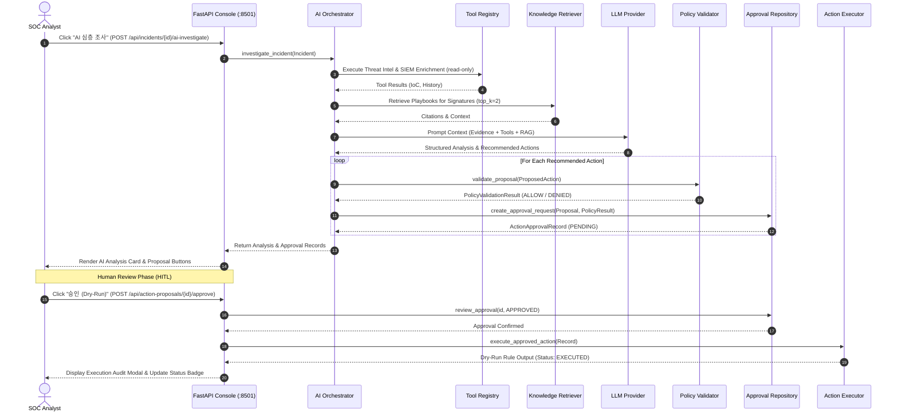

# AI-Orchestrated SOC Copilot Architecture Specification

## 1. High-Level Architecture Overview

The AI-Orchestrated SOC Copilot is an evidence-grounded investigation and human-in-the-loop (HITL) containment layer built on top of the validated **Suricata 8.x + Snort 3 + Wazuh SIEM** detection pipeline.

```text
  [ Network Traffic ]
          │
          ▼
┌──────────────────┐
│  Suricata / Snort │  (Passive IDS AF_PACKET Mirroring)
└─────────┬────────┘
          │ (eve.json / alert_json.txt)
          ▼
┌──────────────────┐
│ Correlation Engine│  (Multi-stage Killchain Correlation)
└─────────┬────────┘
          │
          ▼
┌────────────────────────────────────────────────────────────────────────┐
│                   AI INVESTIGATION ORCHESTRATOR                        │
│                                                                        │
│   1. Security Evidence Normalizer                                      │
│      (Extract Network Coordinates, Alert Signatures, SIDs, URIs)       │
│                                                                        │
│   2. Read-Only Investigation Tools                                     │
│      ├── SiemQueryTool (Wazuh OpenSearch :9200)                        │
│      ├── ThreatIntelLookupTool (IoC Feeds & Reputation)                │
│      └── PcapInspectionTool (SHA-256 Verified PCAP Samples)           │
│                                                                        │
│   3. RAG Knowledge Retriever                                           │
│      (Markdown Playbooks, Detection Docs, Hybrid Keyword Search)       │
│                                                                        │
│   4. LLM Provider (Strict 8K Prompt Contract)                          │
│      ├── MockLLMProvider (Deterministic Offline CI / Baseline)         │
│      └── OllamaProvider (Local Qwen2.5:7b / Auto-fallback)             │
│                                                                        │
│   5. Structured Output Validation (Pydantic AIIncidentAnalysis)        │
│      (Observed Facts vs Hypotheses vs Unknowns vs Recommendations)     │
└───────────────────────────────────┬────────────────────────────────────┘
                                    │ (Proposed Actions)
                                    ▼
┌────────────────────────────────────────────────────────────────────────┐
│             INDEPENDENT DETERMINISTIC POLICY VALIDATOR                 │
│                                                                        │
│   • Protected Asset Whitelist Guard (Gateway, SIEM, DNS, Loopback)    │
│   • Shell Injection Sanitizer (No metacharacters, strict CIDR check)   │
│   • Fail-Closed Verdict (ALLOWED vs DENIED_PROTECTED_ASSET / SYNTAX)  │
└───────────────────────────────────┬────────────────────────────────────┘
                                    │
                                    ▼
┌────────────────────────────────────────────────────────────────────────┐
│                 HUMAN-IN-THE-LOOP APPROVAL REPOSITORY                  │
│                                                                        │
│   • State Machine: PENDING ──► APPROVED / REJECTED / EXPIRED           │
│   • TOCTOU Protection & 60-Minute Expiration TTL                       │
│   • Persistent Audit Trail (`logs/approvals_store.json`)               │
└───────────────────────────────────┬────────────────────────────────────┘
                                    │ (Analyst Clicks 'Approve')
                                    ▼
┌────────────────────────────────────────────────────────────────────────┐
│                   BOUNDED ACTION EXECUTION LAYER                       │
│                                                                        │
│   • Mode: DRY_RUN / TICKET_ONLY (Zero unvetted live kernel modifications)│
│   • Firewall Rule Adapter: nftables / iptables syntax generation       │
│   • Audit Logging & Proof-of-Execution Telemetry                       │
└────────────────────────────────────────────────────────────────────────┘
```

---

## 2. Component Decomposition

### 2.1 Evidence Normalization & Schemas (`analyzer/ai/schemas/`)
- **`evidence.py`**: Defines `SecurityEvidence`, `EvidenceSource`, `NetworkCoordinates`, `AlertMetadata`, and `TrustLevel`.
- **`analysis.py`**: Defines `AIIncidentAnalysis`, `RiskAssessment`, `AttackTechniqueMapping`, and `KnowledgeCitation`.
  - **Core Guardrail**: Strictly separates **Observed Facts** (verifiable data in alerts/PCAP) from **Hypotheses** (inferred intent) and **Unknowns** (missing information).
- **`actions.py`**: Defines `ProposedAction`, `PolicyValidationResult`, `ActionApprovalRecord`, `ApprovalStatus`, and `ExecutionMode`.

### 2.2 Read-Only Tool Registry (`analyzer/ai/tools/`)
The AI layer accesses external system context only through explicitly registered, read-only tools:
1. **`SiemQueryTool`**: Connects to the Wazuh OpenSearch Indexer (`http://127.0.0.1:9200`), enforcing IPv4/CIDR regex sanitization and max record limits.
2. **`ThreatIntelLookupTool`**: Queries curated threat intelligence feeds (`analyzer/detection/threat_intel.py`). Misses are explicitly tagged as unknown, not benign.
3. **`PcapInspectionTool`**: Validates PCAP files against `pcaps/metadata/pcap_manifest.json` SHA-256 hashes, with strict path traversal guards.
4. **`ToolRegistry`**: Enforces a strict session call budget (maximum 6–8 calls per investigation session) to prevent prompt bloat or run-away tool loops.

### 2.3 RAG Knowledge Grounding (`analyzer/ai/rag/`)
- **`KnowledgeStore`**: Parses and chunks `playbooks/*.md` and `docs/06-detection/README.md`. Computes per-file SHA-256 hashes to guarantee provenance.
- **`KnowledgeRetriever`**: Executes hybrid keyword search, ranking chunks by overlap score and returning structured `KnowledgeCitation` objects for incident signatures.

### 2.4 LLM Provider Interface (`analyzer/ai/providers/`)
- **`BaseLLMProvider`**: Abstract interface defining `analyze_incident(...)`.
- **`MockLLMProvider`**: Deterministic, offline provider used for CI/CD, unit tests, and baseline security verification without GPU or API requirements.
- **`OllamaProvider`**: Connects to local Ollama (`http://localhost:11434`), supporting models such as `qwen2.5:7b` with automatic fallback to Mock provider.

### 2.5 Deterministic Policy Engine (`analyzer/ai/policy/`)
- **`protected_assets.py`**: Central whitelist of untouchable infrastructure:
  - Gateways: `10.77.10.1`, `10.77.20.1`, `10.77.30.1`, `192.168.111.1`
  - SIEM / Management: `10.77.10.10`, `10.77.10.20`, `172.24.0.0/16`
  - DNS & Loopback: `8.8.8.8`, `1.1.1.1`, `127.0.0.0/8`, `::1`
- **`validator.py`**: Pure Python policy validator. If an action targets a protected asset or contains syntax anomalies, it is rejected immediately with a `DENIED_*` verdict.

### 2.6 HITL Approval & Execution (`analyzer/ai/approvals/`, `analyzer/ai/actions/`)
- **`ApprovalRepository`**: Manages `ActionApprovalRecord` persistence (`logs/approvals_store.json`), handles TOCTOU race conditions, and enforces expiration TTL.
- **`ActionExecutor`**: Executes actions only after policy validation passes and human approval is granted.
  - In `DRY_RUN` mode, generates valid `nftables` syntax without touching live kernel tables.
  - In `TICKET_ONLY` mode, generates simulated Tier-2 security tickets.

---

## 3. Incident Investigation Workflow Sequence



---

## 4. Key Failure Modes and Mitigation Strategies

| Failure Mode | Root Cause | Impact | Mitigation Strategy |
|---|---|---|---|
| **LLM Hallucination** | Generative model invents non-existent alert or IP | Analyst misled | Strictly grounded schema requiring `evidence_refs`; separate `Observed Facts` from `Hypotheses`. |
| **Prompt Injection** | Attacker embeds control instructions in HTTP User-Agent / URI | LLM proposes malicious containment | LLM has zero execution privileges; all proposals pass through deterministic `PolicyValidator`. |
| **Infrastructure Lockout** | Proposal to block Gateway or SIEM host | Management plane outage | Deterministic `protected_assets.py` check; 100% blocked before analyst review. |
| **TOCTOU Race Condition** | Analyst approves expired or double-reviewed proposal | Inconsistent action state | Atomic state validation in `ApprovalRepository.review_approval(...)`. |
| **Resource Exhaustion** | Heavy prompt or multi-call tool loops | System lag or token overflow | Session budget (≤ 8 tool calls, ≤ 8K tokens total context). |
