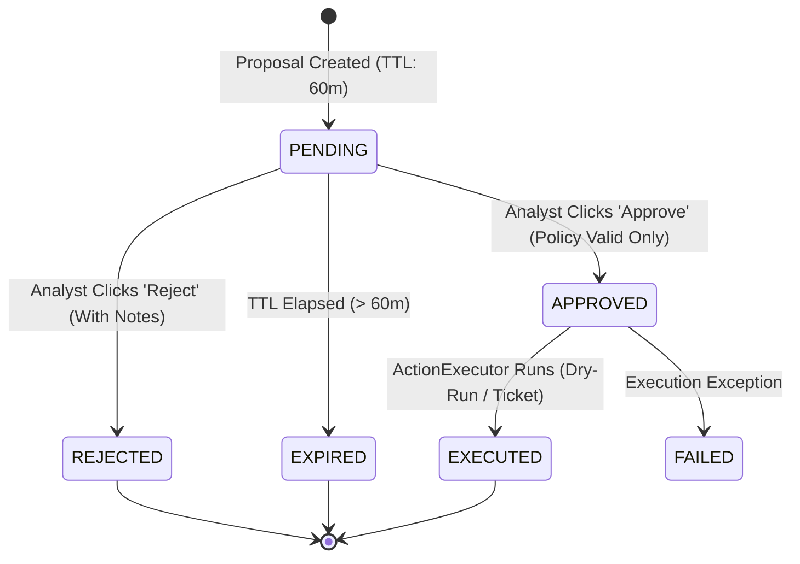

# Policy Validation & Human-in-the-Loop (HITL) Approval Design

## 1. Principles of Authority Separation

The AI Copilot adheres strictly to the **Separation of Authority Principle**:

```text
┌─────────────────────────┐
│     AI Copilot / LLM    │ ──► Generates RECOMMENDATIONS only (Zero Execution Authority)
└─────────────────────────┘
             │
             ▼
┌─────────────────────────┐
│ Deterministic Policy    │ ──► Enforces SAFETY INVARIANTS (Protected Assets & Syntax Guards)
└─────────────────────────┘
             │
             ▼
┌─────────────────────────┐
│   Human SOC Analyst     │ ──► Grants AUTHORIZATION (Explicit HITL Approval Required)
└─────────────────────────┘
             │
             ▼
┌─────────────────────────┐
│ Bounded Action Executor │ ──► Executes in DRY_RUN / TICKET_ONLY mode (Zero live changes)
└─────────────────────────┘
```

---

## 2. Protected Critical Infrastructure Assets (`analyzer/ai/policy/protected_assets.py`)

A non-negotiable security invariant is that **no AI recommendation or automated action may sever connectivity to management, routing, or monitoring infrastructure**.

### Protected Subnets
- `10.77.10.0/24`: **ZONE-MGMT** (Windows host, SIEM container, Sensor MGMT NIC).
- `127.0.0.0/8`: Localhost loopback.
- `172.24.0.0/16`: Docker Wazuh network (`soc-wazuh-net`).

### Protected Explicit Hosts
- `10.77.10.1`: SOC Gateway (MGMT Interface)
- `10.77.20.1`: SOC Gateway (Attack Interface)
- `10.77.30.1`: SOC Gateway (Victim Interface)
- `192.168.111.1`: VMware Host NAT Gateway
- `192.168.111.140`: SOC Gateway Host Address
- `10.77.10.10`: Windows Host MGMT Interface & Wazuh SIEM Docker Host
- `10.77.10.20`: SOC Sensor Management Interface
- `8.8.8.8`, `1.1.1.1`: Upstream Public DNS Resolvers

### Subnet Collision Detection
If a proposed action targets a CIDR block (e.g. `10.77.10.0/28`) or an individual IP inside a protected subnet, `ipaddress.ip_network.overlaps()` detects the collision and denies the action.

---

## 3. Deterministic Policy Validator (`analyzer/ai/policy/validator.py`)

The policy engine operates independently of the LLM:

1. **Format Validation**: Checks whether the target is a valid IPv4 address or CIDR notation.
2. **Command Injection Guard**: Rejects inputs containing characters: `;`, `&`, `|`, `` ` ``, `$`, `\n`, `\r`, `>`, `<`.
3. **Protected Asset Evaluation**: Calls `is_protected_asset(target)`. If protected, returns `DENIED_PROTECTED_ASSET`.
4. **Fail-Closed Default**: Any validation exception or unhandled state yields `DENIED_FAIL_CLOSED`.

---

## 4. HITL Approval State Machine (`analyzer/ai/approvals/`)



### TOCTOU (Time-of-Check to Time-of-Use) Protection
In `ApprovalRepository.review_approval(...)`:
- If `rec.status != ApprovalStatus.PENDING`, the transition is rejected immediately.
- If an analyst attempts to approve a proposal where `rec.policy_validation.is_valid == False`, the repository refuses the approval, even if the analyst was misled or spoofed.

---

## 5. Bounded Action Execution & Rule Adapters

When an action is approved, `ActionExecutor` processes it according to `ExecutionMode`:

### `DRY_RUN` Mode (Default)
Generates the exact rule syntax for the administrator to review:
```text
[DRY-RUN EXECUTION SIMULATION] 2026-09-07T11:34:37.157555+00:00
Action Type: BLOCK_IP
Target: 10.77.20.20 (Direction: INBOUND)
Generated Rule Syntax:
  nft add element inet filter blacklist { 10.77.20.20 }
Quarantine TTL: 60 minutes
Status: PASS (Simulated Dry Run Success - Zero host modification)
```

### `TICKET_ONLY` Mode
Creates a structured Tier-2 SOC incident ticket reference without executing any network commands.
