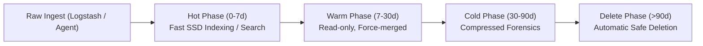

# Elastic Data Stream & ILM Retention Design (Phase ELK-1)

> **Document ID**: `ELK-STREAM-001`  
> **Status**: `APPROVED / BASELINE`  
> **Target Scope**: Data Stream Naming, Index Lifecycle Management (ILM), and Storage Policies  
> **Classification**: Internal Engineering Baseline  

---

## 1. Elastic Data Stream Naming Architecture

In accordance with Section 17 of the implementation mandate, all security telemetry is stored in structured **Elastic Data Streams** following the official Elastic naming convention: `logs-<dataset>-<namespace>`:

```text
Type   Dataset                Namespace   Full Data Stream Name
────── ────────────────────── ─────────── ────────────────────────────────
logs - suricata.eve         - default   = logs-suricata.eve-default
logs - snort.alert          - default   = logs-snort.alert-default
logs - firewall.traffic     - default   = logs-firewall.traffic-default
logs - firewall.security    - default   = logs-firewall.security-default
logs - wazuh.alert          - default   = logs-wazuh.alert-default
logs - linux.auth           - default   = logs-linux.auth-default
logs - soc.incident         - default   = logs-soc.incident-default
logs - soc.audit            - default   = logs-soc.audit-default
soc  - ai.analysis          - default   = soc-ai.analysis-default (ISOLATED)
```

> [!IMPORTANT]
> **Strict AI Evidence Separation Principle**:  
> Raw sensor and security evidence logs are stored strictly under `logs-*`. AI analysis outcomes, LLM prompt traces, and automated triage verdicts are stored exclusively under `soc-ai.analysis-default`. AI inferences MUST NEVER pollute raw forensic evidence streams.

---

## 2. Single-Node Shard & Replica Policy

Per Section 9 of the prompt, a Single-Node Elasticsearch cluster cannot allocate index replicas to other nodes. Defaulting `number_of_replicas: 1` would immediately transition the cluster health to `YELLOW`.

- **Primary Shards**: `1` per data stream backing index.
- **Replica Shards**: `0` (`index.number_of_replicas: 0`).
- **Target Cluster Health**: **GREEN** (without hiding or falsifying replication state).
- **Refresh Interval**: `5s` for high-throughput streams (`suricata.eve`), `1s` for audit/incidents.

---

## 3. Index Lifecycle Management (ILM) Retention Policies

Three distinct ILM policies are established to balance forensic visibility with NVMe disk preservation:

### 3.1 Policy 1: `soc-high-volume-ilm` (Suricata Flow, DNS, HTTP, Firewall Traffic)
- **Hot Phase**: Rollover at `10 GB` index size or `7 days`.
- **Warm Phase**: After `7 days`, read-only, force-merge to 1 segment.
- **Delete Phase**: Automatically purged after **`14 days`**.

### 3.2 Policy 2: `soc-security-alerts-ilm` (Suricata Alerts, Snort Alerts, Wazuh Alerts, Firewall Denies)
- **Hot Phase**: Rollover at `20 GB` index size or `30 days`.
- **Warm Phase**: After `30 days`, force-merge to 1 segment.
- **Cold Phase**: After `60 days`, frozen index.
- **Delete Phase**: Automatically purged after **`90 days`**.

### 3.3 Policy 3: `soc-compliance-ilm` (SOC Incidents, Audit Logs, AI Decision Evidence)
- **Hot Phase**: Rollover at `10 GB` index size or `90 days`.
- **Warm / Cold Phase**: Retained indefinitely or archived.
- **Delete Phase**: Minimum **`365 days`** (Long-term retention).



---

## 4. Index Templates & Component Templates Design

Each data stream is governed by an Elasticsearch composable index template matching `logs-*-*`:

1. `soc-mappings-ecs`: Standard ECS 8.17 mappings (`@timestamp`, `event.*`, `source.*`, `destination.*`, etc.).
2. `soc-settings-singlenode`: `number_of_shards: 1`, `number_of_replicas: 0`.
3. `soc-ilm-routing`: Links stream patterns to the appropriate ILM policy.
