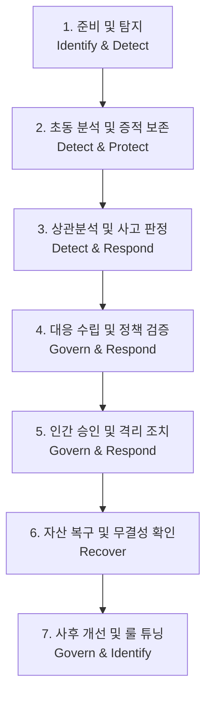

# SOC Detection & Monitoring Lab
# 공통 SOC 관제·대응 룰북 (Common SOC Operations & Incident Response Rulebook)

> **문서 식별자**: `RULEBOOK-SOC-COMMON-001`  
> **개정 버전**: `v1.0 (Official Release)`  
> **적용 기준**: NIST SP 800-61 Rev.3 (2025.04 Final), NIST CSF 2.0, MITRE ATT&CK v19.2 (2026.08)  
> **관제 환경**: Suricata 8.0.6 · Snort 3.12.2.0 · Wazuh 4.14.7 · AI-Orchestrated SOC Copilot  

---

## 1. 목적 및 적용 범위 (Purpose & Scope)

### 1.1 목적
본 공통 룰북은 **SOC Detection & Monitoring Lab** 및 기업·기관의 보안관제센터(SOC)에서 발생하는 모든 보안 이벤트와 위협 경보에 대해, 관제 요원 및 침해사고 대응팀이 일관되고 객관적인 기준에 따라 **탐지 → 분석 → 판정 → 대응 → 복구 → 사후개선**을 수행할 수 있도록 표준 절차와 통제 기준을 제공하는 것을 목적으로 합니다.

### 1.2 관제 대상 및 네트워크 경계
본 룰북은 다음 3대 격리 네트워크 존(Zone)과 호스트 인프라를 보호 및 감시 대상으로 정의합니다.

```text
[ZONE-ATTACK : 10.77.20.0/24]
  - soc-attacker (10.77.20.20): 승인된 테스트 트래픽 및 공격 벡터 생성 호스트
                │ (Default Deny 경계)
                ▼
[ZONE-MGMT : 10.77.10.0/24] ─── (보호 인프라: 차단 절대 불가)
  - soc-gateway (10.77.10.1): L3 라우팅 및 nftables 보안 경계
  - Windows Host MGMT (10.77.10.10): 하이퍼바이저 및 Docker Wazuh 호스트
  - soc-sensor MGMT (10.77.10.20): 센서 관리용 인터페이스
  - Wazuh Manager / Indexer / Dashboard: SIEM 인프라 (1514, 1515, 9200, 443)
                │
                ▼ (Port Mirroring: Source nic-victim ➔ Destination nic-monitor)
[ZONE-VICTIM : 10.77.30.0/24] ─── (핵심 보호 자산)
  - soc-victim (10.77.30.20): 웹 서버(Port 80), SSH(Port 22), 내부 데이터베이스
  - soc-sensor Monitor (No L3 IP): 수동 패킷 수집(AF_PACKET), Suricata/Snort 센서
```

### 1.3 기본 운영 원칙 (Invariant Principles)
1. **Packet Visibility Before IDS (패킷 가시성 최우선)**: 센서의 모니터링 인터페이스에서 미러링된 트래픽 수집(`tcpdump`)이 실측되지 않는 한, 상위 IDS 및 SIEM 연계 작업을 진행하지 않는다.
2. **Strict Grounding & Zero Hallucination (무환각 원칙)**: 모든 보안 분석 결과와 AI 권고안은 실제 수집된 보안 증적(PCAP, EVE JSON, Wazuh Alert, RAG 플레이북)에만 근거해야 하며, 근거 없는 추측이나 환각을 절대 배제한다.
3. **Deterministic Fail-Closed Governance (결정론적 차단 통제)**: AI가 제안한 대응 조치라 할지라도 내부 정책 검증기(`PolicyValidator`)의 사전 검증을 반드시 거쳐야 하며, 핵심 보호 인프라(게이트웨이, SIEM 매니저) 차단 시도는 100% 즉시 거부된다.
4. **Human-in-the-Loop (인간 승인 필수)**: 분석가의 명시적인 수동 승인이 내려지기 전까지는 어떠한 네트워크 변경도 실제 호스트에 반영되지 않으며, `Dry-Run`(모의 실행) 상태를 유지한다.

---

## 2. 관제 아키텍처 및 엔드투엔드 데이터 흐름

```text
[네트워크 및 호스트 활동]
  - 10.77.20.20 (공격자) ➔ 10.77.30.20 (피해 서버) 패킷 발생
                ↓
[수동 패킷 수집 (Capture)]
  - Hyper-V Port Mirroring ➔ Sensor nic-monitor (AF_PACKET 수집)
                ↓
[이중 침입 탐지 엔진 (Dual IDS Detection)]
  - Suricata 8.0.6 (Primary IDS): 실시간 패킷 정밀 파싱 ➔ /var/log/suricata/eve.json
  - Snort 3.12.2.0 (Secondary Validation): 오프라인 PCAP 교차 검증 및 룰 성능 비교
                ↓
[SIEM 수집 및 정규화 (Collection & Normalization)]
  - Wazuh Agent (Sensor): eve.json 실시간 모니터링 ➔ TCP 1514 암호화 전송
  - Wazuh Manager (4.14.7): 디코딩 및 룰 매칭 ➔ wazuh-alerts 인덱싱
  - Wazuh Indexer (OpenSearch 9200): 보안 이벤트 색인 저장
                ↓
[다단계 상관분석 (Correlation Engine)]
  - 시간 윈도우(30분) 기반 공격자 IP 세션 추적
  - 공격 단계 분류: 정찰(Recon) ➔ 초기 침투(Exploit) ➔ C2 역방향 셸(Execution)
  - 2개 이상 공격 단계 결합 시 '다단계 침해사고(Incident)'로 자동 승격
                ↓
[FastAPI 웹 관제 콘솔 (:8501)]
  - 실시간 KPI 집계: 총 탐지 84건, 긴급 18건, 경고 60건, 상관사고 10건
  - Three.js WebGL 3D 홀로그램 실드 & 실시간 요격 매트릭스 허브 시각화
  - 한국어 / 영문 원문 나란히 보기 (Split View)
                ↓
[AI-Orchestrated SOC Copilot (심층 조사 트리거)]
  - SecurityEvidenceNormalizer: 원본 이벤트 정규화 및 증적 패키징
  - Read-Only Investigation Tools: SIEM 검색, Threat Intel 평판, PCAP 해시 검증
  - RAG Playbook Retriever: 내부 6대 마크다운 플레이북 800자 청크 검색
  - Local LLM (Qwen3.5 9B / 4B): 인과관계 추론, MITRE ATT&CK 매핑, 대응 권고 생성
                ↓
[독립 정책 검증기 (PolicyValidator)]
  - 보호 자산 목록(15개 IP) 대조 ➔ 게이트웨이(10.77.10.1) 등 오차단 원천 방지
                ↓
[인간 승인 제어 게이트 (HITL Approval Gate)]
  - 관제 분석가 검토: 승인 대기(PENDING_APPROVAL)
  - 분석가 의사결정: 모의 실행 승인(Dry-Run) 또는 반려(Reject)
                ↓
[대응 실행, 복구 및 사후 피드백]
  - 방화벽 nftables 규칙 프리뷰 / 패킷 검사 ➔ 침해 서버 복구 ➔ 룰 튜닝 및 회귀시험
```

---

## 3. 관제 조직 역할 및 책임 (Roles & Responsibilities)

단일 분석가 실습 환경이라 하더라도, 실무 관제 환경의 직무 분리(Segregation of Duties) 원칙에 따라 다음과 같이 6대 역할을 논리적으로 명확히 분리하여 수행합니다.

| 역할 명칭 | 주 담당 업무 및 책임 범위 | 주요 입력 자료 | 핵심 산출물 및 권한 |
|---|---|---|---|
| **Tier 1 보안관제원 (L1 Analyst)** | • 24/7 실시간 경보 모니터링<br>• 초기 오탐(FP) 1차 필터링<br>• IP 평판 및 패킷 헤더 초동 확인 | • 대시보드 실시간 경보 스트림<br>• Suricata/Snort Alert 요약 | • 티켓 생성 (Ticket)<br>• Tier 2 에스컬레이션 보고 |
| **Tier 2 사고분석가 (L2 Analyst)** | • 다단계 침해사고 상관분석<br>• PCAP 패킷 심층 분석 (Wireshark/tshark)<br>• AI Copilot 심층 조사 실행 및 가설 검증 | • Wazuh SIEM 원본 이벤트<br>• 전체 PCAP 덤프<br>• AI 구조화 분석 보고서 | • 사고 분석 보고서 (INC Report)<br>• 대응 조치(격리/차단) 초안 발의 |
| **침해사고 대응 책임자 (Incident Commander)** | • 사고 등급(P1~P4) 최종 확정<br>• HITL 대응 조치 최종 승인권자<br>• 대외 공지 및 비상 대응 총괄 | • L2 상세 분석 보고서<br>• PolicyValidator 검증 결과 | • 방화벽 격리/차단 실행 최종 승인<br>• 침해사고 종결 선언 (Closure) |
| **탐지 엔지니어 (Detection Engineer)** | • Suricata/Snort 룰 신규 개발<br>• 오탐(FP) 분석 및 정규표현식 튜닝<br>• RAG 플레이북 갱신 및 유지보수 | • FP 오탐 로그 및 패킷 덤프<br>• 최신 MITRE ATT&CK 기법 | • 룰 리비전 커밋 (`rev:2` 등)<br>• 오탐 튜닝 전/후 검증 보고서 |
| **시스템/인프라 관리자 (SysAdmin)** | • Hyper-V 가상 스위치 및 포트 미러링 유지<br>• Linux 게이트웨이 및 라우팅 테이블 관리<br>• 피해 호스트 복구 및 백업 복원 | • 네트워크 토폴로지 구성도<br>• 호스트 리소스/시스템 메트릭 | • vSwitch 설정 스크립트<br>• 호스트 무결성 복구 확인서 |
| **AI 거버넌스 감사관 (AI Auditor)** | • 로컬 LLM 오프라인 무결성 락 검증<br>• 모델 출력 스키마 및 환각 여부 감사<br>• 비상 Mock 롤백 절차 점검 | • model-lock.json SHA-256<br>• Ollama 런타임 로그<br>• 승인 감사 레지스터 | • AI 신뢰성 평가 보고서<br>• 1초 비상 롤백 발동 권한 |

---

## 4. 이벤트 · 경보 · 사고의 명확한 구분 (Event, Alert, Incident)

관제 실무에서 용어의 혼선은 과잉 대응 또는 위협 간과를 초래하므로 다음 분류 기준을 엄격히 적용합니다.

```text
[Event (보안 이벤트)]
  단순 네트워크 패킷 통과, 웹 HTTP 요청, 로그인 시도 등 관측된 모든 개별 활동 단위.
  (예: 10.77.20.20 ➔ 10.77.30.20 HTTP GET /index.html 200 OK)
       │
       ▼ (탐지 시그니처 매칭)
[Alert (보안 경보)]
  Suricata, Snort, Wazuh 룰 조건에 부합하여 생성된 단일 경고성 로그.
  (예: SID 9010001 "Web SQL Injection UNION SELECT Pattern Detected")
  ※ 주의: 경보 발생이 곧 침해 성공을 의미하지 않음 (단순 시도일 수 있음).
       │
       ▼ (상관분석 및 영향도 평가)
[Incident (보안 침해사고)]
  단순 경보를 넘어, 실제 시스템에 위협을 가하거나 내부 침투, C2 연결 등
  보안상 즉각적인 인간의 조사 및 격리 대응이 요구되는 것으로 판정된 사건.
  (예: Nmap 스캔 ➔ SQLi 취약점 공격 ➔ 4444번 포트 역방향 셸 수립으로 이어지는 다단계 공격)
       │
       ▼ (티켓팅 및 라이프사이클 관리)
[Case (사고 관리 케이스)]
  접수 시점부터 증적 수집, AI 분석, 승인, 조치, 복구, 사후 튜닝까지의 전 과정을 추적하는 단위.
```

- **False Positive (오탐)**: 탐지 규칙의 조건이 너무 넓어 정상적인 웹 요청이나 내부 관리 트래픽을 악성으로 잘못 탐지한 경우. (반드시 룰 튜닝 필요)
- **Benign True Positive (무해한 진탐)**: 공격 시그니처와 100% 일치하는 행위가 발생하였으나, 모의해킹 실습이거나 애플리케이션 방어 계층에서 차단되어 실제 피해가 없는 경우.

---

## 5. 사고 등급 및 에스컬레이션 매트릭스 (Severity & Escalation)

사고의 심각도는 **공격 성공 여부**, **침해 단계(Kill Chain Stage)**, **대상 자산 중요도**를 조합하여 4단계로 산정합니다.

| 사고 등급 | 판정 기준 및 침해 정황 | 권고 조치 수준 | 제안 대응 목표 (SLA) | 보고 대상 |
|:---:|---|---|:---:|---|
| **P1 (CRITICAL)<br>긴급 침해** | • C2 역방향 셸 수립 (`/bin/sh` 대화형 세션)<br>• 랜섬웨어 감염 또는 핵심 DB 유출 정황<br>• 내부 게이트웨이 또는 SIEM 침해 징후 | • 피해 호스트 즉시 격리 (`ISOLATE_HOST`)<br>• 공격자 IP 전면 차단 (`BLOCK_IP`)<br>• 포렌식 메모리 덤프 확보 | 초동 분석: **15분 이내**<br>격리 조치: **30분 이내** | SOC 센터장<br>CISO<br>인프라 총괄 |
| **P2 (HIGH)<br>고위험 공격** | • 웹 취약점(SQLi, RCE) 공격 성공 징후 (200 OK)<br>• 시스템 계정 탈취 및 권한 상승 정황<br>• 비정상 대량 아웃바운드 데이터 전송 | • 공격자 IP 인바운드 차단<br>• 세션 강제 종료 및 계정 잠금<br>• 웹 애플리케이션 입력값 패치 | 초동 분석: **30분 이내**<br>대응 완료: **2시간 이내** | L2 수석 분석가<br>시스템 관리자 |
| **P3 (MEDIUM)<br>주의 / 경계** | • 외부 정찰 스캔 (NULL, XMAS, 포트 스캔)<br>• 다수의 인증 실패 (SSH Brute Force 진행 중)<br>• 차단된 웹 공격 시도 (403, 404 응답) | • 침입 방화벽 임계치 제어<br>• 공격자 IP 모니터링 목록 등록<br>• 타겟 호스트 방화벽 상태 점검 | 초동 분석: **2시간 이내**<br>대응 완료: **8시간 이내** | L1/L2 분석가 |
| **P4 (LOW)<br>단순 정보** | • 단순 ICMP Echo 핑 탐색<br>• 단발성 비인가 포트 접속 시도<br>• 알려진 크롤러/스캐너의 무작위 스위핑 | • 자동화 로그 기록 보존<br>• 주기적 트렌드 통계 집계 반영 | 일일 관제 일지 반영 | L1 관제원 |

---

## 6. 공통 사고대응 절차 (NIST SP 800-61 Rev.3 & CSF 2.0 매핑)

NIST SP 800-61 Rev.3(2025.04) 및 NIST Cybersecurity Framework 2.0의 6대 핵심 기능(**Govern, Identify, Protect, Detect, Respond, Recover**)을 관제 실무 파이프라인으로 구조화합니다.



### 단계별 상세 실행 규정

#### [단계 1] 준비 및 탐지 (Preparation & Detection)
- **입력**: 센서 인터페이스 패킷 스트림, Wazuh 에이전트 로그.
- **실행**: Suricata/Snort 듀얼 엔진 실시간 룰 매칭 ➔ OpenSearch 인덱싱 ➔ 웹 콘솔 실시간 경보 표출.
- **완료 조건**: 유효한 Event ID 및 Alert ID가 데이터베이스에 안전하게 영속화됨.

#### [단계 2] 초동 분석 및 원본 증적 보존 (Triage & Evidence Preservation)
- **입력**: 수신된 경보 메타데이터 (출발지 IP, 목적지 IP, 포트, 시그니처).
- **실행**:
  1. RFC 3227 휘발성 순서에 따라 즉시 관련 PCAP 패킷 캡처 파일 보존.
  2. 원본 PCAP 파일의 SHA-256 해시를 산출하여 무결성 레지스터에 기록.
  3. Wazuh SIEM에서 공격자 IP의 이전 24시간 활동 이력 검색.
- **완료 조건**: 증적 고유 ID(`EV-xxx`) 발급 및 원본 무결성 해시 확보.

#### [단계 3] 다단계 상관분석 및 사고 판정 (Correlation & Verdict)
- **입력**: 보존된 증적 데이터셋, CorrelationEngine 텔레메트리.
- **실행**:
  1. `10.77.20.20` 발 공격이 단발성인지, 정찰 ➔ 웹 침투 ➔ C2로 이어지는 다단계인지 판별.
  2. 로컬 AI Copilot 심층 조사 트리거 (`/api/ai/investigate`).
  3. AI 출력 스키마(Pydantic) 검증: 사실(Fact), 가설(Hypothesis), MITRE 기법 식별.
- **완료 조건**: 사고 판정 확정 (`TRUE_POSITIVE` / `FALSE_POSITIVE` / `BENIGN`) 및 사고 티켓 승격.

#### [단계 4] 대응안 수립 및 정책 검증 (Containment Strategy & Policy Validation)
- **입력**: AI Copilot 또는 L2 분석가가 제안한 완화 조치 (`BLOCK_IP`, `ISOLATE_HOST`).
- **실행**:
  1. 독립 정책 검증기(`PolicyValidator`)에 제안 조치 페이로드 전달.
  2. 보호 인프라 화이트리스트(게이트웨이 `10.77.10.1`, 호스트 `10.77.10.10`) 포함 여부 확인.
  3. 보호 자산 포함 시 즉시 `REJECTED` 처리 및 거부 감사 로그 기록.
  4. 외부 공격자 IP 차단 조치는 `PASS` 처리 후 nftables 명령문 프리뷰 생성.
- **완료 조건**: `PolicyValidationResult`가 `APPROVED` 또는 `REJECTED`로 확정됨.

#### [단계 5] 인간 승인 및 격리 실행 (HITL Approval & Execution)
- **입력**: 승인 대기열(`PENDING_APPROVAL`) 레코드, 방화벽 규칙 프리뷰.
- **실행**:
  1. 침해사고 대응 책임자가 콘솔 화면에서 조치 정당성 검토.
  2. [모의 실행 승인(Dry-Run)] 클릭 시 호스트 네트워크 불변 상태로 시뮬레이션 검증.
  3. 실제 차단 승인 시 게이트웨이 nftables 세트에 IP 추가 (`nft add element inet filter blackhole { ... }`).
- **완료 조건**: 분석가 서명 및 승인 감사 레코드 생성, 게이트웨이 차단 반영 확인.

#### [단계 6] 자산 복구 및 서비스 정상화 (Eradication & Recovery)
- **입력**: 차단 완료된 공격자 세션, 격리된 피해 서버 (`10.77.30.20`).
- **실행**:
  1. 피해 서버의 악성 프로세스(`/bin/sh`, nc, webshell) 강제 종료 (`kill -9`).
  2. 웹 취약점 코드 롤백 및 임시 업로드 파일 전수 삭제.
  3. SIEM 통신 유지 상태에서 무결성 재검사 (Wazuh FIM).
  4. 정상 트래픽 송수신 검증 후 격리 해제.
- **완료 조건**: 서버 정상 가동 확인 및 재침투 징후 0건.

#### [단계 7] 사후 개선 및 룰 튜닝 (Post-Incident & Detection Tuning)
- **입력**: 침해사고 전체 타임라인, 공격 페이로드, 오탐 유발 패킷.
- **실행**:
  1. 탐지 지연이 발생했거나 오탐을 유발한 룰 식별.
  2. Suricata 룰 정규표현식 수정 및 리비전 증가 (`rev` + 1).
  3. 정상 트래픽 및 공격 트래픽 PCAP을 재생하여 검증 (`python scripts/verify_detection_tuning.py`).
  4. 64개 전체 회귀 테스트 100% 통과 확인.
- **완료 조건**: Git 커밋 생성, 튜닝 증적 문서(`EV-TUNE-xxx`) 등록.

---

## 7. 증적 보존 및 디지털 포렌식 원칙 (Forensics & Chain of Custody)

### 7.1 RFC 3227 휘발성 순서 (Order of Volatility) 준수
증적 수집 시 정보가 소멸하기 쉬운 순서대로 신속히 수집합니다:
1. 네트워크 활성 연결 상태 및 소켓 정보 (`ss -tulpn`, `netstat`)
2. 물리 메모리 및 프로세스 실행 정보 (`ps aux`, `/proc`)
3. 커널 상태 및 임시 네트워크 버퍼 (`dmesg`, `/var/run`)
4. 디스크 기반 로그 및 보안 이벤트 (`eve.json`, `/var/log/auth.log`)
5. 스토리지 볼륨 및 백업 이미지

### 7.2 증적 무결성 및 해시 검증
- 모든 원본 PCAP 캡처 파일과 추출된 이벤트 데이터는 수집 즉시 **SHA-256** 암호학적 해시를 산출하여 보존합니다.
- 증적 사본을 생성하여 분석을 수행하며, 원본 파일에는 절대 쓰기 작업을 수행하지 않습니다 (Read-Only 마운트 원칙).
- 증적 파일 명명 규칙: `EV-{STAGE}-{YYYYMMDD}-{SEQ}.{ext}` (예: `EV-E2E-20260826-002.json`)

### 7.3 비식별화 및 개인정보보호
- 보고서 본문 및 외부 제출용 문서에는 실제 개인정보(이름, 전화번호, 주민등록번호), 실제 공인 IP, 비밀번호, API 토큰을 일절 수록하지 않습니다.
- 랩 환경의 RFC 1918 사설 IP(`10.77.x.x`) 및 RFC 5737 문서용 IP(`198.51.100.x`)를 사용합니다.
