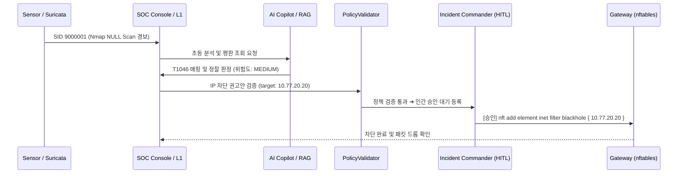

# 침해유형별 탐지·대응 룰북: IR-01
# 네트워크 스캔 및 은닉 정찰 (Network Reconnaissance & Stealth Scanning)

> **시나리오 코드**: `RULE-IR-01`  
> **공격 전술**: MITRE ATT&CK `Reconnaissance (TA0043)`, `Discovery (TA0007)`  
> **핵심 기법**: `T1595.001` (Active Scanning: Scanning IP Blocks), `T1046` (Network Service Discovery)  
> **연계 룰**: Suricata SID `9000001~9000008` / Snort SID `9100007~9100009`  
> **참조 플레이북**: [`playbooks/01_port_scan_investigation.md`](file:///C:/Users/user/Documents/ChatGPT/Suricata-Snort-SOC-Lab/playbooks/01_port_scan_investigation.md)  
> **검증 상태**: `VERIFIED`  

---

## 1. 공격 개요 및 위협 메커니즘

공격자는 침투 대상을 식별하기 위해 피해 서버(`10.77.30.20`)를 대상으로 활성 호스트 탐색 및 개방된 포트 조사를 수행합니다. 일반적인 TCP 3-Way Handshake(SYN 스캔) 외에도 방화벽 상태 추적(Stateful Inspection)을 우회하기 위해 TCP 플래그를 변칙적으로 조작한 **스텔스 스캔(Stealth Scan)** 기법을 사용합니다.

```text
[공격자 (10.77.20.20)]                                    [피해 서버 (10.77.30.20)]
         │                                                           │
         │─── 1. TCP Flag: 0 (NULL Scan) ───────────────────────────>│ (개방 포트: 응답 없음 / 차단: RST)
         │─── 2. TCP Flag: FIN+PSH+URG (XMAS Scan) ─────────────────>│ (개방 포트: 응답 없음 / 차단: RST)
         │─── 3. TCP Flag: FIN (FIN Scan) ──────────────────────────>│
         │─── 4. ICMP Echo Request (Ping Sweep) ────────────────────>│ (호스트 활성화 확인)
         │                                                           │
         ▼                                                           ▼
[Hyper-V Port Mirroring] ➔ [Sensor nic-monitor] ➔ [Suricata AF_PACKET 실시간 탐지]
```

---

## 2. 탐지 시그니처 및 룰 카탈로그

### 2.1 Suricata 8.0.6 탐지 규칙
```suricata
# Nmap Stealth NULL Scan (TCP 플래그가 전혀 없는 패킷 탐지)
alert tcp $EXTERNAL_NET any -> $HOME_NET any (
    msg:"SOC-SCAN: Nmap Stealth NULL Scan Detected (Zero Flags)"; 
    flags:0; 
    classtype:attempted-recon; 
    sid:9000001; 
    rev:1;
)

# Nmap Stealth XMAS Scan (FIN, PSH, URG 플래그가 동시 점등된 비정상 패킷)
alert tcp $EXTERNAL_NET any -> $HOME_NET any (
    msg:"SOC-SCAN: Nmap Stealth XMAS Scan Detected (FPU Flags)"; 
    flags:FPU; 
    classtype:attempted-recon; 
    sid:9000002; 
    rev:1;
)

# Nmap Stealth FIN Scan
alert tcp $EXTERNAL_NET any -> $HOME_NET any (
    msg:"SOC-SCAN: Nmap Stealth FIN Scan Detected"; 
    flags:F; 
    classtype:attempted-recon; 
    sid:9000003; 
    rev:1;
)
```

### 2.2 Snort 3.12.2.0 교차 검증 규칙
```snort
alert tcp $EXTERNAL_NET any -> $HOME_NET any (
    msg:"SNORT-SCAN: Nmap Stealth NULL Scan (No Flags)"; 
    flags:0; 
    classtype:attempted-recon; 
    sid:9100007; 
    rev:1;
)
```

---

## 3. 원본 텔레메트리 및 로그 분석

### 3.1 Suricata `eve.json` 실측 이벤트
```json
{
  "timestamp": "2026-08-26T15:55:18.258300+0900",
  "flow_id": 920000000027384,
  "in_iface": "nic-monitor",
  "event_type": "alert",
  "src_ip": "10.77.20.20",
  "src_port": 54210,
  "dest_ip": "10.77.30.20",
  "dest_port": 80,
  "proto": "TCP",
  "alert": {
    "action": "allowed",
    "gid": 1,
    "signature_id": 9000001,
    "rev": 1,
    "signature": "SOC-SCAN: Nmap Stealth NULL Scan Detected (Zero Flags)",
    "category": "Attempted Information Leak",
    "severity": 2
  }
}
```

### 3.2 분석관 핵심 지표
- **출발지 IP/포트**: `10.77.20.20` (Attacker Zone), 무작위 고위 번호 소스 포트 사용
- **목적지 IP/포트**: `10.77.30.20` (Victim Server), 웹(80), SSH(22), DB(3306) 등 연속 포트 순차 접근
- **패킷 플래그 비트**: `0x000` (Zero Flags) 확인 ➔ 정상 운영체제(Windows/Linux TCP 스택)에서는 절대 발생하지 않는 합성 패킷

---

## 4. 진탐(TP) vs 오탐(FP) 판정 기준

| 구분 | 판정 조건 및 패킷 특성 | 후속 조치 |
|---|---|---|
| **True Positive (진탐)** | • RFC 793 위반 플래그 (Zero Flags, FPU 동시 점등)<br>• 단시간 내 다수 포트에 대한 순차적 연결 시도<br>• 외부 인가되지 않은 IP 대역에서의 인바운드 접근 | • 침해사고 1단계(정찰) 등록<br>• IP 평판 및 후속 침투 시도 감시<br>• 필요 시 인바운드 차단 |
| **False Positive (오탐)** | • 사내 보안팀의 정기 취약점 점검 IP (화이트리스트)<br>• 비정상 종료된 네트워크 장비의 유실 세션 패킷 재전송 | • 출발지 IP 검증 후 화이트리스트 처리<br>• 룰 조건에 예외 IP 추가 (`!$AUTHORIZED_SCANNERS`) |

---

## 5. 단계별 대응 및 격리 절차 (Response SOP)



1. **초동 격리 (Triage)**:
   - 관제 콘솔에서 `10.77.20.20` 발 스캔 패킷 빈도 및 타겟 포트 확인.
   - 단독 스캔인 경우 사고 등급 **P3 (MEDIUM)** 설정.
2. **후속 위협 상관 (Correlation)**:
   - 스캔 직후 30분 이내에 웹 취약점 공격(SQLi, XSS)이나 SSH 접속 시도가 이어지는지 `CorrelationEngine` 윈도우 추적.
3. **방화벽 차단 정책 승인 (Containment)**:
   - `PolicyValidator` 검증 통과 후 HITL 큐에서 차단 명령 승인.
   - 실행 구문:
     ```bash
     nft add element inet filter blackhole { 10.77.20.20 }
     ```
4. **서비스 무결성 확인**:
   - 피해 서버(`10.77.30.20`)의 웹 서비스 포트 정상 응답 여부 확인 (`curl -I http://10.77.30.20/`).
