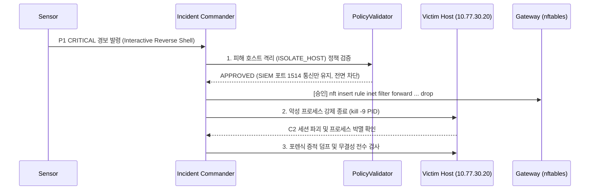

# 침해유형별 탐지·대응 룰북: IR-04
# 악성코드 C2 통신 및 대화형 역방향 셸 (Malware C2 & Interactive Reverse Shell)

> **시나리오 코드**: `RULE-IR-04`  
> **공격 전술**: MITRE ATT&CK `Command and Control (TA0011)`, `Execution (TA0002)`  
> **핵심 기법**: `T1059.004` (Unix Shell), `T1071.001` (Web Protocols), `T1048` (Exfiltration Over Protocol)  
> **연계 룰**: Suricata SID `9030001~9030010` / Snort SID `9100010`  
> **참조 플레이북**: [`playbooks/04_malware_c2_investigation.md`](file:///C:/Users/user/Documents/ChatGPT/Suricata-Snort-SOC-Lab/playbooks/04_malware_c2_investigation.md)  
> **검증 상태**: `VERIFIED` (EV-E2E-002 실측 완료)  

---

## 1. 공격 개요 및 위협 메커니즘

웹 취약점(RCE) 등을 통해 서버 장악에 성공한 공격자가 내부 방화벽(Inbound Deny)을 우회하기 위해, 피해 서버(`10.77.30.20`) 내부에서 외부 공격자 리스너(`10.77.20.20:4444`)로 직접 아웃바운드 TCP 연결을 맺고 대화형 셸(`/bin/sh`, `/bin/bash`) 프롬프트를 공격자에게 넘겨주는 **리버스 셸(Reverse Shell)** 침해 상태입니다.

```text
[피해 서버 (10.77.30.20)]                                   [공격자 리스너 (10.77.20.20:4444)]
         │                                                           │
         │─── 1. Outbound TCP SYN (Port 4444) ──────────────────────>│ ➔ 방화벽 아웃바운드 허용 악용
         │<── 2. TCP SYN-ACK ────────────────────────────────────────│
         │─── 3. Established Interactive Session ────────────────────>│
         │─── 4. Payload: "/bin/sh: $ id; whoami" ──────────────────>│ ➔ 루트/웹 계정 획득
         │                                                           │
         ▼                                                           ▼
[Suricata SID 9030010 탐지] ➔ [최고 등급 P1 CRITICAL 발령] ➔ [호스트 즉시 격리]
```

---

## 2. 탐지 시그니처 및 룰 카탈로그

### 2.1 Suricata 8.0.6 탐지 규칙
```suricata
# 대화형 리버스 셸 프롬프트 (/bin/sh 또는 $ 프롬프트) 감지
alert tcp $HOME_NET any -> $EXTERNAL_NET 4444:9999 (
    msg:"SOC-MALWARE: Interactive Reverse Shell Session Established (/bin/sh prompt detected)"; 
    flow:established,to_server; 
    content:"/bin/sh"; nocase; 
    classtype:trojan-activity; 
    sid:9030010; 
    rev:1;
)

# Metasploit Default Handler Port 4444 Outbound 연결 감지
alert tcp $HOME_NET any -> $EXTERNAL_NET 4444 (
    msg:"SOC-MALWARE: Metasploit Default Handler Port 4444 Outbound Connection"; 
    flow:to_server; 
    classtype:trojan-activity; 
    sid:9030003; 
    rev:1;
)

# Cobalt Strike Default Malleable C2 HTTP 비콘 감지
alert http $HOME_NET any -> $EXTERNAL_NET any (
    msg:"SOC-MALWARE: Cobalt Strike Default Malleable C2 HTTP Beacon Pattern"; 
    flow:to_server,established; 
    http.uri; content:"/activity"; 
    http.header; content:"Cookie|3a 20|USERID="; 
    classtype:trojan-activity; 
    sid:9030005; 
    rev:1;
)
```

---

## 3. 원본 텔레메트리 및 세션 증적 (`EV-E2E-002`)

### 3.1 Suricata `eve.json` 실측 이벤트
```json
{
  "timestamp": "2026-08-26T15:56:18.243500+0900",
  "flow_id": 920000000027386,
  "event_type": "alert",
  "src_ip": "10.77.30.20",
  "src_port": 49182,
  "dest_ip": "10.77.20.20",
  "dest_port": 4444,
  "proto": "TCP",
  "alert": {
    "action": "allowed",
    "signature_id": 9030010,
    "signature": "SOC-MALWARE: Interactive Reverse Shell Session Established (/bin/sh prompt detected)",
    "category": "A Network Trojan was detected",
    "severity": 1
  },
  "payload_printable": "uid=33(www-data) gid=33(www-data) groups=33(www-data)\nLinux soc-victim 6.6.0 #1 SMP\n$ /bin/sh -i\n"
}
```

---

## 4. 사고 판정 및 위험도 (Severity Assessment)

- **사고 판정**: **TRUE_POSITIVE (실제 호스트 침해 완료)**
- **사고 등급**: **P1 (CRITICAL - 최우선 긴급 조치)**
- **위협 분석**:  
  공격자가 `www-data` 웹 계정 권한으로 원격 셸을 획득하였으며, 로컬 권한 상승(Local Privilege Escalation) 및 랜섬웨어 전파, 데이터베이스 덤프 등 2차 피해 발생 직전의 최악의 침해 단계.

---

## 5. 단계별 긴급 대응 절차 (Incident Response SOP)



1. **피해 호스트 네트워크 즉시 격리 (`ISOLATE_HOST`)**:
   - 내부 전파 및 C2 통신을 차단하되, Wazuh SIEM 원격 관제(`1514/TCP`) 통신만을 예외 허용하는 전용 격리 룰 적용:
     ```bash
     nft insert rule inet filter forward ip saddr 10.77.30.20 ip daddr != 10.77.10.10 drop
     nft insert rule inet filter forward ip daddr 10.77.30.20 ip saddr != 10.77.10.10 drop
     ```
2. **악성 프로세스 및 소켓 강제 사살 (Process Termination)**:
   - 피해 서버 접속 후 포트 4444로 연결된 역방향 소켓 프로세스 PID 탐색 및 강제 종료:
     ```bash
     ss -tulpn | grep 4444
     kill -9 <PID>
     pkill -f "/bin/sh -i"
     ```
3. **공격자 C2 서버 인바운드/아웃바운드 전면 블랙홀 등록**:
   ```bash
   nft add element inet filter blackhole { 10.77.20.20 }
   ```
4. **포렌식 아티팩트 보존**:
   - `/tmp/`, `/var/tmp/`, `/dev/shm/` 디렉토리에 생성된 악성 스크립트 전수 수집 및 SHA-256 해시화.
   - `crontab -l` 및 `/etc/systemd/system/` 백도어 지속성(Persistence) 등록 여부 전수 점검.
